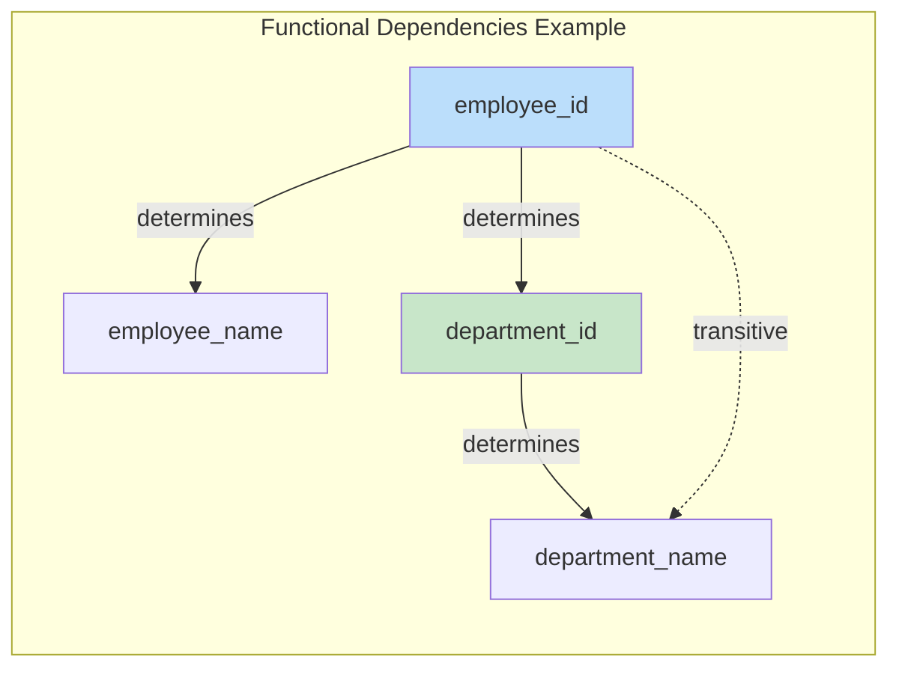
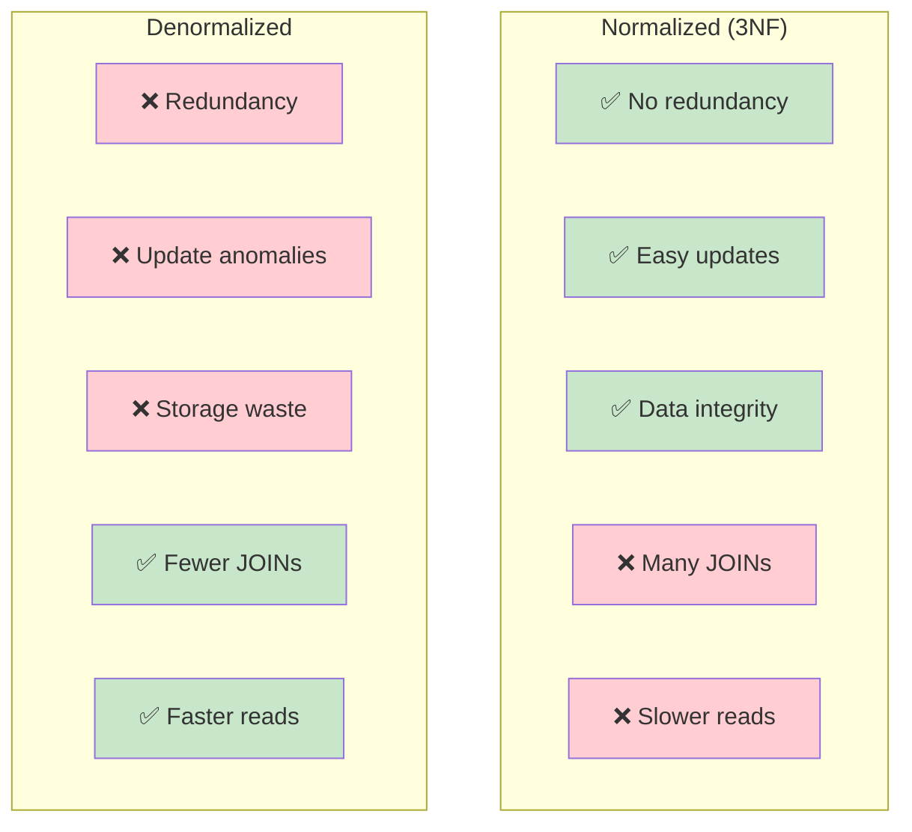
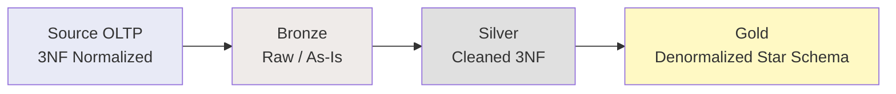

# Normalization — Intermediate Concepts

## Functional Dependencies

Understanding functional dependencies (FDs) is key to determining the correct normal form.

**Notation:** `A → B` means "A determines B" (knowing A, you can determine B uniquely).



```sql
-- Identifying FDs in a table:
-- employees(employee_id, name, department_id, department_name, dept_manager)

-- FDs:
-- employee_id → name, department_id           (direct)
-- department_id → department_name, dept_manager  (direct)
-- employee_id → department_name, dept_manager   (TRANSITIVE via department_id)

-- The transitive dependency violates 3NF → decompose!
```

### Types of Dependencies

| Type | Definition | Example |
|------|-----------|---------|
| **Full FD** | A→B where B depends on ALL of A | (order_id, product_id) → quantity |
| **Partial FD** | A→B where B depends on PART of A | (order_id, product_id) → customer_name (only needs order_id) |
| **Transitive FD** | A→B→C | employee_id → dept_id → dept_name |
| **Multi-valued** | A→→B (A determines a SET of B values) | course →→ textbook (one course has many textbooks) |

## Fourth Normal Form (4NF)

**Rule:** Must be in BCNF AND no multi-valued dependencies (MVDs).

A multi-valued dependency `A →→ B` means: for a given A, the set of B values is independent of all other attributes.

```sql
-- ❌ VIOLATES 4NF:
-- | professor | course     | hobby      |
-- | Smith     | Database   | Tennis     |
-- | Smith     | Database   | Chess      |
-- | Smith     | Algorithms | Tennis     |
-- | Smith     | Algorithms | Chess      |
-- 
-- MVDs: professor →→ course, professor →→ hobby
-- Courses and hobbies are INDEPENDENT of each other
-- But we must store all combinations! (cartesian product)

-- ✅ 4NF (decompose independent MVDs):
CREATE TABLE professor_courses (
    professor   VARCHAR(100),
    course      VARCHAR(100),
    PRIMARY KEY (professor, course)
);

CREATE TABLE professor_hobbies (
    professor   VARCHAR(100),
    hobby       VARCHAR(100),
    PRIMARY KEY (professor, hobby)
);
-- Now: Smith has 2 courses (2 rows) + 2 hobbies (2 rows) = 4 rows total
-- Instead of: 2 × 2 = 4 rows in the combined table (same)
-- But when Smith adds a 3rd hobby: only 1 new row instead of 2!
```

## Fifth Normal Form (5NF) / Project-Join Normal Form

**Rule:** Must be in 4NF AND no join dependencies that aren't implied by candidate keys.

5NF addresses cases where a table can be decomposed into 3+ smaller tables and reconstructed via JOINs without data loss.

```sql
-- ❌ MAY VIOLATE 5NF:
-- | supplier | part    | project  |
-- Rule: If a supplier supplies a part, AND the supplier supplies to a project,
--        AND the project uses that part → then the supplier supplies that part to that project.
-- This "cyclic constraint" means the 3-way table can be decomposed into 3 binary tables.

-- ✅ 5NF:
CREATE TABLE supplier_parts (supplier VARCHAR(50), part VARCHAR(50), PRIMARY KEY (supplier, part));
CREATE TABLE supplier_projects (supplier VARCHAR(50), project VARCHAR(50), PRIMARY KEY (supplier, project));
CREATE TABLE project_parts (project VARCHAR(50), part VARCHAR(50), PRIMARY KEY (project, part));

-- Reconstruct the original via 3-way JOIN:
SELECT sp.supplier, sp.part, sprj.project
FROM supplier_parts sp
JOIN supplier_projects sprj ON sp.supplier = sprj.supplier
JOIN project_parts pp ON sprj.project = pp.project AND sp.part = pp.part;
```

**In practice:** 4NF and 5NF are rarely needed. Most real-world systems stop at 3NF or BCNF.

## Denormalization Patterns

As data engineers, we deliberately denormalize for analytical workloads.

### Pattern 1: Pre-Joined Lookup

```sql
-- Normalized (3NF): requires JOIN at query time
-- orders → customers → regions → countries

-- Denormalized: embed commonly-queried attributes
CREATE TABLE fact_orders_denorm (
    order_id          INT PRIMARY KEY,
    customer_id       INT,
    customer_name     VARCHAR(200),    -- From customers table
    customer_region   VARCHAR(100),    -- From regions table
    customer_country  VARCHAR(100),    -- From countries table
    order_date        DATE,
    amount            DECIMAL(12,2)
);
-- Pro: No JOINs needed for common queries (faster!)
-- Con: customer_name changes → must update all their orders
```

### Pattern 2: Materialized Aggregates

```sql
-- Instead of computing totals at query time:
CREATE TABLE customer_summary (
    customer_id           INT PRIMARY KEY,
    total_orders          INT,
    total_revenue         DECIMAL(14,2),
    avg_order_value       DECIMAL(10,2),
    last_order_date       DATE,
    first_order_date      DATE,
    -- Refreshed daily via ETL
    last_refreshed        TIMESTAMP
);
```

### Pattern 3: Array/JSON Embedding (Modern Platforms)

```sql
-- Snowflake/BigQuery: embed child records as arrays
CREATE TABLE orders_with_items (
    order_id      INT,
    customer_id   INT,
    order_date    DATE,
    items         VARIANT  -- JSON array of line items
    -- [{"product": "Widget", "qty": 2, "price": 9.99}, ...]
);

-- Query nested data:
SELECT order_id, f.value:product::STRING, f.value:qty::INT
FROM orders_with_items, LATERAL FLATTEN(items) f;
```

## Normalization vs. Denormalization Trade-offs



## Normalization in Data Engineering Context

| Layer | Normalization Level | Reason |
|-------|-------------------|--------|
| Source (OLTP) | 3NF / BCNF | Minimize anomalies, ensure integrity |
| Bronze (raw) | As-is from source | Preserve original structure |
| Silver (cleaned) | 3NF-ish | Remove duplicates, enforce relationships |
| Gold (analytics) | Denormalized (star/snowflake) | Optimize for query performance |



## Identifying Normal Form Violations (Practice)

```sql
-- Given table: student_courses
-- | student_id | student_name | course_id | course_name | instructor | instructor_office |
-- PK: (student_id, course_id)

-- Step 1: Identify FDs:
-- student_id → student_name                     (partial: depends on PART of key)
-- course_id → course_name, instructor           (partial: depends on PART of key)
-- instructor → instructor_office                (transitive: non-key → non-key)

-- Step 2: What normal form is it in?
-- Has atomic values → ✓ 1NF
-- Has partial dependencies → ✗ NOT 2NF!

-- Step 3: Decompose to 3NF:
CREATE TABLE students (student_id INT PK, student_name VARCHAR);
CREATE TABLE instructors (instructor VARCHAR PK, instructor_office VARCHAR);
CREATE TABLE courses (course_id INT PK, course_name VARCHAR, instructor VARCHAR FK);
CREATE TABLE enrollments (student_id INT FK, course_id INT FK, PRIMARY KEY (student_id, course_id));
-- Now 3NF: no partial deps, no transitive deps ✓
```

## Interview Tips

> **Tip 1:** "How do you determine if a table is in 3NF?" — (1) List all functional dependencies. (2) Check 1NF: atomic values? (3) Check 2NF: any non-key attribute depends on only PART of a composite key? (4) Check 3NF: any non-key attribute depends on another non-key attribute? If all pass → 3NF.

> **Tip 2:** "4NF vs 5NF?" — 4NF eliminates multi-valued dependencies (independent sets stored in the same table creating cartesian products). 5NF eliminates join dependencies (table decomposable into 3+ tables without loss). Both are rare in practice — 3NF/BCNF covers 99% of cases.

> **Tip 3:** "As a data engineer, where do you normalize vs. denormalize?" — Normalize at the source/silver layer (data integrity, single source of truth). Denormalize at the gold/mart layer (query performance, fewer joins for analysts). The medallion architecture naturally transitions from normalized to denormalized.
