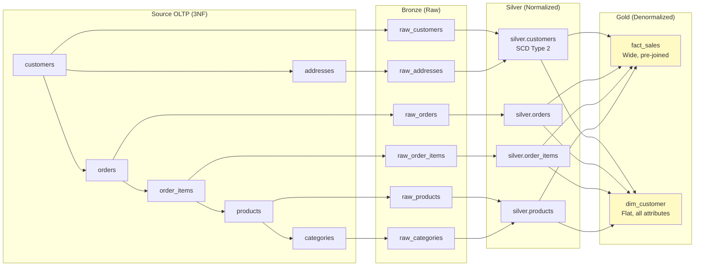

# Normalization — Real-World Production Examples

## Example 1: E-Commerce OLTP → Data Lake Migration

The source OLTP system is normalized (3NF). We must ingest into a lake and build analytics:



### Silver Layer (Re-normalized with Clean Keys)

```sql
-- Silver: Merge customer + address (controlled denormalization for simplicity)
-- Still normalized: no duplication of unrelated concerns
CREATE TABLE silver.customers (
    customer_id       VARCHAR(20) PRIMARY KEY,
    customer_name     VARCHAR(200),
    email             VARCHAR(200),
    phone             VARCHAR(50),
    -- Address embedded (1:1 relationship → safe to merge)
    street_address    VARCHAR(500),
    city              VARCHAR(100),
    state             VARCHAR(50),
    zip_code          VARCHAR(10),
    country           VARCHAR(50),
    -- SCD Type 2 metadata:
    valid_from        TIMESTAMP,
    valid_to          TIMESTAMP DEFAULT '9999-12-31',
    is_current        BOOLEAN DEFAULT TRUE,
    -- Data quality:
    source_system     VARCHAR(50),
    ingested_at       TIMESTAMP
);

-- Silver: Orders stays normalized (1:many with items)
CREATE TABLE silver.orders (
    order_id          VARCHAR(20) PRIMARY KEY,
    customer_id       VARCHAR(20) NOT NULL,
    order_date        TIMESTAMP,
    status            VARCHAR(20),
    total_amount      DECIMAL(12,2),
    shipping_method   VARCHAR(50),
    ingested_at       TIMESTAMP
);

CREATE TABLE silver.order_items (
    order_id          VARCHAR(20),
    line_number       INT,
    product_id        VARCHAR(20),
    quantity          INT,
    unit_price        DECIMAL(10,2),
    discount_pct      DECIMAL(5,2),
    PRIMARY KEY (order_id, line_number)
);
```

### Gold Layer (Denormalized Star Schema)

```sql
-- Gold: Pre-joined, wide fact table for analytics
CREATE TABLE gold.fact_sales AS
SELECT
    oi.order_id || '-' || oi.line_number  AS sale_key,
    o.order_date,
    CAST(DATE_FORMAT(o.order_date, 'yyyyMMdd') AS INT) AS date_key,
    c.customer_id,
    c.customer_name,
    c.city AS customer_city,
    c.state AS customer_state,
    p.product_id,
    p.product_name,
    p.category_name,
    p.brand,
    oi.quantity,
    oi.unit_price,
    oi.quantity * oi.unit_price * (1 - COALESCE(oi.discount_pct, 0)/100) AS net_revenue,
    o.shipping_method
FROM silver.order_items oi
JOIN silver.orders o ON oi.order_id = o.order_id
JOIN silver.customers c ON o.customer_id = c.customer_id AND c.is_current = TRUE
JOIN silver.products p ON oi.product_id = p.product_id;
```

---

## Example 2: Multi-Tenant SaaS Platform

Normalized OLTP schema supporting a SaaS application with tenant isolation:

```sql
-- ═══════════════════════════════════════
-- NORMALIZED OLTP (3NF, multi-tenant)
-- ═══════════════════════════════════════

CREATE TABLE tenants (
    tenant_id         UUID PRIMARY KEY,
    company_name      VARCHAR(200),
    plan_tier         VARCHAR(20),     -- 'starter', 'pro', 'enterprise'
    created_at        TIMESTAMP
);

CREATE TABLE users (
    user_id           UUID PRIMARY KEY,
    tenant_id         UUID REFERENCES tenants,
    email             VARCHAR(200) UNIQUE,
    full_name         VARCHAR(200),
    role              VARCHAR(50),
    created_at        TIMESTAMP,
    last_login_at     TIMESTAMP
);

CREATE TABLE projects (
    project_id        UUID PRIMARY KEY,
    tenant_id         UUID REFERENCES tenants,
    project_name      VARCHAR(200),
    created_by        UUID REFERENCES users,
    status            VARCHAR(20),
    created_at        TIMESTAMP
);

CREATE TABLE tasks (
    task_id           UUID PRIMARY KEY,
    project_id        UUID REFERENCES projects,
    assigned_to       UUID REFERENCES users,
    title             VARCHAR(500),
    status            VARCHAR(20),
    priority          INT,
    estimated_hours   DECIMAL(5,1),
    actual_hours      DECIMAL(5,1),
    created_at        TIMESTAMP,
    completed_at      TIMESTAMP
);

-- Why this normalization works for OLTP:
-- 1. User changes email → update ONE row (not millions of tasks)
-- 2. Project renames → update ONE row (tasks reference project_id)
-- 3. Tenant deletes → CASCADE from tenants (clean, no orphans)
-- 4. No redundancy: company_name stored once per tenant
```

### Analytics Layer (Denormalized for BI)

```sql
-- Denormalized view for product analytics dashboard:
CREATE MATERIALIZED VIEW analytics.task_metrics AS
SELECT
    t.tenant_id,
    ten.company_name,
    ten.plan_tier,
    p.project_id,
    p.project_name,
    u.user_id,
    u.full_name AS assignee_name,
    u.role AS assignee_role,
    tk.task_id,
    tk.title,
    tk.status,
    tk.priority,
    tk.estimated_hours,
    tk.actual_hours,
    tk.actual_hours - tk.estimated_hours AS hours_variance,
    tk.created_at AS task_created,
    tk.completed_at AS task_completed,
    DATEDIFF('hour', tk.created_at, tk.completed_at) AS hours_to_complete
FROM tasks tk
JOIN projects p ON tk.project_id = p.project_id
JOIN users u ON tk.assigned_to = u.user_id
JOIN tenants ten ON p.tenant_id = ten.tenant_id
WHERE tk.status = 'completed';

-- Refresh daily (materialized view):
REFRESH MATERIALIZED VIEW analytics.task_metrics;

-- Dashboard query (fast — single table scan!):
SELECT plan_tier, AVG(hours_to_complete), COUNT(*)
FROM analytics.task_metrics
GROUP BY plan_tier;
```

---

## Example 3: Schema Migration — Denormalized → Normalized

A common data engineering task: clean up a poorly designed "one big table" into a proper normalized structure.

```sql
-- ═══════════════════════════════════════
-- BEFORE: The mess (denormalized dump from a spreadsheet import)
-- ═══════════════════════════════════════
CREATE TABLE raw_sales_dump (
    row_id            INT,
    transaction_date  VARCHAR(50),    -- Mixed formats: 'MM/DD/YYYY', 'YYYY-MM-DD'
    customer_name     VARCHAR(200),
    customer_email    VARCHAR(200),
    customer_phone    VARCHAR(50),
    customer_city     VARCHAR(100),
    customer_state    VARCHAR(50),
    product_name      VARCHAR(200),
    product_sku       VARCHAR(50),
    product_category  VARCHAR(100),
    product_brand     VARCHAR(100),
    quantity          VARCHAR(20),    -- Some rows have 'N/A'
    unit_price        VARCHAR(20),    -- Some have '$' prefix
    total             VARCHAR(20),
    store_name        VARCHAR(200),
    store_location    VARCHAR(200),
    salesperson       VARCHAR(200)
);
-- 50M rows, massive redundancy, inconsistent data, no keys

-- ═══════════════════════════════════════
-- AFTER: Properly normalized (3NF)
-- ═══════════════════════════════════════

-- Step 1: Extract distinct entities
CREATE TABLE normalized.customers AS
SELECT DISTINCT
    ROW_NUMBER() OVER (ORDER BY customer_email) AS customer_id,
    TRIM(customer_name) AS customer_name,
    LOWER(TRIM(customer_email)) AS email,
    customer_phone AS phone,
    TRIM(customer_city) AS city,
    UPPER(TRIM(customer_state)) AS state
FROM raw_sales_dump
WHERE customer_email IS NOT NULL;

CREATE TABLE normalized.products AS
SELECT DISTINCT
    ROW_NUMBER() OVER (ORDER BY product_sku) AS product_id,
    TRIM(product_sku) AS sku,
    TRIM(product_name) AS product_name,
    TRIM(product_category) AS category,
    TRIM(product_brand) AS brand
FROM raw_sales_dump
WHERE product_sku IS NOT NULL;

CREATE TABLE normalized.stores AS
SELECT DISTINCT
    ROW_NUMBER() OVER (ORDER BY store_name) AS store_id,
    TRIM(store_name) AS store_name,
    TRIM(store_location) AS location
FROM raw_sales_dump
WHERE store_name IS NOT NULL;

-- Step 2: Build fact table with proper FKs and clean data
CREATE TABLE normalized.sales AS
SELECT
    r.row_id AS sale_id,
    -- Parse and standardize date:
    CASE 
        WHEN r.transaction_date LIKE '%/%' 
        THEN TO_DATE(r.transaction_date, 'MM/DD/YYYY')
        ELSE TO_DATE(r.transaction_date, 'YYYY-MM-DD')
    END AS sale_date,
    c.customer_id,
    p.product_id,
    s.store_id,
    -- Clean numeric fields:
    CASE WHEN r.quantity RLIKE '^[0-9]+$' THEN CAST(r.quantity AS INT) ELSE NULL END AS quantity,
    CAST(REPLACE(REPLACE(r.unit_price, '$', ''), ',', '') AS DECIMAL(10,2)) AS unit_price
FROM raw_sales_dump r
LEFT JOIN normalized.customers c ON LOWER(TRIM(r.customer_email)) = c.email
LEFT JOIN normalized.products p ON TRIM(r.product_sku) = p.sku
LEFT JOIN normalized.stores s ON TRIM(r.store_name) = s.store_name;

-- RESULT:
-- raw_sales_dump: 50M rows × 17 columns = huge redundancy
-- normalized.customers: 2M rows (deduped!)
-- normalized.products: 50K rows (deduped!)
-- normalized.stores: 500 rows (deduped!)
-- normalized.sales: 50M rows × 6 columns (lean, with FKs)
-- Storage savings: ~60% reduction
-- Data quality: standardized dates, clean numerics, proper keys
```

---

## Example 4: CDC-Driven Incremental Normalization

```sql
-- Real-time normalization from CDC stream (Debezium → Kafka → Spark):

-- Source: denormalized events from application
-- {"user_id": "U1", "user_name": "Alice", "user_email": "alice@co.com",
--  "action": "purchase", "product_id": "P1", "product_name": "Widget",
--  "amount": 29.99, "timestamp": "2024-03-15T10:30:00Z"}

-- Spark Structured Streaming: normalize in real-time
from pyspark.sql import functions as F

events = (spark.readStream
    .format("kafka")
    .option("subscribe", "app-events")
    .load()
    .select(F.from_json(F.col("value").cast("string"), schema).alias("data"))
    .select("data.*"))

# Extract and maintain dim_users (merge/upsert for dedup):
users = events.select("user_id", "user_name", "user_email").distinct()
users.writeStream.foreachBatch(
    lambda df, id: df.createOrReplaceTempView("incoming_users") or
    spark.sql("""
        MERGE INTO silver.users t USING incoming_users s
        ON t.user_id = s.user_id
        WHEN MATCHED AND (t.user_name != s.user_name OR t.user_email != s.user_email)
            THEN UPDATE SET *
        WHEN NOT MATCHED THEN INSERT *
    """)
).start()

# Write normalized events (FK only, no user/product attributes):
normalized_events = events.select(
    "user_id", "action", "product_id", "amount", "timestamp"
)
normalized_events.writeStream.format("delta").save("silver/events/")
```

---

## Interview Tips

> **Tip 1:** "How do you handle a messy denormalized source?" — (1) Profile the data (find natural keys, identify distinct entities). (2) Extract entities with ROW_NUMBER + dedup. (3) Build lookup/reference tables (normalized dimensions). (4) Rebuild the transaction table with FKs pointing to clean entities. (5) Validate: row counts, null FK rates, referential integrity.

> **Tip 2:** "Normalization in a streaming context?" — Use MERGE/upsert operations for dimensions (extract distinct entities, merge new values). Events/facts flow through as-is with just FK references. The streaming framework maintains the normalized structure incrementally, not via full rebuilds.

> **Tip 3:** "What's your normalization strategy for a new data platform?" — Bronze: raw (as-is from source). Silver: normalize to 3NF — deduplicate, enforce keys, establish relationships, apply SCD. Gold: denormalize for specific use cases (star schemas, wide tables, pre-aggregated summaries). The silver normalized layer is the single source of truth; gold is derived and rebuildable.
