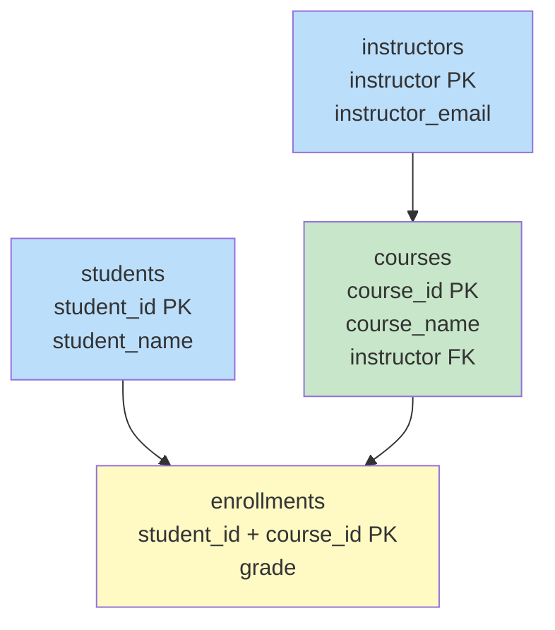
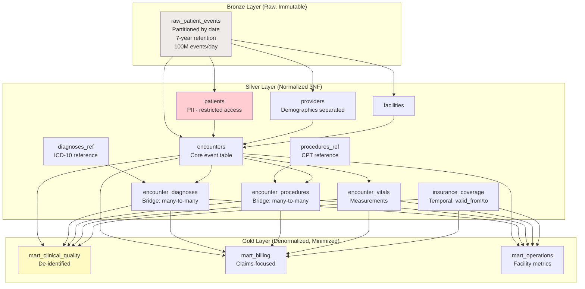

# Scenario Questions — Normalization

<article data-difficulty="junior">

## 🟢 Junior: Identify Normal Form Violations

**Scenario:** Given the following table, identify what normal form it's currently in, list all violations, and decompose it into 3NF.

```
Table: student_enrollment
| student_id | student_name | course_id | course_name | instructor | instructor_email | grade |
|------------|-------------|-----------|-------------|------------|------------------|-------|
| S001       | Alice       | CS101     | Databases   | Dr. Smith  | smith@uni.edu    | A     |
| S001       | Alice       | CS201     | Algorithms  | Dr. Jones  | jones@uni.edu    | B+    |
| S002       | Bob         | CS101     | Databases   | Dr. Smith  | smith@uni.edu    | A-    |
```

Primary Key: (student_id, course_id)

<details>
<summary>💡 Hint</summary>
Check each normal form: 1NF (atomic values?), 2NF (partial dependencies on composite key?), 3NF (transitive dependencies?). Look at which non-key columns depend on only PART of the composite key, and which depend on OTHER non-key columns.
</details>

<details>
<summary>✅ Solution</summary>

**Analysis:**

```
PK: (student_id, course_id) — composite key

Functional Dependencies:
1. student_id → student_name                    (PARTIAL — only part of PK)
2. course_id → course_name, instructor          (PARTIAL — only part of PK)
3. instructor → instructor_email                (TRANSITIVE — non-key → non-key)
4. (student_id, course_id) → grade             (FULL — depends on entire PK ✓)
```

**Current Normal Form: 1NF** (atomic values, has a PK, but fails 2NF)

**Violations:**
- ❌ **2NF violation**: `student_name` depends only on `student_id` (partial dependency)
- ❌ **2NF violation**: `course_name`, `instructor` depend only on `course_id` (partial dependency)
- ❌ **3NF violation**: `instructor_email` depends on `instructor` (transitive: course_id → instructor → instructor_email)

**Decomposition to 3NF:**

```sql
-- Table 1: Students (resolves partial dep on student_id)
CREATE TABLE students (
    student_id      VARCHAR(10) PRIMARY KEY,
    student_name    VARCHAR(100) NOT NULL
);

-- Table 2: Instructors (resolves transitive dep instructor → email)
CREATE TABLE instructors (
    instructor      VARCHAR(100) PRIMARY KEY,
    instructor_email VARCHAR(200) NOT NULL
);

-- Table 3: Courses (resolves partial dep on course_id)
CREATE TABLE courses (
    course_id       VARCHAR(10) PRIMARY KEY,
    course_name     VARCHAR(100) NOT NULL,
    instructor      VARCHAR(100) REFERENCES instructors
);

-- Table 4: Enrollments (only full dependencies on composite key)
CREATE TABLE enrollments (
    student_id      VARCHAR(10) REFERENCES students,
    course_id       VARCHAR(10) REFERENCES courses,
    grade           VARCHAR(5),
    PRIMARY KEY (student_id, course_id)
);
```



**Verification:**
- ✅ 1NF: All values atomic, all tables have PKs
- ✅ 2NF: No partial dependencies (each table has a single-column PK, or all non-key attrs depend on full composite key)
- ✅ 3NF: No transitive dependencies (instructor_email depends on instructor, which IS a PK in its own table)
- ✅ Lossless join: Can reconstruct original via: enrollments ⟕ students ⟕ courses ⟕ instructors

</details>

</article>

<article data-difficulty="mid-level">

## 🟡 Mid-Level: Normalize vs. Denormalize Decision

**Scenario:** You're designing the data layer for a logistics company. The application team proposes a single denormalized table for shipments:

```sql
CREATE TABLE shipments (
    shipment_id, shipment_date, status,
    sender_name, sender_address, sender_city, sender_state, sender_zip,
    receiver_name, receiver_address, receiver_city, receiver_state, receiver_zip,
    carrier_name, carrier_phone, carrier_service_level,
    package_weight, package_dimensions,
    origin_hub_name, origin_hub_city,
    destination_hub_name, destination_hub_city,
    current_location, last_scan_time,
    estimated_delivery, actual_delivery
);
```

They have 50M shipments/year, 500K unique senders, 2M unique receivers, 15 carriers, and 200 hubs. The system needs to support both OLTP (real-time tracking) and analytics (monthly reports). Design the normalized OLTP schema AND explain how you'd serve the analytics use case.

<details>
<summary>💡 Hint</summary>
Identify the entities: senders/receivers (addresses), carriers, hubs. Normalize for OLTP (reduce redundancy, enable updates). Then for analytics: create a denormalized view/table. Consider: carrier changes phone → in denormalized, you'd update 3M+ rows; normalized, just 1 row.
</details>

<details>
<summary>✅ Solution</summary>

```sql
-- ═══════════════════════════════════════
-- NORMALIZED OLTP SCHEMA (3NF)
-- ═══════════════════════════════════════

-- Entities with their own lifecycle:
CREATE TABLE addresses (
    address_id        SERIAL PRIMARY KEY,
    name              VARCHAR(200),
    street_address    VARCHAR(500),
    city              VARCHAR(100),
    state             VARCHAR(50),
    zip_code          VARCHAR(10),
    address_hash      VARCHAR(64) UNIQUE  -- For dedup: MD5(normalized address)
);
-- ~2.5M rows (senders + receivers deduped)
-- UPDATE: change an address ONCE, all shipments reflect it

CREATE TABLE carriers (
    carrier_id        SERIAL PRIMARY KEY,
    carrier_name      VARCHAR(100),
    phone             VARCHAR(20),
    service_levels    TEXT[]              -- Array: ['ground', 'express', 'overnight']
);
-- 15 rows! Without normalization, carrier_phone stored 50M times

CREATE TABLE hubs (
    hub_id            SERIAL PRIMARY KEY,
    hub_name          VARCHAR(200),
    city              VARCHAR(100),
    state             VARCHAR(50),
    hub_type          VARCHAR(20)         -- 'sort_center', 'distribution', 'last_mile'
);
-- 200 rows

CREATE TABLE shipments (
    shipment_id       BIGSERIAL PRIMARY KEY,
    shipment_date     TIMESTAMP NOT NULL,
    status            VARCHAR(20) NOT NULL,
    -- Foreign keys (normalized!):
    sender_address_id     INT REFERENCES addresses,
    receiver_address_id   INT REFERENCES addresses,
    carrier_id            INT REFERENCES carriers,
    service_level         VARCHAR(20),
    origin_hub_id         INT REFERENCES hubs,
    destination_hub_id    INT REFERENCES hubs,
    -- Shipment-specific attributes:
    package_weight_kg     DECIMAL(8,2),
    package_dimensions    VARCHAR(50),
    estimated_delivery    TIMESTAMP,
    actual_delivery       TIMESTAMP,
    -- Tracking (updates frequently):
    current_location      VARCHAR(200),
    last_scan_time        TIMESTAMP,
    -- Indexes for OLTP queries:
    created_at            TIMESTAMP DEFAULT NOW()
);
-- 50M rows/year, but only ~12 columns (vs. 25+ in denormalized)

CREATE INDEX idx_shipments_status ON shipments(status) WHERE status != 'delivered';
CREATE INDEX idx_shipments_receiver ON shipments(receiver_address_id);
CREATE INDEX idx_shipments_date ON shipments(shipment_date);

-- ═══════════════════════════════════════
-- WHY THIS IS BETTER THAN DENORMALIZED:
-- ═══════════════════════════════════════
-- 1. Carrier changes phone: UPDATE 1 row (vs. ~3M rows in denormalized)
-- 2. Hub renames: UPDATE 1 row (vs. millions)
-- 3. Storage: addresses deduped (same sender ships 100s of packages)
-- 4. Consistency: carrier_name is never inconsistent across rows
-- 5. Schema evolution: add carrier_email → 1 ALTER, no backfill

-- ═══════════════════════════════════════
-- ANALYTICS: Denormalized Materialized View
-- ═══════════════════════════════════════

CREATE MATERIALIZED VIEW analytics.shipments_wide AS
SELECT
    s.shipment_id,
    s.shipment_date,
    s.status,
    -- Sender (denormalized):
    sa.name AS sender_name,
    sa.city AS sender_city,
    sa.state AS sender_state,
    -- Receiver (denormalized):
    ra.name AS receiver_name,
    ra.city AS receiver_city,
    ra.state AS receiver_state,
    -- Carrier (denormalized):
    c.carrier_name,
    s.service_level,
    -- Hubs (denormalized):
    oh.hub_name AS origin_hub,
    dh.hub_name AS destination_hub,
    -- Metrics:
    s.package_weight_kg,
    s.estimated_delivery,
    s.actual_delivery,
    EXTRACT(EPOCH FROM (s.actual_delivery - s.shipment_date))/3600 AS hours_to_deliver,
    CASE WHEN s.actual_delivery <= s.estimated_delivery THEN TRUE ELSE FALSE END AS on_time
FROM shipments s
LEFT JOIN addresses sa ON s.sender_address_id = sa.address_id
LEFT JOIN addresses ra ON s.receiver_address_id = ra.address_id
LEFT JOIN carriers c ON s.carrier_id = c.carrier_id
LEFT JOIN hubs oh ON s.origin_hub_id = oh.hub_id
LEFT JOIN hubs dh ON s.destination_hub_id = dh.hub_id;

-- Refresh nightly for reporting:
REFRESH MATERIALIZED VIEW analytics.shipments_wide;

-- Analytics query (fast — single table scan!):
SELECT carrier_name, sender_state, 
       AVG(hours_to_deliver) AS avg_delivery_hours,
       SUM(CASE WHEN on_time THEN 1 ELSE 0 END)::FLOAT / COUNT(*) AS on_time_rate
FROM analytics.shipments_wide
WHERE shipment_date >= '2024-01-01'
GROUP BY carrier_name, sender_state;
```

**Key Points:**
- **OLTP (normalized 3NF)**: Optimized for writes, updates, and data integrity
- **Analytics (denormalized materialized view)**: Optimized for reads, pre-joined, refreshed nightly
- Carrier phone update: 1 row in OLTP → materialized view catches it on next refresh
- Storage savings: addresses table has 2.5M rows vs. being repeated across 50M shipments
- **Both needs served**: normalized source for app, denormalized view for analysts

</details>

</article>

<article data-difficulty="senior">

## 🔴 Senior: Designing a Multi-Layer Normalization Strategy

**Scenario:** You're architecting the data platform for a healthcare company processing 100M patient events/day from 20 hospitals. Each event contains: patient demographics, insurance info, provider details, facility info, diagnosis codes (multiple per event), procedures (multiple per event), medications, and vitals measurements. Regulatory requirements demand: (1) full audit trail for 7 years, (2) ability to reproduce any report as of any historical date, (3) HIPAA compliance (data minimization). Design a complete multi-layer normalization strategy covering ingestion, storage, and consumption.

<details>
<summary>💡 Hint</summary>
Consider: Bronze (raw, immutable, audit trail), Silver (normalized 3NF with temporal validity + role-based access), Gold (denormalized marts with data minimization). Handle multi-valued attributes (multiple diagnoses) via bridge or array patterns. Bi-temporal modeling for "as-of" reporting. HIPAA: separate PII from clinical data (different access controls).
</details>

<details>
<summary>✅ Solution</summary>

```sql
-- ═══════════════════════════════════════════════════════════════
-- ARCHITECTURE OVERVIEW
-- ═══════════════════════════════════════════════════════════════

-- Bronze: Raw immutable events (audit trail, 7-year retention)
-- Silver: Normalized 3NF with bi-temporal tracking (source of truth)
-- Gold: Purpose-built marts with HIPAA data minimization
```



```sql
-- ═══════════════════════════════════════════════════════════════
-- BRONZE: Raw Immutable Events (Audit Trail)
-- ═══════════════════════════════════════════════════════════════

CREATE TABLE bronze.raw_patient_events (
    event_id            VARCHAR(50),
    event_payload       VARIANT,          -- Full JSON, never modified
    source_system       VARCHAR(50),
    source_hospital_id  VARCHAR(20),
    received_at         TIMESTAMP_TZ,     -- When WE received it
    event_timestamp     TIMESTAMP_TZ,     -- When event occurred at source
    file_name           VARCHAR(500),     -- Source file for lineage
    batch_id            VARCHAR(50)
) PARTITION BY (DATE(received_at));

-- RETENTION: 7 years minimum (regulatory)
-- IMMUTABLE: No updates, no deletes (append-only)
-- PURPOSE: Can reproduce any data state from raw events

-- ═══════════════════════════════════════════════════════════════
-- SILVER: Normalized with Bi-Temporal Tracking
-- ═══════════════════════════════════════════════════════════════

-- HIPAA: PII in separate table with restricted access
CREATE TABLE silver.patients (
    patient_id          VARCHAR(20) PRIMARY KEY,
    -- PII (restricted column-level access):
    first_name          VARCHAR(100),
    last_name           VARCHAR(100),
    date_of_birth       DATE,
    ssn_hash            VARCHAR(64),      -- Never store raw SSN!
    -- Non-PII demographics:
    gender              VARCHAR(10),
    race                VARCHAR(50),
    zip_3               VARCHAR(3),       -- Only first 3 digits (HIPAA Safe Harbor)
    -- Bi-temporal:
    valid_from          TIMESTAMP_TZ,
    valid_to            TIMESTAMP_TZ DEFAULT '9999-12-31',
    recorded_at         TIMESTAMP_TZ DEFAULT CURRENT_TIMESTAMP(),
    superseded_at       TIMESTAMP_TZ DEFAULT '9999-12-31'
);

-- Grant access only to authorized roles:
-- GRANT SELECT ON silver.patients TO ROLE clinical_analysts;
-- REVOKE SELECT (first_name, last_name, date_of_birth) FROM ROLE research_analysts;

CREATE TABLE silver.providers (
    provider_id         VARCHAR(20) PRIMARY KEY,
    npi_number          VARCHAR(10) UNIQUE,    -- National Provider Identifier
    provider_name       VARCHAR(200),
    specialty           VARCHAR(100),
    facility_id         VARCHAR(20) REFERENCES silver.facilities,
    valid_from          TIMESTAMP_TZ,
    valid_to            TIMESTAMP_TZ DEFAULT '9999-12-31'
);

CREATE TABLE silver.facilities (
    facility_id         VARCHAR(20) PRIMARY KEY,
    facility_name       VARCHAR(200),
    facility_type       VARCHAR(50),   -- 'hospital', 'clinic', 'lab'
    city                VARCHAR(100),
    state               VARCHAR(2),
    bed_count           INT
);

-- Core normalized event table:
CREATE TABLE silver.encounters (
    encounter_id        VARCHAR(30) PRIMARY KEY,
    patient_id          VARCHAR(20) REFERENCES silver.patients,
    provider_id         VARCHAR(20) REFERENCES silver.providers,
    facility_id         VARCHAR(20) REFERENCES silver.facilities,
    encounter_type      VARCHAR(20),   -- 'inpatient', 'outpatient', 'emergency'
    admission_date      TIMESTAMP_TZ,
    discharge_date      TIMESTAMP_TZ,
    -- Bi-temporal:
    recorded_at         TIMESTAMP_TZ,
    superseded_at       TIMESTAMP_TZ DEFAULT '9999-12-31'
);

-- Many-to-many: Multiple diagnoses per encounter (normalized bridge)
CREATE TABLE silver.encounter_diagnoses (
    encounter_id        VARCHAR(30) REFERENCES silver.encounters,
    diagnosis_code      VARCHAR(10),    -- ICD-10 code
    diagnosis_rank      INT,            -- 1=primary, 2+=secondary
    present_on_admit    BOOLEAN,
    recorded_at         TIMESTAMP_TZ,
    PRIMARY KEY (encounter_id, diagnosis_code, recorded_at)
);

-- Many-to-many: Multiple procedures per encounter
CREATE TABLE silver.encounter_procedures (
    encounter_id        VARCHAR(30) REFERENCES silver.encounters,
    procedure_code      VARCHAR(10),    -- CPT code
    procedure_date      DATE,
    performing_provider VARCHAR(20) REFERENCES silver.providers,
    recorded_at         TIMESTAMP_TZ,
    PRIMARY KEY (encounter_id, procedure_code, procedure_date, recorded_at)
);

-- Vitals: measurements (1:many with encounter)
CREATE TABLE silver.encounter_vitals (
    encounter_id        VARCHAR(30) REFERENCES silver.encounters,
    measurement_time    TIMESTAMP_TZ,
    vital_type          VARCHAR(30),   -- 'heart_rate', 'blood_pressure', 'temperature'
    value_numeric       DECIMAL(10,2),
    unit                VARCHAR(20),
    PRIMARY KEY (encounter_id, measurement_time, vital_type)
);

-- Insurance (temporal: coverage periods)
CREATE TABLE silver.insurance_coverage (
    patient_id          VARCHAR(20) REFERENCES silver.patients,
    payer_id            VARCHAR(20),
    plan_name           VARCHAR(200),
    coverage_start      DATE,
    coverage_end        DATE,
    copay_amount        DECIMAL(8,2),
    deductible_amount   DECIMAL(10,2),
    recorded_at         TIMESTAMP_TZ,
    PRIMARY KEY (patient_id, payer_id, coverage_start, recorded_at)
);

-- ═══════════════════════════════════════════════════════════════
-- GOLD: Purpose-Built Marts (Denormalized + Data Minimization)
-- ═══════════════════════════════════════════════════════════════

-- Clinical Quality Mart (DE-IDENTIFIED for research):
CREATE TABLE gold.mart_clinical_quality AS
SELECT
    e.encounter_id,
    -- De-identified patient: age band only, no PII!
    FLOOR(DATEDIFF('year', p.date_of_birth, e.admission_date) / 10) * 10 AS age_band,
    p.gender,
    p.race,
    p.zip_3,
    -- Provider (denormalized):
    pr.specialty AS provider_specialty,
    -- Facility (denormalized):
    f.facility_type,
    f.state AS facility_state,
    -- Encounter:
    e.encounter_type,
    e.admission_date,
    e.discharge_date,
    DATEDIFF('hour', e.admission_date, e.discharge_date) AS length_of_stay_hours,
    -- Diagnoses (aggregated to array):
    ARRAY_AGG(DISTINCT ed.diagnosis_code) AS diagnosis_codes,
    -- Primary diagnosis denormalized:
    MAX(CASE WHEN ed.diagnosis_rank = 1 THEN ed.diagnosis_code END) AS primary_dx
FROM silver.encounters e
JOIN silver.patients p ON e.patient_id = p.patient_id AND p.valid_to = '9999-12-31'
JOIN silver.providers pr ON e.provider_id = pr.provider_id
JOIN silver.facilities f ON e.facility_id = f.facility_id
LEFT JOIN silver.encounter_diagnoses ed ON e.encounter_id = ed.encounter_id
WHERE e.superseded_at = '9999-12-31'  -- Current version only
GROUP BY 1,2,3,4,5,6,7,8,9,10,11,12;

-- "As-of" reporting capability (uses bi-temporal silver):
-- "Show me the clinical quality metrics AS WE KNEW THEM on March 1, 2024"
-- Filter: recorded_at <= '2024-03-01' AND superseded_at > '2024-03-01'
-- This satisfies the regulatory "reproduce any historical report" requirement!
```

**Key Points:**
- **Bronze**: Immutable raw events → audit trail (7 years, append-only)
- **Silver (3NF)**: Properly normalized with bi-temporal tracking (valid_from/to + recorded_at/superseded_at)
- **HIPAA compliance**: PII isolated in `patients` table with column-level access. Gold marts de-identify (age bands, zip_3, no names)
- **Multi-valued attributes**: Bridge tables for diagnoses/procedures (proper normalization, no arrays in silver)
- **"As-of" reporting**: Bi-temporal queries filter by recorded_at/superseded_at — can reproduce any report at any historical point
- **Gold (denormalized)**: Pre-joined, de-identified, purpose-specific. Research gets `mart_clinical_quality` (no PII). Billing gets `mart_billing` (has claim amounts)
- **Scalability**: 100M events/day handled by partitioning bronze by date, silver encounters by admission_date

</details>

</article>

</content>
