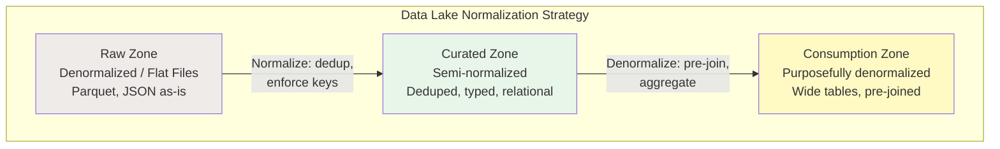

# Normalization — Senior Deep Dive

## Normalization Theory Applied to Data Lakes

In modern data platforms, normalization principles still matter but are applied differently:



### Why Not Just Denormalize Everything?

```sql
-- Fully denormalized "one big table" (common mistake):
CREATE TABLE one_big_table (
    order_id, order_date, 
    customer_id, customer_name, customer_email, customer_city, customer_state,
    product_id, product_name, product_category, product_brand,
    store_id, store_name, store_city,
    warehouse_id, warehouse_name,
    quantity, revenue, discount
);

-- PROBLEMS at scale:
-- 1. Customer changes email → must update MILLIONS of order rows
-- 2. Storage: "Widget" stored 10M times instead of once
-- 3. Inconsistency: some rows say "Electronics", others "electronics" 
-- 4. Schema evolution: adding a column requires rewriting entire table
-- 5. Loading: can't independently load customers vs. orders

-- BETTER: Normalize the integration layer, denormalize the serving layer
```

## Decomposition and Lossless Joins

When decomposing a table, you must ensure **lossless join** (no data lost, no spurious tuples gained).

```sql
-- LOSSLESS decomposition: joining the parts reconstructs the original exactly
-- Rule: R(A,B,C) decomposes into R1(A,B) and R2(A,C) losslessly 
--        if A is a key of R1 or R2 (common attribute must be a key in at least one)

-- Example (SAFE decomposition):
-- Original: employees(emp_id, name, dept_id, dept_name)
-- FD: emp_id → name, dept_id; dept_id → dept_name

-- Decompose into:
-- R1: employees(emp_id, name, dept_id)  — emp_id is key ✓
-- R2: departments(dept_id, dept_name)   — dept_id is key ✓
-- JOIN ON dept_id → perfectly reconstructs original ✓

-- LOSSY decomposition (BAD — creates spurious tuples):
-- Original: supply(supplier, part, project)
-- If you decompose into: (supplier, part) and (part, project)
-- JOIN on 'part' creates combinations that didn't exist! WRONG!
```

## Dependency-Preserving Decomposition

Beyond lossless joins, a good decomposition should also **preserve all functional dependencies** (enforceable without joins).

```sql
-- Original table: teaches(student, course, instructor)
-- FDs: (student, course) → instructor; instructor → course

-- Decomposition A: (student, instructor) + (instructor, course)
-- ✓ Lossless (instructor is key of second table)
-- ✓ Dependency-preserving: instructor → course is in table 2!
--    (student, course) → instructor is enforceable via JOIN, acceptable

-- Decomposition B: (student, course) + (course, instructor)  
-- ✓ Lossless
-- ✗ NOT dependency-preserving: can't enforce "instructor → course" 
--    without joining tables (instructor not in same table as course alone)
```

## Advanced Denormalization Patterns for Data Engineering

### Pattern 1: Controlled Redundancy with Triggers/ETL

```sql
-- Maintain a denormalized summary table via event-driven updates
-- Instead of full rebuild, keep it incrementally updated:

-- Silver (normalized):
CREATE TABLE orders (order_id INT PK, customer_id INT, order_date DATE, status VARCHAR);
CREATE TABLE order_items (order_id INT, product_id INT, quantity INT, amount DECIMAL);

-- Gold (denormalized summary, maintained by streaming/CDC):
CREATE TABLE customer_order_summary (
    customer_id         INT PRIMARY KEY,
    total_orders        INT DEFAULT 0,
    total_revenue       DECIMAL(14,2) DEFAULT 0,
    avg_order_value     DECIMAL(10,2) DEFAULT 0,
    last_order_date     DATE,
    updated_at          TIMESTAMP
);

-- Delta/Spark Streaming job maintains the summary:
-- On each new order: UPDATE summary SET total_orders = total_orders + 1, ...
-- Zero anomalies because source of truth is still the normalized tables!
```

### Pattern 2: Normalization-Aware Partitioning

```sql
-- Normalized table with smart partitioning for data lake:
-- Partition by the dimension that changes least (reduces rewrite scope)

-- orders partitioned by order_date (new data = new partition, no updates to old)
-- customers partitioned by region (SCD changes only affect one partition)

-- Spark/Delta:
CREATE TABLE silver.orders (
    order_id    BIGINT,
    customer_id BIGINT,
    product_id  BIGINT,
    quantity    INT,
    amount      DECIMAL(12,2)
) PARTITIONED BY (order_date DATE);

-- When a customer's region changes (SCD):
-- Only the customer table partition for that region needs update
-- Orders table is UNTOUCHED (normalized = no customer data in orders!)
```

### Pattern 3: Temporal Normalization

```sql
-- Bi-temporal modeling: separate "valid time" from "transaction time"
CREATE TABLE customer_addresses (
    customer_id       INT,
    address           VARCHAR(500),
    -- Valid time: when this was true in the real world
    valid_from        DATE,
    valid_to          DATE,
    -- Transaction time: when we recorded this in our system
    recorded_at       TIMESTAMP,
    superseded_at     TIMESTAMP DEFAULT '9999-12-31',
    PRIMARY KEY (customer_id, valid_from, recorded_at)
);

-- Supports:
-- "What was the address on March 15?" → valid_from <= Mar 15 < valid_to
-- "What did we THINK the address was on March 15, as of April 1?"
--   → valid_from <= Mar 15 < valid_to AND recorded_at <= Apr 1 < superseded_at
-- Enables full audit trail + corrections without data loss
```

## Normalization Anti-Patterns in Data Engineering

### Anti-Pattern 1: Over-Normalization of Analytics Tables

```sql
-- ❌ Over-normalized analytics (too many joins for BI tools):
-- 7 tables joined for a simple revenue-by-region report
SELECT r.region_name, SUM(oi.quantity * oi.unit_price)
FROM order_items oi
JOIN orders o ON oi.order_id = o.order_id
JOIN customers c ON o.customer_id = c.customer_id
JOIN addresses a ON c.address_id = a.address_id
JOIN cities ci ON a.city_id = ci.city_id
JOIN states s ON ci.state_id = s.state_id
JOIN regions r ON s.region_id = r.region_id
GROUP BY r.region_name;

-- ✅ Properly denormalized for analytics:
SELECT customer_region, SUM(revenue)
FROM fact_sales
GROUP BY customer_region;  -- One table scan!
```

### Anti-Pattern 2: Under-Normalization of Integration Layer

```sql
-- ❌ Dumping everything flat into silver (will cause consistency issues):
CREATE TABLE silver.events_flat (
    event_id, user_id, user_name, user_email, user_plan,
    product_id, product_name, product_category,
    event_type, event_timestamp, event_value
);
-- Problem: user_email appears in 500M event rows
-- When email changes, which rows are "current"? Ambiguous!

-- ✅ Normalized silver layer:
CREATE TABLE silver.users (user_id INT PK, name, email, plan);
CREATE TABLE silver.products (product_id INT PK, name, category);
CREATE TABLE silver.events (event_id BIGINT PK, user_id FK, product_id FK, event_type, timestamp, value);
-- Email changes once in users table. Events reference user_id.
```

### Anti-Pattern 3: Snowflake Schema Abuse

```sql
-- ❌ Extreme snowflaking (defeats purpose of dimensional model):
-- dim_product → dim_subcategory → dim_category → dim_department → dim_division
-- 5 dimension tables joined just to get the product's division!

-- ✅ Denormalized star schema dimension:
CREATE TABLE dim_product (
    product_key INT PK,
    product_name VARCHAR(200),
    subcategory  VARCHAR(100),  -- Embedded from dim_subcategory
    category     VARCHAR(100),  -- Embedded from dim_category
    department   VARCHAR(100),  -- Embedded from dim_department
    division     VARCHAR(100)   -- Embedded from dim_division
);
-- One JOIN from fact to dim_product gives you all hierarchy levels!
```

## Schema Evolution and Normalization

How normalization decisions affect schema evolution in production:

```sql
-- Normalized schema evolves BETTER:
-- Adding a new attribute to customers:
ALTER TABLE customers ADD loyalty_tier VARCHAR(20);
-- Done! One table, one change. All queries via JOIN still work.

-- Denormalized schema evolution is PAINFUL:
-- Adding loyalty_tier to the "one big table":
ALTER TABLE fact_sales ADD customer_loyalty_tier VARCHAR(20);
-- Must BACKFILL 500M rows! And update ETL to populate going forward.
-- And now loyalty_tier is embedded in 500M rows (storage waste).

-- TAKEAWAY: Normalize for agility at integration layer.
-- Denormalize at consumption layer (can be rebuilt from normalized source).
```

## Interview Tips

> **Tip 1:** "How do you decide the right level of normalization?" — It depends on the layer. Integration/silver: normalize to 3NF (data integrity, single source of truth, easy schema evolution). Consumption/gold: denormalize (query performance, fewer joins, BI-friendly). The normalized layer is ALWAYS the source of truth; denormalized layers are derived and rebuildable.

> **Tip 2:** "What is lossless decomposition?" — When you split a table, joining the parts must perfectly reconstruct the original (no data loss, no extra phantom rows). The rule: the common column(s) in the join must be a key in at least one of the decomposed tables. If this fails, you'll get spurious tuples.

> **Tip 3:** "How does normalization relate to data lake architecture?" — Bronze = raw (as-is, often denormalized). Silver = cleaned and normalized (enforce keys, remove duplicates, establish relationships). Gold = purposefully denormalized for specific use cases. This gives you the benefits of both: integrity in silver, performance in gold.

## ⚡ Cheat Sheet

**Dimensional modeling building blocks**
```
Fact table:       measures/metrics (order_amount, quantity, duration)
Dimension table:  descriptive attributes (customer, product, date, geography)
Grain:            one row = one business event at lowest detail level
Surrogate key:    system-generated integer PK (never use natural keys in dim)
Natural key:      source system business key (stored alongside surrogate key)
```

**Star schema vs Snowflake schema**
```
Star:       fact → dimension (denormalized, faster queries, more storage)
Snowflake:  fact → dimension → sub-dimension (normalized, saves storage, more joins)
Rule:       prefer star for BI; snowflake only when storage cost is critical
```

**SCD (Slowly Changing Dimensions)**
| Type | Strategy | When |
|---|---|---|
| SCD1 | Overwrite old value | History irrelevant |
| SCD2 | New row (add effective_from, effective_to, is_current) | Need full history |
| SCD3 | Add prev_value column | Only need one prior value |
| SCD4 | Separate history table | Large dimension, rare changes |
| SCD6 | SCD1 + SCD2 + SCD3 hybrid | Best of all worlds |

**SCD2 implementation**
```sql
-- Insert new version, expire old
UPDATE dim_customer SET effective_to = CURRENT_DATE - 1, is_current = FALSE
WHERE customer_id = 123 AND is_current = TRUE;

INSERT INTO dim_customer (customer_id, name, city, effective_from, effective_to, is_current)
VALUES (123, 'Jane Doe', 'Chicago', CURRENT_DATE, '9999-12-31', TRUE);
```

**Data Vault pattern**
```
Hub:   business keys (stable identifiers — customer_id, order_id)
Link:  relationships between hubs (many-to-many)
Sat:   descriptive attributes + context (with load timestamp — full history)
```

**Fact table types**
```
Transaction:    one row per event (orders, clicks, payments)
Snapshot:       one row per period per entity (daily account balance)
Accumulating:   one row per lifecycle, updated as process stages complete
```

**Key interview points**
- Grain: define before designing any fact table — drives every design decision
- Degenerate dimensions: order number on fact table with no corresponding dimension
- Factless facts: events with no measures (student enrolled in course — just the relationship)
- Role-playing dimensions: same dimension used multiple times (order_date, ship_date, return_date)
- Conformed dimensions: shared across multiple fact tables (same dim_date in sales and returns facts)
