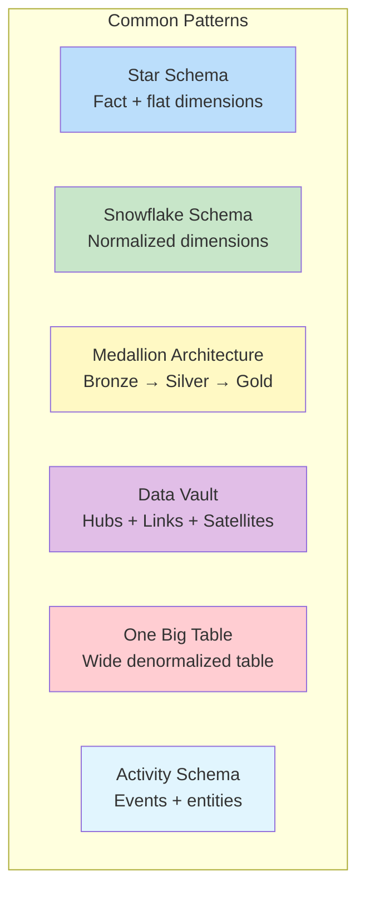
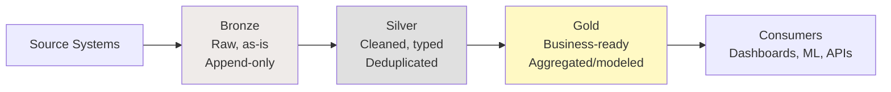
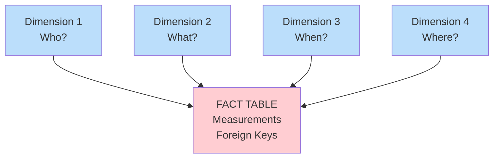
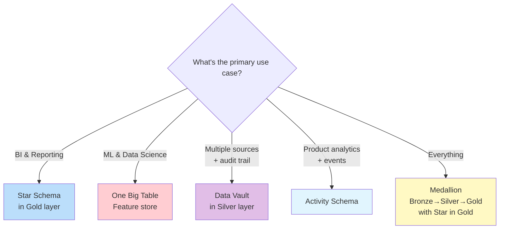

# Schema Design Patterns — Fundamentals

## What Are Schema Design Patterns?

Schema design patterns are **proven architectural approaches** for organizing data in warehouses and lakes. They define how tables relate to each other, how data flows between layers, and how to balance performance with flexibility.



## The Medallion Architecture (Most Popular Today)



| Layer | Purpose | Schema Style | Example |
|-------|---------|-------------|---------|
| **Bronze** | Raw ingestion | Schema-on-read, flat | raw_orders (JSON/Parquet as-is) |
| **Silver** | Cleaned & conformed | 3NF or semi-normalized | silver.orders, silver.customers |
| **Gold** | Business-ready | Star schema / wide tables | gold.fact_sales, gold.dim_customer |

```sql
-- Bronze: Raw data, no transformation
CREATE TABLE bronze.raw_orders (
    _raw_data       VARIANT,         -- Full JSON payload
    _source_file    VARCHAR(500),    -- Where it came from
    _ingested_at    TIMESTAMP        -- When we received it
);

-- Silver: Cleaned, typed, deduplicated  
CREATE TABLE silver.orders (
    order_id        VARCHAR(20) PRIMARY KEY,
    customer_id     VARCHAR(20) NOT NULL,
    order_date      TIMESTAMP NOT NULL,
    total_amount    DECIMAL(12,2),
    status          VARCHAR(20),
    _loaded_at      TIMESTAMP
);

-- Gold: Business-ready star schema
CREATE TABLE gold.fact_sales (
    sale_key        BIGINT PRIMARY KEY,
    date_key        INT,
    customer_key    INT,
    product_key     INT,
    revenue         DECIMAL(12,2),
    quantity        INT
);
```

## Star Schema Pattern

The most common pattern for analytical data warehouses.



**When to use:** Reporting, BI dashboards, ad-hoc analytics.

## One Big Table (OBT) Pattern

A single wide denormalized table containing everything.

```sql
-- One Big Table: all facts and dimension attributes pre-joined
CREATE TABLE analytics.orders_obt (
    -- Order facts:
    order_id, order_date, quantity, revenue, discount,
    -- Customer attributes (denormalized):
    customer_name, customer_email, customer_city, customer_segment,
    -- Product attributes (denormalized):
    product_name, product_category, product_brand,
    -- Store attributes (denormalized):
    store_name, store_region
);
-- ONE table, ZERO joins needed for queries!
```

| Pros | Cons |
|------|------|
| Simplest queries (no JOINs) | Massive redundancy |
| Fast for specific use cases | Hard to maintain (updates affect many rows) |
| Good for ML feature stores | Schema changes are painful |
| Works for small/medium data | Doesn't scale well for many dimensions |

**When to use:** ML feature engineering, specific pre-computed reporting, small datasets.

## Activity Schema Pattern

Modern event-driven approach for product analytics.

```sql
-- Entity table (slowly changing):
CREATE TABLE entities.customers (
    customer_id     VARCHAR(20) PRIMARY KEY,
    attributes      VARIANT,          -- JSON: {name, email, plan, ...}
    updated_at      TIMESTAMP
);

-- Activity stream (append-only events):
CREATE TABLE activities.customer_events (
    event_id        VARCHAR(50) PRIMARY KEY,
    customer_id     VARCHAR(20),
    activity_type   VARCHAR(50),      -- 'purchase', 'login', 'page_view'
    event_timestamp TIMESTAMP,
    properties      VARIANT           -- JSON: event-specific data
);
-- Simple: just entities + their activities over time
```

**When to use:** Product analytics, customer 360, event-driven architectures.

## Choosing the Right Pattern



| Pattern | Best For | Complexity | Query Speed |
|---------|----------|-----------|-------------|
| Star Schema | BI / dashboards | Medium | Fast |
| Snowflake Schema | Deep hierarchies | High | Medium |
| Medallion | General-purpose data platform | Medium | Varies by layer |
| Data Vault | Enterprise DWH with audit needs | High | Slow (needs marts) |
| One Big Table | ML features, simple analytics | Low | Fastest (no joins) |
| Activity Schema | Product/event analytics | Low | Fast for event queries |

## Anti-Patterns to Avoid

| Anti-Pattern | Problem | Better Approach |
|-------------|---------|----------------|
| Everything in one schema | No separation of concerns | Medallion (bronze/silver/gold) |
| Circular dependencies | Tables reference each other | Unidirectional data flow |
| Mixing grain in one fact | Can't aggregate correctly | Separate facts per grain |
| Over-normalization in gold | Too many joins for analysts | Denormalize for consumption |
| No surrogate keys | Can't handle SCD, poor joins | Always add surrogate keys |

## Interview Tips

> **Tip 1:** "What schema design pattern would you use?" — Start with medallion architecture (bronze/silver/gold) as the overall framework. Within the gold layer, use star schema for BI/reporting. This is the most common production pattern today. Mention that Data Vault can replace silver for enterprise environments needing full audit trails.

> **Tip 2:** "Star schema vs. One Big Table?" — Star schema: better for general analytics (flexible, any dimension combination). OBT: better for specific use cases (ML feature store, one dashboard). In practice, star schema in gold layer + OBT views for specific consumers. OBT is derived FROM star, not a replacement.

> **Tip 3:** "What is the medallion architecture?" — Three-layer data organization: Bronze (raw, as-is ingestion), Silver (cleaned, typed, deduplicated), Gold (business-ready, modeled). Data flows one direction: source → bronze → silver → gold. Each layer adds value. Silver is source of truth; gold is optimized for consumption.
