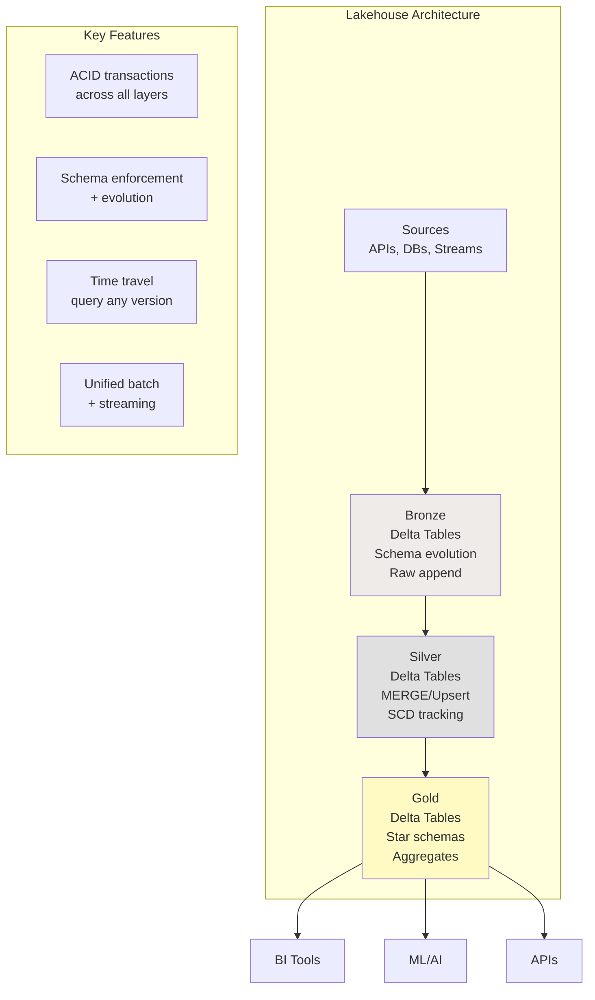
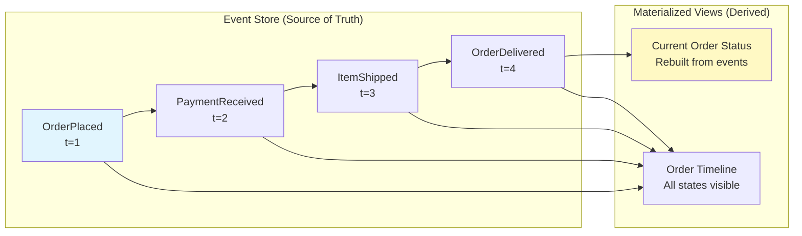
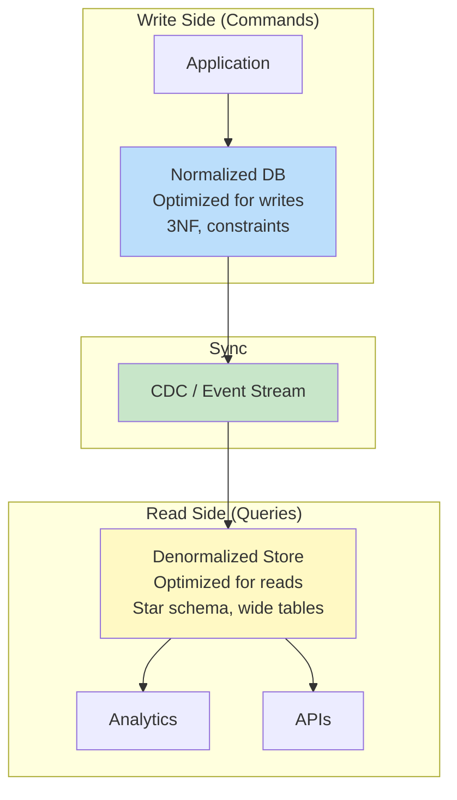

# Schema Design Patterns — Intermediate Concepts

## Lakehouse Pattern (Medallion + Delta)

Combines data lake flexibility with warehouse structure:



```sql
-- Bronze: Schema-on-read with schema evolution
CREATE TABLE bronze.raw_events
USING DELTA
TBLPROPERTIES ('delta.columnMapping.mode' = 'name')  -- Schema evolution!
AS SELECT * FROM read_stream('kafka://events');

-- Silver: Enforced schema with MERGE
MERGE INTO silver.customers target
USING bronze.raw_customers source
ON target.customer_id = source.customer_id
WHEN MATCHED AND source._change_type = 'update' THEN UPDATE SET *
WHEN NOT MATCHED THEN INSERT *
WHEN MATCHED AND source._change_type = 'delete' THEN DELETE;

-- Gold: Optimized star schema
CREATE TABLE gold.fact_sales
USING DELTA
PARTITIONED BY (sale_date)
TBLPROPERTIES ('delta.autoOptimize.optimizeWrite' = 'true');

OPTIMIZE gold.fact_sales ZORDER BY (customer_key, product_key);
```

## Wide Table Pattern (Denormalized Analytics)

For specific analytical use cases, pre-join everything into one wide table:

```sql
-- Wide table for customer analytics (replaces multiple star schema queries)
CREATE TABLE analytics.customer_360 AS
SELECT
    c.customer_id,
    c.customer_name,
    c.segment,
    c.region,
    -- Order metrics:
    COUNT(DISTINCT o.order_id) AS total_orders,
    SUM(o.revenue) AS lifetime_revenue,
    AVG(o.revenue) AS avg_order_value,
    MAX(o.order_date) AS last_order_date,
    MIN(o.order_date) AS first_order_date,
    DATEDIFF('day', MAX(o.order_date), CURRENT_DATE) AS days_since_last_order,
    -- Product preferences:
    MODE(p.category) AS favorite_category,
    COUNT(DISTINCT p.product_id) AS unique_products_bought,
    -- Engagement metrics:
    COUNT(DISTINCT e.session_id) AS total_sessions_30d,
    SUM(e.page_views) AS total_page_views_30d,
    -- Support metrics:
    COUNT(DISTINCT t.ticket_id) AS support_tickets,
    AVG(t.resolution_hours) AS avg_resolution_time,
    -- Derived:
    CASE 
        WHEN DATEDIFF('day', MAX(o.order_date), CURRENT_DATE) > 90 THEN 'churned'
        WHEN COUNT(DISTINCT o.order_id) > 10 THEN 'loyal'
        WHEN COUNT(DISTINCT o.order_id) > 3 THEN 'active'
        ELSE 'new'
    END AS customer_lifecycle_stage
FROM silver.customers c
LEFT JOIN gold.fact_sales o ON c.customer_id = o.customer_id
LEFT JOIN gold.dim_product p ON o.product_key = p.product_key
LEFT JOIN silver.sessions e ON c.customer_id = e.customer_id 
    AND e.session_date > DATEADD('day', -30, CURRENT_DATE)
LEFT JOIN silver.support_tickets t ON c.customer_id = t.customer_id
GROUP BY c.customer_id, c.customer_name, c.segment, c.region;
```

## Event Sourcing Pattern

Store state changes as an immutable sequence of events:



```sql
-- Event store (append-only, immutable):
CREATE TABLE events.order_events (
    event_id        VARCHAR(50) PRIMARY KEY,
    order_id        VARCHAR(20),
    event_type      VARCHAR(50),      -- 'placed', 'paid', 'shipped', 'delivered', 'returned'
    event_timestamp TIMESTAMP,
    event_data      VARIANT,          -- JSON with event-specific payload
    actor           VARCHAR(100),     -- Who triggered this
    -- Never update, never delete!
    _ingested_at    TIMESTAMP DEFAULT CURRENT_TIMESTAMP()
);

-- Materialized state (rebuilt from events):
CREATE TABLE state.orders_current AS
SELECT 
    order_id,
    -- Latest event determines status:
    LAST_VALUE(event_type) OVER (
        PARTITION BY order_id ORDER BY event_timestamp
    ) AS current_status,
    -- First event timestamp = order creation:
    MIN(event_timestamp) AS created_at,
    -- Latest event timestamp = last update:
    MAX(event_timestamp) AS updated_at,
    -- Aggregate event data:
    MAX(CASE WHEN event_type = 'placed' THEN event_data:amount END)::DECIMAL AS order_amount,
    MAX(CASE WHEN event_type = 'shipped' THEN event_data:tracking_number END)::VARCHAR AS tracking
FROM events.order_events
GROUP BY order_id;
```

## Multi-Tenant Schema Patterns

### Shared Schema (Pool Model)

```sql
-- All tenants in same tables, differentiated by tenant_id:
CREATE TABLE shared.orders (
    order_id    BIGINT,
    tenant_id   INT NOT NULL,        -- Tenant discriminator
    customer_id VARCHAR(20),
    amount      DECIMAL(12,2),
    order_date  DATE
);

-- Row-level security:
CREATE POLICY tenant_isolation ON shared.orders
    USING (tenant_id = current_setting('app.current_tenant')::INT);

-- Pro: Simple, efficient
-- Con: Noisy neighbor, complex security
```

### Schema-Per-Tenant (Silo Model)

```sql
-- Each tenant gets their own schema:
CREATE SCHEMA tenant_acme;
CREATE TABLE tenant_acme.orders (...);

CREATE SCHEMA tenant_globex;
CREATE TABLE tenant_globex.orders (...);

-- Pro: Strong isolation, easy to delete tenant
-- Con: Schema proliferation, harder to query across tenants
```

### Hybrid (Bridge Pattern)

```sql
-- Shared reference data + tenant-specific transactional data:
CREATE SCHEMA shared;
CREATE TABLE shared.products (...);       -- Shared catalog
CREATE TABLE shared.dim_date (...);       -- Shared date dimension

CREATE SCHEMA tenant_data;
CREATE TABLE tenant_data.orders (
    tenant_id INT, ...                    -- Tenant-specific transactions
) PARTITION BY (tenant_id);               -- Physical isolation via partitioning

-- Best of both: shared dims, isolated facts, partition-level security
```

## CQRS Pattern (Command Query Responsibility Segregation)

Separate the write model from the read model:



```sql
-- Write model (normalized, OLTP):
CREATE TABLE app.orders (order_id SERIAL PK, customer_id INT FK, status VARCHAR);
CREATE TABLE app.order_items (item_id SERIAL PK, order_id INT FK, product_id INT FK, qty INT);

-- Read model (denormalized, analytics-optimized):
CREATE TABLE analytics.orders_flat (
    order_id, order_date, status,
    customer_name, customer_segment,
    total_items, total_amount,
    product_categories ARRAY  -- Denormalized array of categories
);

-- CDC syncs write → read asynchronously
-- Write side: fast, consistent transactions
-- Read side: fast, flexible queries (eventual consistency acceptable)
```

## Temporal Design Patterns

### Bi-Temporal Tables

```sql
-- Track both "when it was true" AND "when we knew about it":
CREATE TABLE temporal.customer_addresses (
    customer_id       INT,
    address           VARCHAR(500),
    -- Valid time (real world):
    valid_from        DATE,
    valid_to          DATE DEFAULT '9999-12-31',
    -- Transaction time (system knowledge):
    registered_at     TIMESTAMP,
    superseded_at     TIMESTAMP DEFAULT '9999-12-31',
    PRIMARY KEY (customer_id, valid_from, registered_at)
);

-- "What address did we have on file for customer 1 as of March 1?"
SELECT address
FROM temporal.customer_addresses
WHERE customer_id = 1
  AND valid_from <= '2024-03-01' AND valid_to > '2024-03-01'     -- Was valid then
  AND registered_at <= '2024-03-01' AND superseded_at > '2024-03-01'; -- We knew about it then
```

## Interview Tips

> **Tip 1:** "What is the lakehouse pattern?" — Medallion architecture (bronze/silver/gold) implemented on Delta Lake or Iceberg. Combines data lake flexibility (schema evolution, cheap storage, any format) with warehouse guarantees (ACID transactions, time travel, schema enforcement). Single platform for both batch and streaming.

> **Tip 2:** "When would you use event sourcing?" — When you need: (1) complete audit trail of all state changes, (2) ability to rebuild state at any point in time, (3) event-driven downstream processing. Examples: financial transactions, order lifecycle, compliance-heavy domains. Events are immutable source of truth; current state is derived/materialized.

> **Tip 3:** "How do you design multi-tenant schemas?" — Three approaches: (1) Shared tables with tenant_id column + row-level security (simple, efficient). (2) Schema-per-tenant (strong isolation, easy deletion). (3) Hybrid: shared reference data + partitioned tenant data. Choice depends on: isolation requirements, tenant count, and compliance needs.
