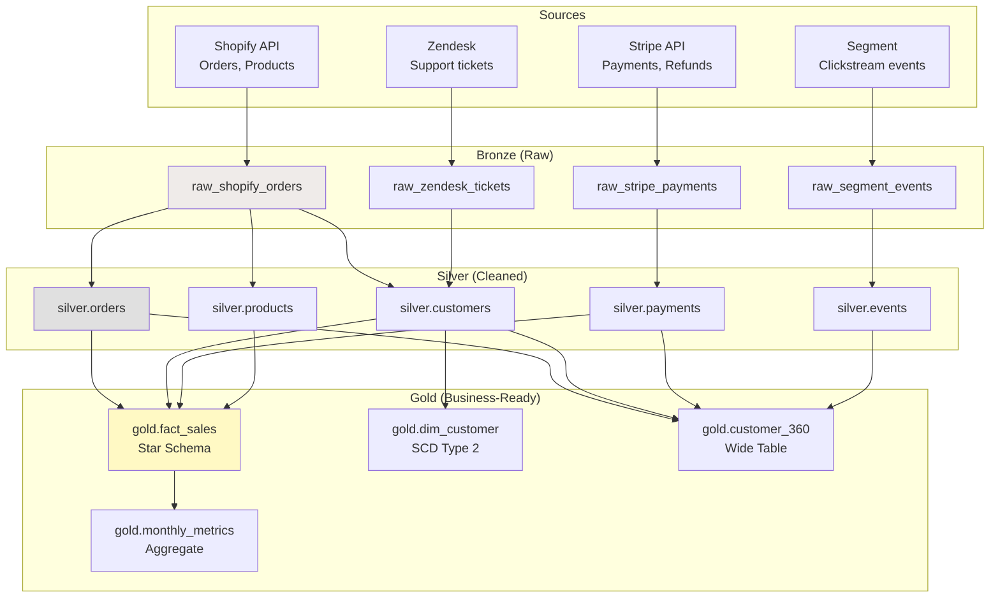

# Schema Design Patterns — Real-World Production Examples

## Example 1: Complete Medallion Architecture (E-Commerce)



### dbt Project Structure

```
models/
├── staging/            # Bronze → Silver (1:1 with sources)
│   ├── shopify/
│   │   ├── stg_shopify_orders.sql
│   │   ├── stg_shopify_products.sql
│   │   └── stg_shopify_customers.sql
│   ├── stripe/
│   │   └── stg_stripe_payments.sql
│   └── segment/
│       └── stg_segment_events.sql
├── intermediate/       # Silver (cross-source joins, dedup)
│   ├── int_orders_enriched.sql
│   └── int_customers_unified.sql
├── marts/              # Gold (business-ready)
│   ├── core/
│   │   ├── fact_sales.sql
│   │   ├── dim_customer.sql
│   │   ├── dim_product.sql
│   │   └── dim_date.sql
│   ├── marketing/
│   │   ├── customer_360.sql
│   │   └── attribution_model.sql
│   └── finance/
│       ├── monthly_revenue.sql
│       └── cohort_analysis.sql
└── schema.yml          # Documentation + tests
```

```sql
-- models/staging/shopify/stg_shopify_orders.sql
{{ config(materialized='view') }}

SELECT
    id::VARCHAR                          AS order_id,
    customer_id::VARCHAR                 AS customer_id,
    created_at::TIMESTAMP                AS order_date,
    total_price::DECIMAL(12,2)           AS total_amount,
    LOWER(financial_status)              AS payment_status,
    LOWER(fulfillment_status)            AS fulfillment_status,
    _fivetran_synced                     AS _loaded_at
FROM {{ source('shopify', 'orders') }}
WHERE NOT _fivetran_deleted

-- models/intermediate/int_orders_enriched.sql
{{ config(materialized='table') }}

SELECT
    o.order_id,
    o.customer_id,
    o.order_date,
    o.total_amount,
    -- Enrich with payment data:
    p.payment_method,
    p.payment_amount,
    p.payment_date,
    -- Calculate net:
    o.total_amount - COALESCE(r.refund_amount, 0) AS net_revenue
FROM {{ ref('stg_shopify_orders') }} o
LEFT JOIN {{ ref('stg_stripe_payments') }} p ON o.order_id = p.order_id
LEFT JOIN {{ ref('stg_stripe_refunds') }} r ON o.order_id = r.order_id

-- models/marts/core/fact_sales.sql
{{ config(
    materialized='incremental',
    unique_key='sale_key',
    partition_by={'field': 'order_date', 'data_type': 'date', 'granularity': 'month'}
) }}

SELECT
    {{ dbt_utils.generate_surrogate_key(['o.order_id', 'li.line_number']) }} AS sale_key,
    dd.date_key,
    dc.customer_key,
    dp.product_key,
    li.quantity,
    li.unit_price,
    li.quantity * li.unit_price AS gross_revenue,
    COALESCE(li.discount_amount, 0) AS discount_amount,
    (li.quantity * li.unit_price) - COALESCE(li.discount_amount, 0) AS net_revenue,
    o.order_date
FROM {{ ref('int_orders_enriched') }} o
JOIN {{ ref('stg_shopify_line_items') }} li ON o.order_id = li.order_id
JOIN {{ ref('dim_date') }} dd ON o.order_date::DATE = dd.full_date
JOIN {{ ref('dim_customer') }} dc ON o.customer_id = dc.customer_id AND dc.is_current
JOIN {{ ref('dim_product') }} dp ON li.product_id = dp.product_id

WHERE o.order_date > (SELECT MAX(order_date) FROM {{ this }})

```

---

## Example 2: Event-Driven Schema (SaaS Product)

```sql
-- ═══════════════════════════════════════
-- Bronze: Raw events (schema-on-read)
-- ═══════════════════════════════════════
CREATE TABLE bronze.raw_product_events (
    event_id        VARCHAR(50),
    event_payload   VARIANT,          -- Any structure!
    event_type      VARCHAR(100),
    received_at     TIMESTAMP
) PARTITION BY (DATE(received_at));

-- ═══════════════════════════════════════
-- Silver: Typed events (schema-on-write)
-- ═══════════════════════════════════════

-- Base event (common fields):
CREATE TABLE silver.events (
    event_id        VARCHAR(50) PRIMARY KEY,
    event_type      VARCHAR(100) NOT NULL,
    user_id         VARCHAR(50),
    session_id      VARCHAR(50),
    event_timestamp TIMESTAMP NOT NULL,
    -- Common properties:
    platform        VARCHAR(20),      -- 'web', 'ios', 'android'
    app_version     VARCHAR(20),
    -- Type-specific properties (semi-structured):
    properties      VARIANT
);

-- Specific event views (typed access to properties):
CREATE VIEW silver.page_view_events AS
SELECT 
    event_id, user_id, session_id, event_timestamp,
    properties:page_url::VARCHAR AS page_url,
    properties:referrer::VARCHAR AS referrer,
    properties:duration_ms::INT AS duration_ms
FROM silver.events
WHERE event_type = 'page_view';

CREATE VIEW silver.purchase_events AS
SELECT 
    event_id, user_id, session_id, event_timestamp,
    properties:order_id::VARCHAR AS order_id,
    properties:amount::DECIMAL AS amount,
    properties:currency::VARCHAR AS currency,
    properties:items::ARRAY AS items
FROM silver.events
WHERE event_type = 'purchase';

-- ═══════════════════════════════════════
-- Gold: Behavioral analytics
-- ═══════════════════════════════════════

-- Session-level aggregation:
CREATE TABLE gold.fact_sessions AS
SELECT
    session_id,
    user_id,
    MIN(event_timestamp) AS session_start,
    MAX(event_timestamp) AS session_end,
    DATEDIFF('second', MIN(event_timestamp), MAX(event_timestamp)) AS session_duration_sec,
    COUNT(*) AS total_events,
    COUNT(CASE WHEN event_type = 'page_view' THEN 1 END) AS page_views,
    COUNT(CASE WHEN event_type = 'button_click' THEN 1 END) AS clicks,
    MAX(CASE WHEN event_type = 'purchase' THEN 1 ELSE 0 END) AS had_purchase,
    SUM(CASE WHEN event_type = 'purchase' THEN properties:amount::DECIMAL ELSE 0 END) AS session_revenue
FROM silver.events
GROUP BY session_id, user_id;

-- Funnel analysis table:
CREATE TABLE gold.fact_conversion_funnel AS
SELECT
    user_id,
    DATE(event_timestamp) AS funnel_date,
    MAX(CASE WHEN event_type = 'page_view' AND properties:page_url LIKE '%/product%' THEN 1 ELSE 0 END) AS viewed_product,
    MAX(CASE WHEN event_type = 'add_to_cart' THEN 1 ELSE 0 END) AS added_to_cart,
    MAX(CASE WHEN event_type = 'checkout_started' THEN 1 ELSE 0 END) AS started_checkout,
    MAX(CASE WHEN event_type = 'purchase' THEN 1 ELSE 0 END) AS completed_purchase
FROM silver.events
GROUP BY user_id, DATE(event_timestamp);
```

---

## Example 3: Hybrid Pattern (Financial Services)

Combining Data Vault (silver) with Star Schema (gold):

```sql
-- ═══════════════════════════════════════
-- Silver: Data Vault (full audit trail for compliance)
-- ═══════════════════════════════════════

-- Hubs (business keys):
CREATE TABLE silver.hub_account (hub_account_hk BINARY(16) PK, account_number VARCHAR, load_date TIMESTAMP, record_source VARCHAR);
CREATE TABLE silver.hub_customer (hub_customer_hk BINARY(16) PK, customer_id VARCHAR, load_date TIMESTAMP, record_source VARCHAR);

-- Links (relationships):
CREATE TABLE silver.link_account_customer (link_hk BINARY(16) PK, hub_account_hk BINARY(16), hub_customer_hk BINARY(16), load_date TIMESTAMP);

-- Satellites (history):
CREATE TABLE silver.sat_account_details (hub_account_hk BINARY(16), load_date TIMESTAMP, balance DECIMAL, account_type VARCHAR, status VARCHAR, hash_diff BINARY(16));
CREATE TABLE silver.sat_customer_details (hub_customer_hk BINARY(16), load_date TIMESTAMP, name VARCHAR, email VARCHAR, credit_score INT, hash_diff BINARY(16));

-- ═══════════════════════════════════════
-- Gold: Star Schema (performance for reporting)
-- ═══════════════════════════════════════

CREATE TABLE gold.dim_customer AS
SELECT
    h.hub_customer_hk AS customer_key,
    h.customer_id,
    s.name AS customer_name,
    s.email,
    s.credit_score
FROM silver.hub_customer h
JOIN silver.sat_customer_details s 
    ON s.hub_customer_hk = h.hub_customer_hk 
    AND s.load_end_date = '9999-12-31';  -- Current version

CREATE TABLE gold.fact_account_daily AS
SELECT
    d.date_key,
    ha.hub_account_hk AS account_key,
    hc.hub_customer_hk AS customer_key,
    sa.balance,
    sa.account_type,
    sa.status
FROM silver.hub_account ha
JOIN silver.link_account_customer lac ON ha.hub_account_hk = lac.hub_account_hk
JOIN silver.hub_customer hc ON lac.hub_customer_hk = hc.hub_customer_hk
JOIN silver.sat_account_details sa ON ha.hub_account_hk = sa.hub_account_hk
CROSS JOIN dim_date d
WHERE d.full_date BETWEEN sa.load_date::DATE AND sa.load_end_date::DATE;

-- Result:
-- Compliance team: queries Data Vault (full history, any point in time)
-- Business users: queries Star Schema (fast, simple, current view)
-- Both are consistent (gold derived from silver)
```

---

## Interview Tips

> **Tip 1:** "Walk through a production schema design" — Medallion architecture with dbt: staging/ (1:1 source mapping, views), intermediate/ (cross-source joins, business logic), marts/ (star schema by domain). Each layer has specific materialization: staging=view, intermediate=table, marts=incremental. Tests at every layer (unique, not_null, relationships, freshness).

> **Tip 2:** "How do you handle semi-structured/event data?" — Bronze: store raw VARIANT/JSON as-is. Silver: extract common fields (user_id, timestamp, event_type) into typed columns, keep event-specific properties in VARIANT column. Gold: materialize specific analytical views (sessions, funnels, metrics). This gives you both flexibility (add new event types without schema changes) and performance (typed queries on materialized views).

> **Tip 3:** "Data Vault + Star Schema together?" — Data Vault for the integration/silver layer (full audit trail, parallel loading, source-agnostic). Star Schema for the gold/consumption layer (query performance, BI-tool friendly). Vault is the source of truth; star is derived. Compliance queries hit the vault; business queries hit the star. Common in regulated industries (banking, healthcare).
