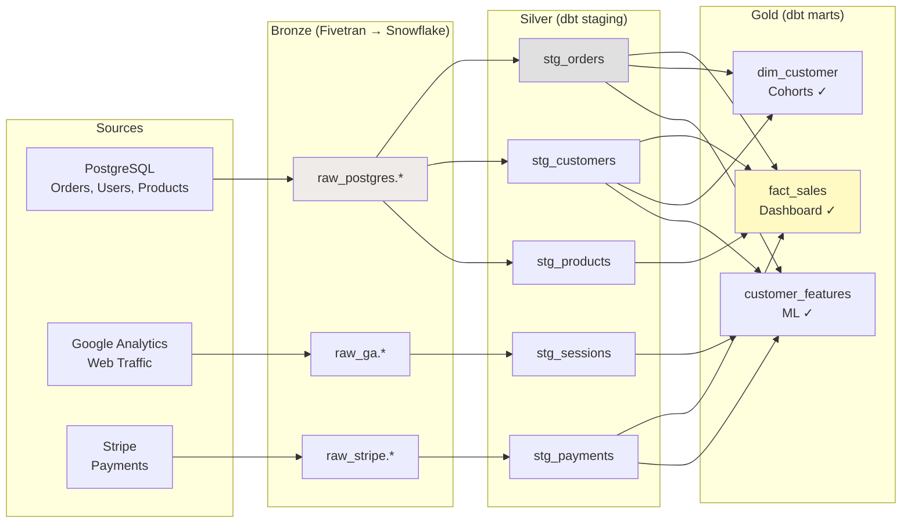
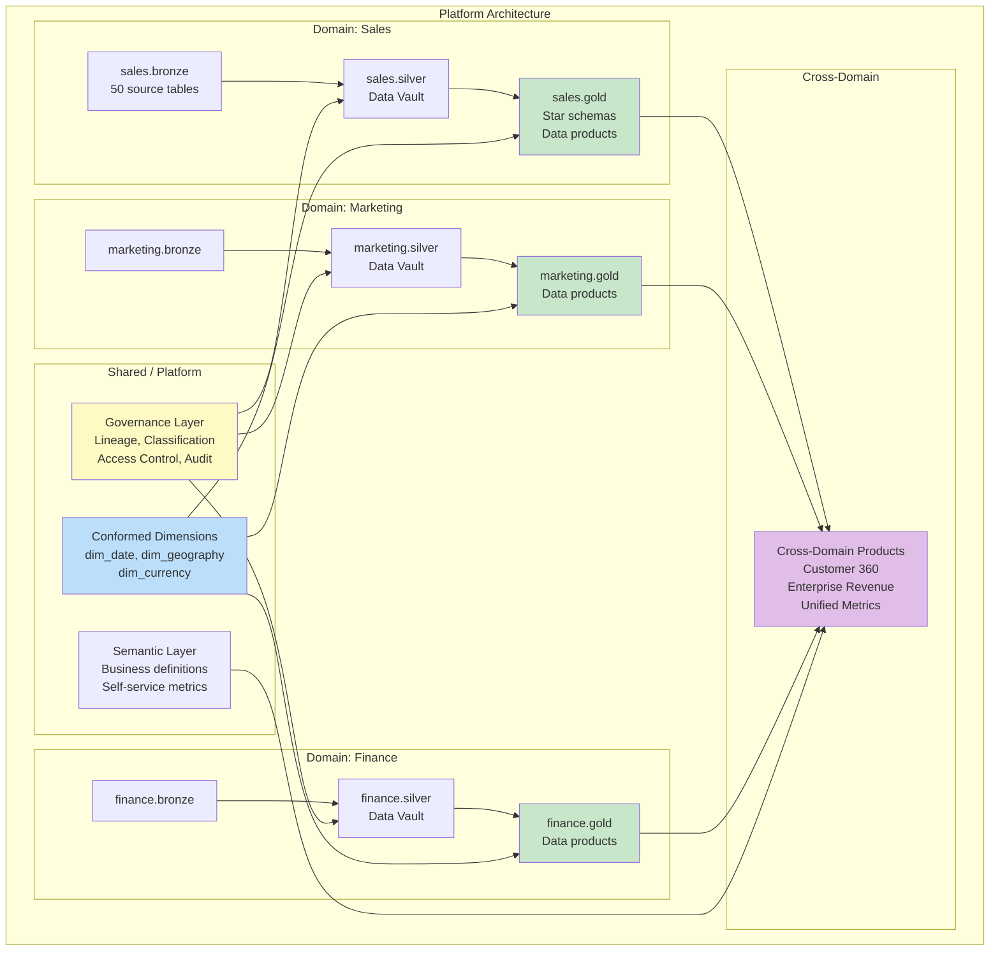

# Scenario Questions — Schema Design Patterns

<article data-difficulty="junior">

## 🟢 Junior: Choose the Right Pattern

**Scenario:** A startup is building their first data platform. They have: a PostgreSQL application database (orders, users, products), Google Analytics (web traffic), and Stripe (payments). They need: (1) a dashboard showing daily revenue and top products, (2) a weekly email report of customer cohorts, (3) data science team to build a churn prediction model. They have 3 engineers and a $500/month budget. Recommend a schema design pattern and explain why.

<details>
<summary>💡 Hint</summary>
Consider constraints: small team (3 people), low budget, three distinct use cases. Medallion architecture (bronze/silver/gold) with star schema in gold covers all three needs. Keep it simple: dbt + Snowflake/BigQuery. Don't over-engineer (no Data Vault, no complex streaming).
</details>

<details>
<summary>✅ Solution</summary>

**Recommendation: Medallion Architecture with Star Schema in Gold**



**Why this pattern:**

| Requirement | Solution | Pattern |
|-------------|----------|---------|
| Revenue dashboard | `gold.fact_sales` + `gold.dim_date` | Star schema |
| Customer cohorts | `gold.dim_customer` with `first_order_date` | Star schema |
| Churn ML model | `gold.customer_features` (wide table) | OBT/wide table |

**Implementation:**

```sql
-- Gold layer: Star schema for dashboard + reports
CREATE TABLE gold.fact_sales (
    sale_key        BIGINT,
    date_key        INT,
    customer_key    INT,
    product_key     INT,
    revenue         DECIMAL(12,2),
    quantity        INT
);

CREATE TABLE gold.dim_customer (
    customer_key    INT,
    customer_id     VARCHAR(20),
    name            VARCHAR(200),
    signup_date     DATE,
    first_order_date DATE,              -- For cohort analysis!
    cohort_month    VARCHAR(7),          -- '2024-01' (signup month)
    total_orders    INT,
    lifetime_value  DECIMAL(12,2)
);

-- Gold layer: Wide table for ML
CREATE TABLE gold.customer_features (
    customer_id     VARCHAR(20),
    -- Order features:
    days_since_last_order INT,
    total_orders_30d INT,
    total_revenue_30d DECIMAL(12,2),
    avg_order_value DECIMAL(10,2),
    -- Web features:
    sessions_30d    INT,
    page_views_30d  INT,
    -- Payment features:
    failed_payments_30d INT,
    -- Label:
    churned_next_30d BOOLEAN            -- For model training
);
```

**Why NOT other patterns:**
- ❌ Data Vault: Overkill for 3 sources. Team of 3 can't maintain it.
- ❌ Event Sourcing: No real-time requirement. Batch is fine.
- ❌ Data Mesh: 3 engineers = one team. Mesh is for 5+ teams.
- ❌ Lambda: No streaming need. Daily batch suffices.

**Budget fit:** Fivetran (free tier or $200/mo) + Snowflake ($200/mo) + dbt Cloud (free tier) = under $500/mo.

</details>

</article>

<article data-difficulty="mid-level">

## 🟡 Mid-Level: Migrating from Monolith to Medallion

**Scenario:** Your company has a 5-year-old data warehouse that's a single Snowflake schema with 200 tables. There's no layering — raw source copies sit next to cleaned tables next to report-specific aggregates. Naming is inconsistent (`tbl_orders_v2`, `orders_clean_final`, `fact_orders_new`). No documentation. Some tables are unused, some are critical for 20+ dashboards. Design a migration strategy to convert this into a proper medallion architecture without breaking existing dashboards.

<details>
<summary>💡 Hint</summary>
Phased approach: (1) Audit and classify existing tables (raw vs cleaned vs aggregated). (2) Create new schemas (bronze/silver/gold). (3) Move tables into proper layers. (4) Create compatibility views in the old schema (pointing to new locations). (5) Gradually migrate consumers. Don't rename — use views for backward compatibility.
</details>

<details>
<summary>✅ Solution</summary>

```sql
-- ═══════════════════════════════════════
-- PHASE 1: Audit (Week 1-2)
-- ═══════════════════════════════════════

-- Step 1: Identify table usage and classify
WITH table_usage AS (
    SELECT 
        table_name,
        COUNT(DISTINCT query_id) AS queries_30d,
        COUNT(DISTINCT user_name) AS users_30d,
        MAX(query_start_time) AS last_queried
    FROM snowflake.account_usage.access_history
    WHERE query_start_time > DATEADD('day', -30, CURRENT_TIMESTAMP)
    GROUP BY table_name
),
table_info AS (
    SELECT table_name, row_count, bytes, last_altered
    FROM information_schema.tables
)
SELECT 
    t.table_name,
    COALESCE(u.queries_30d, 0) AS queries_30d,
    COALESCE(u.users_30d, 0) AS users_30d,
    t.row_count,
    -- Auto-classify based on naming:
    CASE 
        WHEN t.table_name LIKE 'raw_%' OR t.table_name LIKE 'src_%' THEN 'bronze'
        WHEN t.table_name LIKE 'stg_%' OR t.table_name LIKE '%_clean%' THEN 'silver'
        WHEN t.table_name LIKE 'fact_%' OR t.table_name LIKE 'dim_%' THEN 'gold'
        WHEN t.table_name LIKE 'rpt_%' OR t.table_name LIKE 'agg_%' THEN 'gold'
        ELSE 'unclassified'
    END AS suggested_layer,
    CASE WHEN u.queries_30d > 0 THEN 'ACTIVE' ELSE 'UNUSED' END AS status
FROM table_info t
LEFT JOIN table_usage u ON t.table_name = u.table_name
ORDER BY queries_30d DESC;

-- Result: classify all 200 tables into layers + identify 50 unused tables
```

```python
# Phase 1 classification output (example):
classification = {
    'bronze': [
        'raw_shopify_orders', 'raw_stripe_payments', 'src_ga_sessions',
        'tbl_orders_dump', 'orders_import_20230415'  # Clearly raw data
    ],
    'silver': [
        'orders_clean_final', 'customers_deduped', 'stg_payments',
        'products_enriched'  # Cleaned/transformed
    ],
    'gold': [
        'fact_orders_new', 'dim_customer_v2', 'rpt_monthly_revenue',
        'agg_daily_sales'  # Business-ready
    ],
    'unused': [
        'tbl_orders_v2', 'orders_backup_old', 'test_table_john',
        # 50 tables with 0 queries in 30 days
    ]
}
```

```sql
-- ═══════════════════════════════════════
-- PHASE 2: Create New Structure (Week 3)
-- ═══════════════════════════════════════

CREATE SCHEMA bronze;    -- Raw ingestion
CREATE SCHEMA silver;    -- Cleaned & conformed
CREATE SCHEMA gold;      -- Business-ready (star schemas, aggregates)
CREATE SCHEMA archive;   -- Unused tables (keep 90 days before drop)

-- ═══════════════════════════════════════
-- PHASE 3: Move + Create Compatibility Views (Week 4-6)
-- ═══════════════════════════════════════

-- Move a bronze table:
ALTER TABLE public.raw_shopify_orders RENAME TO bronze.raw_shopify_orders;
-- Compatibility view in old location:
CREATE VIEW public.raw_shopify_orders AS SELECT * FROM bronze.raw_shopify_orders;

-- Move a gold table:
ALTER TABLE public.fact_orders_new RENAME TO gold.fact_orders;
-- Compatibility view (old name still works!):
CREATE VIEW public.fact_orders_new AS SELECT * FROM gold.fact_orders;

-- For inconsistently named tables — proper rename + compatibility:
ALTER TABLE public.orders_clean_final RENAME TO silver.orders;
CREATE VIEW public.orders_clean_final AS SELECT * FROM silver.orders;

-- Script to move ALL classified tables:
-- For each table in classification:
--   1. ALTER TABLE ... RENAME TO {layer}.{standardized_name}
--   2. CREATE VIEW public.{old_name} AS SELECT * FROM {layer}.{standardized_name}
-- ZERO dashboard breakage because views maintain old paths!

-- ═══════════════════════════════════════
-- PHASE 4: Introduce dbt (Week 7-10)
-- ═══════════════════════════════════════

-- Create dbt models that formalize the pipeline:
-- models/staging/stg_orders.sql (replaces ad-hoc "orders_clean_final")
-- models/marts/fact_orders.sql (replaces "fact_orders_new")

-- New dbt models write to the NEW schema locations
-- Old compatibility views remain until consumers migrate

-- ═══════════════════════════════════════
-- PHASE 5: Consumer Migration (Week 11-16)
-- ═══════════════════════════════════════

-- Track which views are still being used:
SELECT view_name, COUNT(*) AS queries_this_week
FROM snowflake.account_usage.access_history
WHERE object_name LIKE 'PUBLIC.%'  -- Old schema
  AND query_start_time > DATEADD('day', -7, CURRENT_TIMESTAMP)
GROUP BY view_name
ORDER BY queries_this_week DESC;

-- Notify consumers to update their queries:
-- "Use gold.fact_orders instead of public.fact_orders_new"
-- When a view reaches 0 queries for 2 weeks → safe to drop

-- ═══════════════════════════════════════
-- PHASE 6: Cleanup (Week 17+)
-- ═══════════════════════════════════════

-- Move unused tables to archive:
ALTER TABLE public.tbl_orders_v2 RENAME TO archive.tbl_orders_v2;
-- After 90 days with 0 queries → DROP

-- Drop compatibility views one by one as consumers migrate
DROP VIEW public.fact_orders_new;  -- Only after confirming no usage
```

**Key Points:**
- **Zero-downtime migration**: Compatibility views ensure nothing breaks
- **Phased approach**: Don't try to fix everything at once
- **Usage-driven prioritization**: Migrate most-queried tables first
- **dbt formalization**: Replace ad-hoc scripts with proper models
- **Measurable progress**: Track view usage to know when it's safe to drop
- **Archive unused**: Don't delete immediately — archive for 90 days

</details>

</article>

<article data-difficulty="senior">

## 🔴 Senior: Multi-Domain Platform Architecture

**Scenario:** A large enterprise (5 business units, 20 data teams, 50 source systems) needs a unified data platform. Requirements: (1) Each business unit owns their domain data, (2) Cross-domain analytics must be possible, (3) Regulatory compliance (SOX, GDPR) requires full audit trail, (4) Mix of batch (95%) and real-time (5%) use cases, (5) Must support 500+ analysts with self-service. Design the complete schema architecture including: layer organization, cross-domain patterns, governance model, and technology stack.

<details>
<summary>💡 Hint</summary>
Data Mesh principles + Medallion layers + Data Vault for audit. Each domain: own bronze→silver→gold. Shared: conformed dimensions, governance layer. Cross-domain: published data products with contracts. Real-time: streaming layer alongside batch. Self-service: gold layer as star schemas + semantic layer. Technology: Databricks/Snowflake + dbt + catalog.
</details>

<details>
<summary>✅ Solution</summary>



**Detailed Architecture:**

```yaml
# platform-architecture.yml
layers:
  bronze:
    purpose: "Raw ingestion, immutable, append-only"
    schema_pattern: "{domain}.bronze"
    storage: "Delta Lake (Parquet + transaction log)"
    retention: "7 years (regulatory)"
    access: "domain_engineers only"
    
  silver:
    purpose: "Integration layer, Data Vault, audit trail"
    schema_pattern: "{domain}.silver"
    model: "Data Vault 2.0 (hubs + links + satellites)"
    rationale: "SOX/GDPR requires full history of every data point"
    access: "domain_engineers + compliance"
    
  gold:
    purpose: "Business-ready data products"
    schema_pattern: "{domain}.gold"
    model: "Star schema (per domain) + Wide tables (for ML)"
    access: "all_analysts (via semantic layer)"
    contracts: "Required for cross-domain consumption"

domains:
  - name: "sales"
    owner: "sales-data-team (8 people)"
    sources: ["salesforce", "shopify", "stripe", "netsuite"]
    gold_products:
      - name: "fact_sales"
        consumers: ["finance", "marketing", "executive"]
        contract_version: "3.1.0"
      - name: "dim_customer"
        type: "conformed_dimension"
        consumers: ["ALL"]
        
  - name: "marketing"
    owner: "marketing-analytics (5 people)"
    sources: ["hubspot", "google_ads", "facebook_ads", "segment"]
    gold_products:
      - name: "fact_campaigns"
        consumers: ["finance", "executive"]
      - name: "attribution_model"
        consumers: ["sales"]

  - name: "finance"
    owner: "finance-data-team (6 people)"  
    sources: ["netsuite", "bank_feeds", "payroll"]
    gold_products:
      - name: "fact_gl_entries"
        consumers: ["executive", "audit"]
        regulatory: "SOX compliant"

shared:
  conformed_dimensions:
    owner: "platform-team"
    tables:
      - "shared.dim_date"
      - "shared.dim_geography"  
      - "shared.dim_currency"
      - "shared.dim_exchange_rate"
    rule: "All domains MUST use shared dimensions for cross-domain joins"
    
  governance:
    catalog: "DataHub"
    lineage: "OpenLineage (Airflow + Spark + dbt)"
    classification: "Auto-PII detection + manual review"
    access_control: "Snowflake RBAC + column-level masking"
    audit_trail: "Data Vault satellites preserve all history"
```

```sql
-- ═══════════════════════════════════════
-- CROSS-DOMAIN DATA PRODUCT EXAMPLE
-- ═══════════════════════════════════════

-- Enterprise Revenue (consumes from sales + finance + marketing)
CREATE SCHEMA cross_domain;

CREATE TABLE cross_domain.enterprise_revenue AS
SELECT
    d.date_key,
    d.fiscal_year,
    d.fiscal_quarter,
    -- From sales domain:
    s.product_category,
    s.customer_segment,
    s.gross_revenue,
    s.net_revenue,
    -- From finance domain:
    f.recognized_revenue,    -- Differs from sales (ASC 606 rules!)
    f.deferred_revenue,
    -- From marketing domain:
    m.acquisition_cost,
    m.channel,
    -- Cross-domain calculations:
    s.net_revenue - m.acquisition_cost AS contribution_margin,
    m.acquisition_cost / NULLIF(s.net_revenue, 0) * 100 AS cac_pct
FROM sales.gold.fact_sales s
JOIN shared.dim_date d ON s.date_key = d.date_key
LEFT JOIN finance.gold.fact_recognized_revenue f 
    ON s.order_id = f.order_id
LEFT JOIN marketing.gold.fact_attribution m 
    ON s.customer_key = m.customer_key 
    AND d.month_key = m.attribution_month_key;

-- ═══════════════════════════════════════
-- REAL-TIME LAYER (5% of use cases)
-- ═══════════════════════════════════════

-- Streaming pipeline (separate from batch):
CREATE TABLE streaming.real_time_orders (
    order_id        VARCHAR(20),
    customer_id     VARCHAR(20),
    total_amount    DECIMAL(12,2),
    status          VARCHAR(20),
    event_time      TIMESTAMP,
    processing_time TIMESTAMP
) USING DELTA;

-- Spark Structured Streaming: Kafka → Delta
-- Updates every 30 seconds for live dashboard
-- Batch pipeline overwrites nightly (source of truth)

-- ═══════════════════════════════════════
-- SEMANTIC LAYER (Self-Service for 500+ analysts)
-- ═══════════════════════════════════════

-- Using dbt Metrics or Looker/Cube.dev:
-- Analysts query METRICS, not raw tables

-- metrics/revenue.yml
-- metrics:
--   - name: net_revenue
--     label: "Net Revenue"
--     type: sum
--     sql: net_revenue
--     timestamp: order_date
--     time_grains: [day, week, month, quarter, year]
--     dimensions: [product_category, customer_segment, region]
--     filters:
--       - field: order_status
--         operator: "="
--         value: "completed"

-- Analyst query (via semantic layer):
-- "Show me net_revenue by customer_segment for Q1 2024"
-- Semantic layer translates to optimized SQL against gold tables
```

**Technology Stack:**

| Component | Technology | Why |
|-----------|-----------|-----|
| Storage | Databricks (Delta Lake) | Unified batch + streaming, ACID, time travel |
| Transformation | dbt Cloud | SQL-based, version controlled, tested |
| Orchestration | Airflow (MWAA) | Proven, DAG-based, OpenLineage support |
| Catalog | DataHub | Open source, flexible, lineage-aware |
| Semantic Layer | Cube.dev or dbt Metrics | Self-service, governed metric definitions |
| Access Control | Unity Catalog + Snowflake RBAC | Column-level, row-level, tag-based |
| Real-time | Spark Structured Streaming | Same engine as batch (unified) |
| CI/CD | GitHub Actions + dbt Cloud | Automated testing + deployment |

**Governance Model:**

| Responsibility | Owner |
|---------------|-------|
| Domain data quality | Domain team |
| Domain schema design | Domain team |
| Cross-domain contracts | Platform team facilitates |
| Conformed dimensions | Platform team |
| Catalog/lineage infrastructure | Platform team |
| Access policies (column masking) | Governance team |
| PII classification | Automated + governance review |
| Audit trail (Data Vault) | Platform team maintains infra |

</details>

</article>

</content>
