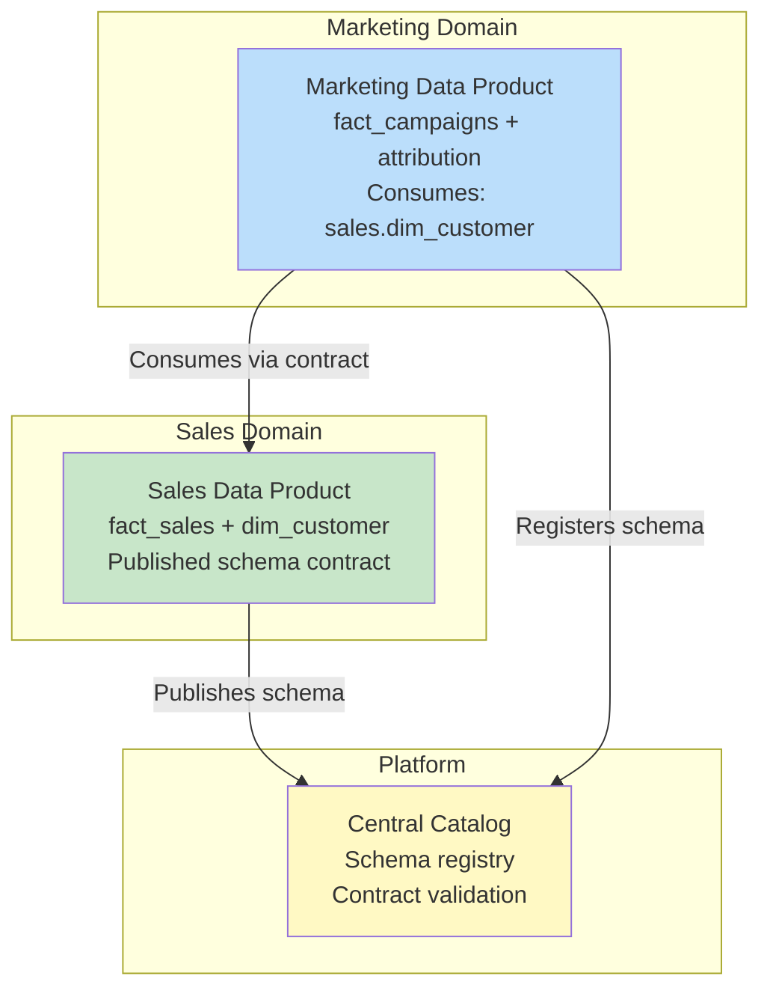
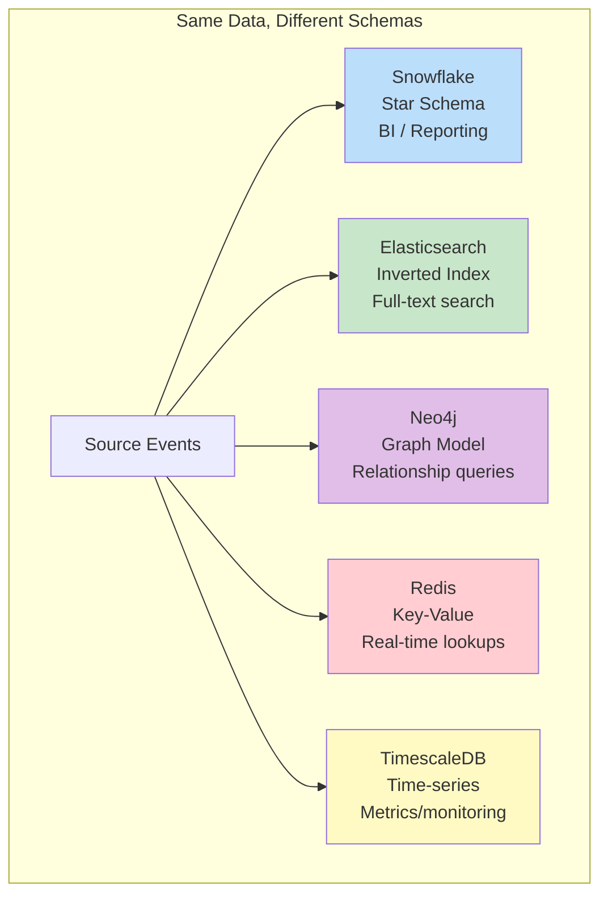

# Schema Design Patterns — Senior Deep Dive

## Data Mesh Schema Patterns

In Data Mesh, each domain owns its data as a **data product** with a well-defined schema contract:



```yaml
# sales-domain/data-products/fact_sales/contract.yml
dataProduct:
  name: "fact_sales"
  domain: "sales"
  version: "3.0.0"
  owner: "sales-analytics-team"
  
  outputPort:
    type: "snowflake_table"
    location: "ANALYTICS.SALES.FACT_SALES"
    
    schema:
      - name: "sale_key"
        type: "BIGINT"
        nullable: false
        description: "Unique surrogate key"
      - name: "revenue"
        type: "DECIMAL(12,2)"
        nullable: false
        description: "Net revenue USD"
        semanticType: "monetary_amount"
        
    sla:
      freshness: "< 4 hours"
      availability: "99.5%"
      
    compatibility:
      breaking_change_policy: "semver"
      deprecation_notice: "30 days"
```

## Schema Evolution Strategies

### Forward-Compatible Changes (Non-Breaking)

```sql
-- Safe changes (consumers don't break):
-- 1. Add a new column (with default):
ALTER TABLE gold.fact_sales ADD COLUMN discount_type VARCHAR(20) DEFAULT 'none';

-- 2. Add a new table:
CREATE TABLE gold.dim_promotion (...);

-- 3. Widen a column type:
ALTER TABLE gold.dim_customer ALTER COLUMN phone TYPE VARCHAR(50);  -- Was VARCHAR(20)

-- 4. Add a new partition:
-- Automatic in most systems (new data, new partition)
```

### Backward-Compatible Changes (Managed Migration)

```sql
-- Requires coordination but preserves old consumers:
-- 1. Rename column (keep old as alias):
ALTER TABLE gold.fact_sales RENAME COLUMN total TO revenue;
CREATE VIEW gold.fact_sales_v2_compat AS 
    SELECT *, revenue AS total FROM gold.fact_sales;  -- Old name still works

-- 2. Split a table (keep original as view):
-- Physical: gold.customer_profile + gold.customer_contact
-- Logical: CREATE VIEW gold.dim_customer AS SELECT ... FROM profile JOIN contact;

-- 3. Change grain (keep aggregate):
-- Old: monthly grain. New: daily grain.
-- Keep: CREATE VIEW gold.fact_monthly AS SELECT ... FROM gold.fact_daily GROUP BY month;
```

### Breaking Changes (Versioned Schemas)

```sql
-- Major version bump — consumers must migrate:
-- gold.fact_sales_v2 → gold.fact_sales_v3

-- Migration process:
-- 1. Create new version alongside old:
CREATE TABLE gold.fact_sales_v3 AS ...;

-- 2. Notify consumers (via catalog/contract):
-- "fact_sales_v2 deprecated. Migrate to v3 by 2024-04-01."

-- 3. Deprecation period (both versions active):
-- v2 still refreshed but marked deprecated

-- 4. Remove old version:
DROP TABLE gold.fact_sales_v2;  -- After all consumers migrated
```

## Polyglot Persistence Patterns

Using different storage engines for different query patterns:



```python
# Same customer data, different schemas per store:

# Snowflake (analytics): Star schema
# dim_customer: customer_key, name, segment, region, lifetime_value

# Elasticsearch (search): Document-oriented
{
    "customer_id": "C001",
    "name": "Alice Smith",
    "email": "alice@company.com",
    "tags": ["enterprise", "high-value", "west-coast"],
    "recent_purchases": ["Widget Pro", "Gadget X"]
}

# Redis (real-time): Key-value
# Key: "customer:C001:profile"
# Value: {"name": "Alice", "segment": "enterprise", "last_login": "2024-03-15T10:30:00Z"}

# Neo4j (graph): Relationship model
# (Alice)-[:PURCHASED]->(Widget Pro)
# (Alice)-[:WORKS_AT]->(Acme Corp)
# (Acme Corp)-[:IN_INDUSTRY]->(Technology)
```

## Slowly Changing Patterns for Schema Itself

When the schema definition changes over time (not just the data):

```sql
-- Schema versioning table:
CREATE TABLE governance.schema_versions (
    table_name      VARCHAR(200),
    version         INT,
    schema_json     VARIANT,          -- Full DDL/schema definition
    change_type     VARCHAR(50),      -- 'column_added', 'type_changed', 'column_removed'
    change_details  VARCHAR(500),
    applied_at      TIMESTAMP,
    applied_by      VARCHAR(100),
    is_current      BOOLEAN DEFAULT TRUE
);

-- Trigger on schema changes (Snowflake example):
-- Use INFORMATION_SCHEMA comparison + scheduled task to detect changes
-- Log every schema modification with full context
```

## Hybrid Analytical Patterns

### Lambda Architecture (Batch + Speed Layers)

```mermaid
graph TD
    SRC[Data Sources] --> BATCH[Batch Layer<br>Complete, accurate<br>High latency (hours)]
    SRC --> SPEED[Speed Layer<br>Approximate, real-time<br>Low latency (seconds)]
    
    BATCH --> SERVE[Serving Layer<br>Merge batch + speed<br>for queries]
    SPEED --> SERVE
    
    SERVE --> QRY[Queries<br>Accurate + Current]
    
    style BATCH fill:#bbdefb
    style SPEED fill:#ffcdd2
    style SERVE fill:#c8e6c9
```

```sql
-- Batch layer (complete, daily):
CREATE TABLE batch.fact_sales_daily AS
SELECT date, product_key, SUM(revenue) AS revenue, COUNT(*) AS txn_count
FROM silver.transactions
WHERE date < CURRENT_DATE  -- Historical (completed days)
GROUP BY date, product_key;

-- Speed layer (real-time, today only):
CREATE TABLE speed.fact_sales_today AS
SELECT product_key, SUM(revenue) AS revenue, COUNT(*) AS txn_count
FROM silver.transactions_stream
WHERE date = CURRENT_DATE  -- Today's live data
GROUP BY product_key;

-- Serving layer (unified view):
CREATE VIEW serve.fact_sales_unified AS
SELECT date, product_key, revenue, txn_count FROM batch.fact_sales_daily
UNION ALL
SELECT CURRENT_DATE, product_key, revenue, txn_count FROM speed.fact_sales_today;
```

### Kappa Architecture (Stream-Only)

```sql
-- Everything is a stream — no separate batch layer
-- Source: Kafka topics with infinite retention
-- Processing: Spark Structured Streaming
-- Storage: Delta Lake (supports both streaming and batch queries)

-- Single pipeline handles both real-time and historical:
CREATE TABLE gold.fact_sales
USING DELTA
AS
SELECT 
    window.start AS event_time,
    product_key,
    SUM(revenue) AS revenue,
    COUNT(*) AS txn_count
FROM silver.transactions_stream
GROUP BY window(event_timestamp, '1 hour'), product_key;

-- Same table serves both:
-- Real-time dashboard: reads latest data (streaming query)
-- Historical analysis: reads full table (batch query)
-- No Lambda complexity (no merge of batch + speed)!
```

## Anti-Patterns at Scale

### The "Golden Source" Monolith

```sql
-- ❌ One team owns ONE massive pipeline producing everything:
-- raw → staging → warehouse → all marts → all dashboards
-- Problem: bottleneck, no ownership, every change breaks something

-- ✅ Domain-oriented: each team owns their slice end-to-end
-- Sales team: raw.orders → silver.orders → gold.fact_sales → sales dashboard
-- Marketing: raw.campaigns → silver.campaigns → gold.fact_campaigns → marketing dashboard
-- Shared: dim_date, dim_customer (owned by platform team)
```

### The "Infinite Schema" Problem

```sql
-- ❌ Adding columns for every new requirement:
ALTER TABLE fact_events ADD COLUMN new_metric_1 DECIMAL;
ALTER TABLE fact_events ADD COLUMN new_metric_2 DECIMAL;
-- ... 200 columns later: unmaintainable, mostly NULL

-- ✅ Flexible schema with VARIANT/JSON for dynamic attributes:
CREATE TABLE fact_events (
    event_id        BIGINT,
    event_type      VARCHAR(50),
    event_timestamp TIMESTAMP,
    -- Fixed core columns:
    user_key        INT,
    session_id      VARCHAR(50),
    -- Flexible properties (schema-on-read):
    properties      VARIANT           -- {"metric_1": 42, "page": "/checkout"}
);
-- Add new event types/properties without schema changes!
```

## Interview Tips

> **Tip 1:** "How do you handle schema evolution in production?" — Categorize changes: (1) Non-breaking (add column, widen type) → deploy directly. (2) Backward-compatible (rename → keep alias view) → deploy with compatibility layer. (3) Breaking (remove column, change grain) → version bump, deprecation period, consumer migration. Use schema registry or data contracts to communicate changes.

> **Tip 2:** "Lambda vs. Kappa architecture?" — Lambda: separate batch (accurate) + speed (real-time) layers, merged in serving layer. Complex to maintain (two code paths). Kappa: single streaming pipeline handles both. Simpler but requires streaming infrastructure maturity. Modern platforms (Delta Lake + Structured Streaming) make Kappa practical. Choose Kappa unless you have legacy batch that can't be rewritten.

> **Tip 3:** "How do you design for data mesh?" — Each domain team owns their data product end-to-end (ingestion → transformation → published schema). Products have formal contracts (schema, SLA, quality). Shared reference data (dates, geography) owned by platform team. Central catalog for discovery. Key: federated ownership with centralized standards.

## ⚡ Cheat Sheet

**Dimensional modeling building blocks**
```
Fact table:       measures/metrics (order_amount, quantity, duration)
Dimension table:  descriptive attributes (customer, product, date, geography)
Grain:            one row = one business event at lowest detail level
Surrogate key:    system-generated integer PK (never use natural keys in dim)
Natural key:      source system business key (stored alongside surrogate key)
```

**Star schema vs Snowflake schema**
```
Star:       fact → dimension (denormalized, faster queries, more storage)
Snowflake:  fact → dimension → sub-dimension (normalized, saves storage, more joins)
Rule:       prefer star for BI; snowflake only when storage cost is critical
```

**SCD (Slowly Changing Dimensions)**
| Type | Strategy | When |
|---|---|---|
| SCD1 | Overwrite old value | History irrelevant |
| SCD2 | New row (add effective_from, effective_to, is_current) | Need full history |
| SCD3 | Add prev_value column | Only need one prior value |
| SCD4 | Separate history table | Large dimension, rare changes |
| SCD6 | SCD1 + SCD2 + SCD3 hybrid | Best of all worlds |

**SCD2 implementation**
```sql
-- Insert new version, expire old
UPDATE dim_customer SET effective_to = CURRENT_DATE - 1, is_current = FALSE
WHERE customer_id = 123 AND is_current = TRUE;

INSERT INTO dim_customer (customer_id, name, city, effective_from, effective_to, is_current)
VALUES (123, 'Jane Doe', 'Chicago', CURRENT_DATE, '9999-12-31', TRUE);
```

**Data Vault pattern**
```
Hub:   business keys (stable identifiers — customer_id, order_id)
Link:  relationships between hubs (many-to-many)
Sat:   descriptive attributes + context (with load timestamp — full history)
```

**Fact table types**
```
Transaction:    one row per event (orders, clicks, payments)
Snapshot:       one row per period per entity (daily account balance)
Accumulating:   one row per lifecycle, updated as process stages complete
```

**Key interview points**
- Grain: define before designing any fact table — drives every design decision
- Degenerate dimensions: order number on fact table with no corresponding dimension
- Factless facts: events with no measures (student enrolled in course — just the relationship)
- Role-playing dimensions: same dimension used multiple times (order_date, ship_date, return_date)
- Conformed dimensions: shared across multiple fact tables (same dim_date in sales and returns facts)
