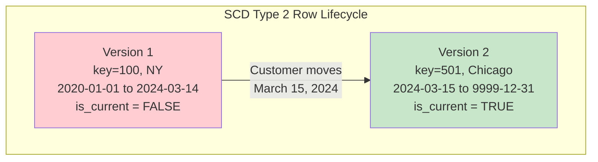
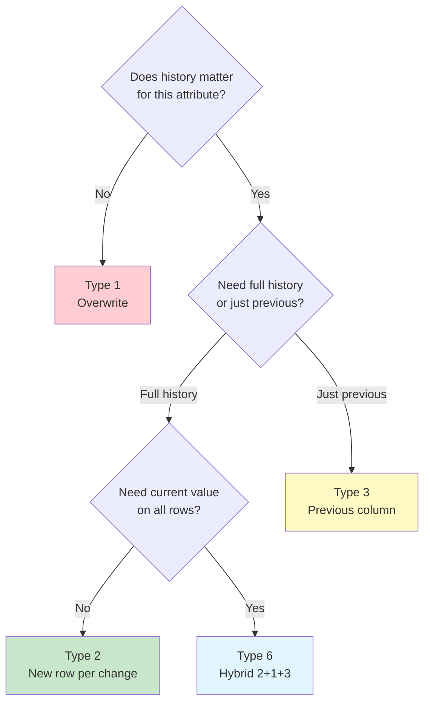

# Slowly Changing Dimensions — Intermediate Concepts

## SCD Type 2 — Complete Implementation

Type 2 is the most important SCD technique for data warehouses. It tracks full history by inserting new rows.



```sql
-- Full SCD Type 2 table structure:
CREATE TABLE dim_customer (
    customer_key        INT PRIMARY KEY,        -- Surrogate key (new per version)
    customer_id         VARCHAR(20) NOT NULL,   -- Natural key (stable across versions)
    customer_name       VARCHAR(200),
    email               VARCHAR(200),
    city                VARCHAR(100),
    state               VARCHAR(50),
    segment             VARCHAR(20),
    -- SCD Type 2 metadata:
    effective_start     DATE NOT NULL,
    effective_end       DATE NOT NULL DEFAULT '9999-12-31',
    is_current          BOOLEAN NOT NULL DEFAULT TRUE,
    -- Audit:
    _loaded_at          TIMESTAMP DEFAULT CURRENT_TIMESTAMP
);

-- Unique constraint: only one current row per customer
CREATE UNIQUE INDEX idx_customer_current 
    ON dim_customer(customer_id) WHERE is_current = TRUE;
```

### Change Detection with Hash Diff

```sql
-- Efficient change detection: compute hash of trackable columns
-- Only process rows where hash differs from current version

WITH incoming AS (
    SELECT 
        customer_id,
        customer_name,
        email,
        city,
        state,
        segment,
        MD5(CONCAT_WS('||',
            COALESCE(customer_name, ''),
            COALESCE(email, ''),
            COALESCE(city, ''),
            COALESCE(state, ''),
            COALESCE(segment, '')
        )) AS hash_diff
    FROM staging_customers
),
current_dim AS (
    SELECT 
        customer_id,
        MD5(CONCAT_WS('||',
            COALESCE(customer_name, ''),
            COALESCE(email, ''),
            COALESCE(city, ''),
            COALESCE(state, ''),
            COALESCE(segment, '')
        )) AS hash_diff
    FROM dim_customer
    WHERE is_current = TRUE
)
-- Changed records:
SELECT i.* FROM incoming i
JOIN current_dim c ON i.customer_id = c.customer_id
WHERE i.hash_diff != c.hash_diff;
```

### Complete SCD Type 2 Load Process

```sql
-- Step 1: Identify changes
CREATE TEMP TABLE changes AS
SELECT i.*
FROM staging_customers i
JOIN dim_customer d ON i.customer_id = d.customer_id AND d.is_current = TRUE
WHERE MD5(CONCAT_WS('||', i.name, i.email, i.city, i.state, i.segment))
   != MD5(CONCAT_WS('||', d.customer_name, d.email, d.city, d.state, d.segment));

-- Step 2: Close current records (expire)
UPDATE dim_customer
SET effective_end = CURRENT_DATE - 1,
    is_current = FALSE
WHERE customer_id IN (SELECT customer_id FROM changes)
  AND is_current = TRUE;

-- Step 3: Insert new versions
INSERT INTO dim_customer (customer_key, customer_id, customer_name, email, city, state, segment,
                          effective_start, effective_end, is_current)
SELECT 
    NEXT_SURROGATE_KEY(),
    customer_id, name, email, city, state, segment,
    CURRENT_DATE,
    '9999-12-31',
    TRUE
FROM changes;

-- Step 4: Insert brand new customers (not yet in dim)
INSERT INTO dim_customer (customer_key, customer_id, customer_name, email, city, state, segment,
                          effective_start, effective_end, is_current)
SELECT 
    NEXT_SURROGATE_KEY(),
    customer_id, name, email, city, state, segment,
    CURRENT_DATE,
    '9999-12-31',
    TRUE
FROM staging_customers s
WHERE NOT EXISTS (SELECT 1 FROM dim_customer d WHERE d.customer_id = s.customer_id);
```

## SCD Type 3 — Previous Value Column

Stores only the current and one previous value. Limited history.

```sql
CREATE TABLE dim_customer_type3 (
    customer_key        INT PRIMARY KEY,
    customer_id         VARCHAR(20),
    customer_name       VARCHAR(200),
    -- Current values:
    current_city        VARCHAR(100),
    current_state       VARCHAR(50),
    -- Previous values (Type 3):
    previous_city       VARCHAR(100),
    previous_state      VARCHAR(50),
    city_changed_date   DATE
);

-- When customer moves:
UPDATE dim_customer_type3
SET previous_city = current_city,
    previous_state = current_state,
    current_city = 'Chicago',
    current_state = 'IL',
    city_changed_date = CURRENT_DATE
WHERE customer_id = 'C001';

-- Query: "Show revenue by customer's CURRENT city"
SELECT current_city, SUM(revenue) FROM fact_sales f
JOIN dim_customer_type3 c ON f.customer_key = c.customer_key
GROUP BY current_city;

-- Query: "Show revenue by customer's PREVIOUS city" (before they moved)
SELECT previous_city, SUM(revenue) FROM fact_sales f
JOIN dim_customer_type3 c ON f.customer_key = c.customer_key
WHERE c.previous_city IS NOT NULL
GROUP BY previous_city;
```

## SCD Type 6 — Hybrid (1 + 2 + 3)

Combines Type 2 rows with a Type 1 "current value" column updated across ALL rows.

```sql
CREATE TABLE dim_customer_type6 (
    customer_key        INT PRIMARY KEY,
    customer_id         VARCHAR(20),
    customer_name       VARCHAR(200),
    -- Type 2 (historical value at this version):
    historical_city     VARCHAR(100),
    historical_state    VARCHAR(50),
    -- Type 1 on Type 3 column (ALWAYS current, on ALL rows):
    current_city        VARCHAR(100),
    current_state       VARCHAR(50),
    -- Type 2 metadata:
    effective_start     DATE,
    effective_end       DATE DEFAULT '9999-12-31',
    is_current          BOOLEAN DEFAULT TRUE
);

-- When customer moves from NY to Chicago:
-- 1. Insert new Type 2 row (historical_city = 'Chicago')
-- 2. UPDATE current_city = 'Chicago' on ALL rows for this customer!

UPDATE dim_customer_type6
SET current_city = 'Chicago', current_state = 'IL'
WHERE customer_id = 'C001';

INSERT INTO dim_customer_type6 VALUES (
    501, 'C001', 'Alice', 'Chicago', 'IL', 'Chicago', 'IL',
    '2024-03-15', '9999-12-31', TRUE
);

-- Result:
-- key=100 | historical=NY | current=Chicago | 2020-01-01 to 2024-03-14 | FALSE
-- key=501 | historical=Chicago | current=Chicago | 2024-03-15 to 9999-12-31 | TRUE
-- Both rows show current_city = Chicago!
-- But historical_city preserves what it WAS during that version's time period.
```

**Use case:** "Show revenue by where the customer IS NOW (current_city) alongside where they WERE WHEN they bought (historical_city)."

## Choosing the Right SCD Type



| Attribute | Recommended SCD | Reason |
|-----------|----------------|--------|
| Customer name correction | Type 1 | Fixing errors, no analytical value in old name |
| Customer city/region | Type 2 | "Revenue by customer region at time of purchase" |
| Customer phone number | Type 1 | No analytical value in old phone |
| Customer segment | Type 2 or 6 | Need to analyze by historical AND current segment |
| Product price | Type 2 | "What price did we sell at?" |
| Product description typo | Type 1 | Just a correction |

## dbt Snapshots for SCD Type 2

```sql
-- snapshots/snap_customers.sql

{{ config(
    target_schema='snapshots',
    unique_key='customer_id',
    strategy='check',
    check_cols=['customer_name', 'email', 'city', 'state', 'segment'],
    invalidate_hard_deletes=True
) }}

SELECT 
    customer_id,
    customer_name,
    email,
    city,
    state,
    segment
FROM {{ source('app_db', 'customers') }}



-- Result: dbt creates a table with:
-- dbt_valid_from (effective_start)
-- dbt_valid_to (effective_end, NULL for current)
-- dbt_scd_id (surrogate key)
-- Automatically handles Type 2 changes on every dbt snapshot run!
```

## Interview Tips

> **Tip 1:** "Walk me through SCD Type 2 implementation" — Four steps: (1) Compare staging to current dim (hash diff for efficiency). (2) Expire changed records (set effective_end, is_current=FALSE). (3) Insert new versions (new surrogate key, effective_start=today). (4) Insert new entities. Always maintain a unique constraint on (customer_id WHERE is_current=TRUE).

> **Tip 2:** "SCD Type 6 — when and why?" — When you need BOTH: "where is the customer NOW" (for current reporting) AND "where WERE they when they bought" (for historical analysis). Type 6 puts a current_city column (updated on ALL rows) alongside historical_city (unique per version). More complex to maintain but enables both queries without self-joins.

> **Tip 3:** "How does dbt handle SCD?" — `dbt snapshot` command with `strategy='check'` (compare specific columns) or `strategy='timestamp'` (use updated_at). Automatically inserts new rows when checked columns change, sets dbt_valid_from/to. No manual SQL needed. Run `dbt snapshot` daily before your dimension model build.
