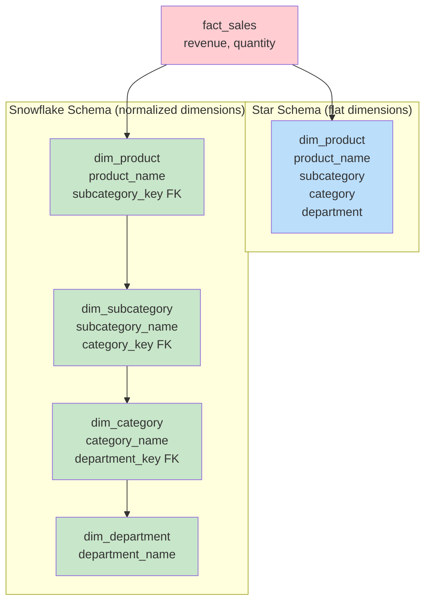
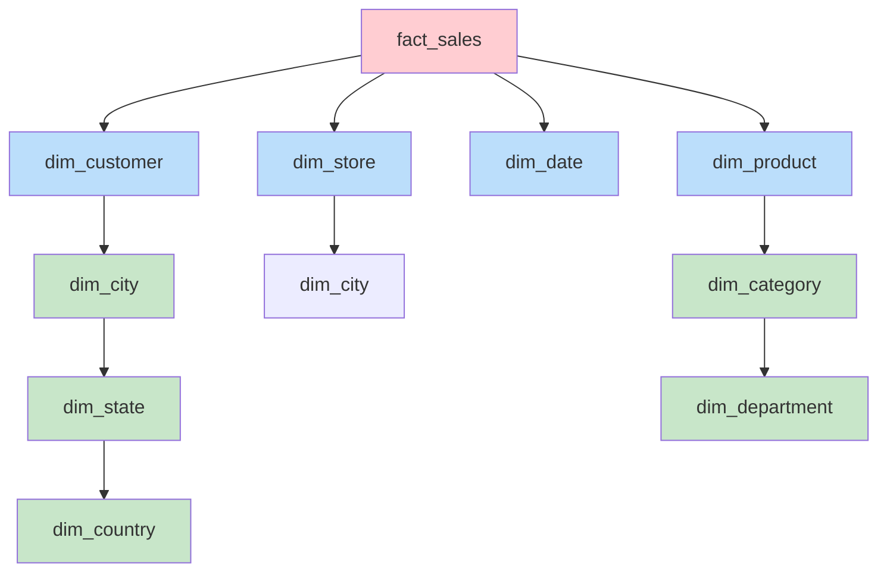

# Snowflake Schema — Fundamentals

## What is a Snowflake Schema?

A snowflake schema is a **normalized variation of the star schema** where dimension tables are broken into multiple related tables (sub-dimensions) representing hierarchy levels.



## Star Schema vs. Snowflake Schema

| Aspect | Star Schema | Snowflake Schema |
|--------|-------------|-----------------|
| Dimension structure | Flat (denormalized) | Normalized (multiple tables) |
| Joins required | Fact + 1 per dimension | Fact + multiple per dimension hierarchy |
| Query complexity | Simple | More complex |
| Storage | More (redundancy) | Less (no redundancy) |
| ETL complexity | Higher (maintain denormalization) | Lower (update one place) |
| Query performance | Faster (fewer joins) | Slower (more joins) |
| BI tool compatibility | Better (simpler for tools) | Varies |

## When the Snowflake Shape Appears



The "snowflake" name comes from the branching pattern of normalized dimension tables — it looks like a snowflake when drawn.

## Example: Product Dimension (Star vs. Snowflake)

### Star Schema (Flat)

```sql
CREATE TABLE dim_product (
    product_key       INT PRIMARY KEY,
    product_id        VARCHAR(20),
    product_name      VARCHAR(200),
    brand             VARCHAR(100),
    -- Hierarchy embedded (denormalized):
    subcategory_name  VARCHAR(100),
    category_name     VARCHAR(100),
    department_name   VARCHAR(100)
);
-- One table, one join from fact. BUT:
-- "Electronics" stored 5000 times (once per product)
-- Change department name? Update 5000 rows!
```

### Snowflake Schema (Normalized)

```sql
CREATE TABLE dim_department (
    department_key    INT PRIMARY KEY,
    department_name   VARCHAR(100)
);
-- ~10 rows

CREATE TABLE dim_category (
    category_key      INT PRIMARY KEY,
    category_name     VARCHAR(100),
    department_key    INT REFERENCES dim_department
);
-- ~50 rows

CREATE TABLE dim_subcategory (
    subcategory_key   INT PRIMARY KEY,
    subcategory_name  VARCHAR(100),
    category_key      INT REFERENCES dim_category
);
-- ~200 rows

CREATE TABLE dim_product (
    product_key       INT PRIMARY KEY,
    product_id        VARCHAR(20),
    product_name      VARCHAR(200),
    brand             VARCHAR(100),
    subcategory_key   INT REFERENCES dim_subcategory
);
-- 5000 rows, but each only stores subcategory_key (not full text)
```

## Querying Snowflake Schema

```sql
-- Star schema query (simple — one join per dimension):
SELECT d.department_name, SUM(f.revenue)
FROM fact_sales f
JOIN dim_product p ON f.product_key = p.product_key
WHERE p.department_name = 'Electronics'
GROUP BY d.department_name;

-- Snowflake schema query (more joins needed):
SELECT dept.department_name, SUM(f.revenue)
FROM fact_sales f
JOIN dim_product p ON f.product_key = p.product_key
JOIN dim_subcategory sub ON p.subcategory_key = sub.subcategory_key
JOIN dim_category cat ON sub.category_key = cat.category_key
JOIN dim_department dept ON cat.department_key = dept.department_key
WHERE dept.department_name = 'Electronics'
GROUP BY dept.department_name;
-- 4 joins vs. 1 join for the same result!
```

## When to Use Snowflake Schema

✅ **Good fit:**
- Large dimension tables where hierarchy data is highly redundant
- Hierarchy levels change independently (rename a department without touching products)
- Storage is a concern (shared hierarchies reduce duplication)
- Dimensions are shared across multiple fact tables at different hierarchy levels
- Enterprise data warehouses with strict normalization requirements

❌ **Not ideal:**
- Small to medium data warehouses
- BI tools that struggle with multiple joins
- Query performance is the top priority
- Self-service analytics (users expect simple schemas)

## Hybrid Approach (Most Common in Practice)

In reality, most data warehouses use a **hybrid** — some dimensions are flat (star), others are partially normalized (snowflake).

```sql
-- Hybrid: Product is snowflaked (deep hierarchy), Date is star (flat)
-- dim_product → dim_subcategory → dim_category (snowflake)
-- dim_date: year, quarter, month, day all in one table (star)
-- dim_customer: all attributes flat (star)

-- Reason: Product hierarchy is deep (5 levels) and shared.
-- Date and customer are flat and simple → no benefit to snowflaking.
```

## Interview Tips

> **Tip 1:** "What is a snowflake schema?" — A normalized star schema where dimension tables are split into sub-tables representing hierarchy levels. Instead of one flat dim_product with category/department columns, you have dim_product → dim_subcategory → dim_category → dim_department. Reduces redundancy but adds joins.

> **Tip 2:** "Star vs. Snowflake — which is better?" — Star for query simplicity and performance (fewer joins, BI-tool friendly). Snowflake for storage efficiency and maintenance (update hierarchy once, not thousands of rows). In practice, most DWHs use star schema for the gold/mart layer and normalize only dimensions with deep, shared hierarchies.

> **Tip 3:** "When would you choose snowflake over star?" — When dimension hierarchies are deep (5+ levels), heavily shared across fact tables, and change frequently at higher levels. Also when storage costs matter and dimensions are very large. Modern columnar databases (Snowflake, BigQuery) make the storage argument weaker — so star schema is more common today.
