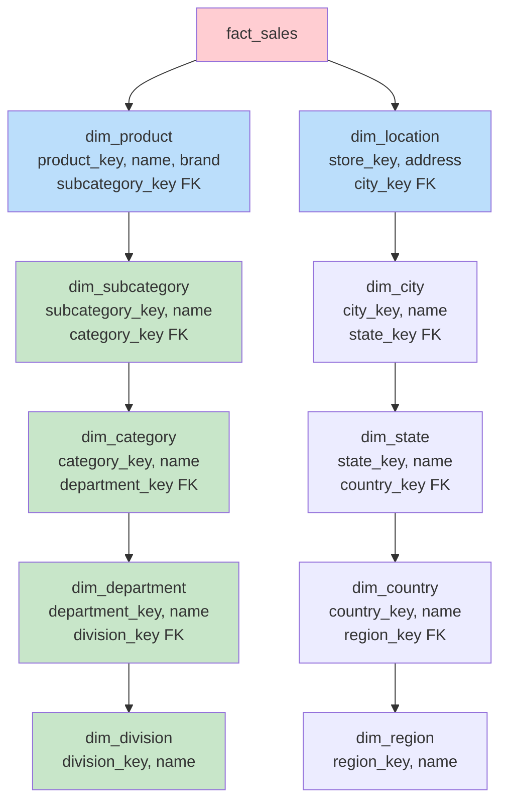

# Snowflake Schema — Intermediate Concepts

## Multi-Level Hierarchies

Snowflake schemas handle complex hierarchies with varying depths.



```sql
-- Geography hierarchy (5 levels normalized):
CREATE TABLE dim_region (
    region_key    INT PRIMARY KEY,
    region_name   VARCHAR(50)      -- 'North America', 'Europe', 'APAC'
);

CREATE TABLE dim_country (
    country_key   INT PRIMARY KEY,
    country_name  VARCHAR(100),
    country_code  CHAR(2),
    region_key    INT REFERENCES dim_region
);

CREATE TABLE dim_state (
    state_key     INT PRIMARY KEY,
    state_name    VARCHAR(100),
    state_code    VARCHAR(5),
    country_key   INT REFERENCES dim_country
);

CREATE TABLE dim_city (
    city_key      INT PRIMARY KEY,
    city_name     VARCHAR(100),
    population    INT,
    timezone      VARCHAR(50),
    state_key     INT REFERENCES dim_state
);

-- Store dimension (leaf level, references city):
CREATE TABLE dim_store (
    store_key     INT PRIMARY KEY,
    store_id      VARCHAR(20),
    store_name    VARCHAR(200),
    address       VARCHAR(500),
    city_key      INT REFERENCES dim_city
);
```

## Shared Sub-Dimensions

A key advantage: sub-dimensions can be **shared** across multiple parent dimensions.

```sql
-- dim_city is shared between dim_store AND dim_customer:
CREATE TABLE dim_store (
    store_key     INT PRIMARY KEY,
    store_name    VARCHAR(200),
    city_key      INT REFERENCES dim_city   -- Shared!
);

CREATE TABLE dim_customer (
    customer_key  INT PRIMARY KEY,
    customer_name VARCHAR(200),
    city_key      INT REFERENCES dim_city   -- Same city table!
);

-- Benefit: City → State → Country hierarchy maintained ONCE
-- Used by both customer and store dimensions
-- Change a city name? One update, both dimensions reflect it.
```

## Views for Simplified Access

Create **views** that flatten the snowflake back to a star for end users:

```sql
-- Flattened view (users see star schema, physical is snowflake):
CREATE VIEW vw_dim_product_flat AS
SELECT 
    p.product_key,
    p.product_id,
    p.product_name,
    p.brand,
    sub.subcategory_name,
    cat.category_name,
    dept.department_name,
    div.division_name
FROM dim_product p
JOIN dim_subcategory sub ON p.subcategory_key = sub.subcategory_key
JOIN dim_category cat ON sub.category_key = cat.category_key
JOIN dim_department dept ON cat.department_key = dept.department_key
JOIN dim_division div ON dept.division_key = div.division_key;

-- Users query the view (simple, like star schema):
SELECT division_name, SUM(revenue)
FROM fact_sales f
JOIN vw_dim_product_flat p ON f.product_key = p.product_key
GROUP BY division_name;
-- Same simplicity as star schema, but physical storage is normalized!
```

## Drill-Down Queries

Snowflake schemas naturally support hierarchical drill-down:

```sql
-- Level 1: Division totals
SELECT div.division_name, SUM(f.revenue) AS revenue
FROM fact_sales f
JOIN dim_product p ON f.product_key = p.product_key
JOIN dim_subcategory sub ON p.subcategory_key = sub.subcategory_key
JOIN dim_category cat ON sub.category_key = cat.category_key
JOIN dim_department dept ON cat.department_key = dept.department_key
JOIN dim_division div ON dept.division_key = div.division_key
GROUP BY div.division_name;

-- Level 2: Drill into "Consumer Products" division → departments
SELECT dept.department_name, SUM(f.revenue) AS revenue
FROM fact_sales f
JOIN dim_product p ON f.product_key = p.product_key
JOIN dim_subcategory sub ON p.subcategory_key = sub.subcategory_key
JOIN dim_category cat ON sub.category_key = cat.category_key
JOIN dim_department dept ON cat.department_key = dept.department_key
JOIN dim_division div ON dept.division_key = div.division_key
WHERE div.division_name = 'Consumer Products'
GROUP BY dept.department_name;

-- Level 3: Drill into "Electronics" department → categories
-- (same pattern, add WHERE dept.department_name = 'Electronics')
```

## Aggregate Tables at Hierarchy Levels

Snowflake schemas pair well with pre-aggregated tables at each hierarchy level:

```sql
-- Pre-aggregated at category level (monthly):
CREATE TABLE fact_sales_monthly_category (
    month_key       INT,
    category_key    INT REFERENCES dim_category,   -- Direct FK to hierarchy level!
    total_revenue   DECIMAL(14,2),
    total_quantity  INT,
    order_count     INT,
    PRIMARY KEY (month_key, category_key)
);

-- Pre-aggregated at department level (quarterly):
CREATE TABLE fact_sales_quarterly_dept (
    quarter_key     INT,
    department_key  INT REFERENCES dim_department,
    total_revenue   DECIMAL(14,2),
    total_quantity  INT,
    PRIMARY KEY (quarter_key, department_key)
);

-- Query at department level: ONE join (fast!)
SELECT dept.department_name, f.total_revenue
FROM fact_sales_quarterly_dept f
JOIN dim_department dept ON f.department_key = dept.department_key
WHERE f.quarter_key = 20241;
-- No need to traverse the full hierarchy!
```

## Handling Ragged Hierarchies

Some hierarchies have **uneven depth** (not all paths reach the same level):

```sql
-- Example: Organization hierarchy
-- CEO → VP → Director → Manager → Employee  (5 levels)
-- CEO → VP → Contractor                     (3 levels, skips 2)

-- Solution: self-referencing table with level indicator
CREATE TABLE dim_org_hierarchy (
    node_key        INT PRIMARY KEY,
    node_name       VARCHAR(200),
    node_type       VARCHAR(50),     -- 'division', 'department', 'team', 'individual'
    parent_key      INT REFERENCES dim_org_hierarchy,
    level_depth     INT,             -- 1, 2, 3, 4, 5
    -- For easy querying, store the full path:
    path_string     VARCHAR(500),    -- 'CEO/VP Sales/East Region/Team A'
    root_key        INT              -- Top-level ancestor
);

-- Recursive query for all descendants:
WITH RECURSIVE descendants AS (
    SELECT node_key, node_name, 1 AS depth
    FROM dim_org_hierarchy WHERE node_name = 'VP Sales'
    UNION ALL
    SELECT h.node_key, h.node_name, d.depth + 1
    FROM dim_org_hierarchy h
    JOIN descendants d ON h.parent_key = d.node_key
)
SELECT * FROM descendants;
```

## Performance Considerations

| Strategy | When to Use |
|----------|-------------|
| Flatten via views | Users need simplicity, DB handles join optimization |
| Aggregate tables per level | Common queries at specific hierarchy levels |
| Materialized views | Complex joins are slow, refresh on schedule |
| Index hierarchy FKs | Always (foreign keys must be indexed) |
| Denormalize hot paths | Query patterns show specific join path is 90%+ of queries |

## Interview Tips

> **Tip 1:** "How do you optimize snowflake schema queries?" — (1) Create views that flatten dimensions (users see star, physical is snowflake). (2) Build aggregate tables keyed to specific hierarchy levels. (3) Index all foreign keys in the hierarchy chain. (4) Consider materialized views for frequently-accessed flattened dimensions.

> **Tip 2:** "What are shared sub-dimensions?" — Sub-dimension tables (like dim_city or dim_country) shared across multiple parent dimensions. Example: both dim_customer and dim_store reference the same dim_city table. Change a city name once → reflected everywhere. This is a core advantage of snowflake over star schema.

> **Tip 3:** "How do you handle ragged/uneven hierarchies?" — Self-referencing table with parent_key and level_depth columns. Store the full path as a string for easy querying. Use recursive CTEs for traversal. Alternatively, bridge tables that pre-resolve all ancestor-descendant relationships for fast lookups.
