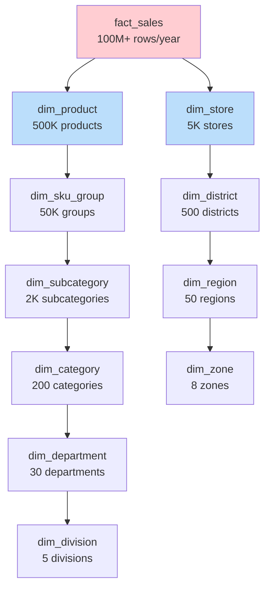

# Snowflake Schema — Real-World Production Examples

## Example 1: Retail Product Hierarchy

Large retailers have deep product hierarchies that are naturally snowflaked:



```sql
-- Complete retail snowflake implementation:
CREATE TABLE dim_division (
    division_key    INT PRIMARY KEY,
    division_code   VARCHAR(5),
    division_name   VARCHAR(100),
    division_vp     VARCHAR(200)
);

CREATE TABLE dim_department (
    department_key  INT PRIMARY KEY,
    department_code VARCHAR(10),
    department_name VARCHAR(100),
    division_key    INT REFERENCES dim_division,
    buyer_name      VARCHAR(200)     -- Department-level attribute
);

CREATE TABLE dim_category (
    category_key    INT PRIMARY KEY,
    category_code   VARCHAR(10),
    category_name   VARCHAR(100),
    department_key  INT REFERENCES dim_department,
    is_seasonal     BOOLEAN          -- Category-level attribute
);

CREATE TABLE dim_product (
    product_key     INT PRIMARY KEY,
    upc_code        VARCHAR(20),
    product_name    VARCHAR(200),
    brand           VARCHAR(100),
    package_size    VARCHAR(50),
    unit_cost       DECIMAL(8,2),
    unit_retail     DECIMAL(8,2),
    category_key    INT REFERENCES dim_category,
    -- Product-specific attributes:
    is_private_label BOOLEAN,
    shelf_life_days  INT,
    weight_oz        DECIMAL(6,2)
);

-- Flattened view for BI users:
CREATE VIEW vw_product_hierarchy AS
SELECT 
    p.product_key, p.upc_code, p.product_name, p.brand,
    p.unit_cost, p.unit_retail,
    c.category_name, c.is_seasonal,
    d.department_name, d.buyer_name,
    div.division_name, div.division_vp,
    -- Calculated:
    p.unit_retail - p.unit_cost AS unit_margin,
    (p.unit_retail - p.unit_cost) / NULLIF(p.unit_retail, 0) * 100 AS margin_pct
FROM dim_product p
JOIN dim_category c ON p.category_key = c.category_key
JOIN dim_department d ON c.department_key = d.department_key
JOIN dim_division div ON d.division_key = div.division_key;

-- Aggregate table: weekly sales by category (for merchant reports)
CREATE TABLE fact_sales_weekly_category AS
SELECT
    date_trunc('week', sale_date)::DATE AS week_start,
    c.category_key,
    c.category_name,
    d.department_name,
    div.division_name,
    SUM(f.revenue) AS total_revenue,
    SUM(f.quantity) AS total_units,
    SUM(f.cost) AS total_cost,
    SUM(f.revenue) - SUM(f.cost) AS gross_profit,
    COUNT(DISTINCT f.store_key) AS stores_with_sales
FROM fact_sales f
JOIN dim_product p ON f.product_key = p.product_key
JOIN dim_category c ON p.category_key = c.category_key
JOIN dim_department d ON c.department_key = d.department_key
JOIN dim_division div ON d.division_key = div.division_key
GROUP BY 1, 2, 3, 4, 5;
```

---

## Example 2: Healthcare — ICD/CPT Code Hierarchies

Medical coding systems are inherently hierarchical and shared across multiple fact tables:

```sql
-- ICD-10 Diagnosis hierarchy (snowflaked):
CREATE TABLE dim_icd_chapter (
    chapter_key     INT PRIMARY KEY,
    chapter_code    VARCHAR(5),        -- 'I', 'II', ..., 'XXII'
    chapter_name    VARCHAR(200)       -- 'Infectious diseases', 'Neoplasms'
);

CREATE TABLE dim_icd_block (
    block_key       INT PRIMARY KEY,
    block_code      VARCHAR(10),       -- 'A00-A09', 'A15-A19'
    block_name      VARCHAR(200),
    chapter_key     INT REFERENCES dim_icd_chapter
);

CREATE TABLE dim_icd_category (
    category_key    INT PRIMARY KEY,
    category_code   VARCHAR(10),       -- 'A00', 'A01'
    category_name   VARCHAR(200),
    block_key       INT REFERENCES dim_icd_block
);

CREATE TABLE dim_diagnosis (
    diagnosis_key   INT PRIMARY KEY,
    icd10_code      VARCHAR(10),       -- 'A00.0', 'A01.1'
    diagnosis_name  VARCHAR(500),
    category_key    INT REFERENCES dim_icd_category,
    -- Diagnosis-level attributes:
    is_chronic      BOOLEAN,
    is_preventable  BOOLEAN,
    drg_weight      DECIMAL(5,3)
);

-- Shared across: fact_claims, fact_encounters, fact_lab_results
-- All reference dim_diagnosis → same hierarchy for all analyses!

-- Clinical analytics query:
SELECT 
    ch.chapter_name,
    bl.block_name,
    COUNT(DISTINCT fc.claim_key) AS claim_count,
    SUM(fc.paid_amount) AS total_paid
FROM fact_claims fc
JOIN dim_diagnosis dx ON fc.diagnosis_key = dx.diagnosis_key
JOIN dim_icd_category cat ON dx.category_key = cat.category_key
JOIN dim_icd_block bl ON cat.block_key = bl.block_key
JOIN dim_icd_chapter ch ON bl.chapter_key = ch.chapter_key
WHERE fc.service_date_key BETWEEN 20240101 AND 20241231
GROUP BY ch.chapter_name, bl.block_name
ORDER BY total_paid DESC;
```

---

## Example 3: dbt Implementation of Snowflake Schema

```sql
-- models/dimensions/hierarchy/dim_division.sql
{{ config(materialized='table') }}

SELECT
    {{ dbt_utils.generate_surrogate_key(['division_code']) }} AS division_key,
    division_code,
    division_name,
    division_vp
FROM {{ ref('stg_product_hierarchy') }}
WHERE hierarchy_level = 'division'

---
-- models/dimensions/hierarchy/dim_department.sql
{{ config(materialized='table') }}

SELECT
    {{ dbt_utils.generate_surrogate_key(['department_code']) }} AS department_key,
    department_code,
    department_name,
    buyer_name,
    div.division_key
FROM {{ ref('stg_product_hierarchy') }} h
JOIN {{ ref('dim_division') }} div ON h.parent_code = div.division_code
WHERE h.hierarchy_level = 'department'

---
-- models/dimensions/dim_product.sql
{{ config(materialized='table') }}

SELECT
    {{ dbt_utils.generate_surrogate_key(['product_id']) }} AS product_key,
    p.product_id,
    p.product_name,
    p.brand,
    p.unit_cost,
    p.unit_retail,
    cat.category_key
FROM {{ ref('stg_products') }} p
JOIN {{ ref('dim_category') }} cat ON p.category_code = cat.category_code

---
-- models/marts/vw_product_flat.sql (flattened view for users)
{{ config(materialized='view') }}

SELECT 
    p.product_key, p.product_name, p.brand, p.unit_cost, p.unit_retail,
    c.category_name,
    d.department_name,
    div.division_name
FROM {{ ref('dim_product') }} p
JOIN {{ ref('dim_category') }} c ON p.category_key = c.category_key
JOIN {{ ref('dim_department') }} d ON c.department_key = d.department_key
JOIN {{ ref('dim_division') }} div ON d.division_key = div.division_key
```

---

## Example 4: Hybrid Star-Snowflake (Most Common in Production)

```sql
-- HYBRID: Product is snowflaked (deep hierarchy, shared)
--         Customer is star (flat, not shared)
--         Date is star (always flat)
--         Geography is snowflaked (shared between store + customer)

-- This is the most common real-world pattern!
CREATE TABLE fact_sales (
    sale_key         BIGINT PRIMARY KEY,
    date_key         INT REFERENCES dim_date,           -- Star (flat)
    customer_key     INT REFERENCES dim_customer,       -- Star (flat, denormalized)
    product_key      INT REFERENCES dim_product,        -- Snowflake (→ subcat → cat → dept)
    store_key        INT REFERENCES dim_store,          -- Snowflake (→ city → state → country)
    revenue          DECIMAL(12,2),
    quantity         INT
);

-- Why hybrid?
-- dim_date: only 1 level deep, no hierarchy sharing → star
-- dim_customer: broad (many attributes), but not hierarchical → star
-- dim_product: 5 levels deep, shared with fact_inventory → snowflake
-- dim_store: shares geography with dim_customer → snowflake for geography
```

---

## Interview Tips

> **Tip 1:** "Give a real-world example of snowflake schema" — Retail product hierarchies: product → SKU group → subcategory → category → department → division (6 levels). Healthcare diagnosis codes: ICD-10 code → category → block → chapter (4 levels). Both are deep, standardized hierarchies shared across multiple fact tables. Perfect snowflake use case.

> **Tip 2:** "How do you implement snowflake schema in dbt?" — Model each hierarchy level as a separate dbt model with materialized='table'. Use ref() to establish the FK chain (department references division, category references department). Create a flattened view (materialized='view') that joins all levels — users query the view. dbt handles dependency ordering automatically.

> **Tip 3:** "Most data warehouses aren't pure star or snowflake — explain." — Correct. Real DWHs are hybrid: flat dimensions (star) for simple entities, snowflaked dimensions for deep/shared hierarchies. The decision is per-dimension based on: hierarchy depth, sharing across facts, and change frequency. Pure star = simple but redundant. Pure snowflake = normalized but complex. Hybrid = pragmatic best of both.
