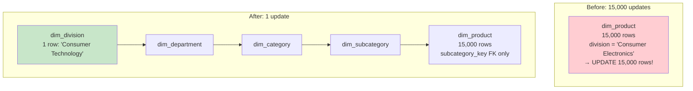
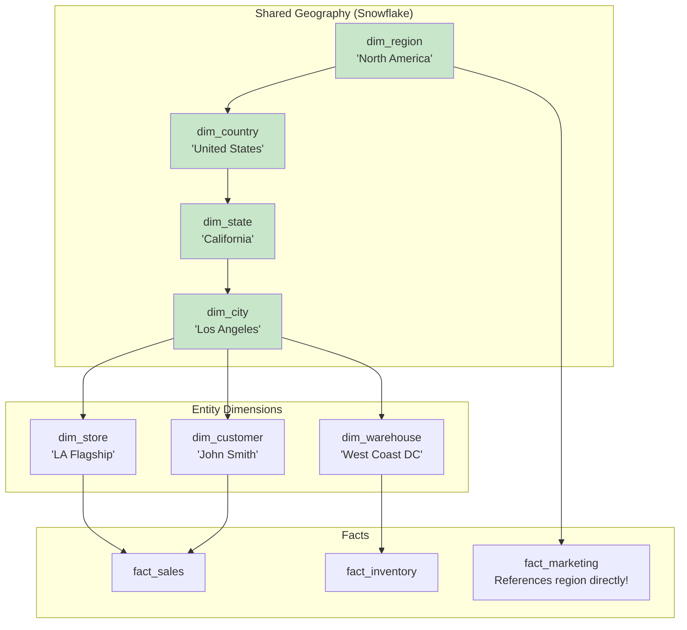
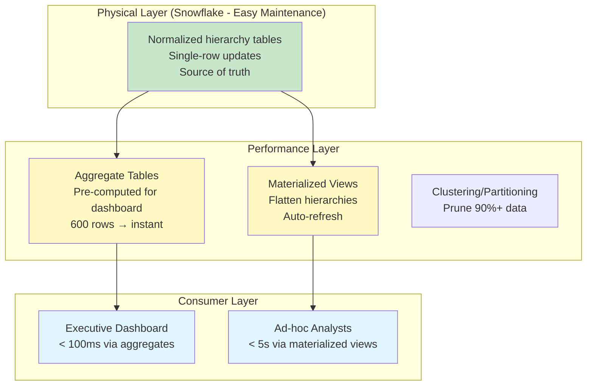

# Scenario Questions — Snowflake Schema

<article data-difficulty="junior">

## 🟢 Junior: Convert Star to Snowflake

**Scenario:** You have a star schema with a flat dim_product containing these columns: `product_key, product_id, product_name, brand, subcategory, category, department, division`. The division name "Consumer Electronics" appears in 15,000 rows, and management just renamed it to "Consumer Technology." You had to update 15,000 rows. Design a snowflake schema that would make this a single-row update.

<details>
<summary>💡 Hint</summary>
Extract each hierarchy level into its own table: dim_division, dim_department, dim_category, dim_subcategory. Each references its parent via FK. The dim_product only stores subcategory_key. Now renaming a division = updating 1 row in dim_division.
</details>

<details>
<summary>✅ Solution</summary>

```sql
-- ═══════════════════════════════════════
-- BEFORE (Star — flat, redundant)
-- ═══════════════════════════════════════
-- dim_product: 15,000 rows with "Consumer Electronics" repeated
-- UPDATE dim_product SET division = 'Consumer Technology' 
-- WHERE division = 'Consumer Electronics';  -- Updates 15,000 rows!

-- ═══════════════════════════════════════
-- AFTER (Snowflake — normalized hierarchy)
-- ═══════════════════════════════════════

CREATE TABLE dim_division (
    division_key    INT PRIMARY KEY,
    division_name   VARCHAR(100)      -- "Consumer Technology" stored ONCE
);
-- ~5 rows total

CREATE TABLE dim_department (
    department_key  INT PRIMARY KEY,
    department_name VARCHAR(100),
    division_key    INT REFERENCES dim_division
);
-- ~30 rows

CREATE TABLE dim_category (
    category_key    INT PRIMARY KEY,
    category_name   VARCHAR(100),
    department_key  INT REFERENCES dim_department
);
-- ~150 rows

CREATE TABLE dim_subcategory (
    subcategory_key INT PRIMARY KEY,
    subcategory_name VARCHAR(100),
    category_key    INT REFERENCES dim_category
);
-- ~500 rows

CREATE TABLE dim_product (
    product_key     INT PRIMARY KEY,
    product_id      VARCHAR(20),
    product_name    VARCHAR(200),
    brand           VARCHAR(100),
    subcategory_key INT REFERENCES dim_subcategory
);
-- 15,000 rows, but NO division/category text — just FK!

-- NOW: Rename division = ONE row update!
UPDATE dim_division 
SET division_name = 'Consumer Technology' 
WHERE division_name = 'Consumer Electronics';
-- Done! 1 row updated. All queries automatically see new name.
```



**Key Points:**
- Division name stored in exactly ONE row → single update for renames
- No redundancy: "Consumer Technology" appears once in the entire database
- Trade-off: queries need more JOINs to get division name from products
- Solution: create a flattened VIEW for user-facing queries

```sql
-- View for users (hides the complexity):
CREATE VIEW vw_product_full AS
SELECT 
    p.product_key, p.product_name, p.brand,
    sub.subcategory_name,
    cat.category_name,
    dept.department_name,
    div.division_name
FROM dim_product p
JOIN dim_subcategory sub ON p.subcategory_key = sub.subcategory_key
JOIN dim_category cat ON sub.category_key = cat.category_key
JOIN dim_department dept ON cat.department_key = dept.department_key
JOIN dim_division div ON dept.division_key = div.division_key;
```

</details>

</article>

<article data-difficulty="mid-level">

## 🟡 Mid-Level: Designing Shared Geography Snowflake

**Scenario:** An international retailer has 3 fact tables: fact_sales (transactions), fact_inventory (daily snapshots), and fact_marketing_spend (monthly by region). They need geographic analysis at multiple levels: store-level, city-level, state-level, country-level, and region-level. Stores, customers, and warehouses all have geographic locations. Design a snowflake schema for geography that: (1) is shared across all three facts, (2) supports drill-down from region to store, (3) allows independent updates at each level.

<details>
<summary>💡 Hint</summary>
Create the geography hierarchy: dim_region → dim_country → dim_state → dim_city. Then dim_store, dim_customer, and dim_warehouse each reference dim_city. Facts reference their respective entity dimensions. Marketing fact can reference dim_region directly (coarser grain). Show how drill-down queries work.
</details>

<details>
<summary>✅ Solution</summary>

```sql
-- ═══════════════════════════════════════
-- SHARED GEOGRAPHY HIERARCHY (Snowflake)
-- ═══════════════════════════════════════

CREATE TABLE dim_region (
    region_key      INT PRIMARY KEY,
    region_name     VARCHAR(50),       -- 'North America', 'Europe', 'APAC'
    region_head     VARCHAR(200)       -- VP responsible
);

CREATE TABLE dim_country (
    country_key     INT PRIMARY KEY,
    country_name    VARCHAR(100),
    country_code    CHAR(2),           -- 'US', 'UK', 'DE'
    currency_code   CHAR(3),           -- 'USD', 'GBP', 'EUR'
    region_key      INT REFERENCES dim_region
);

CREATE TABLE dim_state (
    state_key       INT PRIMARY KEY,
    state_name      VARCHAR(100),
    state_code      VARCHAR(5),
    country_key     INT REFERENCES dim_country,
    timezone        VARCHAR(50)
);

CREATE TABLE dim_city (
    city_key        INT PRIMARY KEY,
    city_name       VARCHAR(100),
    population      INT,
    state_key       INT REFERENCES dim_state,
    latitude        DECIMAL(9,6),
    longitude       DECIMAL(9,6)
);

-- ═══════════════════════════════════════
-- ENTITY DIMENSIONS (reference geography)
-- ═══════════════════════════════════════

CREATE TABLE dim_store (
    store_key       INT PRIMARY KEY,
    store_id        VARCHAR(20),
    store_name      VARCHAR(200),
    store_type      VARCHAR(20),       -- 'flagship', 'standard', 'outlet'
    city_key        INT REFERENCES dim_city,  -- Links to geography!
    open_date       DATE,
    sqft            INT
);

CREATE TABLE dim_customer (
    customer_key    INT PRIMARY KEY,
    customer_id     VARCHAR(20),
    customer_name   VARCHAR(200),
    city_key        INT REFERENCES dim_city,  -- Same geography!
    segment         VARCHAR(20)
);

CREATE TABLE dim_warehouse (
    warehouse_key   INT PRIMARY KEY,
    warehouse_id    VARCHAR(20),
    warehouse_name  VARCHAR(200),
    city_key        INT REFERENCES dim_city,  -- Same geography!
    capacity_sqft   INT
);

-- ═══════════════════════════════════════
-- FACT TABLES (different grains, shared geography)
-- ═══════════════════════════════════════

-- Transaction grain (references store → city → state → country → region)
CREATE TABLE fact_sales (
    sale_key        BIGINT PRIMARY KEY,
    date_key        INT,
    store_key       INT REFERENCES dim_store,
    customer_key    INT REFERENCES dim_customer,
    product_key     INT,
    revenue         DECIMAL(12,2),
    quantity        INT
);

-- Daily snapshot (references warehouse → city → state → country → region)
CREATE TABLE fact_inventory (
    date_key        INT,
    warehouse_key   INT REFERENCES dim_warehouse,
    product_key     INT,
    quantity_on_hand INT,
    PRIMARY KEY (date_key, warehouse_key, product_key)
);

-- Monthly grain (references region DIRECTLY — coarser)
CREATE TABLE fact_marketing_spend (
    month_key       INT,
    region_key      INT REFERENCES dim_region,  -- Direct FK to region!
    channel_key     INT,
    spend_amount    DECIMAL(12,2),
    impressions     BIGINT,
    PRIMARY KEY (month_key, region_key, channel_key)
);

-- ═══════════════════════════════════════
-- DRILL-DOWN QUERIES
-- ═══════════════════════════════════════

-- Level 1: Regional summary (all three facts!)
SELECT 
    r.region_name,
    SUM(fs.revenue) AS sales_revenue,
    SUM(fm.spend_amount) AS marketing_spend,
    SUM(fs.revenue) / NULLIF(SUM(fm.spend_amount), 0) AS roas
FROM dim_region r
-- Sales via: region → country → state → city → store → fact_sales
LEFT JOIN dim_country cn ON cn.region_key = r.region_key
LEFT JOIN dim_state st ON st.country_key = cn.country_key
LEFT JOIN dim_city ct ON ct.state_key = st.state_key
LEFT JOIN dim_store s ON s.city_key = ct.city_key
LEFT JOIN fact_sales fs ON fs.store_key = s.store_key
-- Marketing: direct!
LEFT JOIN fact_marketing_spend fm ON fm.region_key = r.region_key
GROUP BY r.region_name;

-- Level 2: Drill into North America → by country
SELECT cn.country_name, SUM(fs.revenue) AS revenue
FROM fact_sales fs
JOIN dim_store s ON fs.store_key = s.store_key
JOIN dim_city ct ON s.city_key = ct.city_key
JOIN dim_state st ON ct.state_key = st.state_key
JOIN dim_country cn ON st.country_key = cn.country_key
JOIN dim_region r ON cn.region_key = r.region_key
WHERE r.region_name = 'North America'
GROUP BY cn.country_name;

-- Level 3: Drill into US → by state
SELECT st.state_name, SUM(fs.revenue) AS revenue
FROM fact_sales fs
JOIN dim_store s ON fs.store_key = s.store_key
JOIN dim_city ct ON s.city_key = ct.city_key
JOIN dim_state st ON ct.state_key = st.state_key
WHERE st.country_key = (SELECT country_key FROM dim_country WHERE country_code = 'US')
GROUP BY st.state_name
ORDER BY revenue DESC;
```



**Key Points:**
- Geography hierarchy maintained ONCE, shared by store, customer, and warehouse
- Rename a city → ONE update, all three facts reflect it
- Marketing spend at region grain → direct FK (no need to traverse full hierarchy)
- Drill-down works at any level: region → country → state → city → store
- Cross-fact analysis possible through shared geography (sales vs. marketing ROAS by region)

</details>

</article>

<article data-difficulty="senior">

## 🔴 Senior: Optimizing a Slow Snowflake Schema

**Scenario:** Your snowflake schema has a 6-level product hierarchy and a 5-level geography hierarchy. The executive dashboard query joins fact_sales (2B rows) through both hierarchies (11 total joins) and takes 45 seconds. Requirements: (1) dashboard must load in <3 seconds, (2) hierarchy updates must still be single-row, (3) ad-hoc analysts must still be able to drill to any level. Propose an optimization strategy without abandoning the snowflake physical model.

<details>
<summary>💡 Hint</summary>
Multiple strategies: (1) Materialized views that flatten hierarchies (physical star from logical snowflake). (2) Bridge/closure tables for hierarchy pre-computation. (3) Aggregate tables at each commonly-queried level. (4) Clustering/partitioning on fact table. The physical model stays snowflake (easy maintenance); performance layers sit on top.
</details>

<details>
<summary>✅ Solution</summary>

```sql
-- ═══════════════════════════════════════
-- PROBLEM: 11 joins, 2B rows, 45 seconds
-- GOAL: <3 seconds for dashboard, maintain easy updates
-- ═══════════════════════════════════════

-- Strategy 1: MATERIALIZED VIEWS (flatten hierarchies)
-- Physical snowflake + logical star via materialized views

CREATE MATERIALIZED VIEW mv_product_flat AS
SELECT 
    p.product_key,
    p.product_name,
    p.brand,
    sub.subcategory_name,
    cat.category_name,
    dept.department_name,
    div.division_name
FROM dim_product p
JOIN dim_subcategory sub ON p.subcategory_key = sub.subcategory_key
JOIN dim_category cat ON sub.category_key = cat.category_key
JOIN dim_department dept ON cat.department_key = dept.department_key
JOIN dim_division div ON dept.division_key = div.division_key;
-- Pre-joined: 500K rows, auto-refreshed on source change

CREATE MATERIALIZED VIEW mv_geography_flat AS
SELECT
    s.store_key,
    s.store_name,
    ct.city_name,
    st.state_name,
    cn.country_name,
    r.region_name
FROM dim_store s
JOIN dim_city ct ON s.city_key = ct.city_key
JOIN dim_state st ON ct.state_key = st.state_key
JOIN dim_country cn ON st.country_key = cn.country_key
JOIN dim_region r ON cn.region_key = r.region_key;
-- Pre-joined: 5K rows

-- Dashboard query: NOW only 2 joins (was 11!)
SELECT 
    g.region_name,
    p.division_name,
    SUM(f.revenue) AS total_revenue,
    COUNT(DISTINCT f.store_key) AS active_stores
FROM fact_sales f
JOIN mv_product_flat p ON f.product_key = p.product_key
JOIN mv_geography_flat g ON f.store_key = g.store_key
WHERE f.date_key BETWEEN 20240101 AND 20241231
GROUP BY g.region_name, p.division_name;
-- Result: ~2 seconds ✓ (was 45 seconds)

-- ═══════════════════════════════════════
-- Strategy 2: AGGREGATE TABLES (common dashboard levels)
-- ═══════════════════════════════════════

-- Executive dashboard always shows: division × region × month
CREATE TABLE agg_sales_monthly_division_region (
    month_key       INT,
    division_key    INT REFERENCES dim_division,
    region_key      INT REFERENCES dim_region,
    -- Pre-aggregated:
    total_revenue   DECIMAL(14,2),
    total_units     INT,
    order_count     INT,
    unique_stores   INT,
    unique_customers INT,
    avg_basket_size DECIMAL(10,2),
    PRIMARY KEY (month_key, division_key, region_key)
);
-- ~600 rows (12 months × 5 divisions × 8 regions)

-- Dashboard query using aggregate: INSTANT (<100ms)
SELECT 
    div.division_name,
    r.region_name,
    a.total_revenue,
    a.unique_customers
FROM agg_sales_monthly_division_region a
JOIN dim_division div ON a.division_key = div.division_key
JOIN dim_region r ON a.region_key = r.region_key
WHERE a.month_key = 202403;
-- 2 tiny joins on 600 rows → sub-second!

-- Refresh aggregate daily (after fact loads):
MERGE INTO agg_sales_monthly_division_region target
USING (
    SELECT 
        YEAR(d.full_date) * 100 + MONTH(d.full_date) AS month_key,
        div.division_key,
        r.region_key,
        SUM(f.revenue) AS total_revenue,
        SUM(f.quantity) AS total_units,
        COUNT(DISTINCT f.order_number) AS order_count,
        COUNT(DISTINCT f.store_key) AS unique_stores,
        COUNT(DISTINCT f.customer_key) AS unique_customers,
        SUM(f.revenue) / NULLIF(COUNT(DISTINCT f.order_number), 0) AS avg_basket_size
    FROM fact_sales f
    JOIN dim_date d ON f.date_key = d.date_key
    JOIN dim_product p ON f.product_key = p.product_key
    JOIN dim_subcategory sub ON p.subcategory_key = sub.subcategory_key
    JOIN dim_category cat ON sub.category_key = cat.category_key
    JOIN dim_department dept ON cat.department_key = dept.department_key
    JOIN dim_division div ON dept.division_key = div.division_key
    JOIN dim_store s ON f.store_key = s.store_key
    JOIN dim_city ct ON s.city_key = ct.city_key
    JOIN dim_state st ON ct.state_key = st.state_key
    JOIN dim_country cn ON st.country_key = cn.country_key
    JOIN dim_region r ON cn.region_key = r.region_key
    GROUP BY 1, 2, 3
) source
ON target.month_key = source.month_key 
   AND target.division_key = source.division_key
   AND target.region_key = source.region_key
WHEN MATCHED THEN UPDATE SET 
    total_revenue = source.total_revenue,
    total_units = source.total_units,
    order_count = source.order_count,
    unique_stores = source.unique_stores,
    unique_customers = source.unique_customers,
    avg_basket_size = source.avg_basket_size
WHEN NOT MATCHED THEN INSERT VALUES (
    source.month_key, source.division_key, source.region_key,
    source.total_revenue, source.total_units, source.order_count,
    source.unique_stores, source.unique_customers, source.avg_basket_size
);

-- ═══════════════════════════════════════
-- Strategy 3: FACT TABLE OPTIMIZATION
-- ═══════════════════════════════════════

-- Cluster fact_sales by most common filter columns:
ALTER TABLE fact_sales CLUSTER BY (date_key, store_key);
-- Or on Databricks: OPTIMIZE fact_sales ZORDER BY (date_key, store_key, product_key);

-- Partition by date for lifecycle management:
-- Queries with date filter → prune 90%+ of data

-- ═══════════════════════════════════════
-- Strategy 4: AD-HOC ANALYST ACCESS (drill-down)
-- ═══════════════════════════════════════

-- Analysts use the materialized views for drill-down:
-- "Show me revenue by city for California in Q1"
SELECT 
    g.city_name,
    SUM(f.revenue) AS revenue
FROM fact_sales f
JOIN mv_geography_flat g ON f.store_key = g.store_key  
JOIN dim_date d ON f.date_key = d.date_key
WHERE g.state_name = 'California'
  AND d.quarter = 1 AND d.year = 2024
GROUP BY g.city_name
ORDER BY revenue DESC;
-- Still fast (~3-5 seconds for filtered drill-down on 2B rows)
```



**Performance Results:**

| Query Type | Before | After | Strategy Used |
|-----------|--------|-------|--------------|
| Dashboard (div × region) | 45s | <100ms | Aggregate table |
| Dashboard (detailed) | 45s | 2s | Materialized views |
| Ad-hoc drill-down | 45s | 3-5s | MV + clustering |
| Hierarchy update | 1 row | 1 row | Unchanged (still snowflake!) |

**Key Points:**
- Physical model stays snowflake (easy maintenance, single-row updates)
- Performance layers sit ON TOP: MVs for general use, aggregates for dashboards
- Aggregate table for the executive dashboard: 600 rows → instant
- Materialized views: eliminate joins at query time (pre-flattened)
- Clustering: prunes data before join processing begins
- Ad-hoc still works (filtered queries on MV + clustered fact = fast enough)
- No compromise: maintainability AND performance achieved simultaneously

</details>

</article>

</content>
