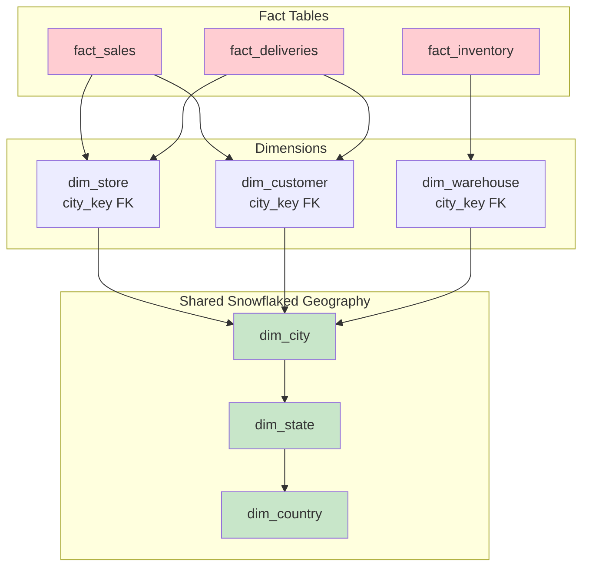
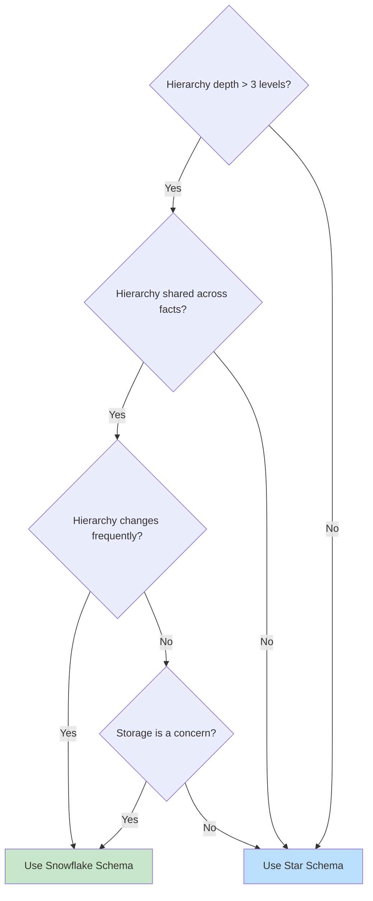

# Snowflake Schema — Senior Deep Dive

## Galaxy Schema (Fact Constellation)

When multiple fact tables share snowflaked dimensions, the result is a **galaxy schema** (or fact constellation):



```sql
-- Galaxy: Three facts share the same geography hierarchy
-- Benefits:
-- 1. Change "California" to "CA" → ONE update, ALL facts get it
-- 2. Add a new geography attribute → ONE table, ALL facts benefit
-- 3. Conformed geography across sales, inventory, deliveries

-- Cross-fact query using shared geography:
SELECT 
    cn.country_name,
    st.state_name,
    SUM(fs.revenue) AS sales_revenue,
    SUM(fi.quantity_on_hand) AS inventory_level,
    AVG(fd.delivery_days) AS avg_delivery_time
FROM dim_country cn
JOIN dim_state st ON st.country_key = cn.country_key
JOIN dim_city ct ON ct.state_key = st.state_key
-- Sales via store:
LEFT JOIN dim_store store ON store.city_key = ct.city_key
LEFT JOIN fact_sales fs ON fs.store_key = store.store_key
-- Inventory via warehouse:
LEFT JOIN dim_warehouse wh ON wh.city_key = ct.city_key
LEFT JOIN fact_inventory fi ON fi.warehouse_key = wh.warehouse_key
-- Deliveries:
LEFT JOIN fact_deliveries fd ON fd.store_key = store.store_key
GROUP BY cn.country_name, st.state_name;
```

## Snowflake Schema on Modern Cloud Platforms

On columnar MPP databases, the traditional arguments shift:

```sql
-- Snowflake (the platform) handles snowflake schema (the pattern) well:
-- Reason: Columnar storage + query optimizer handles multi-join plans efficiently

-- Modern considerations:
-- 1. Storage is CHEAP → redundancy in star schema costs almost nothing
-- 2. Columnar compression → repeated values compress extremely well
-- 3. Query optimizers → can handle 10+ joins efficiently
-- 4. Materialized views → flatten snowflake physically when needed

-- Best practice on modern platforms:
-- • Physical: snowflake schema (normalized, easy to maintain)
-- • Logical: star schema views (flattened for users/BI tools)
-- • Performance: materialized views or aggregate tables where needed

CREATE MATERIALIZED VIEW mv_product_flat AS
SELECT 
    p.product_key, p.product_name, p.brand,
    sub.subcategory_name,
    cat.category_name,
    dept.department_name
FROM dim_product p
JOIN dim_subcategory sub ON p.subcategory_key = sub.subcategory_key
JOIN dim_category cat ON sub.category_key = cat.category_key
JOIN dim_department dept ON cat.department_key = dept.department_key;

-- Automatic refresh when source tables change (Snowflake):
-- mv_product_flat stays in sync with underlying snowflake tables
```

## Bridge Tables for Hierarchy Navigation

For complex hierarchies, pre-compute all ancestor-descendant relationships:

```sql
-- Bridge table: every ancestor-descendant pair pre-computed
CREATE TABLE bridge_product_hierarchy (
    ancestor_key      INT,         -- Any level: dept, cat, subcat, product
    ancestor_level    VARCHAR(20), -- 'department', 'category', 'subcategory', 'product'
    descendant_key    INT,         -- Product level (leaf)
    depth             INT,         -- Distance from ancestor to descendant
    PRIMARY KEY (ancestor_key, descendant_key)
);

-- Pre-populate (recursive):
INSERT INTO bridge_product_hierarchy
WITH RECURSIVE hierarchy AS (
    -- Base: each product is its own descendant at depth 0
    SELECT product_key AS ancestor_key, 'product' AS level, product_key AS descendant_key, 0 AS depth
    FROM dim_product
    UNION ALL
    -- Subcategory ancestors:
    SELECT sub.subcategory_key, 'subcategory', h.descendant_key, h.depth + 1
    FROM hierarchy h
    JOIN dim_product p ON h.ancestor_key = p.product_key AND h.depth = 0
    JOIN dim_subcategory sub ON p.subcategory_key = sub.subcategory_key
    UNION ALL
    -- Category ancestors:
    SELECT cat.category_key, 'category', h.descendant_key, h.depth + 1
    FROM hierarchy h
    JOIN dim_subcategory sub ON h.ancestor_key = sub.subcategory_key AND h.level = 'subcategory'
    JOIN dim_category cat ON sub.category_key = cat.category_key
    -- ... and so on for each level
)
SELECT * FROM hierarchy;

-- Query: "Revenue for department 'Electronics' and all its descendants"
-- Using bridge table: ONE join instead of traversing the full hierarchy!
SELECT SUM(f.revenue) AS total_revenue
FROM fact_sales f
JOIN bridge_product_hierarchy b ON f.product_key = b.descendant_key
WHERE b.ancestor_key = 5  -- department_key for Electronics
  AND b.ancestor_level = 'department';
-- FAST: no recursive joins needed at query time!
```

## ETL Patterns for Snowflake Schema

### Loading Order (Dependency-Aware)

```sql
-- Must load hierarchy tables TOP-DOWN (parent before child):
-- 1. dim_division    (no FK dependencies)
-- 2. dim_department  (depends on dim_division)
-- 3. dim_category    (depends on dim_department)
-- 4. dim_subcategory (depends on dim_category)
-- 5. dim_product     (depends on dim_subcategory)
-- 6. fact_sales      (depends on all dimensions)

-- dbt handles this automatically via ref():
-- models/dims/dim_department.sql
SELECT ... FROM {{ ref('dim_division') }} ...  -- dbt knows the order!
```

### SCD Type 2 in Snowflaked Dimensions

```sql
-- Challenge: If a subcategory moves to a different category, 
-- do ALL products under it get new surrogate keys?

-- Approach 1: SCD on leaf dimension only (products)
-- The hierarchy tables are Type 1 (overwrite)
-- Products get new versions (Type 2) when their hierarchy path changes

-- Approach 2: SCD on each level independently
-- Each hierarchy table tracks its own history
-- Fact table only references the leaf (product_key)
-- Historical hierarchy reconstructed via product's subcategory_key 
-- at the product's effective date

-- Approach 2 is cleaner but requires careful point-in-time joins:
SELECT 
    f.revenue,
    p.product_name,
    sub.subcategory_name,
    cat.category_name
FROM fact_sales f
JOIN dim_product p 
    ON f.product_key = p.product_key  -- Already point-in-time via SCD2
JOIN dim_subcategory sub 
    ON p.subcategory_key = sub.subcategory_key
    AND sub.effective_start <= f.sale_date AND sub.effective_end > f.sale_date
JOIN dim_category cat 
    ON sub.category_key = cat.category_key
    AND cat.effective_start <= f.sale_date AND cat.effective_end > f.sale_date;
```

## When to Snowflake vs. Star (Decision Framework)



## Interview Tips

> **Tip 1:** "Galaxy schema?" — Multiple fact tables sharing the same snowflaked dimensions. Example: fact_sales, fact_inventory, and fact_deliveries all reference the same geography hierarchy (city→state→country). Enables cross-process analytics with guaranteed consistency on shared dimensions.

> **Tip 2:** "How do you handle SCD in snowflake schemas?" — Two approaches: (1) SCD Type 2 only at the leaf level (dim_product), hierarchy tables are Type 1 (overwrite). Simpler but loses hierarchy history. (2) SCD on each hierarchy level independently — requires point-in-time joins through the hierarchy, but preserves full history. Choice depends on whether historical hierarchy matters for your analysis.

> **Tip 3:** "Snowflake schema on modern cloud platforms?" — Storage is cheap now, so the redundancy argument for snowflake is weaker. But maintenance/update arguments remain strong. Best practice: physically store as snowflake (normalized, easy ETL), expose to users as star via materialized views or flattened views. Get the benefits of both.
