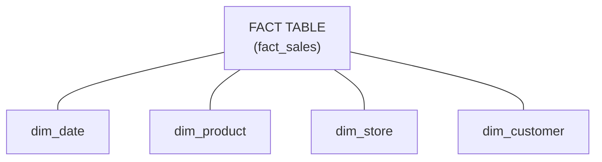

# Star Schema — Fundamentals


## 🎯 Analogy

Think of a star schema like a solar system: the fact table is the sun (big, central, all the measures), and dimension tables are the planets orbiting it (providing context: who, what, when, where).

---
## What Is a Star Schema?

A star schema is the **most common data warehouse design pattern**. It organizes data into a central **fact table** (measurements/events) surrounded by **dimension tables** (descriptive context).

**The analogy:** Think of a fact table as a spreadsheet of transactions (what happened). Dimensions answer the "who, what, where, when, why" about each transaction.

> **Why it matters for DE:** Nearly every data warehouse (Snowflake, Redshift, BigQuery, Databricks) uses star schemas. Interview questions frequently ask you to design one or query one.

---

## The Star Shape



**What this shows:**
- The **fact table** sits in the center (like the body of a star)
- **Dimension tables** radiate outward (like the points of a star)
- Each dimension connects to the fact via a foreign key
- This is why it's called a "star" — the shape when you draw the relationships

---

## Fact Tables — The Measurements

A fact table stores **quantitative data** — things you measure, count, or sum.

**Characteristics:**
- Very large (millions to billions of rows)
- Narrow (few columns — mostly foreign keys + measures)
- Each row represents a business event or measurement
- Contains **foreign keys** pointing to dimensions
- Contains **measures** (numeric values you aggregate)

**Example: `fact_sales`**

| sale_id | date_key | product_key | store_key | customer_key | quantity | unit_price | total_amount | discount |
|---------|----------|-------------|-----------|-------------|----------|-----------|-------------|---------|
| 1001 | 20240115 | 501 | 10 | 2001 | 2 | 29.99 | 59.98 | 0.00 |
| 1002 | 20240115 | 305 | 10 | 2045 | 1 | 149.00 | 149.00 | 15.00 |
| 1003 | 20240116 | 501 | 22 | 2001 | 5 | 29.99 | 149.95 | 10.00 |

**What are the measures?** `quantity`, `unit_price`, `total_amount`, `discount` — numeric values you SUM, AVG, COUNT.

**What are the keys?** `date_key`, `product_key`, `store_key`, `customer_key` — pointers to dimension tables for context.

---

## Dimension Tables — The Context

A dimension table stores **descriptive attributes** — the who, what, where, when about each fact.

**Characteristics:**
- Small to medium (thousands to millions of rows)
- Wide (many descriptive columns)
- Each row represents a unique entity (a product, a customer, a date)
- Contains a **primary key** (surrogate key) referenced by the fact table
- Contains **descriptive attributes** for filtering, grouping, labeling

**Example: `dim_product`**

| product_key | product_id | product_name | category | subcategory | brand | unit_cost | launch_date |
|-------------|-----------|-------------|----------|-------------|-------|-----------|------------|
| 501 | SKU-A100 | Widget Pro | Electronics | Gadgets | Acme | 12.50 | 2023-03-01 |
| 305 | SKU-B200 | Super Screen | Electronics | Displays | TechCo | 85.00 | 2022-06-15 |

**Example: `dim_date`**

| date_key | full_date | day_name | month_name | quarter | year | is_weekend | is_holiday |
|----------|-----------|----------|-----------|---------|------|-----------|-----------|
| 20240115 | 2024-01-15 | Monday | January | Q1 | 2024 | No | No |
| 20240116 | 2024-01-16 | Tuesday | January | Q1 | 2024 | No | No |

> **Why a date dimension?** Instead of extracting MONTH(sale_date) every query, pre-computed attributes (is_weekend, fiscal_quarter, holiday_name) make queries simpler and faster.

---

## Surrogate Keys vs Natural Keys

| Type | Example | Use in Star Schema |
|------|---------|-------------------|
| **Natural key** | product_id = "SKU-A100" | Comes from the source system |
| **Surrogate key** | product_key = 501 | Warehouse-assigned integer (auto-increment) |

**Why use surrogate keys?**
1. Source system keys can change (mergers, migrations)
2. Integer keys are smaller and faster to join
3. Handles SCD (multiple dimension rows for same natural key)
4. Protects warehouse from source system changes

> **Rule:** Fact tables store surrogate keys (integers). Dimension tables have both the surrogate key (PK) and the natural key (for lookups from source data).

---

## Types of Fact Tables

| Type | What It Stores | Grain | Example |
|------|---------------|-------|---------|
| **Transaction** | Individual events | One row per event | Each sale, each click |
| **Periodic snapshot** | State at regular intervals | One row per period | Daily account balance |
| **Accumulating snapshot** | Lifecycle milestones | One row per entity (updated) | Order: placed → shipped → delivered |

**Transaction fact (most common):**
```sql
-- One row per sale event
INSERT INTO fact_sales (date_key, product_key, store_key, quantity, amount)
VALUES (20240115, 501, 10, 2, 59.98);
```

**Periodic snapshot:**
```sql
-- One row per account per day
INSERT INTO fact_account_balance (date_key, account_key, balance, transactions_count)
VALUES (20240115, 3001, 15420.50, 7);
```

**Accumulating snapshot:**
```sql
-- One row per order, updated as it progresses
UPDATE fact_order_fulfillment 
SET ship_date_key = 20240117, ship_quantity = 2
WHERE order_key = 5001;
```

---

## Grain — The Most Important Decision

The **grain** defines what one row in the fact table represents. It must be declared explicitly before designing anything else.

**Examples of grain statements:**
- "One row per individual product sold in a single transaction"
- "One row per student per course per semester"
- "One row per daily closing balance per account"

> **Why grain matters:** If the grain is unclear, the fact table will have ambiguous measures that produce wrong results when aggregated.

**Wrong: Mixed grain**
```
Row 1: Sale of 1 item (quantity = 1)
Row 2: Daily summary (quantity = 150)  ← WRONG: mixed with individual rows
-- SUM(quantity) now gives meaningless results
```

**Correct: Consistent grain**
```
Every row = one product in one transaction at one store on one date
```

---

## A Complete Star Schema Example

**Business: Retail store chain**
**Grain:** "One row per product sold per transaction"

```sql
-- Fact table
CREATE TABLE fact_sales (
    sale_key        BIGINT PRIMARY KEY,  -- Surrogate key
    date_key        INT NOT NULL,        -- FK → dim_date
    product_key     INT NOT NULL,        -- FK → dim_product
    store_key       INT NOT NULL,        -- FK → dim_store
    customer_key    INT NOT NULL,        -- FK → dim_customer
    -- Measures
    quantity        INT NOT NULL,
    unit_price      DECIMAL(10,2),
    discount_amount DECIMAL(10,2),
    net_amount      DECIMAL(10,2)
);

-- Dimension tables
CREATE TABLE dim_date (
    date_key    INT PRIMARY KEY,
    full_date   DATE NOT NULL,
    day_name    VARCHAR(10),
    month_name  VARCHAR(10),
    quarter     VARCHAR(2),
    year        INT,
    is_weekend  BOOLEAN,
    is_holiday  BOOLEAN
);

CREATE TABLE dim_product (
    product_key   INT PRIMARY KEY,
    product_id    VARCHAR(20),      -- Natural key from source
    product_name  VARCHAR(100),
    category      VARCHAR(50),
    subcategory   VARCHAR(50),
    brand         VARCHAR(50),
    unit_cost     DECIMAL(10,2)
);

CREATE TABLE dim_store (
    store_key   INT PRIMARY KEY,
    store_id    VARCHAR(10),
    store_name  VARCHAR(100),
    city        VARCHAR(50),
    state       VARCHAR(50),
    country     VARCHAR(50),
    region      VARCHAR(50)
);

CREATE TABLE dim_customer (
    customer_key  INT PRIMARY KEY,
    customer_id   VARCHAR(20),
    first_name    VARCHAR(50),
    last_name     VARCHAR(50),
    email         VARCHAR(100),
    segment       VARCHAR(20),     -- Gold, Silver, Bronze
    signup_date   DATE
);
```

---

## Querying a Star Schema

Star schemas are designed for simple, fast analytical queries:

```sql
-- "Total revenue by product category per quarter"
SELECT 
    d.quarter,
    p.category,
    SUM(f.net_amount) AS total_revenue,
    SUM(f.quantity) AS units_sold
FROM fact_sales f
JOIN dim_date d ON f.date_key = d.date_key
JOIN dim_product p ON f.product_key = p.product_key
WHERE d.year = 2024
GROUP BY d.quarter, p.category
ORDER BY d.quarter, total_revenue DESC;
```

**Why this works well:**
- Fact table has only the keys and measures (narrow, fast to scan)
- Each JOIN is a simple FK → PK lookup (efficient)
- Dimensions provide all the grouping/filtering context
- No complex multi-table joins or subqueries needed

---

## Star Schema vs 3NF (Normalized)

| Aspect | Star Schema | 3NF (Normalized) |
|--------|------------|-------------------|
| Purpose | Analytics / Reporting | Transactional (OLTP) |
| Redundancy | Dimension data is denormalized (repeated) | Minimal redundancy |
| Query complexity | Simple (few joins) | Complex (many joins) |
| Query performance | Fast for aggregates | Fast for single-record ops |
| Update complexity | ETL needed to maintain | Direct updates |
| Used in | Data warehouses | Operational databases |

> **Key distinction:** In OLTP, you normalize to avoid update anomalies. In a warehouse, you denormalize dimensions for query performance — it's OK because data is loaded in controlled ETL batches, not random updates.

---


## ▶️ Try It Yourself

```sql
-- Star schema: fact table + dimension tables
-- Dimension: who placed the order
CREATE TABLE dim_customer (
    customer_sk INT PRIMARY KEY,  -- Surrogate key
    customer_id INT,              -- Natural key from source
    name VARCHAR(100),
    region VARCHAR(50),
    valid_from DATE, valid_to DATE
);

-- Dimension: when
CREATE TABLE dim_date (
    date_sk INT PRIMARY KEY,
    full_date DATE,
    year INT, quarter INT, month INT, day_of_week VARCHAR(10)
);

-- Fact table: measurements (foreign keys to all dims)
CREATE TABLE fact_orders (
    order_sk BIGINT PRIMARY KEY,
    customer_sk INT REFERENCES dim_customer(customer_sk),
    date_sk INT REFERENCES dim_date(date_sk),
    amount DECIMAL(12,2),
    quantity INT
);

-- Simple star query
SELECT d.year, c.region, SUM(f.amount) AS revenue
FROM fact_orders f
JOIN dim_date d USING (date_sk)
JOIN dim_customer c USING (customer_sk)
GROUP BY d.year, c.region;
```

> **Run it:** Copy the snippet into a REPL or file and run it — no external services needed for the basic example.

---
## Interview Tips

> **Tip 1:** When asked to "design a data model for X," always start by stating the grain: "Each row represents one [event/entity] at [this level of detail]." Then identify the measures (what you'll SUM/AVG) and the dimensions (how you'll slice/filter).

> **Tip 2:** "Why star schema over snowflake schema?" — "Star is simpler to query (fewer joins), performs better for aggregations, and is easier for BI tools to understand. Snowflake normalizes dimensions into sub-dimensions, which saves storage but adds query complexity."

> **Tip 3:** Always include a date dimension (not just a date column). Pre-computed attributes like `is_holiday`, `fiscal_quarter`, and `day_of_week` avoid repetitive date logic in every query.
