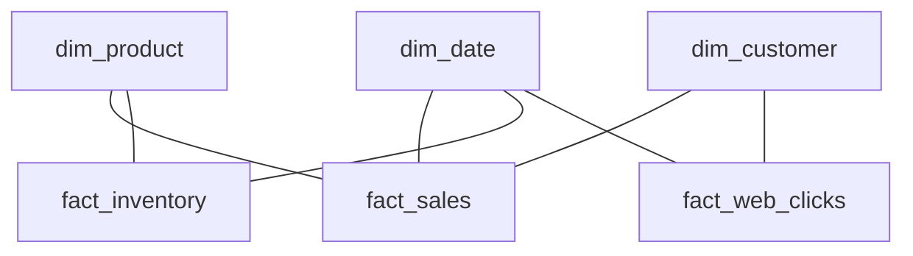

# Star Schema — Intermediate Concepts

## Conformed Dimensions — Shared Across Fact Tables

A **conformed dimension** is used consistently across multiple fact tables, enabling cross-process analysis.



**What this shows:**
- `dim_date` and `dim_product` are shared across multiple fact tables
- This enables drill-across queries: "Compare sales vs inventory levels by date and product"
- Without conformed dimensions, you can't join results from different fact tables reliably

**Example — Drill-across query:**

```sql
-- "For each product, compare units sold vs units in stock per month"
WITH monthly_sales AS (
    SELECT p.product_key, d.month_name, d.year, SUM(f.quantity) AS units_sold
    FROM fact_sales f
    JOIN dim_date d ON f.date_key = d.date_key
    JOIN dim_product p ON f.product_key = p.product_key
    GROUP BY p.product_key, d.month_name, d.year
),
monthly_inventory AS (
    SELECT p.product_key, d.month_name, d.year, AVG(f.on_hand_qty) AS avg_stock
    FROM fact_inventory f
    JOIN dim_date d ON f.date_key = d.date_key
    JOIN dim_product p ON f.product_key = p.product_key
    GROUP BY p.product_key, d.month_name, d.year
)
SELECT 
    s.product_key, s.month_name, s.year,
    s.units_sold, i.avg_stock,
    s.units_sold / NULLIF(i.avg_stock, 0) AS sell_through_rate
FROM monthly_sales s
JOIN monthly_inventory i 
    ON s.product_key = i.product_key 
    AND s.month_name = i.month_name 
    AND s.year = i.year;
```

> **Key rule:** Conformed dimensions must have the same keys, attributes, and values across all fact tables they connect to. If "dim_product" means different things in sales vs inventory, cross-analysis is impossible.

---

## Role-Playing Dimensions

The **same dimension table** used multiple times in one fact table with different meanings.

**Example:** An order has an `order_date`, a `ship_date`, and a `delivery_date` — all referencing `dim_date`.

```sql
CREATE TABLE fact_orders (
    order_key       BIGINT PRIMARY KEY,
    order_date_key  INT REFERENCES dim_date(date_key),   -- When ordered
    ship_date_key   INT REFERENCES dim_date(date_key),   -- When shipped
    delivery_date_key INT REFERENCES dim_date(date_key), -- When delivered
    customer_key    INT REFERENCES dim_customer(customer_key),
    amount          DECIMAL(10,2)
);
```

**Querying with role-playing dimensions:**

```sql
SELECT 
    od.full_date AS order_date,
    sd.full_date AS ship_date,
    dd.full_date AS delivery_date,
    dd.full_date - sd.full_date AS shipping_days
FROM fact_orders f
JOIN dim_date od ON f.order_date_key = od.date_key   -- Alias 1
JOIN dim_date sd ON f.ship_date_key = sd.date_key    -- Alias 2
JOIN dim_date dd ON f.delivery_date_key = dd.date_key -- Alias 3;
```

> **Implementation:** Either create views (`dim_order_date`, `dim_ship_date`) pointing to the same physical table, or simply use table aliases in queries.

---

## Degenerate Dimensions

A **degenerate dimension** is a dimension key stored in the fact table that has **no corresponding dimension table** — because the key itself IS the useful information.

**Examples:**
- `invoice_number` — no need for a separate dim_invoice (the number is all you need)
- `order_id` — identifies the transaction group but has no additional attributes
- `receipt_number` — used for grouping line items

```sql
CREATE TABLE fact_order_lines (
    line_key        BIGINT PRIMARY KEY,
    order_number    VARCHAR(20),  -- Degenerate dimension (no dim_order table)
    date_key        INT,
    product_key     INT,
    quantity        INT,
    amount          DECIMAL(10,2)
);

-- Group line items by their parent order
SELECT order_number, SUM(amount) AS order_total, COUNT(*) AS line_count
FROM fact_order_lines
GROUP BY order_number;
```

> **When to use:** The dimension has no descriptive attributes worth storing separately. It's just a grouping identifier. Creating a separate table would add a useless join.

---

## Junk Dimensions

A **junk dimension** combines multiple low-cardinality flags/indicators into a single dimension to avoid cluttering the fact table.

**Problem: Too many flag columns in the fact table**

```sql
-- BAD: Fact table polluted with flags
CREATE TABLE fact_sales (
    ...,
    is_online       BOOLEAN,   -- 2 values
    is_promotion    BOOLEAN,   -- 2 values
    payment_type    VARCHAR(10), -- 4 values (cash, credit, debit, mobile)
    gift_wrapped    BOOLEAN,   -- 2 values
    -- 2 × 2 × 4 × 2 = 32 possible combinations
);
```

**Solution: Combine into a junk dimension**

```sql
-- dim_transaction_type (junk dimension — 32 rows max)
CREATE TABLE dim_transaction_type (
    txn_type_key    INT PRIMARY KEY,
    is_online       BOOLEAN,
    is_promotion    BOOLEAN,
    payment_type    VARCHAR(10),
    gift_wrapped    BOOLEAN
);

-- Fact table: single FK instead of 4 columns
CREATE TABLE fact_sales (
    ...,
    txn_type_key    INT REFERENCES dim_transaction_type(txn_type_key),
    quantity        INT,
    amount          DECIMAL(10,2)
);
```

**Benefits:**
- Fact table stays narrow (1 key instead of 4 columns)
- All combinations pre-populated (32 rows — tiny table)
- Clean grouping: "Sales by payment type" uses dimension join

---

## Bridge Tables — Many-to-Many Relationships

When a fact has a **many-to-many relationship** with a dimension (one patient has multiple diagnoses, one student takes multiple courses), use a bridge table.


**What this shows:**
- A patient visit can have multiple diagnoses
- The bridge table resolves the many-to-many between fact and dimension
- Each row in the bridge links one visit to one diagnosis with a weighting factor

```sql
CREATE TABLE bridge_diagnosis (
    visit_key       BIGINT,     -- FK to fact
    diagnosis_key   INT,        -- FK to dim_diagnosis
    weight_factor   DECIMAL(5,4) -- Fractional allocation (e.g., 0.5 for 2 diagnoses)
);

-- Query: Total cost by diagnosis (weighted to avoid double-counting)
SELECT 
    d.diagnosis_name,
    SUM(f.visit_cost * br.weight_factor) AS attributed_cost
FROM fact_patient_visit f
JOIN bridge_diagnosis br ON f.visit_key = br.visit_key
JOIN dim_diagnosis d ON br.diagnosis_key = d.diagnosis_key
GROUP BY d.diagnosis_name;
```

> **The weight_factor:** If a visit has 3 diagnoses, each gets weight_factor = 0.333. This prevents double/triple-counting when summing across the bridge.

---

## Handling NULLs in Dimensions

**Problem:** Fact rows sometimes have no valid dimension match (unknown customer, missing product).

**Solution:** Create explicit "Unknown" rows in each dimension.

```sql
-- Insert an "Unknown" row with key = -1 (or 0)
INSERT INTO dim_customer (customer_key, customer_id, first_name, segment)
VALUES (-1, 'UNKNOWN', 'Unknown', 'Unknown');

-- In ETL: replace NULL FKs with the unknown key
INSERT INTO fact_sales (date_key, product_key, customer_key, amount)
VALUES (20240115, 501, COALESCE(looked_up_key, -1), 149.00);
```

**Benefits:**
- Every fact row joins successfully (no NULL FKs causing orphaned rows)
- Reports correctly show "Unknown" category instead of silently dropping data
- INNER JOINs work without losing rows

---

## Additive vs Semi-Additive vs Non-Additive Measures

| Type | Can SUM across... | Example | Trap |
|------|------------------|---------|------|
| **Additive** | All dimensions | Revenue, quantity, cost | None — always safe to SUM |
| **Semi-additive** | Some dimensions (not time) | Account balance, inventory level | Can't SUM daily balances to get monthly — use AVG or snapshot |
| **Non-additive** | No dimensions | Ratios, percentages, unit prices | Must recompute from components, never SUM directly |

**Example of the trap:**

```sql
-- WRONG: Summing a semi-additive measure across time
SELECT SUM(account_balance) FROM fact_daily_balance WHERE month = 'January';
-- This sums 31 daily snapshots — meaningless!

-- CORRECT: Use the last day's value or average
SELECT AVG(account_balance) FROM fact_daily_balance WHERE month = 'January';
-- Or: SELECT account_balance WHERE date = last_day_of_month;
```

---

## Interview Tips

> **Tip 1:** "What's the first thing you decide when designing a star schema?" — "The grain. I explicitly state what one row represents before choosing dimensions or measures. Everything flows from the grain."

> **Tip 2:** "How do you handle many-to-many relationships?" — "Bridge tables with a weight factor to prevent double-counting. For example, if an order has 3 categories, each gets weight 0.333 so SUM(amount * weight) equals the true total."

> **Tip 3:** "Why use surrogate keys instead of natural keys?" — "Three reasons: (1) source system keys can change, (2) integers are faster to join than strings, (3) SCD Type 2 requires multiple dimension rows for the same natural key."
