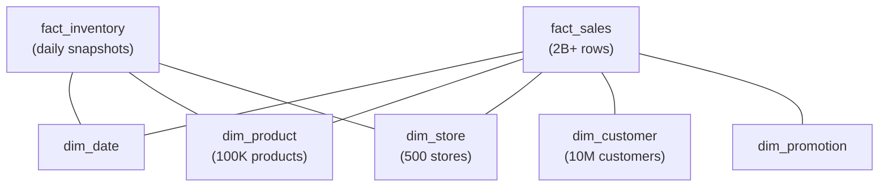

# Star Schema — Real-World Production Examples

## Case Study 1: E-Commerce Analytics Warehouse

**Business requirement:** Track sales, inventory, customer behavior, and marketing effectiveness across 500+ stores and online channel.

### Schema Design



**What this shows:**
- Two fact tables sharing conformed dimensions (dim_date, dim_product, dim_store)
- fact_sales at transaction grain (2B+ rows, growing daily)
- fact_inventory as periodic snapshot (one row per product per store per day)
- Conformed dimensions enable cross-fact analysis (sales vs inventory)

### ETL Pipeline

```sql
-- Daily incremental load pattern
-- Step 1: Load new dimension records (SCD Type 2 for customer)
MERGE INTO dim_customer t
USING staging_customers s ON t.customer_id = s.customer_id AND t.is_current = TRUE
WHEN MATCHED AND (t.segment != s.segment OR t.city != s.city) THEN
    UPDATE SET is_current = FALSE, effective_to = CURRENT_DATE - 1
WHEN NOT MATCHED THEN
    INSERT (customer_key, customer_id, first_name, last_name, segment, city,
            effective_from, effective_to, is_current)
    VALUES (next_surrogate_key(), s.customer_id, s.first_name, s.last_name, 
            s.segment, s.city, CURRENT_DATE, '9999-12-31', TRUE);

-- Insert new version rows for changed customers
INSERT INTO dim_customer
SELECT next_surrogate_key(), customer_id, first_name, last_name, segment, city,
       CURRENT_DATE, '9999-12-31', TRUE
FROM staging_customers s
WHERE EXISTS (
    SELECT 1 FROM dim_customer t 
    WHERE t.customer_id = s.customer_id AND t.is_current = FALSE
    AND t.effective_to = CURRENT_DATE - 1  -- Just closed today
);

-- Step 2: Load facts with dimension lookups
INSERT INTO fact_sales
SELECT 
    NEXT_KEY() AS sale_key,
    dd.date_key,
    dp.product_key,
    ds.store_key,
    dc.customer_key,
    s.quantity,
    s.unit_price,
    s.discount,
    s.quantity * s.unit_price - s.discount AS net_amount
FROM staging_sales s
JOIN dim_date dd ON s.sale_date = dd.full_date
JOIN dim_product dp ON s.product_id = dp.product_id AND dp.is_current = TRUE
JOIN dim_store ds ON s.store_id = ds.store_id
JOIN dim_customer dc ON s.customer_id = dc.customer_id AND dc.is_current = TRUE
    AND s.sale_date BETWEEN dc.effective_from AND dc.effective_to;
```

### Common Queries

```sql
-- Query 1: Year-over-year growth by category
WITH current_year AS (
    SELECT p.category, SUM(f.net_amount) AS revenue
    FROM fact_sales f
    JOIN dim_date d ON f.date_key = d.date_key
    JOIN dim_product p ON f.product_key = p.product_key
    WHERE d.year = 2024
    GROUP BY p.category
),
prior_year AS (
    SELECT p.category, SUM(f.net_amount) AS revenue
    FROM fact_sales f
    JOIN dim_date d ON f.date_key = d.date_key
    JOIN dim_product p ON f.product_key = p.product_key
    WHERE d.year = 2023
    GROUP BY p.category
)
SELECT 
    cy.category,
    cy.revenue AS revenue_2024,
    py.revenue AS revenue_2023,
    ROUND((cy.revenue - py.revenue) / py.revenue * 100, 1) AS yoy_growth_pct
FROM current_year cy
JOIN prior_year py ON cy.category = py.category
ORDER BY yoy_growth_pct DESC;
```

---

## Case Study 2: Healthcare Claims Warehouse

**Challenges:** Many-to-many relationships (patient ↔ diagnoses), strict compliance (audit trails), complex hierarchies (procedure codes).

### Schema with Bridge Tables

```sql
-- Fact: one row per claim line
CREATE TABLE fact_claims (
    claim_line_key  BIGINT PRIMARY KEY,
    claim_id        VARCHAR(20),        -- Degenerate dimension
    service_date_key INT,
    patient_key     INT,
    provider_key    INT,
    procedure_key   INT,
    -- Measures
    billed_amount   DECIMAL(12,2),
    allowed_amount  DECIMAL(12,2),
    paid_amount     DECIMAL(12,2),
    patient_responsibility DECIMAL(12,2)
);

-- Bridge: patient can have multiple diagnoses per claim
CREATE TABLE bridge_claim_diagnosis (
    claim_line_key  BIGINT,
    diagnosis_key   INT,
    diagnosis_rank  INT,            -- Primary = 1, Secondary = 2, etc.
    weight_factor   DECIMAL(5,4)    -- For cost allocation
);

-- Dimension: diagnosis codes (ICD-10)
CREATE TABLE dim_diagnosis (
    diagnosis_key   INT PRIMARY KEY,
    icd10_code      VARCHAR(10),
    description     VARCHAR(200),
    category        VARCHAR(100),
    body_system     VARCHAR(50)
);
```

**Querying with bridge table (handling many-to-many):**

```sql
-- Total paid amount by diagnosis category (weighted)
SELECT 
    diag.category,
    COUNT(DISTINCT f.claim_id) AS claim_count,
    SUM(f.paid_amount * br.weight_factor) AS attributed_paid
FROM fact_claims f
JOIN bridge_claim_diagnosis br ON f.claim_line_key = br.claim_line_key
JOIN dim_diagnosis diag ON br.diagnosis_key = diag.diagnosis_key
WHERE br.diagnosis_rank = 1  -- Primary diagnosis only
GROUP BY diag.category
ORDER BY attributed_paid DESC;
```

---

## Case Study 3: SaaS Product Analytics

**Grain decision:** "One row per user per feature per day" (periodic snapshot approach for engagement tracking).

```sql
CREATE TABLE fact_feature_usage (
    usage_key       BIGINT PRIMARY KEY,
    date_key        INT,
    user_key        INT,
    feature_key     INT,
    plan_key        INT,            -- Which subscription plan
    -- Measures
    session_count   INT,
    total_duration_sec INT,
    action_count    INT,
    error_count     INT
);

CREATE TABLE dim_feature (
    feature_key     INT PRIMARY KEY,
    feature_name    VARCHAR(100),
    module          VARCHAR(50),     -- "Reporting", "Admin", "Analytics"
    release_date    DATE,
    is_premium      BOOLEAN
);

CREATE TABLE dim_plan (
    plan_key        INT PRIMARY KEY,
    plan_name       VARCHAR(50),     -- "Free", "Pro", "Enterprise"
    monthly_price   DECIMAL(8,2),
    max_users       INT,
    features_included TEXT[]         -- Array of feature names
);
```

**Business query: Feature adoption by plan**

```sql
-- Which premium features do Free-tier users try (and maybe convert for)?
SELECT 
    feat.feature_name,
    plan.plan_name,
    COUNT(DISTINCT f.user_key) AS unique_users,
    SUM(f.action_count) AS total_actions,
    AVG(f.total_duration_sec) / 60.0 AS avg_minutes_per_session
FROM fact_feature_usage f
JOIN dim_feature feat ON f.feature_key = feat.feature_key
JOIN dim_plan plan ON f.plan_key = plan.plan_key
WHERE feat.is_premium = TRUE
  AND plan.plan_name = 'Free'     -- Free users trying premium features
GROUP BY feat.feature_name, plan.plan_name
HAVING COUNT(DISTINCT f.user_key) > 100
ORDER BY unique_users DESC;
```

---

## Production Data Quality Checks

```sql
-- Check 1: Orphaned fact rows (FK doesn't match any dimension)
SELECT 'Missing product' AS issue, COUNT(*) AS row_count
FROM fact_sales f
LEFT JOIN dim_product p ON f.product_key = p.product_key
WHERE p.product_key IS NULL

UNION ALL

SELECT 'Missing customer', COUNT(*)
FROM fact_sales f
LEFT JOIN dim_customer c ON f.customer_key = c.customer_key
WHERE c.customer_key IS NULL

UNION ALL

-- Check 2: Measure validation (negative amounts, extreme outliers)
SELECT 'Negative net_amount', COUNT(*)
FROM fact_sales WHERE net_amount < 0

UNION ALL

-- Check 3: Dimension completeness (NULLs in critical attributes)
SELECT 'Product with NULL category', COUNT(*)
FROM dim_product WHERE category IS NULL AND is_current = TRUE;
```

---

## Dimensional Modeling Process (Step-by-Step)

When designing a new star schema from scratch:

| Step | Action | Example |
|------|--------|---------|
| 1 | Identify the business process | "Sales transactions" |
| 2 | Declare the grain | "One row per product per transaction" |
| 3 | Choose dimensions | date, product, store, customer, promotion |
| 4 | Identify measures | quantity, unit_price, discount, net_amount |
| 5 | Determine dimension type | SCD Type 1 for store, Type 2 for customer |
| 6 | Handle special cases | Bridge for many-to-many, junk for flags |
| 7 | Physical design | Partition key, sort key, distribution |
| 8 | Design ETL load order | Dimensions first, then facts |

> **Rule:** Never combine steps. If you can't clearly state the grain in one sentence, the design isn't ready. Go back and clarify.

---

## Interview Tips

> **Tip 1:** "Walk me through designing a star schema" — Follow the 8 steps above. Start with: "First, I identify the business process and declare the grain. For a ride-sharing app, the grain might be 'one row per completed trip.' The measures would be trip_distance, fare_amount, tip_amount. Dimensions would be date, rider, driver, pickup_location, dropoff_location."

> **Tip 2:** "How do you handle real-time updates to a star schema?" — "Star schemas are batch-loaded by design. For near-real-time, I'd use micro-batch ETL (every 5-15 minutes) or streaming into a staging area with periodic MERGE into the dimensional model. Delta Lake or Snowflake Streams + Tasks enable this pattern."

> **Tip 3:** "What's the biggest challenge in maintaining a star schema?" — "Dimension changes (SCDs) and late-arriving data. SCD Type 2 is complex ETL — you need to close existing rows and insert new versions while maintaining referential integrity. Late-arriving facts need the inferred member pattern so you don't lose data."
