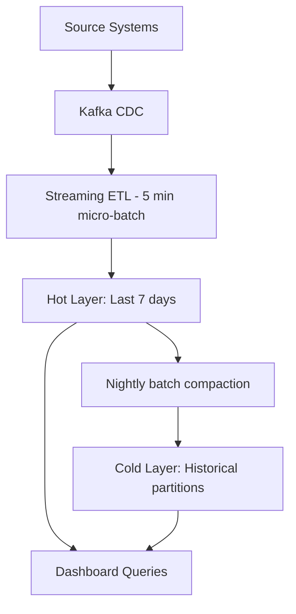

# Scenario Questions — Star Schema

<article data-difficulty="junior">

## 🟢 Junior: Identify Facts and Dimensions

**Scenario:** You're building a data warehouse for a university. The business tracks: course enrollments, student grades, instructor ratings, and classroom utilization. For the "student grades" process, identify: the grain, the fact table measures, and the dimension tables.

<details>
<summary>✅ Solution</summary>

**Grain:** "One row per student per course per semester (one grade record)"

**Fact table: `fact_student_grades`**

| Column | Type | Role |
|--------|------|------|
| grade_key | BIGINT | Surrogate PK |
| date_key | INT | FK → dim_date (grade submission date) |
| student_key | INT | FK → dim_student |
| course_key | INT | FK → dim_course |
| instructor_key | INT | FK → dim_instructor |
| semester_key | INT | FK → dim_semester |
| grade_points | DECIMAL | Measure (4.0 scale) |
| credits | INT | Measure (credit hours) |
| is_passing | BOOLEAN | Degenerate indicator |

**Dimension tables:**
- **dim_student** (student_id, name, major, enrollment_year, gpa_cumulative)
- **dim_course** (course_id, course_name, department, level, credits)
- **dim_instructor** (instructor_id, name, department, tenure_status)
- **dim_semester** (semester_key, semester_name, year, start_date, end_date)
- **dim_date** (date_key, full_date, day_name, month, year)

**Sample query:** "Average GPA by department, broken down by semester"
```sql
SELECT sem.semester_name, c.department, AVG(f.grade_points) AS avg_gpa
FROM fact_student_grades f
JOIN dim_semester sem ON f.semester_key = sem.semester_key
JOIN dim_course c ON f.course_key = c.course_key
GROUP BY sem.semester_name, c.department
ORDER BY sem.year, avg_gpa DESC;
```

</details>

</article>

<article data-difficulty="junior">

## 🟢 Junior: Why Surrogate Keys?

**Scenario:** Your colleague proposes using `product_id` (the natural key from the source system) directly in the fact table instead of creating a surrogate `product_key`. Give three reasons why this is problematic.

<details>
<summary>✅ Solution</summary>

**Three problems with natural keys in fact tables:**

1. **Source system key changes:** If the ERP system is replaced or upgraded, product IDs may change format (e.g., from "P-100" to "PRD000100"). With surrogate keys, only the dimension ETL needs updating — the fact table is unaffected.

2. **SCD Type 2 requires multiple rows:** If a product's category changes and you need history (Type 2), you need two dimension rows with the same `product_id` but different attributes. A surrogate key uniquely identifies each version. With natural keys, the fact FK is ambiguous.

3. **Performance:** String-based natural keys ("SKU-A100-XL-BLUE") are larger and slower to join than integer surrogate keys. At billions of fact rows, this difference in JOIN performance is significant.

**Additional reasons:**
- NULL handling: natural keys from sources may contain NULLs or empty strings
- Multi-source integration: two source systems may use overlapping key spaces ("product 100" exists in both)
- Warehouse independence: surrogate keys decouple the warehouse from source system decisions

</details>

</article>

<article data-difficulty="mid-level">

## 🟡 Mid-Level: Design a Star Schema for Ride-Sharing

**Scenario:** Design a star schema for a ride-sharing company (like Uber). They want to analyze: trip revenue, driver performance, surge pricing effectiveness, and rider retention. Define the grain, fact table, and dimensions.

<details>
<summary>💡 Hint</summary>

Start with the grain: what event does one row represent? Then identify what you measure (money, time, distance) and what context you need (who, where, when, what type).

</details>

<details>
<summary>✅ Solution</summary>

**Grain:** "One row per completed trip"

**Fact table: `fact_trips`**

```sql
CREATE TABLE fact_trips (
    trip_key            BIGINT PRIMARY KEY,
    -- Dimension FKs
    request_date_key    INT,         -- When ride was requested
    completion_date_key INT,         -- When ride ended (role-playing dim_date)
    rider_key           INT,
    driver_key          INT,
    pickup_location_key INT,         -- FK → dim_location
    dropoff_location_key INT,        -- Role-playing dim_location
    vehicle_type_key    INT,         -- FK → dim_vehicle_type
    promo_key           INT,         -- FK → dim_promotion (NULL = no promo)
    -- Measures
    trip_distance_miles DECIMAL(8,2),
    trip_duration_min   DECIMAL(8,2),
    wait_time_min       DECIMAL(8,2),
    base_fare           DECIMAL(10,2),
    surge_multiplier    DECIMAL(4,2),
    surge_amount        DECIMAL(10,2),
    tip_amount          DECIMAL(10,2),
    total_fare          DECIMAL(10,2),
    driver_payout       DECIMAL(10,2),
    platform_fee        DECIMAL(10,2),
    rating_by_rider     INT,         -- 1-5 (semi-additive: use AVG not SUM)
    rating_by_driver    INT          -- 1-5
);
```

**Dimension tables:**

```sql
-- dim_rider (SCD Type 2 — segment changes over time)
CREATE TABLE dim_rider (
    rider_key       INT PRIMARY KEY,
    rider_id        VARCHAR(20),
    name            VARCHAR(100),
    signup_date     DATE,
    segment         VARCHAR(20),    -- "New", "Active", "Churned", "VIP"
    lifetime_trips  INT,
    effective_from  DATE,
    effective_to    DATE,
    is_current      BOOLEAN
);

-- dim_driver (SCD Type 2 — tier/rating changes)
CREATE TABLE dim_driver (
    driver_key      INT PRIMARY KEY,
    driver_id       VARCHAR(20),
    name            VARCHAR(100),
    vehicle_make    VARCHAR(50),
    vehicle_year    INT,
    tier            VARCHAR(20),    -- "Standard", "Premium", "Luxury"
    avg_rating      DECIMAL(3,2),
    total_trips     INT,
    effective_from  DATE,
    effective_to    DATE,
    is_current      BOOLEAN
);

-- dim_location (conformed — used for both pickup and dropoff)
CREATE TABLE dim_location (
    location_key    INT PRIMARY KEY,
    latitude        DECIMAL(9,6),
    longitude       DECIMAL(9,6),
    neighborhood    VARCHAR(100),
    city            VARCHAR(50),
    zone_type       VARCHAR(20),    -- "Airport", "Downtown", "Suburban", "Highway"
    surge_zone_id   VARCHAR(10)
);

-- dim_vehicle_type (junk-like — few rows)
CREATE TABLE dim_vehicle_type (
    vehicle_type_key INT PRIMARY KEY,
    type_name       VARCHAR(20),    -- "UberX", "UberXL", "Black", "Pool"
    max_passengers  INT,
    base_rate       DECIMAL(6,2),
    per_mile_rate   DECIMAL(6,2),
    per_min_rate    DECIMAL(6,2)
);
```

**Sample queries:**

```sql
-- Driver performance: average rating and earnings per hour
SELECT 
    d.name AS driver_name,
    d.tier,
    COUNT(*) AS trips,
    AVG(f.rating_by_rider) AS avg_rider_rating,
    SUM(f.driver_payout) / NULLIF(SUM(f.trip_duration_min) / 60, 0) AS earnings_per_hour
FROM fact_trips f
JOIN dim_driver d ON f.driver_key = d.driver_key
JOIN dim_date dt ON f.completion_date_key = dt.date_key
WHERE dt.year = 2024 AND dt.month_name = 'January'
GROUP BY d.name, d.tier
ORDER BY earnings_per_hour DESC;

-- Surge pricing effectiveness: does surge reduce wait times?
SELECT 
    CASE 
        WHEN f.surge_multiplier = 1.0 THEN 'No Surge'
        WHEN f.surge_multiplier <= 1.5 THEN 'Low Surge (1.0-1.5x)'
        WHEN f.surge_multiplier <= 2.0 THEN 'Medium Surge (1.5-2.0x)'
        ELSE 'High Surge (2.0x+)'
    END AS surge_band,
    COUNT(*) AS trip_count,
    AVG(f.wait_time_min) AS avg_wait_min,
    AVG(f.total_fare) AS avg_fare
FROM fact_trips f
GROUP BY surge_band
ORDER BY avg_wait_min;
```

</details>

</article>

<article data-difficulty="mid-level">

## 🟡 Mid-Level: Handle a Semi-Additive Measure

**Scenario:** Your warehouse has a `fact_account_balance` table with daily snapshots. A business user writes this query and gets wrong results:

```sql
-- "Total balance across all accounts for January 2024"
SELECT SUM(balance) AS total_balance
FROM fact_account_balance f
JOIN dim_date d ON f.date_key = d.date_key
WHERE d.month_name = 'January' AND d.year = 2024;
```

Explain why this is wrong and provide the correct query.

<details>
<summary>✅ Solution</summary>

**Why it's wrong:** `balance` is a **semi-additive measure** — you can SUM it across accounts (different entities at a point in time) but NOT across dates (different snapshots of the same entity).

The query sums 31 daily snapshots per account. If an account has $10,000 every day in January, this query reports $310,000 instead of $10,000.

**Correct approaches:**

```sql
-- Option 1: Use last day of month only
SELECT SUM(f.balance) AS total_balance_end_of_month
FROM fact_account_balance f
JOIN dim_date d ON f.date_key = d.date_key
WHERE d.full_date = '2024-01-31';  -- Only one snapshot date

-- Option 2: Use average balance across the month
SELECT AVG(daily_total) AS avg_total_balance
FROM (
    SELECT d.full_date, SUM(f.balance) AS daily_total
    FROM fact_account_balance f
    JOIN dim_date d ON f.date_key = d.date_key
    WHERE d.month_name = 'January' AND d.year = 2024
    GROUP BY d.full_date
) daily_totals;

-- Option 3: Last value per account using window function
SELECT SUM(last_balance) AS total_balance_month_end
FROM (
    SELECT DISTINCT account_key,
        LAST_VALUE(balance) OVER (
            PARTITION BY account_key 
            ORDER BY date_key
            ROWS BETWEEN UNBOUNDED PRECEDING AND UNBOUNDED FOLLOWING
        ) AS last_balance
    FROM fact_account_balance f
    JOIN dim_date d ON f.date_key = d.date_key
    WHERE d.month_name = 'January' AND d.year = 2024
) latest;
```

**Rule for semi-additive measures:** Always aggregate across non-time dimensions first (SUM across accounts for one day), then handle time separately (use last value, average, or specific point-in-time).

</details>

</article>

<article data-difficulty="senior">

## 🔴 Senior: Design for Both Real-Time and Historical Analytics

**Scenario:** Your company needs a data warehouse that supports:
- Executive dashboards refreshed every 5 minutes
- Historical trend analysis (years of data)
- Cost-efficient storage (data grows 500GB/day)

Design the architecture including how the star schema handles both freshness and history requirements.

<details>
<summary>✅ Solution</summary>

**Architecture: Hot/Cold Tiered Star Schema**



**What this shows:**
- Streaming micro-batch loads new facts every 5 minutes (hot layer)
- Nightly batch compacts, deduplicates, and moves data to optimized cold storage
- Queries read from both layers (UNION ALL or partition-transparent views)

**Implementation:**

```sql
-- Hot table: Recent data (append-heavy, small partitions)
CREATE TABLE fact_sales_hot (
    sale_key        BIGINT,
    date_key        INT,
    product_key     INT,
    store_key       INT,
    customer_key    INT,
    quantity        INT,
    net_amount      DECIMAL(10,2),
    loaded_at       TIMESTAMP      -- For dedup and compaction
)
PARTITION BY RANGE (date_key);     -- Daily partitions

-- Cold table: Historical data (compacted, optimized)
CREATE TABLE fact_sales_cold (
    sale_key        BIGINT,
    date_key        INT,
    product_key     INT,
    store_key       INT,
    customer_key    INT,
    quantity        INT,
    net_amount      DECIMAL(10,2)
)
PARTITION BY RANGE (date_key);     -- Monthly partitions, compressed

-- Unified view for queries (transparent to users)
CREATE VIEW fact_sales AS
SELECT sale_key, date_key, product_key, store_key, customer_key, quantity, net_amount
FROM fact_sales_hot
WHERE date_key >= current_date_key() - 7
UNION ALL
SELECT sale_key, date_key, product_key, store_key, customer_key, quantity, net_amount
FROM fact_sales_cold
WHERE date_key < current_date_key() - 7;
```

**Nightly compaction job:**

```sql
-- Move yesterday's data from hot to cold (deduplicated and optimized)
INSERT INTO fact_sales_cold
SELECT DISTINCT ON (sale_key) *   -- Dedup in case of micro-batch duplicates
FROM fact_sales_hot
WHERE date_key = yesterday_key()
ORDER BY sale_key, loaded_at DESC; -- Keep latest version

-- Drop the hot partition for yesterday
ALTER TABLE fact_sales_hot DROP PARTITION FOR (yesterday_key());
```

**Cost optimization:**
- Hot layer: SSD storage, low compression (fast writes) — 7 days × 500GB = 3.5TB
- Cold layer: HDD/S3, high compression (Zstd) — years of data at ~60% compression
- Aggregate tables: Pre-compute daily/weekly summaries for dashboard queries

**Dimension handling:**
- Dimensions loaded in real-time with the hot-path (SCD Type 1 for most, Type 2 for customer/product)
- Inferred members for late-arriving dimension data (enriched in nightly batch)

</details>

</article>

<article data-difficulty="senior">

## 🔴 Senior: Refactor a Denormalized Flat Table into Star Schema

**Scenario:** The analytics team has been querying a single denormalized table with 200 columns and 5B rows. Queries are slow, storage is 40TB, and it's unmaintainable. Refactor into a proper star schema without breaking existing dashboards.

<details>
<summary>✅ Solution</summary>

**Migration strategy (zero-downtime):**

**Phase 1: Analysis (1 week)**
```sql
-- Profile the existing table to identify measures vs dimensions
-- Measures: columns used in SUM, AVG, COUNT
-- Dimensions: columns used in GROUP BY, WHERE, labels

-- Find the grain
SELECT COUNT(*), COUNT(DISTINCT transaction_id) FROM flat_table;
-- If counts match: grain = one row per transaction

-- Profile cardinality of dimension candidates
SELECT 'product_name', COUNT(DISTINCT product_name) FROM flat_table
UNION ALL
SELECT 'customer_segment', COUNT(DISTINCT customer_segment) FROM flat_table
UNION ALL
SELECT 'region', COUNT(DISTINCT region) FROM flat_table;
```

**Phase 2: Build star schema alongside flat table**
```sql
-- Extract dimensions from the flat table
CREATE TABLE dim_product AS
SELECT DISTINCT
    ROW_NUMBER() OVER (ORDER BY product_id) AS product_key,
    product_id, product_name, category, subcategory, brand
FROM flat_table;

CREATE TABLE dim_customer AS
SELECT DISTINCT
    ROW_NUMBER() OVER (ORDER BY customer_id) AS customer_key,
    customer_id, customer_name, segment, city, country
FROM flat_table;

-- Build fact table with lookups
CREATE TABLE fact_sales AS
SELECT 
    ROW_NUMBER() OVER (ORDER BY transaction_id) AS sale_key,
    dd.date_key,
    dp.product_key,
    dc.customer_key,
    ft.quantity,
    ft.amount,
    ft.discount
FROM flat_table ft
JOIN dim_date dd ON ft.sale_date = dd.full_date
JOIN dim_product dp ON ft.product_id = dp.product_id
JOIN dim_customer dc ON ft.customer_id = dc.customer_id;
```

**Phase 3: Create compatibility view (non-breaking)**
```sql
-- Existing dashboards query flat_table → redirect to star schema via view
CREATE VIEW flat_table_compat AS
SELECT 
    f.sale_key AS transaction_id,
    d.full_date AS sale_date,
    p.product_id, p.product_name, p.category, p.subcategory, p.brand,
    c.customer_id, c.customer_name, c.segment, c.city, c.country,
    f.quantity, f.amount, f.discount
FROM fact_sales f
JOIN dim_date d ON f.date_key = d.date_key
JOIN dim_product p ON f.product_key = p.product_key
JOIN dim_customer c ON f.customer_key = c.customer_key;
```

**Phase 4: Validate and switch**
- Run queries against both old table and compatibility view
- Compare row counts and aggregated results
- Gradually migrate dashboards to use star schema directly
- Drop flat table after all consumers migrated

**Storage savings:**
- Flat table: 200 columns × 5B rows = 40TB
- Star schema: narrow fact (10 cols × 5B rows = ~5TB) + dimensions (small) = ~6TB total
- **~85% storage reduction** + much faster queries

</details>

</article>
