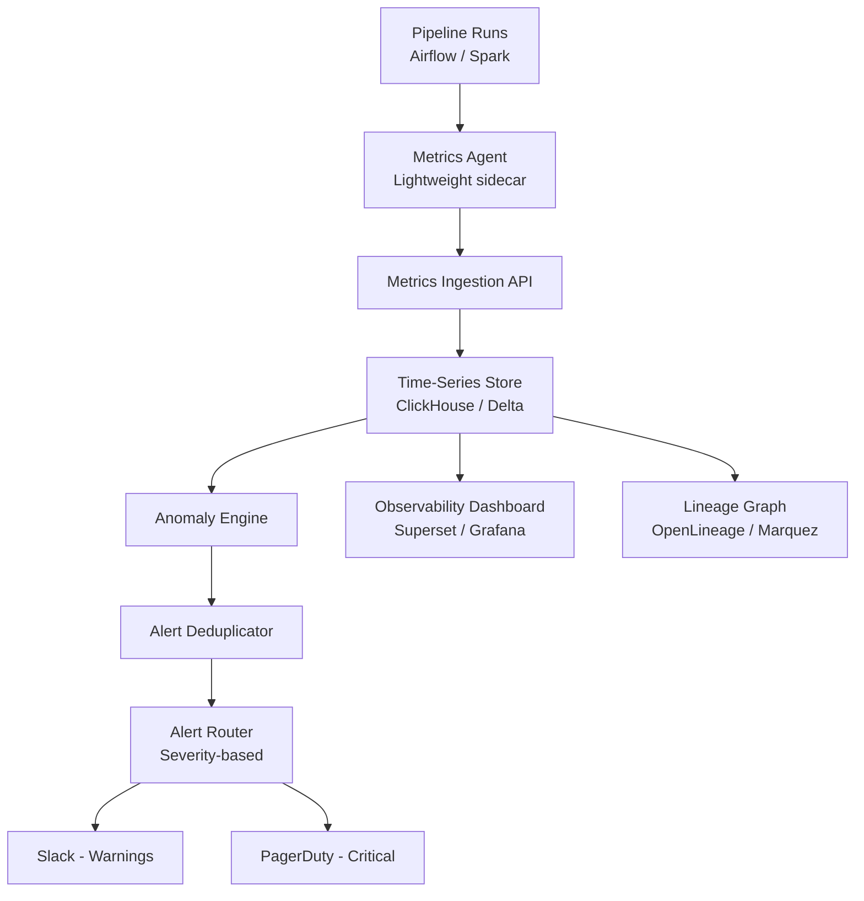

# Anomaly Detection — Interview Scenarios


<article data-difficulty="junior">

## 🟢 Junior: Row Count Drop

**Scenario:** Your daily orders pipeline suddenly processes only 1,000 rows instead of the usual 50,000. How do you detect and respond?

<details>
<summary>💡 Hint</summary>

**Response steps:** 1. Alert the data team immediately 2. Check if the source system is down (check monitoring dashboards) 3. Check if there was a pipeline change deployed today 4. Check if a date filter was accidentally applied (e.g., wrong partition) 5. Do NOT use the partial data for downstream...

</details>

<details>
<summary>✅ Solution</summary>

```python
import numpy as np

def check_row_count(current: int, historical: list[int], threshold: float = 3.0) -> dict:
    mean = np.mean(historical)
    std = np.std(historical)
    z = abs(current - mean) / max(std, 1)
    
    return {
        "anomaly": z > threshold,
        "current": current,
        "mean": mean,
        "z_score": round(z, 2),
        "pct_of_normal": round(current / mean * 100, 1),
    }

historical = [48000, 51000, 49500, 52000, 50500, 48500, 51500]
result = check_row_count(1000, historical)
# {'anomaly': True, 'current': 1000, 'mean': 50142.86, 'z_score': 17.7, 'pct_of_normal': 2.0}
```

**Response steps:**
1. Alert the data team immediately
2. Check if the source system is down (check monitoring dashboards)
3. Check if there was a pipeline change deployed today
4. Check if a date filter was accidentally applied (e.g., wrong partition)
5. Do NOT use the partial data for downstream reporting
6. If source is healthy but data is missing → check ingestion logs, rerun
7. If source is down → wait, then backfill when restored

</details>

</article>

<article data-difficulty="mid-level">

## 🟡 Mid-Level: Revenue Distribution Shift

**Scenario:** Mean revenue per order dropped from $85 to $42 overnight. The row count is normal. How do you investigate?

<details>
<summary>💡 Hint</summary>

The row count is normal — so it's not a missing data problem. Think about *distributional* shifts: what could halve the mean without changing the count? Work through the likely causes in order: a new product category, a currency/unit change, a refund/reversal spike, or a data type/rounding issue. Use percentile comparisons and group-by breakdowns to isolate which segment drove the drop.

</details>

<details>
<summary>✅ Solution</summary>

**Investigation:**
```python
# Step 1: Check distribution shift, not just mean
import pandas as pd

today = pd.read_parquet("orders_today.parquet")
yesterday = pd.read_parquet("orders_yesterday.parquet")

# Percentile comparison
for p in [25, 50, 75, 90, 99]:
    t = today["amount"].quantile(p/100)
    y = yesterday["amount"].quantile(p/100)
    print(f"P{p}: Today={t:.2f}, Yesterday={y:.2f}, Change={t-y:+.2f}")

# Step 2: Check by segment
print(today.groupby("product_category")["amount"].mean())
print(yesterday.groupby("product_category")["amount"].mean())

# Step 3: Check for a new record type
print(today["order_type"].value_counts())
print(yesterday["order_type"].value_counts())
```

**Likely root causes:**
1. **New product category with lower prices** added to pipeline
2. **Currency conversion bug** — foreign currency orders not converted to USD
3. **Discount applied incorrectly** — discount_amount being subtracted wrong
4. **Partial data** — high-value orders from one region not yet ingested
5. **Schema change** — `amount` now stores cents instead of dollars

**Resolution:** Add distribution-aware anomaly detection (not just mean), segment metrics by region/category, and add currency validation.

</details>

</article>

<article data-difficulty="senior">

## 🔴 Senior: Building a Data Observability System

**Scenario:** You're building a data observability system from scratch. Describe the architecture and key decisions.

<details>
<summary>💡 Hint</summary>

Think in layers: collection (metadata, row counts, distributions at each pipeline stage), detection (statistical baselines, ML-based anomalies, rule-based thresholds), alerting (tiered by severity, routed to owners), and a lineage layer that lets you trace *which upstream table* caused the anomaly. Distinguish between infrastructure observability (pipeline health) and data observability (content quality). Decide early whether to build on open standards (OpenLineage, Great Expectations) or build custom — and what the incremental path looks like.

</details>

<details>
<summary>✅ Solution</summary>

**Architecture:**



**Key design decisions:**

1. **What to collect automatically (no config):** Row count, null rates per column, schema fingerprint, max timestamp, run duration. These apply to every table.

2. **What requires explicit config:** Business metric ranges (revenue bounds), cross-table consistency checks, custom anomaly models.

3. **Metrics store:** ClickHouse for sub-second query on billions of metric rows. Alternative: Delta Lake with Spark queries (slower, but unified with pipeline storage).

4. **Alert deduplication:** Don't alert on the same anomaly twice within 24 hours. Group related anomalies (downstream tables affected by one upstream issue) into one incident.

5. **Lineage integration:** When anomaly detected in `silver.orders`, automatically query lineage graph to find downstream `gold.revenue` and `gold.customer_metrics` — include impact in the alert.

6. **Cost control:** Run lightweight volume/freshness checks on every batch. Run expensive ML-based distribution checks only daily or on configured tables.

7. **Progressive rollout:** Start advisory mode (log everything, alert nothing) for 30 days. Tune thresholds. Enable warnings. Enable critical alerts only for the most important tables.

</details>

</article>