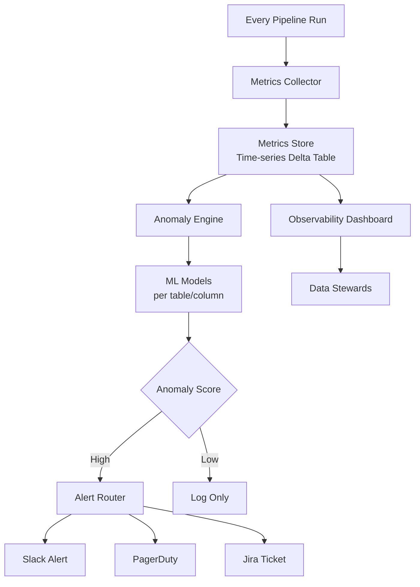

# Anomaly Detection — Senior Deep Dive

## Data Observability — Beyond Point Checks

Senior engineers distinguish between **validation** (did this batch pass?) and **observability** (can we see the health of data across its lifecycle?).

The five pillars of data observability (Monte Carlo's model):
1. **Freshness** — Is data up to date?
2. **Volume** — Is data at expected scale?
3. **Schema** — Did the structure change?
4. **Distribution** — Are values in expected ranges?
5. **Lineage** — Where did data come from, what does it affect?

---

## Production Anomaly Detection Architecture



---

## Per-Column Model Selection

Different columns need different anomaly models:

```python
from enum import Enum
import numpy as np
import pandas as pd
from scipy import stats
from sklearn.ensemble import IsolationForest

class ColumnType(Enum):
    NUMERIC_CONTINUOUS = "numeric_continuous"    # revenue, price
    NUMERIC_COUNT = "numeric_count"              # row count, event count
    CATEGORICAL = "categorical"                   # status, country
    TIMESTAMP = "timestamp"                       # created_at, event_time
    TEXT = "text"                                 # description, name

class AnomalyModelSelector:
    """Select and run the appropriate anomaly model per column type."""
    
    def detect(
        self,
        historical: pd.Series,
        current_value: float,
        col_type: ColumnType,
    ) -> dict:
        if col_type == ColumnType.NUMERIC_CONTINUOUS:
            return self._z_score_detect(historical, current_value)
        elif col_type == ColumnType.NUMERIC_COUNT:
            # Log-transform for count data (right-skewed)
            return self._z_score_detect(np.log1p(historical), np.log1p(current_value), transformed=True)
        elif col_type == ColumnType.CATEGORICAL:
            return self._chi_square_detect(historical, current_value)
        else:
            return self._z_score_detect(historical, current_value)
    
    def _z_score_detect(self, historical, current, z_threshold=3.0, transformed=False) -> dict:
        mean, std = historical.mean(), historical.std()
        if std == 0:
            return {"anomaly": float(current) != float(mean), "method": "z_score", "z_score": 0}
        z = abs(current - mean) / std
        return {
            "anomaly": z > z_threshold,
            "method": "z_score_log" if transformed else "z_score",
            "z_score": round(float(z), 3),
            "mean": round(float(mean), 3),
            "std": round(float(std), 3),
        }
    
    def _chi_square_detect(self, historical_dist: pd.Series, current_dist: pd.Series) -> dict:
        """Detect distribution shift in categorical column."""
        from scipy.stats import chisquare
        
        # Normalize both distributions
        hist_freq = historical_dist.value_counts(normalize=True)
        curr_freq = current_dist.value_counts(normalize=True)
        
        # Align on same categories
        all_cats = hist_freq.index.union(curr_freq.index)
        f_obs = curr_freq.reindex(all_cats, fill_value=0).values
        f_exp = hist_freq.reindex(all_cats, fill_value=0).values
        
        # Avoid division by zero
        f_exp = np.where(f_exp == 0, 1e-10, f_exp)
        f_obs = f_obs * f_exp.sum() / f_obs.sum()
        
        chi2_stat, p_value = chisquare(f_obs, f_exp)
        return {
            "anomaly": p_value < 0.05,
            "method": "chi_square",
            "chi2_statistic": round(float(chi2_stat), 3),
            "p_value": round(float(p_value), 4),
        }
```

---

## Automated Anomaly Threshold Tuning

Initial thresholds are rarely correct. Build auto-tuning based on alert feedback:

```python
class ThresholdTuner:
    """
    Tune anomaly thresholds based on alert acknowledgment feedback.
    If alerts are consistently ignored → threshold too sensitive.
    If real anomalies are missed → threshold too lenient.
    """
    
    def __init__(self, metrics_store):
        self.store = metrics_store
    
    def compute_optimal_threshold(
        self,
        table: str,
        column: str,
        metric: str,
        lookback_days: int = 90,
    ) -> float:
        # Fetch historical alerts and outcomes
        alerts = self.store.get_alerts(table, column, metric, lookback_days)
        
        true_positives = [a for a in alerts if a["outcome"] == "confirmed_issue"]
        false_positives = [a for a in alerts if a["outcome"] == "false_alarm"]
        
        if not alerts:
            return 3.0  # Default
        
        fp_rate = len(false_positives) / len(alerts)
        
        # Too many false positives: raise threshold
        if fp_rate > 0.3:
            current = self.store.get_threshold(table, column, metric)
            new_threshold = min(current * 1.2, 5.0)
            print(f"High FP rate ({fp_rate:.0%}): raising threshold {current:.1f} → {new_threshold:.1f}")
            return new_threshold
        
        # Too few alerts detected real issues: lower threshold
        elif fp_rate < 0.05 and len(true_positives) < 2:
            current = self.store.get_threshold(table, column, metric)
            new_threshold = max(current * 0.9, 2.0)
            print(f"Low detection: lowering threshold {current:.1f} → {new_threshold:.1f}")
            return new_threshold
        
        return self.store.get_threshold(table, column, metric)
```

---

## SQL-Based Anomaly Detection (Warehouse-Native)

For teams that prefer to keep computation in the warehouse:

```sql
-- Detect row count anomalies using SQL window functions
WITH daily_counts AS (
    SELECT
        DATE(created_at) AS batch_date,
        COUNT(*) AS row_count
    FROM orders
    WHERE created_at >= CURRENT_DATE - INTERVAL '60 days'
    GROUP BY 1
),
stats AS (
    SELECT
        batch_date,
        row_count,
        AVG(row_count) OVER (
            ORDER BY batch_date
            ROWS BETWEEN 28 PRECEDING AND 1 PRECEDING
        ) AS rolling_mean,
        STDDEV(row_count) OVER (
            ORDER BY batch_date
            ROWS BETWEEN 28 PRECEDING AND 1 PRECEDING
        ) AS rolling_std
    FROM daily_counts
),
anomalies AS (
    SELECT
        batch_date,
        row_count,
        rolling_mean,
        rolling_std,
        (row_count - rolling_mean) / NULLIF(rolling_std, 0) AS z_score,
        ABS((row_count - rolling_mean) / NULLIF(rolling_std, 0)) > 3.0 AS is_anomaly
    FROM stats
)
SELECT * FROM anomalies
WHERE batch_date = CURRENT_DATE - INTERVAL '1 day'
  AND is_anomaly = TRUE;
```

---

## Interview Tips

> **Tip 1:** "How do you avoid alert fatigue in anomaly detection?" — (1) Tune thresholds per table/column based on historical false positive rates. (2) Group correlated alerts into a single incident. (3) Use severity levels — only critical anomalies page on-call. (4) Implement auto-silence: if same alert fired 5 days in a row, escalate instead of re-alerting.

> **Tip 2:** "What's a data freshness SLA and how do you monitor it?" — A commitment that a table will be updated within N hours/minutes. Monitor by comparing MAX(updated_at) or MAX(created_at) against NOW(). If lag > threshold, alert. Implement in SQL as a scheduled check or in your orchestrator (Airflow SLA miss callbacks).

> **Tip 3:** "Compare ML-based vs rule-based anomaly detection." — Rule-based is deterministic and explainable: "row count dropped 80%." ML-based (Isolation Forest, autoencoders) catches complex multi-dimensional anomalies but is harder to explain and requires training data. Use rules for high-impact, well-understood metrics; ML for exploratory monitoring across hundreds of columns.
