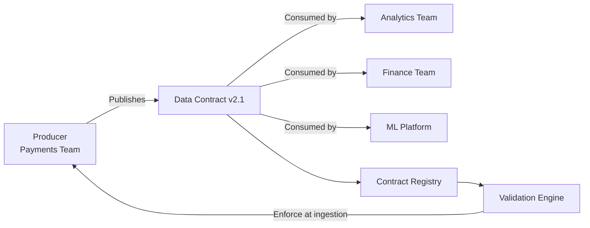

# Data Contracts — Fundamentals

## What Is a Data Contract?

A data contract is a formal, versioned agreement between a **data producer** (the team publishing data) and **data consumers** (teams using that data). It specifies:

- **Schema** — column names, types, nullability
- **Semantics** — what each field means
- **Quality guarantees** — freshness, completeness SLAs
- **Breaking change policy** — how changes are communicated



---

## Why Data Contracts?

**The Problem (without contracts):**
- Producer changes column name from `cust_id` → `customer_id`
- 12 downstream pipelines break silently
- Finance dashboard shows $0 revenue for 3 days
- Root cause takes 8 hours to find

**The Solution (with contracts):**
- Schema change requires a new contract version
- All consumers are notified before the change goes live
- Validation catches schema drift at the producer boundary
- Breaking changes require consumer sign-off

---

## Contract Specification Format

Data contracts are typically defined in YAML:

```yaml
# contracts/payments/v2.1.yaml
id: payments_v2.1
name: Payments Events
version: "2.1"
status: active
owner: payments-engineering@company.com
consumers:
  - analytics-team
  - finance-team
  - ml-platform

schema:
  fields:
    - name: payment_id
      type: string
      required: true
      unique: true
      description: "UUID for this payment transaction"
      
    - name: customer_id
      type: string
      required: true
      description: "FK to customers.customer_id"
      
    - name: amount_usd
      type: decimal(18,2)
      required: true
      description: "Payment amount in USD"
      constraints:
        min: 0.01
        max: 1000000
        
    - name: status
      type: string
      required: true
      description: "Payment status"
      constraints:
        accepted_values: [pending, processing, completed, failed, refunded]
        
    - name: created_at
      type: timestamp
      required: true
      description: "UTC timestamp when payment was initiated"

quality:
  freshness:
    max_age_hours: 1
  completeness:
    min_pct: 99.9
  row_count:
    min_per_hour: 100
    max_per_hour: 1000000

sla:
  availability: "99.9%"
  latency_p99_seconds: 5

changelog:
  - version: "2.1"
    date: "2024-01-15"
    changes: "Added refunded to accepted status values"
    breaking: false
  - version: "2.0"
    date: "2023-11-01"
    changes: "Renamed cust_id to customer_id"
    breaking: true
```

---

## Types of Contract Changes

| Change Type | Breaking? | Process |
|-------------|-----------|---------|
| Add optional column | No | Notify consumers, deploy |
| Add required column | Yes | Negotiate with consumers, versioned rollout |
| Rename column | Yes | Add new column alongside old (parallel run), deprecate old |
| Change data type | Usually yes | Consumer impact analysis first |
| Remove column | Yes | Deprecation notice, grace period (e.g., 90 days) |
| Change accepted values | Depends | Adding = non-breaking, removing = breaking |
| Change SLA | Depends | Loosening = non-breaking, tightening = breaking |

---

## Contract Validation — Python

```python
import yaml
import pandas as pd
from typing import List, Dict, Any

def validate_against_contract(df: pd.DataFrame, contract_path: str) -> List[str]:
    """Validate a DataFrame against a data contract YAML."""
    
    with open(contract_path) as f:
        contract = yaml.safe_load(f)
    
    violations = []
    schema = contract["schema"]["fields"]
    
    # Check all required fields exist
    for field in schema:
        col = field["name"]
        if col not in df.columns:
            violations.append(f"Missing required column: {col}")
            continue
        
        # Type check (simplified)
        expected_type = field["type"].lower()
        if expected_type in ("string", "varchar") and df[col].dtype != "object":
            violations.append(f"{col}: expected string, got {df[col].dtype}")
        
        # Nullability check
        if field.get("required", False) and df[col].isna().any():
            null_count = df[col].isna().sum()
            violations.append(f"{col}: {null_count} NULL values, field is required")
        
        # Accepted values
        constraints = field.get("constraints", {})
        if "accepted_values" in constraints:
            invalid = ~df[col].isin(constraints["accepted_values"])
            if invalid.any():
                violations.append(
                    f"{col}: {invalid.sum()} values not in {constraints['accepted_values']}"
                )
        
        # Range constraints
        if "min" in constraints and pd.api.types.is_numeric_dtype(df[col]):
            below_min = (df[col] < constraints["min"]).sum()
            if below_min:
                violations.append(f"{col}: {below_min} values below min={constraints['min']}")
    
    return violations


# Usage
violations = validate_against_contract(payments_df, "contracts/payments/v2.1.yaml")
if violations:
    raise ValueError(f"Contract violations:\n" + "\n".join(violations))
print("Contract validation passed ✓")
```

---

## Key Concepts Cheat Sheet

| Term | Definition |
|------|-----------|
| Producer | Team/system that publishes data |
| Consumer | Team/system that reads data |
| Contract Registry | Central store of all active contracts |
| Breaking change | Modification that breaks existing consumers |
| Deprecation | Announcing a future removal with a grace period |
| Schema evolution | Controlled, backward-compatible schema changes |

---

## Interview Tips

> **Tip 1:** "What is a data contract?" — A formal YAML/JSON agreement between producer and consumer specifying schema, semantics, quality SLAs, and change policies. Validated at runtime to catch drift before it breaks downstream.

> **Tip 2:** "How do you handle breaking changes?" — Semantic versioning (v1 → v2). Run old and new schemas in parallel during transition. Consumers migrate before old version is sunset. Never drop columns without a deprecation period.

> **Tip 3:** "Who owns the data contract?" — Jointly: producer is responsible for honoring it, consumers are responsible for specifying their needs. A data platform team provides the tooling and registry. Ideally enforced by CI/CD — contract changes require PR approval from all consumer teams.
