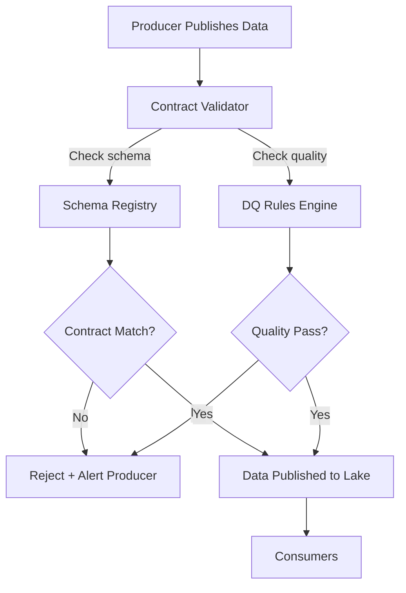

# Data Contracts — Intermediate

## Contract Enforcement Architecture



---

## Soda Core — Contract-Driven Validation

Soda is a popular data quality framework built around the contract concept:

```yaml
# soda/checks/payments.yml
checks for payments:
  - row_count > 0
  - missing_count(payment_id) = 0
  - duplicate_count(payment_id) = 0
  - missing_percent(customer_id) < 0.1%
  - invalid_count(status) = 0:
      valid values: [pending, processing, completed, failed, refunded]
  - min(amount_usd) >= 0.01
  - max(amount_usd) <= 1000000
  - freshness(created_at) < 1h
  - schema:
      name: Payments Schema Contract
      columns:
        - name: payment_id
          type: VARCHAR
        - name: customer_id
          type: VARCHAR
        - name: amount_usd
          type: DECIMAL(18,2)
        - name: status
          type: VARCHAR
        - name: created_at
          type: TIMESTAMP
```

```python
# Run Soda checks programmatically
from soda.scan import Scan

scan = Scan()
scan.set_data_source_name("prod_snowflake")
scan.add_configuration_yaml_file("soda/configuration.yml")
scan.add_sodacl_yaml_file("soda/checks/payments.yml")
scan.set_scan_definition_name("payments_daily")

exit_code = scan.execute()

if exit_code != 0:
    print(scan.get_logs_text())
    raise ValueError("Soda contract validation failed")
    
print(scan.get_scan_results())
```

---

## Schema Registry Integration

Use Confluent Schema Registry (or AWS Glue Data Catalog) as the source of truth:

```python
from confluent_kafka.schema_registry import SchemaRegistryClient
from confluent_kafka.schema_registry.avro import AvroDeserializer
import pandas as pd

class SchemaContractValidator:
    """Validate data against a schema registry contract."""
    
    def __init__(self, registry_url: str):
        self.client = SchemaRegistryClient({"url": registry_url})
    
    def validate_schema(self, topic: str, version: str = "latest") -> dict:
        """Fetch the registered schema for a topic."""
        schema = self.client.get_latest_version(f"{topic}-value")
        return {
            "subject": schema.subject,
            "version": schema.version,
            "schema_id": schema.schema_id,
            "schema": schema.schema.schema_str,
        }
    
    def check_compatibility(self, topic: str, new_schema: str) -> bool:
        """Check if a new schema is backward compatible."""
        result = self.client.test_compatibility(
            subject_name=f"{topic}-value",
            schema=new_schema,
        )
        return result
    
    def register_new_version(self, topic: str, avro_schema: str) -> int:
        """Register a new schema version (after compatibility check)."""
        from confluent_kafka.schema_registry import Schema
        schema = Schema(avro_schema, schema_type="AVRO")
        schema_id = self.client.register_schema(f"{topic}-value", schema)
        return schema_id


validator = SchemaContractValidator("https://schema-registry:8081")

# Check before deploying new schema
is_compatible = validator.check_compatibility(
    "payments",
    new_schema='{"type":"record","name":"Payment","fields":[...]}'
)
if not is_compatible:
    raise ValueError("New schema breaks backward compatibility!")
```

---

## Semantic Versioning for Data Contracts

```python
from dataclasses import dataclass
from enum import Enum

class ChangeType(Enum):
    PATCH = "patch"   # Bug fix, description update
    MINOR = "minor"   # Add optional column, add accepted value
    MAJOR = "major"   # Breaking: rename, drop, type change, add required column

@dataclass
class ContractVersion:
    major: int
    minor: int
    patch: int
    
    def bump(self, change_type: ChangeType) -> "ContractVersion":
        if change_type == ChangeType.MAJOR:
            return ContractVersion(self.major + 1, 0, 0)
        elif change_type == ChangeType.MINOR:
            return ContractVersion(self.major, self.minor + 1, 0)
        else:
            return ContractVersion(self.major, self.minor, self.patch + 1)
    
    def __str__(self):
        return f"{self.major}.{self.minor}.{self.patch}"
    
    def is_backward_compatible_with(self, other: "ContractVersion") -> bool:
        """Same major version = backward compatible."""
        return self.major == other.major


current = ContractVersion(2, 1, 0)
# Adding optional column → MINOR bump
next_version = current.bump(ChangeType.MINOR)
print(next_version)  # 2.2.0

# Renaming column → MAJOR bump
breaking_version = current.bump(ChangeType.MAJOR)
print(breaking_version)  # 3.0.0
```

---

## Contract in dbt — Column-Level Documentation

```yaml
# models/payments/schema.yml
models:
  - name: payments
    description: "Payment transactions — contract v2.1"
    meta:
      contract_version: "2.1"
      owner: payments-engineering@company.com
      consumers: [analytics, finance, ml-platform]
    
    config:
      contract:
        enforced: true   # dbt model contract — fails if schema doesn't match
    
    columns:
      - name: payment_id
        data_type: varchar
        description: "UUID — Primary key"
        constraints:
          - type: not_null
          - type: unique
      
      - name: amount_usd
        data_type: numeric
        description: "Payment amount in USD"
        constraints:
          - type: not_null
        tests:
          - dbt_utils.expression_is_true:
              expression: ">= 0.01"
      
      - name: status
        data_type: varchar
        tests:
          - accepted_values:
              values: [pending, processing, completed, failed, refunded]
```

---

## Interview Tips

> **Tip 1:** "How do you enforce contracts in a streaming pipeline?" — Kafka + Schema Registry. Register Avro/Protobuf schema. Set `BACKWARD` compatibility mode. Producers must register new schema before publishing. Consumers use `AvroDeserializer` which validates schema ID at read time.

> **Tip 2:** "What happens when a consumer needs a field the contract doesn't have?" — Consumer files a contract change request. Producer adds the field as optional (MINOR bump) and populates it. Never have consumers read fields outside the contract.

> **Tip 3:** "How do you handle contracts for third-party data sources?" — Define a contract based on what you observe from the source. Add schema drift detection. When the source changes, your validation catches it and you adapt the contract. You can't control the source but you can detect and respond to changes.
