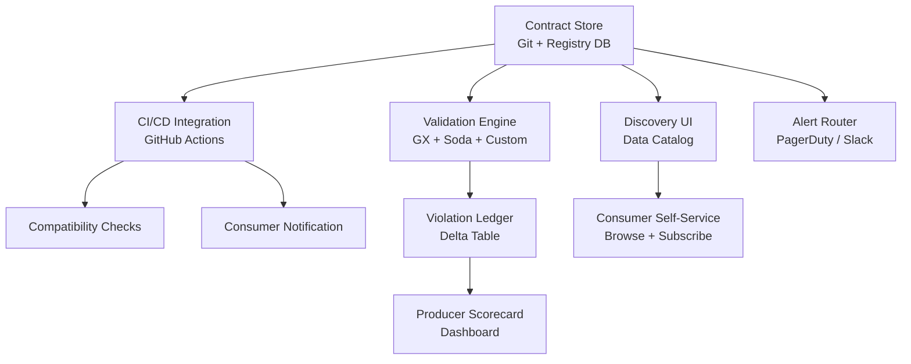

# Data Contracts — Interview Scenarios


<article data-difficulty="junior">

## 🟢 Junior: Detecting Schema Drift

**Scenario:** The payments team changed `amount` from `float` to `string` without notifying you. Your pipeline broke. How do you prevent this in the future?

<details>
<summary>💡 Hint</summary>

1. **Immediate fix:** Add type coercion at ingestion, alert payments team, fix schema 2. **Prevention:** Implement schema validation at the ingestion boundary:

</details>

<details>
<summary>✅ Solution</summary>

1. **Immediate fix:** Add type coercion at ingestion, alert payments team, fix schema
2. **Prevention:** Implement schema validation at the ingestion boundary:
```python
def validate_schema(df, expected_schema: dict):
    for col, expected_type in expected_schema.items():
        if col not in df.columns:
            raise ValueError(f"Missing column: {col}")
        actual_type = str(df[col].dtype)
        if expected_type not in actual_type:
            raise TypeError(f"{col}: expected {expected_type}, got {actual_type}")

expected = {"payment_id": "object", "amount": "float", "status": "object"}
validate_schema(payments_df, expected)
```
3. **Long-term:** Establish a data contract with the payments team. Any schema change requires a PR to the contract YAML, which notifies all consumers and runs compatibility checks in CI.

</details>

</article>

<article data-difficulty="mid-level">

## 🟡 Mid-Level: Renaming a Column

**Scenario:** You need to rename `cust_id` to `customer_id` in the payments table. 8 downstream teams consume this column. How do you manage the migration?

<details>
<summary>💡 Hint</summary>

The safe pattern is *parallel run* — publish both the old and new column name simultaneously for a deprecation window, then remove the old name only after confirming zero readers. Think about: how do you notify 8 teams (contract PR triggers notifications), how do you verify migration (column-read metrics or query log analysis), what's the deprecation timeline (90 days is typical), and what's the rollback plan if a team misses the deadline.

</details>

<details>
<summary>✅ Solution</summary>

**Migration plan:**

```
Week 0: Announce the breaking change
  - Create contract v2.0 proposal PR
  - PR triggers notifications to all 8 consumer teams
  - Set 90-day deprecation timeline for cust_id

Week 1-4: Parallel run
  - Producer publishes BOTH cust_id and customer_id
  - Schema version field: _schema_version = "2.0"
  - Monitor which consumers are reading which field (via column read metrics)

Week 1-12: Consumer migration
  - Each consumer team migrates at their own pace
  - Dependency graph: migrate leaf consumers first, then upstream
  - Track migration % in contract dashboard

Week 13: Remove deprecated field
  - Verify 100% of consumers have migrated (no reads on cust_id)
  - Remove cust_id from producer
  - Archive v1.x contract, promote v2.0 to active
```

**Key point:** Never delete a field without verifying zero reads. Use query logs or column-level lineage to confirm.

</details>

</article>

<article data-difficulty="senior">

## 🔴 Senior: Designing a Contract Platform

**Scenario:** Your company has 200 producers and 1000 consumers across 15 teams. Design a data contract platform.

<details>
<summary>💡 Hint</summary>

Think about the four components every contract platform needs: a *contract store* (Git + registry DB for machine-readable contracts), a *CI/CD integration* (validate contracts on PR, notify consumers of breaking changes), a *validation engine* (runtime checks at ingestion), and a *discovery UI* (so consumers can find and subscribe to datasets). The hard problems at this scale are: who owns enforcement for legacy datasets without contracts, how to handle "soft" violations that shouldn't block pipelines, and how to prevent contract sprawl.

</details>

<details>
<summary>✅ Solution</summary>

**Components:**



**Governance model:**
- Every dataset must have a registered contract within 30 days of creation
- Contracts are versioned in Git with semantic versioning
- Breaking changes require approval from all consumer team leads via PR
- Violation SLAs: Critical violations must be resolved within 4 hours. Producers with >5 violations/month get flagged for review.

**Enforcement tiers:**
1. **Advisory** (low-priority tables): Log violations, no pipeline blocking
2. **Active** (medium-priority): Pipeline fails on critical violations, alert on warnings
3. **Enforced** (business-critical): Block producer deploys if contract compatibility check fails

**Migration to this system:**
- Start with tier 1 for all tables (advisory)
- Promote top 20 most-consumed tables to tier 3
- Gradually promote remaining tables over 6 months

**Key metric to track:** Contract health score = (tables with active contracts) / (total tables). Target: 80% within 12 months.

</details>

</article>
---

## ⚡ Quick-fire Q&A

**Q: What is a data contract and what problem does it solve?**
A: A data contract is a formal, versioned agreement between a data producer and consumer defining the schema, semantics, quality expectations, and SLA of a dataset. It solves the problem of undocumented, fragile dependencies where producers unknowingly break downstream consumers.

**Q: What are the key elements of a data contract?**
A: A data contract typically includes schema definition (fields, types, nullability), semantic descriptions (field meanings, business rules), quality expectations (null rates, value ranges, uniqueness), SLA commitments (freshness, availability), ownership, versioning, and compatibility guarantees.

**Q: What is the difference between a data contract and a schema registry?**
A: A schema registry (e.g., Confluent Schema Registry) manages serialization schemas (Avro, Protobuf) for message formats. A data contract is broader — it includes schema but also quality rules, semantics, SLAs, and ownership, making it a governance artifact, not just a technical format specification.

**Q: How do you enforce data contracts in a production pipeline?**
A: Enforcement can happen at ingestion (reject non-conforming data), in the pipeline (assert contracts using Great Expectations or Soda), at the API/event layer (schema validation with a registry), or at consumption (contract testing in CI/CD). Multiple layers provide defense in depth.

**Q: What is semantic versioning for data contracts?**
A: Semantic versioning applies major.minor.patch rules to contract changes: patch for non-breaking documentation changes, minor for backward-compatible additions (new optional fields), and major for breaking changes (field removal, type changes) requiring consumer migration.

**Q: What is a "shift-left" approach to data quality and how do data contracts support it?**
A: Shift-left moves quality checks upstream toward data producers rather than catching issues downstream in the consuming team. Data contracts enforce quality at the source, giving producers clear expectations and making quality the producer's responsibility.

**Q: How do you handle contract violations in a streaming pipeline?**
A: Use a dead-letter queue or quarantine topic to capture records that violate the contract without blocking the main pipeline. Alert the producing team, track violation rates as a metric, and decide on reprocessing strategy once the issue is resolved.

**Q: What organizational changes are needed for data contracts to succeed?**
A: Data contracts require treating data as a product, with producers accountable for their outputs. This means establishing data ownership, creating incentives for producers to maintain contracts, building tooling for contract testing in CI/CD, and having executive support for the cultural shift.

---

## 💼 Interview Tips

- Frame data contracts as an organizational and cultural solution, not just a technical one — tooling alone never succeeds without producer accountability.
- Be ready to discuss the "data mesh" connection: data contracts are a foundational primitive of data mesh, enabling federated data ownership at scale.
- Know at least one concrete tool or format for defining contracts (dbt contracts, Soda, Great Expectations, Atlan, or YAML-based contract schemas).
- Senior interviewers will probe how you handle breaking changes — show maturity by discussing versioning strategies and consumer migration plans.
- Avoid presenting data contracts as a panacea — discuss the overhead of maintaining contracts and how to scope them to high-impact datasets first.
- The best answers connect data contracts to business outcomes: fewer incidents, faster onboarding of new consumers, and clear accountability when quality issues occur.
