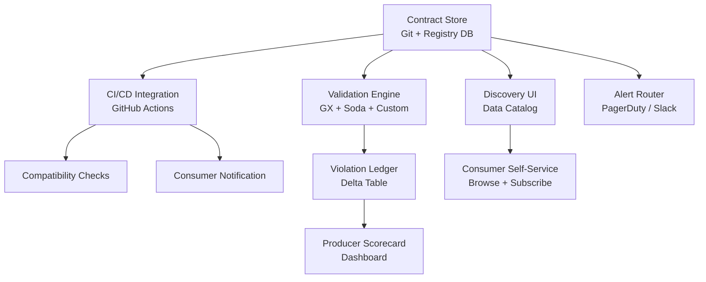

# Data Contracts — Interview Scenarios

## Scenario 1 (Junior): Detecting Schema Drift

**Question:** The payments team changed `amount` from `float` to `string` without notifying you. Your pipeline broke. How do you prevent this in the future?

**Answer:**
1. **Immediate fix:** Add type coercion at ingestion, alert payments team, fix schema
2. **Prevention:** Implement schema validation at the ingestion boundary:
```python
def validate_schema(df, expected_schema: dict):
    for col, expected_type in expected_schema.items():
        if col not in df.columns:
            raise ValueError(f"Missing column: {col}")
        actual_type = str(df[col].dtype)
        if expected_type not in actual_type:
            raise TypeError(f"{col}: expected {expected_type}, got {actual_type}")

expected = {"payment_id": "object", "amount": "float", "status": "object"}
validate_schema(payments_df, expected)
```
3. **Long-term:** Establish a data contract with the payments team. Any schema change requires a PR to the contract YAML, which notifies all consumers and runs compatibility checks in CI.

---

## Scenario 2 (Mid-level): Renaming a Column

**Question:** You need to rename `cust_id` to `customer_id` in the payments table. 8 downstream teams consume this column. How do you manage the migration?

**Answer:**

**Migration plan:**

```
Week 0: Announce the breaking change
  - Create contract v2.0 proposal PR
  - PR triggers notifications to all 8 consumer teams
  - Set 90-day deprecation timeline for cust_id

Week 1-4: Parallel run
  - Producer publishes BOTH cust_id and customer_id
  - Schema version field: _schema_version = "2.0"
  - Monitor which consumers are reading which field (via column read metrics)

Week 1-12: Consumer migration
  - Each consumer team migrates at their own pace
  - Dependency graph: migrate leaf consumers first, then upstream
  - Track migration % in contract dashboard

Week 13: Remove deprecated field
  - Verify 100% of consumers have migrated (no reads on cust_id)
  - Remove cust_id from producer
  - Archive v1.x contract, promote v2.0 to active
```

**Key point:** Never delete a field without verifying zero reads. Use query logs or column-level lineage to confirm.

---

## Scenario 3 (Senior): Designing a Contract Platform

**Question:** Your company has 200 producers and 1000 consumers across 15 teams. Design a data contract platform.

**Answer:**

**Components:**



**Governance model:**
- Every dataset must have a registered contract within 30 days of creation
- Contracts are versioned in Git with semantic versioning
- Breaking changes require approval from all consumer team leads via PR
- Violation SLAs: Critical violations must be resolved within 4 hours. Producers with >5 violations/month get flagged for review.

**Enforcement tiers:**
1. **Advisory** (low-priority tables): Log violations, no pipeline blocking
2. **Active** (medium-priority): Pipeline fails on critical violations, alert on warnings
3. **Enforced** (business-critical): Block producer deploys if contract compatibility check fails

**Migration to this system:**
- Start with tier 1 for all tables (advisory)
- Promote top 20 most-consumed tables to tier 3
- Gradually promote remaining tables over 6 months

**Key metric to track:** Contract health score = (tables with active contracts) / (total tables). Target: 80% within 12 months.
