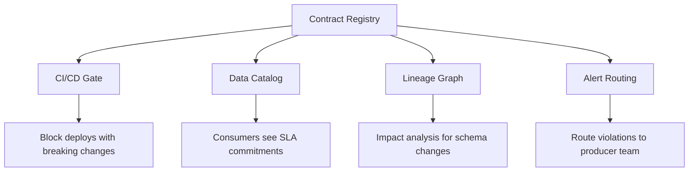

# Data Contracts — Senior Deep Dive

## Data Contracts as Organizational Infrastructure

At scale, data contracts become a governance mechanism — not just a technical tool. They shift responsibility upstream (producer accountability) and enable autonomous team delivery without coordination overhead.



---

## Producer Accountability Model

```python
from dataclasses import dataclass
from typing import List, Optional
from datetime import datetime, timedelta

@dataclass
class ContractViolation:
    contract_id: str
    violation_type: str   # "schema_drift", "freshness_sla", "quality_sla"
    severity: str         # "critical", "warning"
    detected_at: datetime
    details: str

class ContractRegistry:
    """Central registry for all data contracts."""
    
    def __init__(self, db_connection):
        self.db = db_connection
    
    def register_contract(self, contract: dict) -> str:
        """Register a new contract. Returns contract ID."""
        # Validate contract format
        required_fields = ["name", "version", "owner", "schema", "quality"]
        for field in required_fields:
            if field not in contract:
                raise ValueError(f"Contract missing required field: {field}")
        
        contract_id = f"{contract['name']}_v{contract['version']}"
        self.db.execute(
            "INSERT INTO contracts VALUES (?, ?, ?, ?)",
            (contract_id, contract["owner"], contract["version"], str(contract)),
        )
        return contract_id
    
    def record_violation(self, violation: ContractViolation):
        """Record a violation and trigger producer alert."""
        self.db.execute(
            "INSERT INTO contract_violations VALUES (?, ?, ?, ?, ?, ?)",
            (violation.contract_id, violation.violation_type,
             violation.severity, violation.detected_at.isoformat(),
             violation.details, "open"),
        )
        
        # Route alert to producer
        contract = self.get_contract(violation.contract_id)
        if violation.severity == "critical":
            self._page_producer(contract["owner"], violation)
        else:
            self._notify_slack(contract["owner"], violation)
    
    def get_violation_stats(self, contract_id: str, days: int = 30) -> dict:
        """Producer reliability scorecard."""
        since = (datetime.utcnow() - timedelta(days=days)).isoformat()
        rows = self.db.execute(
            """SELECT violation_type, severity, COUNT(*) as cnt
               FROM contract_violations
               WHERE contract_id = ? AND detected_at > ?
               GROUP BY 1, 2""",
            (contract_id, since),
        ).fetchall()
        return {"contract_id": contract_id, "period_days": days, "violations": rows}
```

---

## Shift-Left: Contract Validation in Producer CI

The most powerful pattern: validate contracts before code is merged:

```yaml
# .github/workflows/contract-check.yml
name: Data Contract Validation

on:
  pull_request:
    paths:
      - 'contracts/**'
      - 'src/payments/**'

jobs:
  validate-contract:
    runs-on: ubuntu-latest
    steps:
      - uses: actions/checkout@v4
      
      - name: Check schema compatibility
        run: |
          python scripts/check_contract_compatibility.py \
            --current contracts/payments/v2.1.yaml \
            --proposed contracts/payments/proposed.yaml
      
      - name: Notify consumers of breaking changes
        if: failure()
        run: |
          python scripts/notify_contract_consumers.py \
            --contract contracts/payments/proposed.yaml \
            --channel "#data-contracts"
      
      - name: Run contract tests
        run: |
          python -m pytest tests/contract/ -v
```

```python
# scripts/check_contract_compatibility.py
import yaml
import sys

def check_compatibility(current_path: str, proposed_path: str) -> bool:
    with open(current_path) as f:
        current = yaml.safe_load(f)
    with open(proposed_path) as f:
        proposed = yaml.safe_load(f)
    
    breaking_changes = []
    
    current_fields = {f["name"]: f for f in current["schema"]["fields"]}
    proposed_fields = {f["name"]: f for f in proposed["schema"]["fields"]}
    
    # Removed columns
    for col in current_fields:
        if col not in proposed_fields:
            breaking_changes.append(f"Column removed: {col}")
    
    # Type changes
    for col, field in proposed_fields.items():
        if col in current_fields:
            current_type = current_fields[col]["type"]
            proposed_type = field["type"]
            if current_type != proposed_type:
                breaking_changes.append(f"Type changed for {col}: {current_type} → {proposed_type}")
    
    # Optional → Required
    for col, field in proposed_fields.items():
        if col in current_fields:
            was_optional = not current_fields[col].get("required", True)
            is_required = field.get("required", True)
            if was_optional and is_required:
                breaking_changes.append(f"Column made required: {col}")
    
    if breaking_changes:
        print("BREAKING CHANGES DETECTED:")
        for change in breaking_changes:
            print(f"  - {change}")
        return False
    
    print("No breaking changes — contract is backward compatible.")
    return True

if __name__ == "__main__":
    import argparse
    parser = argparse.ArgumentParser()
    parser.add_argument("--current")
    parser.add_argument("--proposed")
    args = parser.parse_args()
    
    if not check_compatibility(args.current, args.proposed):
        sys.exit(1)
```

---

## Multi-Consumer Impact Analysis

```sql
-- When a contract changes, find all affected downstream assets
WITH contract_consumers AS (
    SELECT 
        c.contract_id,
        c.version,
        c.proposed_change_type,
        cr.consumer_table,
        cr.consumer_team
    FROM proposed_contract_changes c
    JOIN contract_registrations cr ON c.contract_id = cr.contract_id
),
downstream AS (
    -- Recurse through lineage to find transitive consumers
    SELECT 
        cc.contract_id,
        cc.consumer_table,
        cc.consumer_team,
        l.downstream_table,
        l.downstream_team,
        1 AS depth
    FROM contract_consumers cc
    JOIN table_lineage l ON cc.consumer_table = l.upstream_table
    
    UNION ALL
    
    SELECT
        d.contract_id,
        d.downstream_table AS consumer_table,
        d.downstream_team AS consumer_team,
        l.downstream_table,
        l.downstream_team,
        d.depth + 1
    FROM downstream d
    JOIN table_lineage l ON d.downstream_table = l.upstream_table
    WHERE d.depth < 5
)
SELECT DISTINCT
    contract_id,
    downstream_table AS impacted_asset,
    downstream_team AS impacted_team,
    MIN(depth) AS distance_from_source
FROM downstream
GROUP BY 1, 2, 3
ORDER BY 4, 2;
```

---

## Interview Tips

> **Tip 1:** "How do contracts scale across 50 teams?" — Platform team owns the registry and tooling. Each team owns their contracts. Contract changes are PRs reviewed by consumers. Automated compatibility checks in CI block breaking changes. Producer SLAs tracked via violation dashboards.

> **Tip 2:** "What's 'shift-left' in data contracts?" — Moving validation to the earliest possible point: the producer's CI/CD pipeline. Instead of consumers discovering schema drift after deployment, producers are blocked from deploying breaking changes at all.

> **Tip 3:** "How do you handle the cold-start problem — no existing contracts?" — Profile existing datasets to auto-generate v1 contracts. Get producer sign-off (not much extra work). Add consumers over time. Don't try to contract everything at once — start with the most critical/most broken pipelines.

## ⚡ Cheat Sheet

**Great Expectations core objects**
```python
import great_expectations as gx
context = gx.get_context()

# Expectation suite
suite = context.add_expectation_suite("orders_suite")
validator = context.get_validator(batch_request=batch_req, expectation_suite_name="orders_suite")

# Common expectations
validator.expect_column_values_to_not_be_null("order_id")
validator.expect_column_values_to_be_unique("order_id")
validator.expect_column_values_to_be_between("amount", 0, 100000)
validator.expect_column_pair_values_a_to_be_greater_than_b("ship_date", "order_date")
validator.expect_column_values_to_match_regex("email", r"^[\w._%+-]+@[\w.-]+\.[a-z]{2,}$")

# Run checkpoint
result = context.run_checkpoint("orders_checkpoint")
assert result["success"], f"DQ failure: {result}"
```

**Anomaly detection patterns**
```python
# Z-score for numeric columns
def zscore_anomaly(series, threshold=3.0):
    z = (series - series.mean()) / series.std()
    return z.abs() > threshold

# Rolling mean comparison (for time series)
df["rolling_avg"] = df["revenue"].rolling(7).mean()
df["anomaly"] = abs(df["revenue"] - df["rolling_avg"]) > 2 * df["revenue"].rolling(7).std()
```

**Data contract (dbt schema.yml)**
```yaml
models:
  - name: orders
    description: "Gold orders table — SLA: updated within 1 hour of source"
    config: {contract: {enforced: true}}
    columns:
      - name: order_id
        data_type: bigint
        constraints: [{type: not_null}, {type: unique}]
      - name: amount
        data_type: double
        constraints: [{type: not_null}]
    tests:
      - dbt_utils.recency:
          datepart: hour
          field: updated_at
          interval: 2
```

**SLA monitoring**
```sql
-- Alert if table hasn't been updated within SLA window
SELECT table_name,
       MAX(updated_at) AS last_updated,
       DATEDIFF('hour', MAX(updated_at), NOW()) AS hours_since_update,
       CASE WHEN DATEDIFF('hour', MAX(updated_at), NOW()) > sla_hours THEN 'BREACHED' ELSE 'OK' END AS status
FROM table_sla_registry
JOIN gold_tables USING (table_name)
GROUP BY table_name, sla_hours;
```

**DQ dimensions**
```
Completeness:  % non-null values
Accuracy:      matches source of truth
Consistency:   same value across systems
Timeliness:    data arrives within SLA
Uniqueness:    no duplicates on PK
Validity:      conforms to expected format/range
```

**Incident response flow**
```
1. Alert fires (DQ check fails, SLA breached)
2. Triage: severity — who's impacted? (BI dashboard, ML model, external SLA?)
3. Notify: page on-call DE + inform data consumers
4. Contain: quarantine bad data (move to _quarantine schema; don't serve bad data)
5. Fix: patch pipeline or source data
6. Backfill: reprocess affected time range
7. Post-mortem: root cause + prevention (add check that would have caught this earlier)
```
