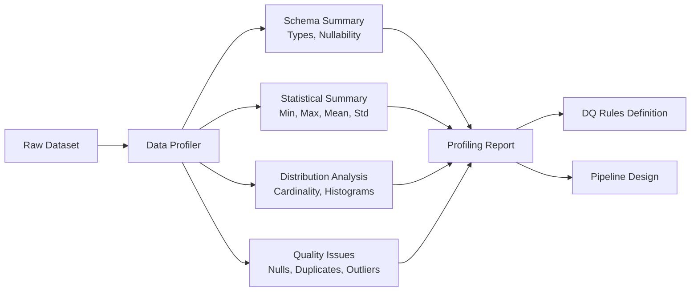

# Data Profiling — Fundamentals


## 🎯 Analogy

Think of data profiling like a medical check-up for your dataset: you measure completeness (no null organs), uniqueness (no duplicate patients), distribution (healthy weight range), and freshness (recent check-up) — before any treatment (transformation).

---
## What Is Data Profiling?

Data profiling is the process of examining and analyzing a dataset to understand its structure, content, and quality. It's done before building pipelines, defining DQ rules, or writing transformations.

> "Profile first, build second." — You can't validate what you don't understand.



---

## Manual Profiling with Pandas

```python
import pandas as pd
import numpy as np

def profile_dataframe(df: pd.DataFrame) -> dict:
    """Comprehensive profiling of a pandas DataFrame."""
    
    profile = {
        "shape": df.shape,
        "total_rows": len(df),
        "total_columns": len(df.columns),
        "duplicate_rows": int(df.duplicated().sum()),
        "memory_mb": round(df.memory_usage(deep=True).sum() / 1024**2, 2),
        "columns": {},
    }
    
    for col in df.columns:
        series = df[col]
        col_profile = {
            "dtype": str(series.dtype),
            "null_count": int(series.isna().sum()),
            "null_pct": round(series.isna().mean() * 100, 2),
            "unique_count": int(series.nunique()),
            "cardinality_pct": round(series.nunique() / len(df) * 100, 2),
            "completeness_pct": round(series.notna().mean() * 100, 2),
        }
        
        if pd.api.types.is_numeric_dtype(series):
            col_profile.update({
                "min": float(series.min()) if not pd.isna(series.min()) else None,
                "max": float(series.max()) if not pd.isna(series.max()) else None,
                "mean": round(float(series.mean()), 4) if not pd.isna(series.mean()) else None,
                "std": round(float(series.std()), 4) if not pd.isna(series.std()) else None,
                "p25": float(series.quantile(0.25)),
                "p50": float(series.quantile(0.50)),
                "p75": float(series.quantile(0.75)),
                "p99": float(series.quantile(0.99)),
                "negative_count": int((series < 0).sum()),
                "zero_count": int((series == 0).sum()),
            })
        
        if pd.api.types.is_string_dtype(series) or series.dtype == "object":
            col_profile["top_values"] = series.value_counts().head(5).to_dict()
            col_profile["avg_length"] = round(series.dropna().str.len().mean(), 1) if series.notna().any() else 0
        
        profile["columns"][col] = col_profile
    
    return profile


# Run it
df = pd.read_parquet("orders.parquet")
report = profile_dataframe(df)

# Print summary
print(f"Shape: {report['shape']}")
print(f"Duplicates: {report['duplicate_rows']:,}")
print(f"\nColumn Summary:")
for col, stats in report["columns"].items():
    print(f"  {col}: null={stats['null_pct']}%, unique={stats['unique_count']:,}, type={stats['dtype']}")
```

---

## YData Profiling (formerly pandas-profiling)

The most popular automated profiling library:

```python
from ydata_profiling import ProfileReport
import pandas as pd

df = pd.read_parquet("orders.parquet")

# Generate full HTML report
profile = ProfileReport(
    df,
    title="Orders Dataset Profile",
    explorative=True,           # More detailed analysis
    correlations={              # Control correlation analysis
        "pearson": {"calculate": True},
        "spearman": {"calculate": False},
        "kendall": {"calculate": False},
    },
    missing_diagrams={
        "bar": True,
        "matrix": True,
    },
    samples={"head": 20, "tail": 20},
)

# Save report
profile.to_file("orders_profile.html")

# Or get as dict for programmatic use
profile_dict = profile.get_description()
print(f"Dataset shape: {profile_dict['table']['n']} rows × {profile_dict['table']['n_var']} columns")
print(f"Missing cells: {profile_dict['table']['n_cells_missing']:,}")
print(f"Duplicate rows: {profile_dict['table']['n_duplicates']:,}")

# Extract column stats
for col, stats in profile_dict["variables"].items():
    print(f"{col}: type={stats['type']}, missing={stats.get('p_missing', 0):.1%}, unique={stats.get('p_unique', 0):.1%}")
```

---

## Key Profiling Metrics to Know

| Metric | What It Tells You | DQ Rule To Generate |
|--------|------------------|---------------------|
| **Null %** | Completeness | `not_null` if 0%, `mostly` threshold if >0% |
| **Unique %** | Cardinality | If 100% → likely PK, add `unique` constraint |
| **Min / Max** | Range | Add range check: `between(min, max)` |
| **Top values** | Accepted values | If ≤20 distinct → add `accepted_values` list |
| **Std deviation** | Spread | Use for anomaly detection baseline |
| **Skewness** | Distribution shape | High skew → use log transform before Z-score |
| **Duplicate rows** | Dedup needed | Add dedup step to pipeline |
| **Data type** | Schema | Define explicit schema |

---

## Column Classification from Profiling

```python
def classify_columns(profile: dict) -> dict:
    """Classify columns by their profiling characteristics."""
    
    classifications = {}
    
    for col, stats in profile["columns"].items():
        if stats["cardinality_pct"] > 95 and stats["null_pct"] == 0:
            classifications[col] = "likely_primary_key"
        elif stats["cardinality_pct"] < 5 and stats["dtype"] == "object":
            classifications[col] = "categorical_low_cardinality"
        elif stats["cardinality_pct"] > 90 and stats["dtype"] == "object":
            classifications[col] = "free_text_or_id"
        elif stats.get("negative_count", 0) == 0 and stats["dtype"] in ("float64", "int64"):
            classifications[col] = "non_negative_numeric"
        elif "date" in col.lower() or "time" in col.lower() or "at" in col.lower():
            classifications[col] = "timestamp_like"
        else:
            classifications[col] = "general_numeric"
    
    return classifications
```

---


## ▶️ Try It Yourself

```python
import pandas as pd
import numpy as np

def profile_dataframe(df: pd.DataFrame) -> pd.DataFrame:
    stats = []
    for col in df.columns:
        series = df[col]
        stats.append({
            "column": col,
            "dtype": str(series.dtype),
            "null_count": int(series.isna().sum()),
            "null_pct": round(series.isna().mean() * 100, 1),
            "unique_count": int(series.nunique()),
            "unique_pct": round(series.nunique() / len(df) * 100, 1),
            "min": series.min() if series.dtype != object else series.str.len().min(),
            "max": series.max() if series.dtype != object else series.str.len().max(),
            "mean": round(float(series.mean()), 2) if series.dtype in [np.float64, np.int64] else None,
            "sample": str(series.dropna().iloc[0]) if len(series.dropna()) > 0 else None,
        })
    return pd.DataFrame(stats)

df = pd.DataFrame({
    "order_id": [1, 2, 2, 3, None],
    "amount":   [100.0, -50.0, 200.0, 300.0, 150.0],
    "region":   ["US", "EU", "EU", None, "US"],
})
print(profile_dataframe(df).to_string(index=False))
```

> **Run it:** Copy the snippet into a REPL or file — no external services needed for the basic example.

---
## Interview Tips

> **Tip 1:** "What's the first thing you do when given a new dataset?" — Profile it. Before writing a single transformation: understand shape, types, null rates, cardinality, and distribution. YData Profiling generates a comprehensive HTML report in one line.

> **Tip 2:** "How does profiling help with DQ rule design?" — Profiling reveals natural rule candidates: columns with 0% nulls → not_null rule; columns with ≤10 unique values → accepted_values; numeric columns → min/max range rules. Profiling makes rule generation systematic, not guesswork.

> **Tip 3:** "What's cardinality and why does it matter?" — The number of distinct values in a column. High cardinality (close to row count) = likely an ID or free text. Low cardinality = categorical, good for accepted_values checks. Medium cardinality = could be encoded as enum. Affects join performance, storage, and indexing decisions.
