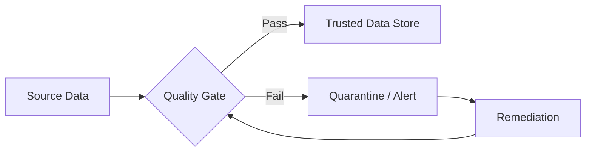
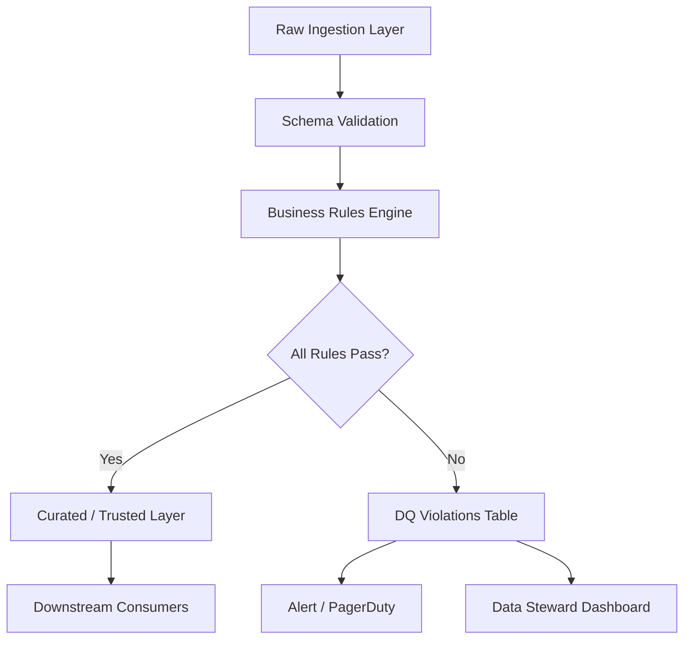

# Data Quality Fundamentals

## What Is Data Quality?

Data quality measures how well data fits its intended use. Poor quality data costs organizations an estimated **$12.9 million per year** on average (Gartner). A data engineer's job is not just to move data — it's to move *trustworthy* data.



---

## The 6 Dimensions of Data Quality

| Dimension | Definition | Example Failure |
|-----------|-----------|-----------------|
| **Completeness** | All required fields are present | `customer_email` is NULL for 30% of rows |
| **Accuracy** | Data reflects real-world truth | Order total = $500 but actual charge = $50 |
| **Consistency** | Same entity has same values across systems | CRM says customer is "Active", DW says "Churned" |
| **Timeliness** | Data is available when needed | Sales dashboard shows yesterday's data at 9 AM |
| **Uniqueness** | No unexpected duplicates | Customer ID 12345 appears 3 times |
| **Validity** | Data conforms to defined formats/rules | `birth_date` = "32/13/2024" — invalid date |

---

## Data Quality Rules — Categories

### 1. Not-Null Rules
```python
# Column must never be null
assert df["order_id"].notna().all(), "order_id has NULL values"
```

### 2. Uniqueness Rules
```python
# Primary key must be unique
assert df["order_id"].nunique() == len(df), "order_id has duplicates"
```

### 3. Range Rules
```python
# Values must fall within expected range
assert df["discount_pct"].between(0, 100).all(), "discount_pct out of range [0,100]"
```

### 4. Referential Integrity Rules
```python
# Foreign key must exist in reference table
valid_customer_ids = set(customers_df["customer_id"])
orphan_orders = ~df["customer_id"].isin(valid_customer_ids)
assert not orphan_orders.any(), f"{orphan_orders.sum()} orders with invalid customer_id"
```

### 5. Format Rules
```python
import re

email_pattern = r'^[a-zA-Z0-9._%+-]+@[a-zA-Z0-9.-]+\.[a-zA-Z]{2,}$'
valid_emails = df["email"].str.match(email_pattern)
assert valid_emails.all(), f"{(~valid_emails).sum()} invalid email addresses"
```

### 6. Business Logic Rules
```python
# Ship date must be after order date
invalid_dates = df["ship_date"] < df["order_date"]
assert not invalid_dates.any(), f"{invalid_dates.sum()} orders shipped before order date"
```

---

## Data Quality Pipeline Architecture



### Rule Engine Pattern

```python
from dataclasses import dataclass
from typing import Callable, List
import pandas as pd

@dataclass
class DQRule:
    name: str
    description: str
    severity: str  # "critical", "warning", "info"
    check: Callable[[pd.DataFrame], bool]
    
class DQEngine:
    def __init__(self, rules: List[DQRule]):
        self.rules = rules
        self.violations = []
    
    def run(self, df: pd.DataFrame) -> bool:
        all_passed = True
        for rule in self.rules:
            passed = rule.check(df)
            if not passed:
                self.violations.append({
                    "rule": rule.name,
                    "severity": rule.severity,
                    "description": rule.description,
                })
                if rule.severity == "critical":
                    all_passed = False
        return all_passed

# Define rules
rules = [
    DQRule(
        name="order_id_not_null",
        description="order_id must never be null",
        severity="critical",
        check=lambda df: df["order_id"].notna().all(),
    ),
    DQRule(
        name="amount_positive",
        description="order_amount must be > 0",
        severity="critical",
        check=lambda df: (df["order_amount"] > 0).all(),
    ),
    DQRule(
        name="email_completeness",
        description="At least 95% of customers should have email",
        severity="warning",
        check=lambda df: df["email"].notna().mean() >= 0.95,
    ),
]

engine = DQEngine(rules)
if not engine.run(orders_df):
    raise ValueError(f"Critical DQ failures: {engine.violations}")
```

---

## DQ Metrics to Track

```python
def compute_dq_metrics(df: pd.DataFrame, table_name: str) -> dict:
    """Compute standard DQ metrics for any DataFrame."""
    total_rows = len(df)
    
    metrics = {
        "table": table_name,
        "total_rows": total_rows,
        "completeness": {},
        "uniqueness": {},
    }
    
    for col in df.columns:
        null_count = df[col].isna().sum()
        metrics["completeness"][col] = {
            "null_count": int(null_count),
            "null_pct": round(null_count / total_rows * 100, 2),
            "completeness_pct": round((1 - null_count / total_rows) * 100, 2),
        }
        
        dup_count = total_rows - df[col].nunique()
        metrics["uniqueness"][col] = {
            "unique_count": int(df[col].nunique()),
            "duplicate_count": int(dup_count),
        }
    
    return metrics
```

---

## Key Concepts Cheat Sheet

| Concept | Definition |
|---------|-----------|
| DQ Rule | A check that data must pass |
| Severity | Critical (blocks pipeline) vs Warning (alerts only) |
| Quarantine | Holding area for failed records |
| DQ Score | % of records / fields passing all rules |
| Lineage | Tracking where data came from |
| Steward | Business owner responsible for data accuracy |

---

## Interview Tips

> **Tip 1:** "Name the 6 dimensions of data quality." — Completeness, Accuracy, Consistency, Timeliness, Uniqueness, Validity. Memorize these cold.

> **Tip 2:** "How do you handle bad records in a pipeline?" — Three strategies: (1) Fail-fast: stop pipeline, alert, fix upstream. (2) Quarantine: route bad records to a separate table, continue pipeline. (3) Impute: fill missing values using business rules (only for warnings, not critical failures).

> **Tip 3:** "What's the difference between data validation and data quality monitoring?" — Validation is point-in-time: "does this batch pass checks?" Monitoring is continuous: "are quality metrics trending in the right direction over time?"
