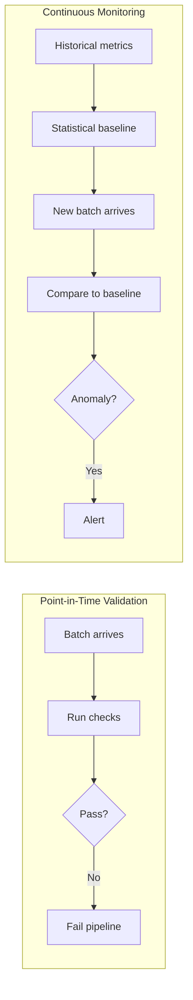

# Data Quality Fundamentals — Intermediate

## Building a DQ Scoring Framework

A DQ score gives stakeholders a single number representing overall data health. The key is weighting rules by business impact.

```python
from dataclasses import dataclass, field
from typing import List, Dict, Optional
import pandas as pd
from datetime import datetime

@dataclass
class DQCheckResult:
    rule_name: str
    dimension: str          # completeness, accuracy, consistency, etc.
    severity: str           # critical, warning, info
    weight: float           # 0.0 to 1.0
    passed: bool
    failing_count: int
    total_count: int
    details: Optional[str] = None

    @property
    def pass_rate(self) -> float:
        if self.total_count == 0:
            return 1.0
        return (self.total_count - self.failing_count) / self.total_count

class DQScorer:
    """Compute weighted DQ score across multiple dimensions."""
    
    def __init__(self, results: List[DQCheckResult]):
        self.results = results
    
    def overall_score(self) -> float:
        """Weighted average of all check pass rates."""
        total_weight = sum(r.weight for r in self.results)
        if total_weight == 0:
            return 1.0
        weighted_sum = sum(r.pass_rate * r.weight for r in self.results)
        return round(weighted_sum / total_weight * 100, 2)
    
    def dimension_scores(self) -> Dict[str, float]:
        """Score per quality dimension."""
        dims: Dict[str, List[DQCheckResult]] = {}
        for r in self.results:
            dims.setdefault(r.dimension, []).append(r)
        
        return {
            dim: round(
                sum(r.pass_rate * r.weight for r in checks) /
                sum(r.weight for r in checks) * 100, 2
            )
            for dim, checks in dims.items()
        }
    
    def critical_failures(self) -> List[DQCheckResult]:
        return [r for r in self.results if r.severity == "critical" and not r.passed]
    
    def report(self) -> dict:
        return {
            "timestamp": datetime.utcnow().isoformat(),
            "overall_score": self.overall_score(),
            "dimension_scores": self.dimension_scores(),
            "critical_failures": len(self.critical_failures()),
            "total_checks": len(self.results),
            "passed_checks": sum(1 for r in self.results if r.passed),
        }
```

---

## Quarantine Pattern — Deep Dive

Route bad records to a separate table instead of failing the pipeline:

```python
import pandas as pd
from typing import Tuple, List, Callable

def apply_quarantine(
    df: pd.DataFrame,
    rules: List[Tuple[str, Callable[[pd.DataFrame], pd.Series]]],
) -> Tuple[pd.DataFrame, pd.DataFrame]:
    """
    Returns (clean_df, quarantine_df).
    quarantine_df includes a 'dq_failure_reason' column.
    """
    quarantine_rows = []
    
    for rule_name, mask_fn in rules:
        # mask_fn returns True for FAILING rows
        failing_mask = mask_fn(df)
        if failing_mask.any():
            bad_rows = df[failing_mask].copy()
            bad_rows["dq_failure_reason"] = rule_name
            bad_rows["dq_detected_at"] = pd.Timestamp.utcnow()
            quarantine_rows.append(bad_rows)
            df = df[~failing_mask]  # remove from clean dataset
    
    quarantine_df = pd.concat(quarantine_rows, ignore_index=True) if quarantine_rows else pd.DataFrame()
    return df, quarantine_df


# Usage
rules = [
    ("null_order_id", lambda df: df["order_id"].isna()),
    ("negative_amount", lambda df: df["amount"] <= 0),
    ("future_order_date", lambda df: df["order_date"] > pd.Timestamp.today()),
]

clean, quarantine = apply_quarantine(raw_orders_df, rules)
print(f"Clean: {len(clean):,} rows | Quarantined: {len(quarantine):,} rows")

# Write quarantine to a separate table
quarantine.to_parquet("s3://bucket/quarantine/orders/batch_20240115.parquet")
```

---

## Data Quality Monitoring vs Validation



### Baseline Computation

```python
import numpy as np
from scipy import stats

class DQBaseline:
    """Statistical baseline for DQ monitoring."""
    
    def __init__(self, history: pd.DataFrame):
        """history: DataFrame with columns [date, metric_name, metric_value]"""
        self.baselines = {}
        for metric in history["metric_name"].unique():
            values = history[history["metric_name"] == metric]["metric_value"].values
            self.baselines[metric] = {
                "mean": float(np.mean(values)),
                "std": float(np.std(values)),
                "p5": float(np.percentile(values, 5)),
                "p95": float(np.percentile(values, 95)),
            }
    
    def is_anomaly(self, metric_name: str, value: float, z_threshold: float = 3.0) -> bool:
        if metric_name not in self.baselines:
            return False
        b = self.baselines[metric_name]
        if b["std"] == 0:
            return value != b["mean"]
        z_score = abs(value - b["mean"]) / b["std"]
        return z_score > z_threshold
```

---

## DQ at the Lakehouse Layer

In a medallion architecture, each layer has different DQ expectations:

| Layer | DQ Focus | Action on Failure |
|-------|---------|-------------------|
| **Bronze (Raw)** | Schema conformance, not-null PKs | Quarantine, never reject entirely |
| **Silver (Curated)** | Business rules, dedup, referential integrity | Fail batch, alert |
| **Gold (Serving)** | Aggregation accuracy, SLA freshness | Monitoring alert, dashboards |

```sql
-- Bronze → Silver: deduplicate with row quality scoring
WITH ranked AS (
    SELECT *,
        ROW_NUMBER() OVER (
            PARTITION BY order_id
            ORDER BY
                -- Prefer rows with more non-null fields
                (CASE WHEN customer_id IS NOT NULL THEN 1 ELSE 0 END
                 + CASE WHEN amount IS NOT NULL THEN 1 ELSE 0 END
                 + CASE WHEN ship_date IS NOT NULL THEN 1 ELSE 0 END) DESC,
                ingestion_timestamp DESC
        ) AS rn
    FROM bronze.orders
    WHERE order_id IS NOT NULL
)
INSERT INTO silver.orders
SELECT * EXCEPT (rn)
FROM ranked
WHERE rn = 1;
```

---

## Interview Tips

> **Tip 1:** "How do you build a DQ score?" — Assign each rule a weight based on business criticality. Score = weighted average of pass rates across all rules. Track score over time to detect degradation trends.

> **Tip 2:** "When would you quarantine vs. fail the pipeline?" — Quarantine when failures are isolated to specific rows and downstream consumers can tolerate partial data. Fail the pipeline when failures affect the entire dataset or PKs/dimensions are broken.

> **Tip 3:** "What's a DQ SLA?" — An agreement that data will meet quality thresholds (e.g., >99% completeness, <0.01% duplicates) by a certain time. Violations trigger escalation.
