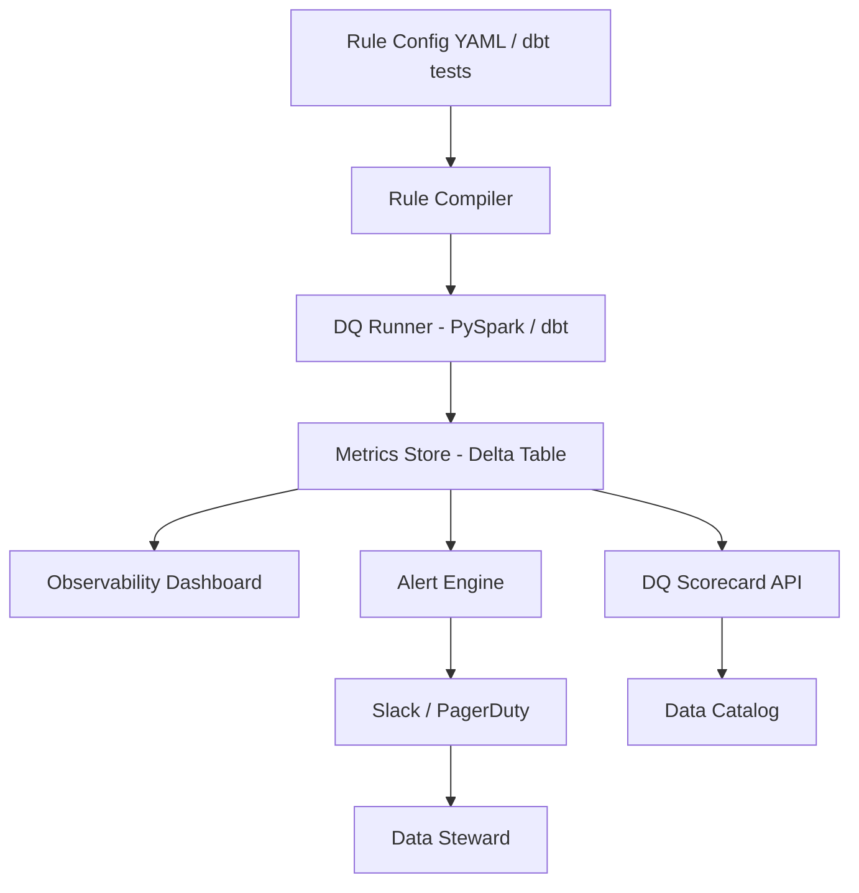

# Data Quality Fundamentals — Interview Scenarios


<article data-difficulty="junior">

## 🟢 Junior: Null Order IDs

**Scenario:** Your orders table has 5,000 rows where `order_id` is NULL. How do you handle this?

<details>
<summary>💡 Hint</summary>

1. **Don't silently drop** — first understand why they're null. Check the source system. Is it a bug? A new record type? 2. **Quarantine** the NULL rows to a separate table with a `dq_failure_reason` column 3. **Alert** the data owner / upstream engineering team 4. **Do not** pass NULL PKs to...

</details>

<details>
<summary>✅ Solution</summary>

1. **Don't silently drop** — first understand why they're null. Check the source system. Is it a bug? A new record type?
2. **Quarantine** the NULL rows to a separate table with a `dq_failure_reason` column
3. **Alert** the data owner / upstream engineering team
4. **Do not** pass NULL PKs to downstream tables — they break joins and aggregations
5. Add a DQ rule that **fails the pipeline** if NULL PKs exceed 0% (zero tolerance for PK nulls)
6. Track the quarantine table so you know when the upstream fix lands and you can replay

**Follow-up:** What if the business says "some orders come from a legacy system that doesn't generate IDs yet"?
→ Generate a surrogate key with a `LEGACY_` prefix, flag rows with `is_surrogate_pk = TRUE`

</details>

</article>

<article data-difficulty="mid-level">

## 🟡 Mid-Level: Revenue Discrepancy

**Scenario:** The finance team reports that your DW shows $10M in weekly revenue, but the source OLTP system shows $10.5M. How do you investigate?

<details>
<summary>💡 Hint</summary>

First establish whether the gap is consistent across time (structural issue) or only recent (pipeline incident). Then work down the layers: row counts match? If not, find where rows are dropped (Silver filters, dedup rules). If counts match, compare subtotals by dimension (date, region, order type) to isolate the segment. Common culprits: currency conversion, cancelled/refunded orders handled differently, pipeline lag for late-arriving records, and Silver-layer business-rule filters the OLTP doesn't apply.

</details>

<details>
<summary>✅ Solution</summary>

**Step 1: Scope the gap**
```sql
-- Check if it's all weeks or just recent
SELECT
    DATE_TRUNC('week', order_date) AS week,
    SUM(amount) AS dw_revenue
FROM gold.orders
GROUP BY 1
ORDER BY 1 DESC;
-- Compare against finance's numbers
```

**Step 2: Check row counts**
```sql
SELECT COUNT(*) FROM gold.orders WHERE order_date >= '2024-01-08';
-- Compare to OLTP
```

**Step 3: Check for filtering issues**
```sql
-- What's being filtered at Silver?
SELECT dq_status, COUNT(*), SUM(amount)
FROM silver.orders
GROUP BY 1;
-- Are there $500K of WARNING/FAILED rows being excluded?
```

**Step 4: Check deduplication**
```sql
-- Are there duplicate orders being collapsed?
SELECT order_id, COUNT(*) AS cnt
FROM silver.orders
GROUP BY 1
HAVING cnt > 1;
```

**Root cause resolution:**
- Missing orders (ingestion gap) → fix pipeline, backfill
- Filtered by DQ rules → review rules, potentially widen threshold or fix upstream
- Currency conversion error → fix exchange rate join
- Timezone issue → align all timestamps to UTC at ingestion

</details>

</article>

<article data-difficulty="senior">

## 🔴 Senior: Designing a DQ Framework

**Scenario:** Your company has 300 tables across 5 data domains. You're asked to build a scalable DQ framework. What does it look like?

<details>
<summary>💡 Hint</summary>

Think about the four concerns that must be separate: *rule definition* (how domain teams express expectations without needing engineering), *execution* (at what stage in the pipeline and with what engine), *results storage* (time-series metric store for trending), and *action* (alerting, blocking, quarantine, scorecard). The key design question for 300 tables is automation: you can't manually write rules for every table — consider profiling-driven rule generation and domain-level defaults.

</details>

<details>
<summary>✅ Solution</summary>

**Architecture:**



**Key design decisions:**

1. **Rule storage:** YAML config files per table, versioned in Git. PR review before new rules go live.
2. **Runner:** dbt tests for SQL transformations, Great Expectations for ingestion, custom PySpark for complex cross-table checks.
3. **Metrics store:** Append-only Delta table with `(table, rule, run_id, evaluated_at, pass_rate)`. Never update in place.
4. **Alerting:** Route critical failures to PagerDuty. Warnings to Slack #data-quality channel. Info to daily email digest.
5. **Ownership:** Every table has a registered `data_owner` in the catalog. Alerts go to that person.
6. **SLAs:** Define per-table: "orders must have ≥99.9% completeness by 8 AM UTC daily."
7. **Scoring:** Weighted DQ score per domain, tracked week-over-week. Red = <95%, Yellow = 95-99%, Green = ≥99%.

**Interview key points:**
- Rules as code (Git, PR review, versioning)
- Separation of concerns: rule definition ≠ runner ≠ metrics store ≠ alerting
- Data ownership model — every alert has a human owner
- DQ is a first-class citizen: block pipelines for critical, alert for warnings

</details>

</article>
---

## ⚡ Quick-fire Q&A

**Q: What are the six core dimensions of data quality?**
A: Completeness (no missing values), accuracy (values reflect reality), consistency (no contradictions across systems), timeliness (data is available when needed), validity (values conform to defined rules), and uniqueness (no unintended duplicates). Each dimension requires different checks and remediation strategies.

**Q: What is the difference between data quality and data reliability?**
A: Data quality describes the fitness of data for its intended use (accuracy, completeness, validity). Data reliability describes whether the data platform consistently delivers quality data on schedule — it encompasses pipeline uptime, freshness SLAs, and alerting, not just the data itself.

**Q: What is a data quality rule and how do you implement one?**
A: A data quality rule is an explicit assertion about expected data behavior (e.g., "order_amount must be > 0"). Implementation options include SQL assertions, Great Expectations expectations, dbt tests, or Soda checks — all of which can be run in CI/CD and production monitoring.

**Q: How do you prioritize which data quality checks to implement first?**
A: Prioritize by business impact: start with checks on data feeding critical reports, SLA-bound datasets, and ML model features. Then expand to high-traffic tables, and finally to lower-priority historical data. A risk-based approach prevents boiling the ocean.

**Q: What is data quality scoring and how is it used?**
A: Data quality scoring aggregates multiple quality dimension metrics (null rate, duplicate rate, freshness lag, referential integrity pass rate) into a composite score for a dataset. Scores help data consumers quickly assess trust level and help data teams prioritize remediation work.

**Q: What is the difference between data quality monitoring and data testing?**
A: Data testing runs assertions at a specific point in time (in CI/CD or on pipeline execution) to catch issues in new data loads. Data quality monitoring continuously tracks metrics over time to detect gradual degradation, drift, and emerging patterns that one-time tests miss.

**Q: How do you handle data quality issues discovered in production?**
A: Follow an incident response process: alert the responsible team, quarantine or flag affected data, assess downstream impact, root-cause the issue, apply a fix, backfill corrected data, and add a new test to prevent recurrence. Document everything in a quality incident log.

**Q: What is referential integrity and how do you validate it in a data pipeline?**
A: Referential integrity ensures that foreign key values in a fact table exist in the corresponding dimension table. Validate it with SQL anti-joins (records in fact with no matching dimension key), dbt relationship tests, or Great Expectations multi-table validations.

---

## 💼 Interview Tips

- Memorize the six dimensions of data quality (completeness, accuracy, consistency, timeliness, validity, uniqueness) — interviewers frequently open with this question as a baseline check.
- Show that you treat data quality as an engineering discipline with code, tests, and monitoring — not a manual review process.
- Be ready to discuss how you build quality checks into the pipeline itself, not as a separate after-the-fact audit.
- Senior interviewers want to hear about organizational challenges: how do you get data producers to care about quality? Discuss SLAs, data contracts, and ownership.
- Common mistake: implementing only completeness checks (null rates) while ignoring accuracy and consistency — explain how you would cover all six dimensions systematically.
- Connect data quality to business outcomes: a 1% error rate in customer addresses could mean millions in undeliverable mail — always anchor quality discussions in business cost.
