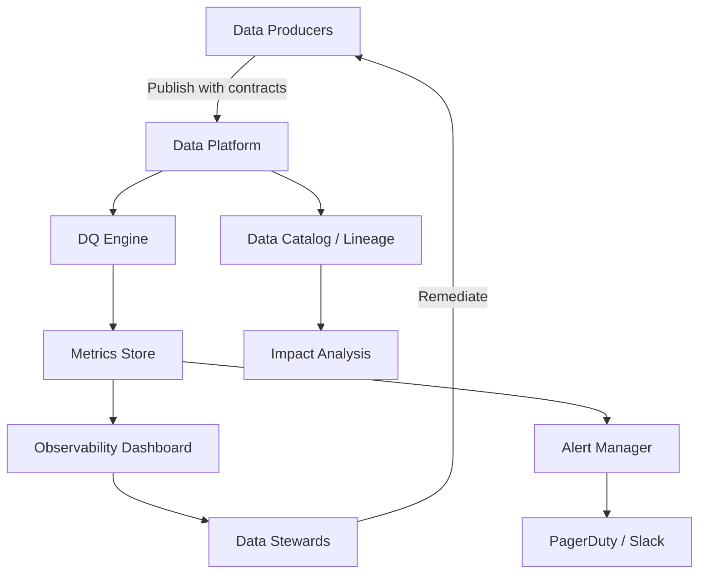

# Data Quality Fundamentals — Senior Deep Dive

## Data Quality as a Product

Senior engineers treat DQ not as a one-off check but as an ongoing product with SLAs, dashboards, and ownership.



---

## Rule Governance — At Scale

When you have 1000+ tables, you need systematic rule management:

```python
from abc import ABC, abstractmethod
from typing import Dict, Any, List
import yaml

class DQRule(ABC):
    """Base class for all DQ rules."""
    
    @property
    @abstractmethod
    def rule_id(self) -> str: ...
    
    @property
    @abstractmethod
    def dimension(self) -> str: ...
    
    @abstractmethod
    def evaluate(self, df) -> Dict[str, Any]: ...

class NotNullRule(DQRule):
    def __init__(self, column: str, severity: str = "critical"):
        self._column = column
        self._severity = severity
    
    @property
    def rule_id(self) -> str:
        return f"not_null_{self._column}"
    
    @property
    def dimension(self) -> str:
        return "completeness"
    
    def evaluate(self, df) -> Dict[str, Any]:
        null_count = int(df[self._column].isna().sum())
        return {
            "rule_id": self.rule_id,
            "passed": null_count == 0,
            "failing_count": null_count,
            "total_count": len(df),
            "severity": self._severity,
        }

class ReferentialIntegrityRule(DQRule):
    def __init__(self, fk_col: str, ref_df, ref_col: str):
        self._fk_col = fk_col
        self._ref_values = set(ref_df[ref_col].dropna())
        self._ref_col = ref_col
    
    @property
    def rule_id(self) -> str:
        return f"ref_integrity_{self._fk_col}"
    
    @property
    def dimension(self) -> str:
        return "consistency"
    
    def evaluate(self, df) -> Dict[str, Any]:
        orphans = ~df[self._fk_col].isin(self._ref_values)
        return {
            "rule_id": self.rule_id,
            "passed": not orphans.any(),
            "failing_count": int(orphans.sum()),
            "total_count": len(df),
            "severity": "critical",
        }


# Rule Registry — load from YAML config
class RuleRegistry:
    def __init__(self, config_path: str):
        with open(config_path) as f:
            self._config = yaml.safe_load(f)
    
    def rules_for_table(self, table_name: str) -> List[DQRule]:
        table_config = self._config.get("tables", {}).get(table_name, {})
        rules = []
        for rule_def in table_config.get("rules", []):
            if rule_def["type"] == "not_null":
                rules.append(NotNullRule(rule_def["column"], rule_def.get("severity", "critical")))
            # ... other types
        return rules
```

---

## DQ Observability Stack

A production DQ observability system has four layers:

### 1. Metrics Collection
```python
# Write DQ metrics to a centralized metrics table
def write_dq_metrics(results: List[dict], run_id: str, table_name: str):
    import boto3, json
    from datetime import datetime
    
    records = [
        {
            "run_id": run_id,
            "table_name": table_name,
            "rule_id": r["rule_id"],
            "dimension": r["dimension"],
            "passed": r["passed"],
            "failing_count": r["failing_count"],
            "total_count": r["total_count"],
            "pass_rate": (r["total_count"] - r["failing_count"]) / r["total_count"],
            "evaluated_at": datetime.utcnow().isoformat(),
        }
        for r in results
    ]
    # Write to DQ metrics table (Delta/Iceberg)
    pd.DataFrame(records).to_parquet(f"s3://dq-store/metrics/{table_name}/")
```

### 2. Trend Detection
```sql
-- Detect tables where DQ score dropped >5% week-over-week
WITH weekly_scores AS (
    SELECT
        table_name,
        DATE_TRUNC('week', evaluated_at) AS week,
        AVG(pass_rate) AS avg_pass_rate
    FROM dq_metrics
    GROUP BY 1, 2
),
week_over_week AS (
    SELECT
        table_name,
        week,
        avg_pass_rate,
        LAG(avg_pass_rate) OVER (PARTITION BY table_name ORDER BY week) AS prev_week_rate
    FROM weekly_scores
)
SELECT *,
    avg_pass_rate - prev_week_rate AS delta
FROM week_over_week
WHERE delta < -0.05
  AND week = DATE_TRUNC('week', CURRENT_DATE)
ORDER BY delta ASC;
```

### 3. Impact Analysis via Lineage
```python
def find_downstream_impact(failed_table: str, lineage_graph: dict) -> List[str]:
    """
    BFS through lineage graph to find all downstream tables
    affected by a DQ failure in failed_table.
    """
    from collections import deque
    
    visited = set()
    queue = deque([failed_table])
    impacted = []
    
    while queue:
        node = queue.popleft()
        if node in visited:
            continue
        visited.add(node)
        for downstream in lineage_graph.get(node, {}).get("downstream", []):
            impacted.append(downstream)
            queue.append(downstream)
    
    return impacted
```

---

## The Cost of Bad Data — Quantifying Impact

In interviews, frame DQ in business terms:

| DQ Failure Type | Business Impact | Example |
|-----------------|----------------|---------|
| Duplicate transactions | Double billing customers | $500K revenue dispute |
| Stale inventory data | Overselling / stockouts | 10% order cancellation rate |
| Wrong attribution | Marketing spend misallocation | $2M to wrong channel |
| PII in wrong table | Compliance violation | GDPR fine up to 4% of revenue |
| Late data | Dashboard shows wrong KPIs | Executives make wrong decisions |

---

## Interview Tips

> **Tip 1:** "How do you scale DQ to 500+ tables?" — Rule registry from config files, automated rule inference (profile tables to generate NOT NULL / range rules automatically), shared rule library with composable building blocks. Don't write one-off checks per table.

> **Tip 2:** "How do you prioritize which DQ issues to fix?" — Score by (probability of failure) × (cost of failure). A 0.1% null rate on a rarely used table is lower priority than a 0.001% null rate on a PK in a billing-critical pipeline.

> **Tip 3:** "What's the difference between data quality and data observability?" — Quality: "Does the data meet our rules?" Observability: "Can we see what's happening to data across its entire lifecycle, detect anomalies, and trace root cause?" Monte Carlo, Bigeye, and Anomalo are observability platforms. Great Expectations is a quality framework.

## ⚡ Cheat Sheet

**Great Expectations core objects**
```python
import great_expectations as gx
context = gx.get_context()

# Expectation suite
suite = context.add_expectation_suite("orders_suite")
validator = context.get_validator(batch_request=batch_req, expectation_suite_name="orders_suite")

# Common expectations
validator.expect_column_values_to_not_be_null("order_id")
validator.expect_column_values_to_be_unique("order_id")
validator.expect_column_values_to_be_between("amount", 0, 100000)
validator.expect_column_pair_values_a_to_be_greater_than_b("ship_date", "order_date")
validator.expect_column_values_to_match_regex("email", r"^[\w._%+-]+@[\w.-]+\.[a-z]{2,}$")

# Run checkpoint
result = context.run_checkpoint("orders_checkpoint")
assert result["success"], f"DQ failure: {result}"
```

**Anomaly detection patterns**
```python
# Z-score for numeric columns
def zscore_anomaly(series, threshold=3.0):
    z = (series - series.mean()) / series.std()
    return z.abs() > threshold

# Rolling mean comparison (for time series)
df["rolling_avg"] = df["revenue"].rolling(7).mean()
df["anomaly"] = abs(df["revenue"] - df["rolling_avg"]) > 2 * df["revenue"].rolling(7).std()
```

**Data contract (dbt schema.yml)**
```yaml
models:
  - name: orders
    description: "Gold orders table — SLA: updated within 1 hour of source"
    config: {contract: {enforced: true}}
    columns:
      - name: order_id
        data_type: bigint
        constraints: [{type: not_null}, {type: unique}]
      - name: amount
        data_type: double
        constraints: [{type: not_null}]
    tests:
      - dbt_utils.recency:
          datepart: hour
          field: updated_at
          interval: 2
```

**SLA monitoring**
```sql
-- Alert if table hasn't been updated within SLA window
SELECT table_name,
       MAX(updated_at) AS last_updated,
       DATEDIFF('hour', MAX(updated_at), NOW()) AS hours_since_update,
       CASE WHEN DATEDIFF('hour', MAX(updated_at), NOW()) > sla_hours THEN 'BREACHED' ELSE 'OK' END AS status
FROM table_sla_registry
JOIN gold_tables USING (table_name)
GROUP BY table_name, sla_hours;
```

**DQ dimensions**
```
Completeness:  % non-null values
Accuracy:      matches source of truth
Consistency:   same value across systems
Timeliness:    data arrives within SLA
Uniqueness:    no duplicates on PK
Validity:      conforms to expected format/range
```

**Incident response flow**
```
1. Alert fires (DQ check fails, SLA breached)
2. Triage: severity — who's impacted? (BI dashboard, ML model, external SLA?)
3. Notify: page on-call DE + inform data consumers
4. Contain: quarantine bad data (move to _quarantine schema; don't serve bad data)
5. Fix: patch pipeline or source data
6. Backfill: reprocess affected time range
7. Post-mortem: root cause + prevention (add check that would have caught this earlier)
```
