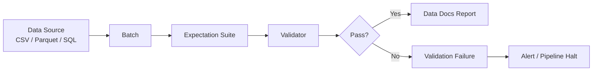

# Great Expectations — Fundamentals


## 🎯 Analogy

Think of Great Expectations like a test suite for your data: you define expectations (column X should never be null, values should be between 0 and 1000), and GE runs them against every new batch before it enters the warehouse.

---
## What Is Great Expectations?

Great Expectations (GX) is the most widely used open-source data quality framework for Python. It lets you define **expectations** — assertions about your data — and validate batches of data against them. When expectations fail, GX produces human-readable validation reports.



---

## Core Concepts

| Concept | Description |
|---------|-------------|
| **Expectation** | A single assertion: "column `age` must be between 0 and 120" |
| **Expectation Suite** | Named collection of expectations for one dataset |
| **Batch** | A slice of data to validate (a file, a partition, a SQL query) |
| **Validator** | Runs a batch against a suite and produces results |
| **Checkpoint** | Orchestrates validation: connects data source + suite + actions |
| **Data Docs** | Auto-generated HTML report of expectations and results |

---

## Installation & Setup

```bash
pip install great-expectations
gx init   # creates gx/ directory with config
```

---

## ⚠️ Two API Generations — Know Which One You're Using

Great Expectations had a **breaking rewrite in GX 1.0 (August 2024)**:

| | Legacy 0.x (≤0.18) | GX 1.x (current) |
|---|---|---|
| Add expectations | Interactively on a `validator` object: `validator.expect_column_values_to_not_be_null("id")` | As classes added to a suite: `suite.add_expectation(gx.expectations.ExpectColumnValuesToNotBeNull(column="id"))` |
| Run validation | `validator.validate()` / `SimpleCheckpoint` | `ValidationDefinition.run()` / `Checkpoint` |
| Data sources | `context.sources.add_pandas(...)` | `context.data_sources.add_pandas(...)` |

Many production codebases still run 0.18 — interviewers may use either style. The example below uses **GX 1.x**.

## Your First Expectation Suite (GX 1.x)

```python
import great_expectations as gx
import pandas as pd

# 1. Get context (project root)
context = gx.get_context()

# 2. Add a data source (Pandas in-memory)
data_source = context.data_sources.add_pandas("orders_source")

# 3. Add a data asset
asset = data_source.add_dataframe_asset(name="orders")

# 4. Add batch definition
batch_def = asset.add_batch_definition_whole_dataframe("full_load")

# 5. Create expectation suite with expectations
suite = context.suites.add(gx.ExpectationSuite(name="orders_suite"))
suite.add_expectation(gx.expectations.ExpectColumnToExist(column="order_id"))
suite.add_expectation(gx.expectations.ExpectColumnValuesToNotBeNull(column="order_id"))
suite.add_expectation(gx.expectations.ExpectColumnValuesToBeUnique(column="order_id"))
suite.add_expectation(gx.expectations.ExpectColumnValuesToNotBeNull(column="customer_id"))
suite.add_expectation(gx.expectations.ExpectColumnValuesToBeBetween(
    column="amount", min_value=0.01, max_value=100000))
suite.add_expectation(gx.expectations.ExpectColumnValuesToBeInSet(
    column="status", value_set=["pending", "shipped", "delivered", "cancelled"]))
suite.add_expectation(gx.expectations.ExpectTableRowCountToBeBetween(
    min_value=1, max_value=10_000_000))

# 6. Tie data + suite together in a validation definition
validation_def = context.validation_definitions.add(
    gx.ValidationDefinition(name="orders_validation", data=batch_def, suite=suite)
)

# 7. Run validation against a dataframe
df = pd.read_parquet("orders.parquet")
results = validation_def.run(batch_parameters={"dataframe": df})
print(f"Success: {results.success}")
```

---

## Common Expectations Reference

> Shown in the compact legacy 0.x `validator.` style. In GX 1.x the same expectations exist as classes: `expect_column_values_to_not_be_null("email")` becomes `gx.expectations.ExpectColumnValuesToNotBeNull(column="email")` — mechanical rename, same parameters.

### Completeness
```python
validator.expect_column_values_to_not_be_null("email")
validator.expect_column_values_to_not_be_null("email", mostly=0.95)  # 95% threshold
```

### Uniqueness
```python
validator.expect_column_values_to_be_unique("order_id")
```

### Range Checks
```python
validator.expect_column_values_to_be_between("age", min_value=0, max_value=120)
validator.expect_column_mean_to_be_between("revenue", min_value=50, max_value=500)
validator.expect_column_median_to_be_between("tenure_days", min_value=0, max_value=3650)
```

### Set Membership
```python
validator.expect_column_values_to_be_in_set(
    "country_code", {"US", "GB", "CA", "AU", "DE"}
)
```

### Pattern Matching
```python
validator.expect_column_values_to_match_regex(
    "email", r"^[a-zA-Z0-9._%+-]+@[a-zA-Z0-9.-]+\.[a-zA-Z]{2,}$"
)
validator.expect_column_values_to_match_strftime_format("order_date", "%Y-%m-%d")
```

### Table-Level
```python
validator.expect_table_row_count_to_be_between(min_value=1000, max_value=5_000_000)
validator.expect_table_columns_to_match_ordered_list(
    ["order_id", "customer_id", "amount", "status", "order_date"]
)
```

---

## Running a Checkpoint

Checkpoints combine a suite with actions (like saving results, updating Data Docs):

```python
checkpoint = context.checkpoints.add(
    gx.Checkpoint(
        name="orders_checkpoint",
        validations=[
            {
                "batch_definition": batch_def,
                "expectation_suite_name": "orders_suite",
            }
        ],
    )
)

result = checkpoint.run(batch_parameters={"dataframe": df})
print(f"Checkpoint passed: {result.success}")

# Update Data Docs (HTML report)
context.build_data_docs()
```

---

## Key Concepts Cheat Sheet

| Term | Meaning |
|------|---------|
| `mostly` | Allow a fraction to fail: `mostly=0.99` = 99% must pass |
| `success` | Boolean: did ALL expectations pass (or meet `mostly`)? |
| `meta` | Optional dict to attach notes/tags to an expectation |
| Expectation Suite | JSON file saved in `gx/expectations/` |
| Data Docs | HTML site at `gx/uncommitted/data_docs/` |

---


## ▶️ Try It Yourself

```python
# pip install great-expectations
import great_expectations as gx

context = gx.get_context()

# Create a simple in-memory datasource (for demo)
import pandas as pd
df = pd.DataFrame({
    "order_id": [1, 2, 3],
    "amount": [100.0, 200.0, 50.0],
    "region": ["US", "EU", "US"],
})

# Validate directly
validator = context.sources.pandas_default.read_dataframe(df)
validator.expect_column_to_exist("order_id")
validator.expect_column_values_to_not_be_null("order_id")
validator.expect_column_values_to_be_between("amount", min_value=0, max_value=10000)
validator.expect_column_values_to_be_in_set("region", ["US", "EU", "APAC"])
results = validator.validate()
print(f"Success: {results.success}")
```

> **Run it:** Copy the snippet into a REPL or file and run it — no external services needed for the basic example.

---
## Interview Tips

> **Tip 1:** "What is Great Expectations?" — A Python DQ framework where you declare expectations (assertions) about data, then validate batches against them. Failures produce actionable reports, not just error messages.

> **Tip 2:** "What is the `mostly` parameter?" — Allows a column to have some failing values while still passing. `mostly=0.95` means 95% of rows must pass. Useful for columns that are "usually" populated but not always required.

> **Tip 3:** "How does GX compare to writing manual assertions?" — GX provides 50+ built-in expectations, human-readable HTML reports, profiling to auto-generate expectations, and integrations with Airflow, Spark, and dbt. Manual assertions are fragile, one-off, and don't produce reports.
