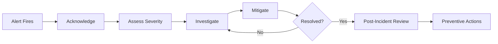

# Incident Management — Fundamentals


## 🎯 Analogy

Think of data quality incident management like a software on-call process: severity is defined upfront (P1 = revenue impact, P2 = stale dashboards, P3 = non-critical), runbooks prescribe response steps, and post-mortems prevent recurrence.

---
## What Is a Data Incident?

A data incident is any event that causes data to be unavailable, inaccurate, or late in a way that impacts business operations. Data engineers are often on-call to respond to these incidents.



---

## Incident Severity Levels

| Severity | Impact | Response Time | Examples |
|----------|--------|---------------|---------|
| **P1 / Critical** | Business blocked, revenue impacted | 15 minutes | Orders pipeline down, billing data wrong |
| **P2 / High** | Major dashboard failure | 30 minutes | Daily reports unavailable at 9 AM |
| **P3 / Medium** | Partial data issue, workaround available | 2 hours | One region missing from report |
| **P4 / Low** | Minor issue, no immediate business impact | Next business day | Warning in non-critical table |

---

## The Incident Response Flow

### Step 1: Acknowledge
```python
# In PagerDuty: acknowledge within 15 min for P1
# This stops escalation and assigns you as responder

# Immediately notify stakeholders
def notify_incident_start(incident_id: str, severity: str, affected_tables: list):
    slack_message = (
        f":red_circle: *DATA INCIDENT STARTED*\n"
        f"*Incident:* {incident_id}\n"
        f"*Severity:* {severity}\n"
        f"*Affected:* {', '.join(affected_tables)}\n"
        f"*Responder:* @on-call-data-eng\n"
        f"*Status thread:* Will update every 15 min"
    )
    post_to_slack("#data-incidents", slack_message)
```

### Step 2: Assess Scope
```python
def assess_incident_scope(affected_table: str) -> dict:
    """Quickly determine blast radius of an incident."""
    
    # Check which Gold tables depend on affected_table
    downstream = get_downstream_tables(affected_table)  # from lineage graph
    
    # Check which dashboards use those tables
    impacted_dashboards = []
    for table in downstream:
        impacted_dashboards.extend(get_dashboards_using_table(table))
    
    # Check consumer teams
    impacted_teams = get_consumer_teams(affected_table)
    
    return {
        "root_table": affected_table,
        "downstream_tables": downstream,
        "impacted_dashboards": impacted_dashboards,
        "impacted_teams": impacted_teams,
        "estimated_users": len(impacted_teams) * 10,  # rough estimate
    }
```

### Step 3: Investigate — Standard Checks
```python
def standard_investigation_checklist(table: str, run_date: str):
    """
    Standard checklist for pipeline failure investigation.
    """
    checks = []
    
    # 1. Is the source available?
    checks.append(("Source data present?", check_source_has_data(table, run_date)))
    
    # 2. Did the pipeline job start?
    checks.append(("Pipeline job started?", check_job_started(table, run_date)))
    
    # 3. Did it fail or succeed?
    checks.append(("Pipeline status?", get_job_status(table, run_date)))
    
    # 4. Are there recent deployments?
    checks.append(("Recent code deployments?", check_recent_deployments(hours=4)))
    
    # 5. Are there upstream failures?
    checks.append(("Upstream table fresh?", check_upstream_freshness(table)))
    
    # 6. Resource issues?
    checks.append(("Memory/CPU issues?", check_cluster_health()))
    
    for check, result in checks:
        print(f"  {'✓' if result else '✗'} {check}: {result}")
    
    return checks
```

### Step 4: Mitigate
Common mitigation actions:
```bash
# Option 1: Rerun failed pipeline
airflow dags trigger orders_pipeline --conf '{"run_date": "2024-01-15", "rerun": "true"}'

# Option 2: Restore from backup
python scripts/restore_from_backup.py --table gold.orders --snapshot 2024-01-14

# Option 3: Serve stale data with a staleness notice
python scripts/add_staleness_banner.py --dashboard revenue_dashboard

# Option 4: Manual fix for data corruption
python scripts/remediate_orders.py --date 2024-01-15 --fix duplicate_removal
```

---

## Runbook Template

A runbook is a step-by-step guide for handling known incidents:

```markdown
# Runbook: Orders Pipeline Failure

## Symptoms
- Gold.orders not updated by 8:30 AM UTC
- PagerDuty alert: "orders_freshness_sla_breach"
- Finance dashboard shows stale data

## Immediate Actions (< 5 min)
1. Acknowledge PagerDuty alert
2. Post in #data-incidents: "Investigating orders pipeline failure"
3. Check Airflow: https://airflow.company.com/dags/orders_pipeline

## Investigation Steps
1. [ ] Check Airflow task statuses for today's run
2. [ ] Check Bronze table: `SELECT COUNT(*) FROM bronze.orders WHERE DATE(ingested_at) = CURRENT_DATE`
3. [ ] Check source system health: https://source-monitoring/orders
4. [ ] Check for recent deployments: `git log --since="6 hours ago"`
5. [ ] Check Spark cluster logs for OOM/failures

## Remediation Options
| Scenario | Action |
|----------|--------|
| Job failed, source OK | Re-trigger: `airflow tasks run orders_pipeline transform_silver <date>` |
| Source delayed | Wait for source, then re-trigger. ETA from source team. |
| Data corruption | Run: `python scripts/fix_orders_dedup.py --date <date>` |
| Infrastructure issue | Escalate to Platform team: @platform-oncall |

## Escalation
- After 30 min: Escalate to senior DE or TL
- After 60 min: Notify VP Data

## Post-Incident
- Create Jira ticket with RCA within 24h
- Update runbook with any new findings
```

---


## ▶️ Try It Yourself

```python
from dataclasses import dataclass, field
from datetime import datetime
from enum import Enum

class Severity(Enum):
    P1 = "P1 - Critical (revenue/compliance impact)"
    P2 = "P2 - High (analytics broken)"
    P3 = "P3 - Medium (non-critical)"

@dataclass
class DataIncident:
    title: str
    severity: Severity
    pipeline: str
    detected_at: datetime = field(default_factory=datetime.now)
    status: str = "open"
    root_cause: str = ""
    resolution: str = ""

    def time_to_detect_minutes(self) -> int:
        # In practice: compare to when data was actually bad
        return 0

def create_incident(title: str, pipeline: str, impact: str) -> DataIncident:
    severity = Severity.P1 if "revenue" in impact.lower() or "compliance" in impact.lower()                else Severity.P2 if "dashboard" in impact.lower()                else Severity.P3
    incident = DataIncident(title=title, severity=severity, pipeline=pipeline)
    print(f"[INCIDENT CREATED] {severity.value}")
    print(f"  Pipeline: {pipeline}")
    print(f"  Next: page on-call if P1, create Jira ticket, post to #data-incidents")
    return incident

create_incident("Revenue metric dropped 40%", "orders_daily", "Revenue dashboard broken")
```

> **Run it:** Copy the snippet into a REPL or file — no external services needed for the basic example.

---
## Interview Tips

> **Tip 1:** "Walk me through how you'd handle a production data incident." — Acknowledge, assess scope (which tables/dashboards affected), investigate using standard checklist (source OK? job started? recent changes?), mitigate (rerun or restore), communicate status every 15 min to stakeholders, resolve, then write RCA.

> **Tip 2:** "What's a runbook?" — A documented, step-by-step procedure for handling a known type of incident. Good runbooks have: symptoms, investigation steps, remediation options for each root cause, escalation path, and post-incident actions. They let junior engineers handle incidents without waiting for senior engineers.

> **Tip 3:** "What's the difference between resolution and remediation?" — Remediation: quick fix to restore service (rerun the job). Resolution: permanent fix so the incident doesn't happen again (fix the root cause, add monitoring). Treat them separately — always remediate first, then resolve properly.
