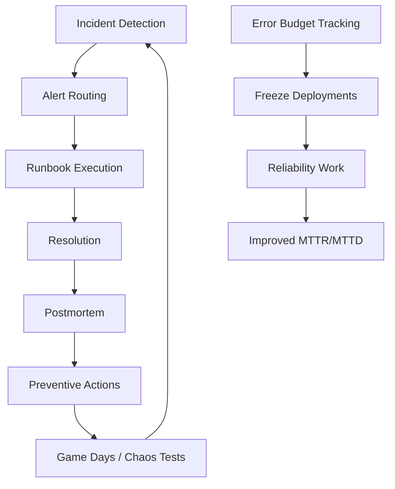

# Incident Management — Senior Deep Dive

## Building a Data Reliability Engineering Practice

Senior engineers go beyond incident response — they build systems that prevent incidents and make the team more effective during them.



---

## Incident Management System Design

```python
from dataclasses import dataclass, field
from typing import List, Callable, Optional
from enum import Enum
from datetime import datetime
import threading

class AlertSeverity(Enum):
    P1 = "critical"
    P2 = "high"
    P3 = "medium"
    P4 = "low"

@dataclass
class AlertRule:
    name: str
    severity: AlertSeverity
    condition: Callable  # Returns (is_firing, details)
    runbook_url: str
    affected_tables: List[str]
    owner: str

class IncidentOrchestrator:
    """
    Central orchestrator that:
    1. Evaluates alert rules
    2. Creates incidents for firing alerts
    3. Routes to appropriate channels
    4. Tracks response and escalates if needed
    """
    
    def __init__(self, pagerduty_client, slack_client, jira_client):
        self.pd = pagerduty_client
        self.slack = slack_client
        self.jira = jira_client
        self.active_incidents: dict = {}
        self.alert_rules: List[AlertRule] = []
    
    def register_rule(self, rule: AlertRule):
        self.alert_rules.append(rule)
    
    def evaluate_all(self):
        """Run all alert rules."""
        for rule in self.alert_rules:
            try:
                is_firing, details = rule.condition()
                
                if is_firing and rule.name not in self.active_incidents:
                    self._open_incident(rule, details)
                elif not is_firing and rule.name in self.active_incidents:
                    self._close_incident(rule.name)
            except Exception as e:
                print(f"Error evaluating rule {rule.name}: {e}")
    
    def _open_incident(self, rule: AlertRule, details: str):
        incident_id = f"INC-{datetime.utcnow().strftime('%Y%m%d%H%M')}"
        
        self.active_incidents[rule.name] = {
            "incident_id": incident_id,
            "opened_at": datetime.utcnow(),
            "rule": rule,
        }
        
        # Route by severity
        if rule.severity == AlertSeverity.P1:
            self.pd.trigger(
                title=f"{rule.name}: {details}",
                severity="critical",
                details={"runbook": rule.runbook_url, "tables": rule.affected_tables},
            )
        
        self.slack.post(
            channel="#data-incidents",
            message=(
                f":fire: *INCIDENT OPENED* `{incident_id}`\n"
                f"*Alert:* {rule.name}\n"
                f"*Severity:* {rule.severity.value}\n"
                f"*Owner:* {rule.owner}\n"
                f"*Details:* {details}\n"
                f"*Runbook:* {rule.runbook_url}\n"
                f"*Affected tables:* {', '.join(rule.affected_tables)}"
            )
        )
        
        # Create Jira ticket for P1/P2
        if rule.severity in (AlertSeverity.P1, AlertSeverity.P2):
            self.jira.create_ticket(
                project="DATA",
                title=f"[{rule.severity.value.upper()}] {rule.name}",
                description=details,
                priority=rule.severity.value,
                labels=["data-incident", "on-call"],
            )
    
    def _close_incident(self, rule_name: str):
        incident = self.active_incidents.pop(rule_name)
        duration = (datetime.utcnow() - incident["opened_at"]).total_seconds() / 60
        
        self.slack.post(
            channel="#data-incidents",
            message=(
                f":white_check_mark: *INCIDENT RESOLVED* `{incident['incident_id']}`\n"
                f"*Duration:* {duration:.0f} minutes\n"
                f"*Alert:* {rule_name}"
            )
        )
```

---

## Game Days — Proactive Incident Preparedness

Game days simulate failures to test incident response:

```python
class GameDay:
    """
    Orchestrate a game day exercise to test incident response.
    
    Injects failures into non-production systems and verifies:
    - Alerts fire correctly
    - Runbooks are followed
    - MTTD and MTTR are within targets
    """
    
    def __init__(self, target_env: str = "staging"):
        assert target_env != "production", "Never run game days in production!"
        self.env = target_env
        self.results = []
    
    def scenario_1_source_delay(self, expected_alert_within_minutes: int = 10):
        """
        Scenario: Source system stops updating.
        Expected: Freshness alert fires within 10 minutes.
        """
        print(f"[Game Day] Scenario 1: Stopping source updates in {self.env}")
        
        # Inject: pause source ingestion
        self._pause_ingestion("orders_source", minutes=30)
        
        # Wait and check if alert fired
        import time
        time.sleep(expected_alert_within_minutes * 60)
        
        alert_fired = self._check_alert_fired("orders_freshness_sla_breach")
        self.results.append({
            "scenario": "source_delay",
            "passed": alert_fired,
            "expected": f"Alert within {expected_alert_within_minutes} min",
        })
        
        # Restore
        self._resume_ingestion("orders_source")
        print(f"{'PASS' if alert_fired else 'FAIL'}: Alert fired: {alert_fired}")
    
    def scenario_2_schema_drift(self):
        """
        Scenario: Schema change in source.
        Expected: Schema drift alert fires, pipeline is quarantined.
        """
        # Inject: rename column in staging source
        pass
    
    def scenario_3_data_corruption(self):
        """
        Scenario: Duplicates injected into Bronze layer.
        Expected: DQ check catches, quarantines, alerts.
        """
        pass
    
    def report(self):
        passed = sum(1 for r in self.results if r["passed"])
        print(f"\nGame Day Results: {passed}/{len(self.results)} scenarios passed")
        for r in self.results:
            print(f"  {'✓' if r['passed'] else '✗'} {r['scenario']}: {r['expected']}")
```

---

## On-Call Health Metrics

Track and improve on-call experience:

```sql
-- On-call burden metrics (team health indicator)
SELECT
    DATE_TRUNC('month', incident_opened_at) AS month,
    COUNT(*) AS total_incidents,
    AVG(duration_minutes) AS avg_duration_minutes,
    SUM(CASE WHEN severity = 'critical' THEN 1 ELSE 0 END) AS p1_count,
    COUNT(CASE WHEN EXTRACT(HOUR FROM incident_opened_at) BETWEEN 22 AND 6 THEN 1 END) AS after_hours_incidents,
    COUNT(DISTINCT root_cause_category) AS unique_root_causes,
    -- Recurrence: same root cause twice = preventable
    COUNT(CASE WHEN recurrence = TRUE THEN 1 ELSE 0 END) AS recurring_incidents
FROM incident_history
WHERE incident_opened_at >= CURRENT_DATE - INTERVAL '6 months'
GROUP BY 1
ORDER BY 1;
```

---

## Interview Tips

> **Tip 1:** "How do you reduce on-call burden?" — Track mean time between incidents, identify top recurring root causes, run game days to validate detection. Eliminate toil: runbooks for every known incident type, automated remediation for common failures (e.g., auto-retry on OOM), reduce alert noise by tuning thresholds.

> **Tip 2:** "What is chaos engineering for data systems?" — Intentionally inject failures (stop ingestion, corrupt records, rename columns) in a controlled way to test that monitoring detects them and runbooks work. Improves confidence in your incident response before real incidents happen.

> **Tip 3:** "What metrics do you track for incident management maturity?" — MTTD (detection speed), MTTA (response speed), MTTR (resolution speed), recurring incident rate (preventable issues), after-hours incident count (on-call burden), postmortem action completion rate (follow-through). Track month-over-month improvement.

## ⚡ Cheat Sheet

**Great Expectations core objects**
```python
import great_expectations as gx
context = gx.get_context()

# Expectation suite
suite = context.add_expectation_suite("orders_suite")
validator = context.get_validator(batch_request=batch_req, expectation_suite_name="orders_suite")

# Common expectations
validator.expect_column_values_to_not_be_null("order_id")
validator.expect_column_values_to_be_unique("order_id")
validator.expect_column_values_to_be_between("amount", 0, 100000)
validator.expect_column_pair_values_a_to_be_greater_than_b("ship_date", "order_date")
validator.expect_column_values_to_match_regex("email", r"^[\w._%+-]+@[\w.-]+\.[a-z]{2,}$")

# Run checkpoint
result = context.run_checkpoint("orders_checkpoint")
assert result["success"], f"DQ failure: {result}"
```

**Anomaly detection patterns**
```python
# Z-score for numeric columns
def zscore_anomaly(series, threshold=3.0):
    z = (series - series.mean()) / series.std()
    return z.abs() > threshold

# Rolling mean comparison (for time series)
df["rolling_avg"] = df["revenue"].rolling(7).mean()
df["anomaly"] = abs(df["revenue"] - df["rolling_avg"]) > 2 * df["revenue"].rolling(7).std()
```

**Data contract (dbt schema.yml)**
```yaml
models:
  - name: orders
    description: "Gold orders table — SLA: updated within 1 hour of source"
    config: {contract: {enforced: true}}
    columns:
      - name: order_id
        data_type: bigint
        constraints: [{type: not_null}, {type: unique}]
      - name: amount
        data_type: double
        constraints: [{type: not_null}]
    tests:
      - dbt_utils.recency:
          datepart: hour
          field: updated_at
          interval: 2
```

**SLA monitoring**
```sql
-- Alert if table hasn't been updated within SLA window
SELECT table_name,
       MAX(updated_at) AS last_updated,
       DATEDIFF('hour', MAX(updated_at), NOW()) AS hours_since_update,
       CASE WHEN DATEDIFF('hour', MAX(updated_at), NOW()) > sla_hours THEN 'BREACHED' ELSE 'OK' END AS status
FROM table_sla_registry
JOIN gold_tables USING (table_name)
GROUP BY table_name, sla_hours;
```

**DQ dimensions**
```
Completeness:  % non-null values
Accuracy:      matches source of truth
Consistency:   same value across systems
Timeliness:    data arrives within SLA
Uniqueness:    no duplicates on PK
Validity:      conforms to expected format/range
```

**Incident response flow**
```
1. Alert fires (DQ check fails, SLA breached)
2. Triage: severity — who's impacted? (BI dashboard, ML model, external SLA?)
3. Notify: page on-call DE + inform data consumers
4. Contain: quarantine bad data (move to _quarantine schema; don't serve bad data)
5. Fix: patch pipeline or source data
6. Backfill: reprocess affected time range
7. Post-mortem: root cause + prevention (add check that would have caught this earlier)
```
