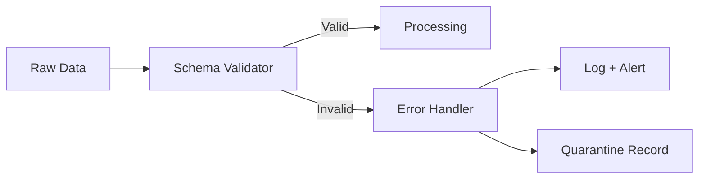

# Schema Validation — Fundamentals

## What Is Schema Validation?

Schema validation verifies that data conforms to a predefined structural contract — correct column names, data types, nullability, and value constraints. It's the first line of defense in any data pipeline.



---

## Pandera — DataFrame Schema Validation

Pandera is the go-to library for validating pandas and Spark DataFrames:

```python
import pandera as pa
from pandera import Column, DataFrameSchema, Check
import pandas as pd

# Define schema
orders_schema = DataFrameSchema(
    columns={
        "order_id": Column(
            dtype=str,
            checks=[Check.str_length(min_value=1), Check(lambda s: ~s.duplicated())],
            nullable=False,
            unique=True,
            description="UUID primary key",
        ),
        "customer_id": Column(dtype=str, nullable=False),
        "amount": Column(
            dtype=float,
            checks=[Check.greater_than(0), Check.less_than_or_equal_to(100_000)],
            nullable=False,
        ),
        "status": Column(
            dtype=str,
            checks=Check.isin(["pending", "shipped", "delivered", "cancelled"]),
            nullable=False,
        ),
        "order_date": Column(dtype="datetime64[ns]", nullable=False),
    },
    checks=[
        # Table-level: must have at least 1 row
        Check(lambda df: len(df) > 0, error="Empty DataFrame"),
    ],
    strict=False,   # Allow extra columns
    coerce=True,    # Auto-cast types where possible
)

# Validate
try:
    validated_df = orders_schema.validate(raw_df)
    print("Schema validation passed ✓")
except pa.errors.SchemaError as e:
    print(f"Schema validation failed: {e}")
```

---

## Pydantic — Row-Level Validation

Use Pydantic to validate individual records (e.g., API payloads, JSON events):

```python
from pydantic import BaseModel, Field, validator, field_validator
from typing import Literal, Optional
from datetime import datetime
from decimal import Decimal
import uuid

class PaymentRecord(BaseModel):
    payment_id: str = Field(..., description="UUID primary key")
    customer_id: str = Field(..., min_length=1)
    amount_usd: Decimal = Field(..., gt=0, le=Decimal("1000000"))
    status: Literal["pending", "processing", "completed", "failed", "refunded"]
    created_at: datetime
    metadata: Optional[dict] = None
    
    @field_validator("payment_id")
    @classmethod
    def validate_uuid(cls, v: str) -> str:
        try:
            uuid.UUID(v)
        except ValueError:
            raise ValueError(f"payment_id must be a valid UUID, got: {v}")
        return v
    
    @field_validator("created_at")
    @classmethod
    def validate_not_future(cls, v: datetime) -> datetime:
        if v > datetime.utcnow():
            raise ValueError("created_at cannot be in the future")
        return v


# Validate a record
try:
    record = PaymentRecord(
        payment_id="550e8400-e29b-41d4-a716-446655440000",
        customer_id="cust_123",
        amount_usd=Decimal("99.99"),
        status="completed",
        created_at=datetime.utcnow(),
    )
    print(f"Valid: {record}")
except Exception as e:
    print(f"Invalid: {e}")


# Batch validation with error collection
def validate_batch(records: list[dict]) -> tuple[list, list]:
    valid, invalid = [], []
    for rec in records:
        try:
            valid.append(PaymentRecord(**rec))
        except Exception as e:
            invalid.append({"record": rec, "error": str(e)})
    return valid, invalid
```

---

## JSON Schema Validation

For JSON-based APIs and event streams:

```python
import jsonschema
from jsonschema import validate, ValidationError

order_json_schema = {
    "$schema": "https://json-schema.org/draft/2020-12/schema",
    "type": "object",
    "required": ["order_id", "customer_id", "amount", "status"],
    "properties": {
        "order_id": {"type": "string", "minLength": 1},
        "customer_id": {"type": "string", "minLength": 1},
        "amount": {"type": "number", "minimum": 0.01, "maximum": 100000},
        "status": {
            "type": "string",
            "enum": ["pending", "shipped", "delivered", "cancelled"]
        },
        "order_date": {"type": "string", "format": "date-time"},
        "items": {
            "type": "array",
            "items": {
                "type": "object",
                "required": ["product_id", "quantity"],
                "properties": {
                    "product_id": {"type": "string"},
                    "quantity": {"type": "integer", "minimum": 1},
                    "unit_price": {"type": "number", "minimum": 0},
                }
            }
        }
    },
    "additionalProperties": False
}

def validate_json(data: dict) -> tuple[bool, str]:
    try:
        validate(instance=data, schema=order_json_schema)
        return True, ""
    except ValidationError as e:
        return False, e.message


valid, error = validate_json({
    "order_id": "ord_001",
    "customer_id": "cust_001",
    "amount": 99.99,
    "status": "pending",
})
print(f"Valid: {valid}, Error: {error}")
```

---

## Avro Schema

For Kafka streaming data:

```python
import fastavro
from io import BytesIO

payment_avro_schema = {
    "type": "record",
    "name": "Payment",
    "namespace": "com.company",
    "fields": [
        {"name": "payment_id", "type": "string"},
        {"name": "customer_id", "type": "string"},
        {"name": "amount_usd", "type": {"type": "bytes", "logicalType": "decimal",
                                         "precision": 18, "scale": 2}},
        {"name": "status", "type": {
            "type": "enum",
            "name": "PaymentStatus",
            "symbols": ["PENDING", "PROCESSING", "COMPLETED", "FAILED"]
        }},
        {"name": "created_at", "type": {"type": "long", "logicalType": "timestamp-millis"}},
        {"name": "metadata", "type": ["null", {"type": "map", "values": "string"}], "default": None},
    ]
}

parsed_schema = fastavro.parse_schema(payment_avro_schema)

# Serialize
record = {
    "payment_id": "pay_001",
    "customer_id": "cust_001",
    "amount_usd": b'\x00\x00\x00\x00\x00\x00\x27\x0f',
    "status": "COMPLETED",
    "created_at": 1705276800000,
    "metadata": None,
}

buffer = BytesIO()
fastavro.schemaless_writer(buffer, parsed_schema, record)
```

---

## Interview Tips

> **Tip 1:** "What's the difference between schema validation and DQ checks?" — Schema validation checks structure (types, names, nullability). DQ checks verify business rules (amount > 0, status in accepted set). Schema validation should run first — bad structure prevents business rule checks from working.

> **Tip 2:** "When would you use Pandera vs Pydantic?" — Pandera for tabular data (DataFrames). Pydantic for record-level validation (API requests, JSON events, row-by-row processing). Both can coexist: Pydantic validates each row as it arrives, Pandera validates the full batch.

> **Tip 3:** "What does `coerce=True` do in Pandera?" — Attempts to cast data to the expected type before validation. E.g., if the schema says `float` but the data has `int`, coerce will cast it. Useful for handling minor type mismatches without failing. Dangerous if coercion silently corrupts data (e.g., coercing "N/A" to float gives NaN).
