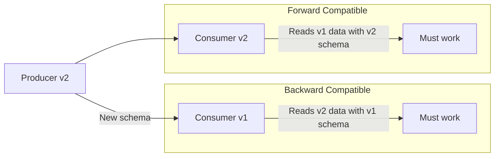

# Schema Validation — Intermediate

## Schema Evolution — Backward and Forward Compatibility



| Compatibility | Rule | Safe Changes |
|---|---|---|
| **Backward** | Old consumers read new data | Add optional field, add enum value |
| **Forward** | New consumers read old data | Remove optional field |
| **Full** | Both directions | Only add/remove optional fields |
| **None** | No guarantees | Any change |

---

## Schema Drift Detection

Detect when incoming data doesn't match the expected schema:

```python
import pandas as pd
from dataclasses import dataclass
from typing import List, Optional

@dataclass
class SchemaDriftResult:
    has_drift: bool
    added_columns: List[str]
    removed_columns: List[str]
    type_changes: List[dict]
    
def detect_schema_drift(
    expected_schema: dict,  # {col: dtype}
    actual_df: pd.DataFrame,
    strict: bool = False,
) -> SchemaDriftResult:
    """
    Compare actual DataFrame schema against expected schema.
    strict=True: extra columns count as drift
    """
    expected_cols = set(expected_schema.keys())
    actual_cols = set(actual_df.columns)
    
    removed = expected_cols - actual_cols   # In expected but not actual
    added = actual_cols - expected_cols     # In actual but not expected
    
    type_changes = []
    for col in expected_cols & actual_cols:
        expected_type = expected_schema[col]
        actual_type = str(actual_df[col].dtype)
        if expected_type not in actual_type:
            type_changes.append({
                "column": col,
                "expected": expected_type,
                "actual": actual_type,
            })
    
    has_drift = bool(removed) or bool(type_changes)
    if strict:
        has_drift = has_drift or bool(added)
    
    return SchemaDriftResult(
        has_drift=has_drift,
        added_columns=list(added),
        removed_columns=list(removed),
        type_changes=type_changes,
    )


# Usage
expected = {
    "order_id": "object",
    "customer_id": "object",
    "amount": "float64",
    "status": "object",
}

result = detect_schema_drift(expected, incoming_df)
if result.has_drift:
    if result.removed_columns:
        raise ValueError(f"Columns removed: {result.removed_columns}")
    if result.type_changes:
        raise TypeError(f"Type changes detected: {result.type_changes}")
    if result.added_columns:
        print(f"Warning: New columns detected: {result.added_columns}")
```

---

## Pandera — Advanced Patterns

### Inheritance for Shared Base Schemas
```python
import pandera as pa
from pandera.typing import DataFrame, Series
from typing import Optional

class BaseSchema(pa.DataFrameModel):
    """Shared fields for all tables."""
    _ingestion_id: Series[str]
    _ingested_at: Series[pa.DateTime]
    _source_system: Series[str]
    
    class Config:
        strict = False
        coerce = True

class OrdersSchema(BaseSchema):
    order_id: Series[str] = pa.Field(unique=True, nullable=False)
    customer_id: Series[str] = pa.Field(nullable=False)
    amount: Series[float] = pa.Field(gt=0, le=100_000)
    status: Series[str] = pa.Field(isin=["pending", "shipped", "delivered"])
    
    @pa.check("amount")
    def check_amount_precision(cls, series: Series) -> bool:
        """Amount should have at most 2 decimal places."""
        return (series.round(2) == series).all()

def process_orders(df: DataFrame[OrdersSchema]) -> DataFrame[OrdersSchema]:
    """Type-annotated function — Pandera validates on call."""
    return df[df["status"] == "shipped"]

# Pandera validates df when process_orders is called
result = process_orders(raw_df)
```

### Lazy Validation — Collect All Errors
```python
import pandera as pa

try:
    orders_schema.validate(df, lazy=True)
except pa.errors.SchemaErrors as e:
    # Returns ALL errors, not just the first one
    print(e.failure_cases)
    # DataFrame with: schema_context, column, check, check_number, failure_case
```

---

## AWS Glue Data Catalog — Schema Management

```python
import boto3

glue = boto3.client("glue", region_name="us-east-1")

def get_table_schema(database: str, table: str) -> dict:
    """Fetch schema from Glue Data Catalog."""
    response = glue.get_table(DatabaseName=database, Name=table)
    return {
        col["Name"]: col["Type"]
        for col in response["Table"]["StorageDescriptor"]["Columns"]
    }

def validate_schema_against_catalog(df: pd.DataFrame, database: str, table: str):
    """Validate DataFrame schema against Glue catalog definition."""
    catalog_schema = get_table_schema(database, table)
    
    violations = []
    for col, expected_type in catalog_schema.items():
        if col not in df.columns:
            violations.append(f"Missing column: {col} (expected type: {expected_type})")
    
    if violations:
        raise ValueError(f"Schema violations vs Glue catalog:\n" + "\n".join(violations))
    
    return True

# Auto-register schema in Glue
def register_schema(df: pd.DataFrame, database: str, table: str, s3_location: str):
    """Register or update table schema in Glue."""
    type_map = {
        "object": "string",
        "int64": "bigint",
        "float64": "double",
        "bool": "boolean",
        "datetime64[ns]": "timestamp",
    }
    
    columns = [
        {"Name": col, "Type": type_map.get(str(dtype), "string")}
        for col, dtype in df.dtypes.items()
    ]
    
    glue.create_table(
        DatabaseName=database,
        TableInput={
            "Name": table,
            "StorageDescriptor": {
                "Columns": columns,
                "Location": s3_location,
                "InputFormat": "org.apache.hadoop.mapred.TextInputFormat",
                "OutputFormat": "org.apache.hadoop.hive.ql.io.HiveIgnoreKeyTextOutputFormat",
                "SerdeInfo": {
                    "SerializationLibrary": "org.apache.hadoop.hive.ql.io.parquet.serde.ParquetHiveSerDe"
                },
            },
            "TableType": "EXTERNAL_TABLE",
        }
    )
```

---

## dbt Schema Tests

dbt's built-in schema tests are schema validation for SQL models:

```yaml
# models/schema.yml
models:
  - name: orders
    columns:
      - name: order_id
        tests:
          - not_null
          - unique
      - name: customer_id
        tests:
          - not_null
          - relationships:
              to: ref('customers')
              field: customer_id
      - name: status
        tests:
          - accepted_values:
              values: ['pending', 'shipped', 'delivered', 'cancelled']
      - name: amount
        tests:
          - not_null
          - dbt_utils.expression_is_true:
              expression: "> 0"
```

---

## Interview Tips

> **Tip 1:** "What causes schema drift and how do you catch it early?" — Schema drift is caused by upstream changes (column renames, type changes, new columns) without notice. Catch it with: (1) schema validation at ingestion, (2) automated schema comparison on every batch, (3) schema registry with compatibility checks.

> **Tip 2:** "How do you validate schema for a streaming pipeline?" — Use Avro/Protobuf + Schema Registry. Schema ID is embedded in each Kafka message. Consumer uses the ID to fetch the schema and deserialize. Incompatible schema = deserialization failure = goes to DLQ.

> **Tip 3:** "What's strict mode in Pandera?" — `strict=True` fails if the DataFrame has any columns not in the schema. `strict=False` allows extra columns. Use strict for tightly controlled outputs, non-strict for ingestion where the source may add new columns.
