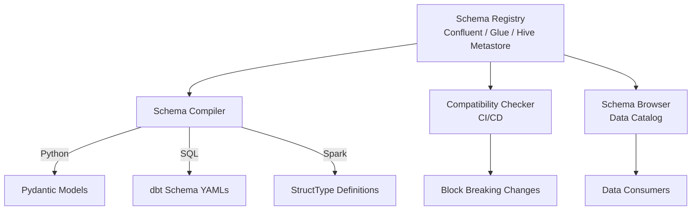

# Schema Validation — Senior Deep Dive

## Schema Governance at the Platform Level

Senior engineers think about schema as a platform concern — not a per-pipeline problem:



The key insight: **generate code from schema, not schema from code**.

---

## Protobuf Schema — Production Streaming

```protobuf
// proto/payments/payment.proto
syntax = "proto3";
package com.company.payments;

import "google/protobuf/timestamp.proto";

enum PaymentStatus {
  PAYMENT_STATUS_UNKNOWN = 0;   // proto3: always include default 0 value
  PAYMENT_STATUS_PENDING = 1;
  PAYMENT_STATUS_PROCESSING = 2;
  PAYMENT_STATUS_COMPLETED = 3;
  PAYMENT_STATUS_FAILED = 4;
  PAYMENT_STATUS_REFUNDED = 5;
}

message Payment {
  string payment_id = 1;
  string customer_id = 2;
  
  // Use int64 for money (store cents to avoid float precision issues)
  int64 amount_cents = 3;
  string currency_code = 4;
  
  PaymentStatus status = 5;
  google.protobuf.Timestamp created_at = 6;
  
  // Optional metadata map
  map<string, string> metadata = 7;
  
  // Reserved field numbers for future use (prevent accidental reuse)
  reserved 8, 9, 10;
  reserved "legacy_amount_float";
}
```

```python
# Generated Python code usage
from payment_pb2 import Payment, PaymentStatus
from google.protobuf.timestamp_pb2 import Timestamp
from datetime import datetime

payment = Payment(
    payment_id="pay_001",
    customer_id="cust_001",
    amount_cents=9999,      # $99.99
    currency_code="USD",
    status=PaymentStatus.PAYMENT_STATUS_COMPLETED,
)
payment.created_at.FromDatetime(datetime.utcnow())

# Serialize
serialized = payment.SerializeToString()

# Deserialize + validate (Protobuf validates field types)
p2 = Payment()
p2.ParseFromString(serialized)
print(f"Amount: ${p2.amount_cents / 100:.2f}")
```

---

## Apache Iceberg — Schema Evolution

Iceberg handles schema evolution safely at the table format level:

```python
from pyiceberg.catalog import load_catalog
from pyiceberg.schema import Schema
from pyiceberg.types import (
    NestedField, StringType, LongType, DoubleType, TimestampType
)

catalog = load_catalog("glue", **{"type": "glue"})

# Original schema
original_schema = Schema(
    NestedField(1, "order_id", StringType(), required=True),
    NestedField(2, "customer_id", StringType(), required=True),
    NestedField(3, "amount", DoubleType(), required=True),
    NestedField(4, "created_at", TimestampType(), required=True),
)

table = catalog.create_table(
    "warehouse.orders",
    schema=original_schema,
    location="s3://bucket/warehouse/orders/",
)

# Safe schema evolution: add optional column
with table.update_schema() as update:
    update.add_column("status", StringType(), doc="Order status")

# Rename column (tracked by field ID, not name)
with table.update_schema() as update:
    update.rename_column("amount", "amount_usd")

# Old Parquet files still readable — Iceberg maps by field ID
# No rewriting required
```

---

## Schema Validation in PySpark

```python
from pyspark.sql import SparkSession
from pyspark.sql.types import (
    StructType, StructField, StringType, DoubleType, TimestampType, LongType
)
from pyspark.sql.functions import col
from typing import List, Tuple

ORDERS_SCHEMA = StructType([
    StructField("order_id", StringType(), nullable=False),
    StructField("customer_id", StringType(), nullable=False),
    StructField("amount", DoubleType(), nullable=False),
    StructField("status", StringType(), nullable=False),
    StructField("created_at", TimestampType(), nullable=False),
])

def validate_spark_schema(
    df,
    expected_schema: StructType,
    strict: bool = True,
) -> Tuple[bool, List[str]]:
    """Validate Spark DataFrame schema."""
    violations = []
    
    expected_fields = {f.name: f for f in expected_schema.fields}
    actual_fields = {f.name: f for f in df.schema.fields}
    
    # Missing required columns
    for name, field in expected_fields.items():
        if name not in actual_fields:
            violations.append(f"Missing column: {name} ({field.dataType})")
        else:
            # Type mismatch
            if actual_fields[name].dataType != field.dataType:
                violations.append(
                    f"Type mismatch for {name}: "
                    f"expected {field.dataType}, got {actual_fields[name].dataType}"
                )
    
    if strict:
        extra = set(actual_fields) - set(expected_fields)
        if extra:
            violations.append(f"Unexpected columns: {extra}")
    
    return len(violations) == 0, violations


spark = SparkSession.builder.getOrCreate()
df = spark.read.parquet("s3://bucket/orders/dt=2024-01-15/")

# Apply expected schema at read time (safest approach)
df_typed = spark.read.schema(ORDERS_SCHEMA).parquet("s3://bucket/orders/dt=2024-01-15/")

# Or validate after reading
valid, violations = validate_spark_schema(df, ORDERS_SCHEMA)
if not valid:
    raise ValueError(f"Schema violations: {violations}")
```

---

## Schema as Code — CI/CD Pipeline

```yaml
# .github/workflows/schema-check.yml
name: Schema Validation

on:
  pull_request:
    paths:
      - 'schemas/**'
      - 'proto/**'

jobs:
  schema-validation:
    runs-on: ubuntu-latest
    steps:
      - uses: actions/checkout@v4
      
      - name: Validate JSON Schemas
        run: |
          python -c "
          import json, jsonschema, glob
          meta_schema = json.load(open('schemas/meta-schema.json'))
          for path in glob.glob('schemas/**/*.json', recursive=True):
              schema = json.load(open(path))
              jsonschema.validate(schema, meta_schema)
              print(f'Valid: {path}')
          "
      
      - name: Check Protobuf compilation
        run: |
          protoc --python_out=. proto/**/*.proto
      
      - name: Check Avro compatibility
        run: |
          python scripts/check_avro_compatibility.py \
            --registry-url ${{ secrets.SCHEMA_REGISTRY_URL }} \
            --schemas-dir schemas/avro/
      
      - name: Run schema tests
        run: pytest tests/schema/ -v
```

---

## Interview Tips

> **Tip 1:** "Why use Protobuf over Avro for Kafka?" — Protobuf: strongly typed, better IDE support, forward/backward compat with field numbers, not schema-ID-dependent for deserialization. Avro: schema embedded (or via registry), better for polyglot environments, simpler schema. Protobuf is preferred when the producer and consumer are both in a language with good proto support.

> **Tip 2:** "How does Iceberg handle schema evolution without rewriting files?" — Iceberg uses field IDs (not names) to track columns. When you rename a column, old Parquet files still have the old name but the same field ID. Iceberg maps both to the new name. No data rewrite needed.

> **Tip 3:** "What's the most common cause of production schema failures?" — Undocumented schema changes from external teams / third-party vendors. Solution: schema registry + compatibility checks + monitoring for schema drift in every batch.
