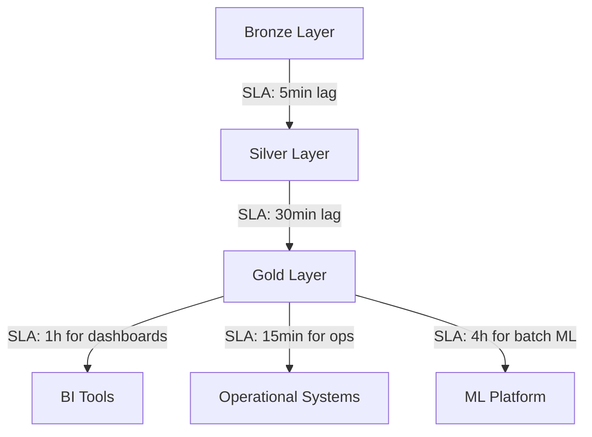

# SLA Monitoring — Intermediate

## Multi-Tier SLA Architecture

Different consumers need different SLAs. Structure your monitoring to reflect this:



```python
from dataclasses import dataclass, field
from typing import List
from enum import Enum

class SLATier(Enum):
    REALTIME = "realtime"   # < 5 minutes
    NEAR_REALTIME = "near_realtime"  # < 30 minutes
    BATCH = "batch"         # < 24 hours
    WEEKLY = "weekly"       # < 7 days

@dataclass
class LayeredSLA:
    """SLA definition with cascade — downstream SLAs depend on upstream."""
    table: str
    tier: SLATier
    max_lag_minutes: int
    depends_on: List[str] = field(default_factory=list)
    business_impact: str = ""
    owner: str = ""
    
    def breach_message(self, actual_lag_minutes: float) -> str:
        over_by = actual_lag_minutes - self.max_lag_minutes
        return (
            f"SLA BREACH: {self.table}\n"
            f"  SLA: {self.max_lag_minutes} min | Actual: {actual_lag_minutes:.0f} min | Over by: {over_by:.0f} min\n"
            f"  Impact: {self.business_impact}\n"
            f"  Owner: {self.owner}"
        )


# Define the full SLA hierarchy
SLA_CATALOG = [
    LayeredSLA(
        table="bronze.orders_raw",
        tier=SLATier.REALTIME,
        max_lag_minutes=5,
        business_impact="Delays all downstream processing",
        owner="platform-team",
    ),
    LayeredSLA(
        table="silver.orders",
        tier=SLATier.NEAR_REALTIME,
        max_lag_minutes=30,
        depends_on=["bronze.orders_raw"],
        business_impact="Ops team cannot see recent orders",
        owner="data-engineering",
    ),
    LayeredSLA(
        table="gold.revenue_daily",
        tier=SLATier.BATCH,
        max_lag_minutes=60,
        depends_on=["silver.orders", "silver.payments"],
        business_impact="Finance dashboard shows stale revenue",
        owner="analytics",
    ),
]
```

---

## Error Budget — Production SLA Management

Error budgets quantify how much downtime/breach you can afford:

```python
from datetime import datetime, timedelta

class ErrorBudgetTracker:
    """Track SLA error budget consumption for a given period."""
    
    def __init__(self, sla_pct: float = 99.9, period_days: int = 30):
        """
        sla_pct: Target availability (e.g., 99.9%)
        period_days: Measurement period
        """
        self.sla_pct = sla_pct
        self.period_days = period_days
        
        # Total minutes in period
        self.total_minutes = period_days * 24 * 60
        
        # Allowed downtime minutes
        self.budget_minutes = self.total_minutes * (1 - sla_pct / 100)
    
    def compute(self, breaches: list[dict]) -> dict:
        """
        breaches: list of {"start": datetime, "end": datetime}
        """
        breach_minutes = sum(
            (b["end"] - b["start"]).total_seconds() / 60
            for b in breaches
        )
        
        remaining_minutes = self.budget_minutes - breach_minutes
        budget_consumed_pct = breach_minutes / self.budget_minutes * 100 if self.budget_minutes > 0 else 100
        
        actual_availability = (self.total_minutes - breach_minutes) / self.total_minutes * 100
        
        return {
            "period_days": self.period_days,
            "sla_target_pct": self.sla_pct,
            "actual_availability_pct": round(actual_availability, 4),
            "total_budget_minutes": round(self.budget_minutes, 1),
            "consumed_minutes": round(breach_minutes, 1),
            "remaining_minutes": round(remaining_minutes, 1),
            "budget_consumed_pct": round(budget_consumed_pct, 1),
            "sla_met": actual_availability >= self.sla_pct,
            "burn_rate": round(budget_consumed_pct / (datetime.utcnow().day / self.period_days), 1),
        }


# Usage
tracker = ErrorBudgetTracker(sla_pct=99.5, period_days=30)
breaches = [
    {"start": datetime(2024, 1, 5, 14, 0), "end": datetime(2024, 1, 5, 15, 30)},  # 90 min
    {"start": datetime(2024, 1, 12, 8, 0), "end": datetime(2024, 1, 12, 8, 20)},  # 20 min
]
report = tracker.compute(breaches)
print(f"Budget remaining: {report['remaining_minutes']:.0f} min ({100 - report['budget_consumed_pct']:.1f}% left)")
print(f"Burn rate: {report['burn_rate']}x (>100% = will breach SLA by month end)")
```

---

## Pipeline Latency SLA Tracking

Track end-to-end latency from source event to Gold layer:

```python
import pandas as pd
import sqlalchemy as sa

def measure_pipeline_latency(engine, lookback_hours: int = 24) -> pd.DataFrame:
    """
    Measure end-to-end latency per pipeline run.
    Requires: pipeline_runs table with (run_id, layer, start_time, end_time, status)
    """
    
    latency_query = """
    WITH bronze AS (
        SELECT run_id, start_time AS bronze_start, end_time AS bronze_end
        FROM pipeline_runs WHERE layer = 'bronze'
    ),
    silver AS (
        SELECT run_id, end_time AS silver_end
        FROM pipeline_runs WHERE layer = 'silver'
    ),
    gold AS (
        SELECT run_id, end_time AS gold_end
        FROM pipeline_runs WHERE layer = 'gold'
    )
    SELECT
        b.run_id,
        b.bronze_start AS source_time,
        g.gold_end AS delivery_time,
        EXTRACT(EPOCH FROM (g.gold_end - b.bronze_start)) / 60 AS e2e_latency_minutes,
        EXTRACT(EPOCH FROM (s.silver_end - b.bronze_start)) / 60 AS bronze_to_silver_minutes,
        EXTRACT(EPOCH FROM (g.gold_end - s.silver_end)) / 60 AS silver_to_gold_minutes
    FROM bronze b
    JOIN silver s ON b.run_id = s.run_id
    JOIN gold g ON b.run_id = g.run_id
    WHERE b.bronze_start >= NOW() - INTERVAL ':hours hours'
    ORDER BY b.bronze_start DESC
    """
    
    with engine.connect() as conn:
        df = pd.read_sql(latency_query, conn, params={"hours": lookback_hours})
    
    # SLA: e2e must be < 60 minutes
    df["sla_breach"] = df["e2e_latency_minutes"] > 60
    
    summary = {
        "p50_latency": df["e2e_latency_minutes"].quantile(0.5),
        "p95_latency": df["e2e_latency_minutes"].quantile(0.95),
        "p99_latency": df["e2e_latency_minutes"].quantile(0.99),
        "max_latency": df["e2e_latency_minutes"].max(),
        "breach_count": df["sla_breach"].sum(),
        "breach_rate_pct": df["sla_breach"].mean() * 100,
    }
    
    return df, summary
```

---

## Prometheus + Grafana for DQ SLA Monitoring

```python
# Custom Prometheus metrics for DQ SLAs
from prometheus_client import Gauge, Counter, Histogram, start_http_server

# Metrics
data_freshness_hours = Gauge(
    "data_freshness_hours",
    "Hours since last data update",
    ["table_name", "layer"]
)

sla_breach_total = Counter(
    "data_sla_breach_total",
    "Total SLA breaches",
    ["table_name", "sla_type", "severity"]
)

pipeline_latency_minutes = Histogram(
    "pipeline_latency_minutes",
    "End-to-end pipeline latency",
    ["pipeline_name"],
    buckets=[5, 15, 30, 60, 120, 240]
)

def update_freshness_metrics(engine):
    """Update Prometheus gauges with current freshness data."""
    tables = {
        ("orders", "gold"): "SELECT MAX(updated_at) FROM gold.orders",
        ("customers", "silver"): "SELECT MAX(updated_at) FROM silver.customers",
    }
    
    for (table, layer), query in tables.items():
        with engine.connect() as conn:
            max_ts = conn.execute(sa.text(query)).scalar()
        
        if max_ts:
            age_hours = (datetime.utcnow() - max_ts).total_seconds() / 3600
            data_freshness_hours.labels(table_name=table, layer=layer).set(age_hours)

# Grafana dashboard then alerts when freshness_hours > SLA threshold
```

---

## Interview Tips

> **Tip 1:** "What is an error budget and how do you use it?" — Error budget = (1 - SLA target) × period. For 99.9% SLA over 30 days = 43.2 minutes of allowed downtime. When the budget is consumed, you freeze new feature deploys and focus on reliability. It creates shared incentives between engineering and business.

> **Tip 2:** "How do you handle SLA breaches that aren't caused by your pipeline?" — Track upstream dependencies. If the source system was late (e.g., nightly batch delayed by 2 hours), that's an upstream SLA breach, not yours. Document dependency SLAs and separate your availability from upstream availability in reporting.

> **Tip 3:** "How do you set realistic SLA targets?" — Start by measuring actual performance for 30 days. Set SLA at p90 latency with a 20% buffer. Never commit to p99 as your SLA unless the business truly needs it — outlier runs will constantly breach it.
