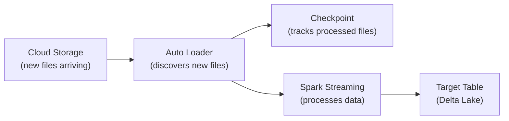

# Auto Loader — Fundamentals

## What Is Auto Loader?

Auto Loader is Databricks' **incremental file ingestion** solution. It automatically discovers and processes new files as they arrive in cloud storage (S3, ADLS, GCS) — without you tracking which files have already been loaded.

```python
# Without Auto Loader: manual tracking of processed files
processed_files = get_already_processed()  # You maintain this state
new_files = list_all_files() - processed_files  # You scan the directory
df = spark.read.parquet(new_files)  # You read only new ones
# Error-prone, slow at scale, complex state management

# With Auto Loader: automatic, exactly-once, efficient
df = (spark.readStream
    .format("cloudFiles")
    .option("cloudFiles.format", "json")
    .load("s3://bucket/landing/events/")
)
# Auto Loader handles: discovery, dedup, checkpointing, schema evolution
```

> **Key Insight for DE:** Auto Loader solves the "new files" problem that every data pipeline faces. It replaces custom file-tracking logic with a managed, exactly-once ingestion primitive.

---

## How It Works

The following diagram shows Auto Loader's architecture:



Auto Loader detects new files via cloud event notifications (fast) or directory listing (simpler), tracks which files have been processed in a checkpoint, and processes them as a Spark Structured Streaming job.

---

## Basic Usage

```python
# Minimal Auto Loader: ingest JSON files into a Delta table
df = (spark.readStream
    .format("cloudFiles")                    # Auto Loader format
    .option("cloudFiles.format", "json")     # Source file format
    .option("cloudFiles.schemaLocation", "/checkpoints/events_schema/")  # Schema inference
    .load("s3://data-lake/landing/events/")  # Source path
)

# Write to Delta table
(df.writeStream
    .option("checkpointLocation", "/checkpoints/events/")  # Track progress
    .trigger(availableNow=True)              # Process all available, then stop
    .toTable("production.raw.events")        # Target Delta table
)
```

### File Formats Supported

| Format | Option Value | Common Source |
|--------|-------------|--------------|
| JSON | `json` | APIs, application logs |
| CSV | `csv` | Legacy systems, exports |
| Parquet | `parquet` | Data lake transfers |
| Avro | `avro` | Kafka dumps, CDC |
| ORC | `orc` | Hive ecosystem |
| Text | `text` | Raw logs |
| Binary | `binaryFile` | Images, PDFs |

```python
# CSV with options
df = (spark.readStream
    .format("cloudFiles")
    .option("cloudFiles.format", "csv")
    .option("header", "true")
    .option("delimiter", "|")
    .option("cloudFiles.schemaLocation", "/checkpoints/csv_schema/")
    .load("s3://bucket/landing/csv_files/")
)

# Parquet (no schema inference needed — schema is in the file)
df = (spark.readStream
    .format("cloudFiles")
    .option("cloudFiles.format", "parquet")
    .load("s3://bucket/landing/parquet_files/")
)
```

---

## File Discovery Modes

### Notification Mode (Recommended for Production)

Uses cloud event notifications (S3 Events, Azure Event Grid, GCS Pub/Sub) for near-instant detection of new files.

```python
df = (spark.readStream
    .format("cloudFiles")
    .option("cloudFiles.format", "json")
    .option("cloudFiles.useNotifications", "true")  # Use cloud events
    .load("s3://bucket/landing/events/")
)
# Detects new files within seconds of arrival
# Auto Loader sets up SQS queue + S3 event notification automatically
```

### Directory Listing Mode (Simpler Setup)

Periodically lists the directory to find new files. No cloud infrastructure needed.

```python
df = (spark.readStream
    .format("cloudFiles")
    .option("cloudFiles.format", "json")
    .option("cloudFiles.useNotifications", "false")  # Directory listing
    .load("s3://bucket/landing/events/")
)
# Slower detection (depends on listing interval)
# But simpler — no SQS/EventGrid setup needed
# Good for: development, small volumes, cross-account without notification access
```

| Mode | Detection Speed | Setup Complexity | Cost | Best For |
|------|----------------|-----------------|------|----------|
| Notification | Seconds | Auto-configured | Low (SQS/EventGrid) | Production |
| Directory Listing | Minutes | Zero | API listing calls | Dev, small volume |

---

## Schema Inference and Evolution

Auto Loader can detect and adapt to schema changes automatically:

```python
df = (spark.readStream
    .format("cloudFiles")
    .option("cloudFiles.format", "json")
    .option("cloudFiles.inferColumnTypes", "true")     # Infer types (not all strings)
    .option("cloudFiles.schemaEvolutionMode", "addNewColumns")  # Handle new columns
    .option("cloudFiles.schemaLocation", "/checkpoints/schema/")
    .load("s3://bucket/landing/events/")
)

# Schema evolution modes:
# "addNewColumns" — new columns in files are added to the schema automatically
# "rescue" — unknown columns go to a _rescued_data column (safest)
# "failOnNewColumns" — job fails if schema changes (strictest)
# "none" — ignore new columns
```

### Rescued Data Column

```python
# With rescue mode: unexpected fields go to _rescued_data instead of failing
df = (spark.readStream
    .format("cloudFiles")
    .option("cloudFiles.format", "json")
    .option("cloudFiles.schemaEvolutionMode", "rescue")
    .load("s3://bucket/landing/")
)

# If a file has a new field "loyalty_tier" not in the schema:
# |user_id|name  |email          |_rescued_data                    |
# |1001   |Alice |alice@co.com   |{"loyalty_tier": "gold"}         |
# The data isn't lost — it's captured for later handling
```

---

## Trigger Modes

| Trigger | Behavior | Use Case |
|---------|----------|----------|
| `availableNow=True` | Process all available, then stop | Batch-style ETL (Airflow triggered) |
| `processingTime="5 minutes"` | Run continuously, micro-batch every 5 min | Near-real-time |
| `once=True` (deprecated) | Process one batch, stop | Legacy, use availableNow instead |
| No trigger (default) | Continuous micro-batches | Always-on streaming |

```python
# Batch-style (most common for data engineering):
# Run by Airflow/Workflow, process new files, stop
(df.writeStream
    .trigger(availableNow=True)
    .option("checkpointLocation", "/checkpoints/events/")
    .toTable("production.raw.events")
)
# Job exits after processing all available files

# Near-real-time (always running):
(df.writeStream
    .trigger(processingTime="1 minute")
    .option("checkpointLocation", "/checkpoints/events/")
    .toTable("production.raw.events")
)
# Processes new files every 1 minute, runs indefinitely
```

---

## Checkpointing (Exactly-Once Guarantee)

The checkpoint tracks which files have been processed:

```python
# The checkpoint location stores:
# 1. List of files already processed (won't re-read them)
# 2. Current schema (for schema evolution)
# 3. Stream offsets (for exactly-once semantics)

(df.writeStream
    .option("checkpointLocation", "/checkpoints/events/")  # CRITICAL: never change this!
    .toTable("production.raw.events")
)

# Rules:
# - One checkpoint per stream (don't share between pipelines)
# - Never delete the checkpoint (you'll reprocess all files!)
# - Never change the checkpoint path (creates a new stream)
# - Checkpoints are small (metadata only, not data)
```

---

## Common Patterns

### Landing Zone → Raw Table

```python
# Standard ingestion pattern: files land in S3, Auto Loader picks them up
raw_df = (spark.readStream
    .format("cloudFiles")
    .option("cloudFiles.format", "json")
    .option("cloudFiles.schemaLocation", "/checkpoints/events_schema/")
    .load("s3://data-lake/landing/events/")
)

# Add metadata columns (when was the file processed, which file was it)
from pyspark.sql.functions import current_timestamp, input_file_name

enriched_df = (raw_df
    .withColumn("_ingested_at", current_timestamp())
    .withColumn("_source_file", input_file_name())
)

# Write to raw Delta table
(enriched_df.writeStream
    .trigger(availableNow=True)
    .option("checkpointLocation", "/checkpoints/events_raw/")
    .toTable("production.raw.events")
)
```

---

## Interview Tips

> **Tip 1:** "What is Auto Loader and when do you use it?" — Auto Loader incrementally ingests new files from cloud storage into Delta tables. Use it whenever files arrive over time (landing zone pattern, CDC exports, log files). It handles file discovery, deduplication, schema evolution, and exactly-once guarantees automatically.

> **Tip 2:** "Notification mode vs directory listing?" — Notification uses cloud events (SQS/EventGrid) for near-instant detection of new files. Directory listing scans the folder periodically. Use notification for production (faster, cheaper at scale), listing for development or when you can't set up notifications (cross-account access).

> **Tip 3:** "How does exactly-once work?" — The checkpoint tracks every file that's been processed. If the job restarts, it reads the checkpoint and skips already-processed files. Combined with Delta Lake's transactional writes, this guarantees each file is processed exactly once — even across failures and restarts.
