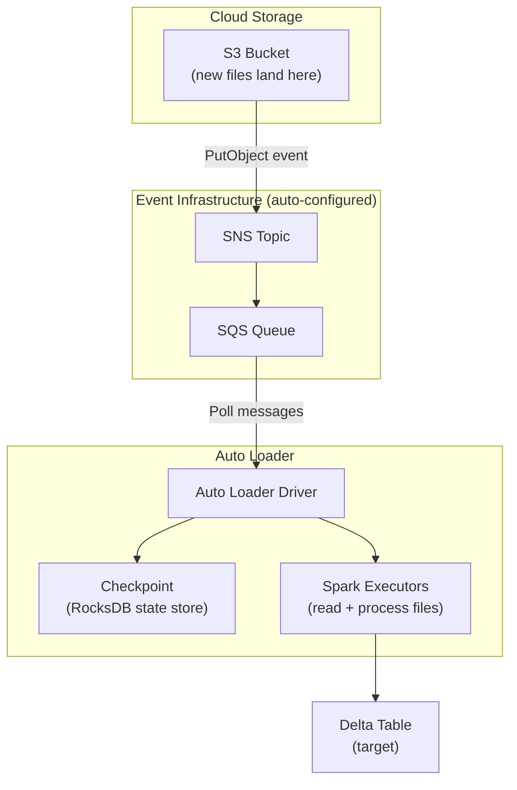

# Auto Loader — Senior-Level Deep Dive

## Internals: How File Discovery Works

### Notification Mode Architecture



Auto Loader's notification mode creates SNS+SQS infrastructure automatically. When a new file lands in S3, the event flows through SNS → SQS → Auto Loader driver, which adds it to the processing queue.

### Incremental Listing Optimization

For directory listing mode, Auto Loader uses an optimized incremental approach:

```python
# Standard directory listing: lists ALL files every time → O(n) always
# Auto Loader incremental listing: only lists files NEWER than last checkpoint

# For S3: uses ListObjectsV2 with StartAfter parameter
# Only lists objects with keys lexicographically after the last processed file
# This reduces API calls from O(total_files) to O(new_files)

# Configuration for incremental listing:
df = (spark.readStream
    .format("cloudFiles")
    .option("cloudFiles.format", "json")
    .option("cloudFiles.useNotifications", "false")  # Directory listing
    .option("cloudFiles.useIncrementalListing", "true")  # Optimized listing
    .load("s3://bucket/landing/events/")
)
# Works well when files are named with timestamps or sequential IDs
# Does NOT work well if files arrive with random names scattered in the key space
```

---

## Exactly-Once Semantics Deep Dive

### How Exactly-Once is Achieved

```python
# Auto Loader's exactly-once guarantee relies on TWO mechanisms:

# 1. SOURCE SIDE: File-level deduplication in checkpoint
#    - RocksDB state store tracks every file path ever processed
#    - Even if the same file appears in notifications twice, it's processed once
#    - Checkpoint is durable (survives job restarts)

# 2. SINK SIDE: Delta Lake transactional writes
#    - Each micro-batch is written as an atomic Delta transaction
#    - If a batch fails mid-write, it's rolled back (no partial data)
#    - On retry, the same batch produces the same output (idempotent)

# Together: file discovered exactly once + written exactly once = end-to-end exactly-once
```

### Checkpoint Recovery Scenarios

```python
# Scenario 1: Job crashes after reading files but before writing
# - Checkpoint did NOT advance (write didn't commit)
# - On restart: same files re-read and processed
# - Delta write succeeds this time
# - Result: exactly-once (files not marked processed until write commits)

# Scenario 2: Job crashes after writing but before checkpoint advances
# - This CAN'T happen: checkpoint advances AS PART OF the write commit
# - Structured Streaming's write-ahead log ensures atomicity

# Scenario 3: Duplicate SQS messages (at-least-once delivery)
# - SQS may deliver the same message multiple times
# - Auto Loader deduplicates using the file path in its state store
# - Same file never processed twice regardless of delivery count
```

---

## Scaling for High-Volume Ingestion

### Processing 100K+ Files per Hour

```python
# Challenge: 100K files/hour arriving in a landing zone
# Each file: 1-10 MB (JSON/Parquet)

# Configuration for high throughput:
df = (spark.readStream
    .format("cloudFiles")
    .option("cloudFiles.format", "parquet")
    .option("cloudFiles.useNotifications", "true")
    
    # Batch sizing
    .option("cloudFiles.maxFilesPerTrigger", "10000")  # Large batches
    .option("cloudFiles.maxBytesPerTrigger", "50g")    # Cap total bytes
    
    # Parallelism
    .option("cloudFiles.numFileNotificationWorkers", "4")  # Parallel SQS polling
    
    .load("s3://bucket/high-volume-landing/")
)

# Write with optimized Delta settings
(df.writeStream
    .option("checkpointLocation", "/checkpoints/high_volume/")
    .option("maxRecordsPerFile", "5000000")  # Control output file size
    .trigger(processingTime="2 minutes")     # Process every 2 minutes
    .toTable("production.raw.high_volume_events")
)

# Cluster sizing for 100K files/hour:
# - Driver: 32 GB RAM (holds file list + checkpoint state)
# - Workers: 8-16 nodes with 16 GB each (parallel file reading)
# - Auto-scaling: min 4, max 16 workers (burst capacity)
```

### State Store Management

```python
# The checkpoint state store grows over time (one entry per processed file)
# For high-volume: 100K files/hour × 24 hours × 365 days = ~876M entries/year!

# Mitigation 1: Set file expiry (Auto Loader won't reprocess expired files anyway)
df = (spark.readStream
    .format("cloudFiles")
    .option("cloudFiles.format", "json")
    .option("cloudFiles.useNotifications", "true")
    # After 7 days, remove file entries from state (they won't arrive again)
    .option("cloudFiles.fileCompletedCommitRecordsInterval", "7 days")
    .load("s3://bucket/landing/")
)

# Mitigation 2: Organize files by date partitions (reduces listing scope)
# s3://bucket/landing/date=2024-03-15/file_001.json
# Auto Loader only needs to track recent partition's files
```

---

## Multi-Source Ingestion Architecture

```python
# Pattern: Multiple landing zones, each with its own Auto Loader stream
# All feeding into a unified raw layer

streams = [
    {
        "name": "api_events",
        "source": "s3://bucket/landing/api-events/",
        "format": "json",
        "target": "production.raw.api_events",
    },
    {
        "name": "cdc_orders",
        "source": "s3://bucket/landing/cdc/orders/",
        "format": "avro",
        "target": "production.raw.orders_cdc",
    },
    {
        "name": "partner_data",
        "source": "s3://bucket/landing/partner/",
        "format": "csv",
        "target": "production.raw.partner_data",
    },
]

# Deploy each as a separate streaming query (independent checkpoints)
active_streams = []
for config in streams:
    df = (spark.readStream
        .format("cloudFiles")
        .option("cloudFiles.format", config["format"])
        .option("cloudFiles.schemaLocation", f"/checkpoints/{config['name']}_schema/")
        .load(config["source"])
    )
    
    query = (df.writeStream
        .option("checkpointLocation", f"/checkpoints/{config['name']}/")
        .trigger(availableNow=True)
        .toTable(config["target"])
    )
    active_streams.append(query)

# Each stream is independent:
# - Separate checkpoint (one failure doesn't affect others)
# - Different schemas and formats
# - Can be scheduled independently in a Databricks Workflow
```

---

## Auto Loader vs COPY INTO

| Aspect | Auto Loader | COPY INTO |
|--------|-------------|-----------|
| Mechanism | Streaming (stateful) | SQL command (stateless tracking) |
| File tracking | Checkpoint (built-in) | Target table metadata |
| Schema evolution | Full support | Limited |
| Performance at scale | Better (notification mode) | OK for small volumes |
| Complexity | Slightly higher (streaming) | Simpler (SQL command) |
| Exactly-once | Guaranteed | Guaranteed (idempotent) |
| Best for | High-volume, continuous | Ad-hoc loads, simple cases |

```sql
-- COPY INTO: simpler but less capable
COPY INTO production.raw.events
FROM 's3://bucket/landing/events/'
FILEFORMAT = JSON
FORMAT_OPTIONS ('inferSchema' = 'true')
COPY_OPTIONS ('mergeSchema' = 'true');
-- Tracks loaded files in target table metadata (no separate checkpoint)
-- Good for: simple batch loads, ad-hoc data loading
-- Bad for: continuous ingestion, complex schema evolution, high volume
```

---

## Monitoring and Alerting

```python
from pyspark.sql.functions import col, current_timestamp

class AutoLoaderMonitor:
    """Monitor Auto Loader health and alert on issues."""
    
    def check_pipeline_health(self, table_name: str, max_stale_hours: int = 2):
        """Alert if pipeline hasn't ingested data recently."""
        last_update = spark.sql(f"""
            SELECT MAX(_ingested_at) as last_ingest
            FROM {table_name}
        """).collect()[0]["last_ingest"]
        
        hours_stale = (datetime.now() - last_update).total_seconds() / 3600
        
        if hours_stale > max_stale_hours:
            alert(f"Pipeline stale: {table_name} last updated {hours_stale:.1f} hours ago")
    
    def check_rescued_data(self, table_name: str, threshold_pct: float = 5.0):
        """Alert if too many rows have rescued (unexpected) data."""
        stats = spark.sql(f"""
            SELECT 
                COUNT(*) as total,
                SUM(CASE WHEN _rescued_data IS NOT NULL THEN 1 ELSE 0 END) as rescued
            FROM {table_name}
            WHERE _ingested_at >= current_timestamp() - INTERVAL 1 HOUR
        """).collect()[0]
        
        if stats["total"] > 0:
            rescued_pct = stats["rescued"] / stats["total"] * 100
            if rescued_pct > threshold_pct:
                alert(f"Schema drift: {rescued_pct:.1f}% of rows have rescued data in {table_name}")
    
    def check_file_backlog(self, checkpoint_path: str):
        """Alert if files are accumulating faster than processing."""
        # Read streaming metrics
        # If numFilesOutstanding grows over time → pipeline can't keep up
        pass
```

---

## Interview Tips

> **Tip 1:** "How does Auto Loader achieve exactly-once semantics?" — Two-layer guarantee: (1) Source dedup — checkpoint state store tracks every processed file path (even if notification delivers duplicates), (2) Sink atomicity — Delta Lake writes are transactional (partial batches are rolled back). The checkpoint only advances after a successful Delta commit, so crashes between read and write result in safe re-processing.

> **Tip 2:** "Auto Loader vs COPY INTO?" — Auto Loader: streaming-based, supports schema evolution, notification mode for instant detection, scales to millions of files. COPY INTO: SQL command, simpler for ad-hoc loads, limited schema evolution, uses directory listing only. Use Auto Loader for production ETL pipelines; COPY INTO for one-off or simple batch loads.

> **Tip 3:** "How do you handle 100K+ files per hour?" — Notification mode (SQS-based, no directory listing bottleneck), large batch sizes (maxFilesPerTrigger=10000), parallel notification workers, auto-scaling cluster (burst capacity for peaks), and date-partitioned source files to limit state store growth. Monitor: file backlog, processing time per batch, and rescued data rate.

## ⚡ Cheat Sheet

**Format detection**
- `cloudFiles.inferColumnTypes=true` → samples 1/1000 files; disable in prod with explicit schema
- `cloudFiles.schemaEvolutionMode`: `addNewColumns` (default) | `rescue` | `failOnNewColumns` | `none`
- Schema location must be separate from checkpoint dir

**Trigger modes**
- `trigger(availableNow=True)` → processes all backlog then stops (replaces `Once`); use for cost-efficient batch
- `trigger(processingTime="5 minutes")` → micro-batch streaming
- Omit trigger → continuous streaming

**File notification vs directory listing**
- File notification (SQS/SNS or Azure Event Grid) → O(1) latency, no listing cost; use for high-volume
- Directory listing → default; works without cloud infra but slow at scale (>10K files/trigger)
- Switch: `cloudFiles.useNotifications=true` + IAM/SQS setup

**Checkpoint and idempotency**
- Checkpoint stores: schema, processed file list, stream offsets — never delete mid-stream
- Exactly-once: Auto Loader + Delta sink; at-least-once with non-idempotent sinks
- Rescue column `_rescued_data`: captures fields not matching schema

**Key config numbers**
- Max files per trigger: `cloudFiles.maxFilesPerTrigger` (default 1000)
- Max bytes per trigger: `cloudFiles.maxBytesPerTrigger`
- Schema hints: `cloudFiles.schemaHints="id BIGINT, ts TIMESTAMP"`

**Production checklist**
- ✓ Explicit schema + `schemaEvolutionMode=rescue` for prod
- ✓ File notification for >10K files/day
- ✓ Checkpoint on DBFS or cloud storage (not local)
- ✓ Monitor `cloudFiles.numFilesProcessed` metric
- ✓ `availableNow` for cost-optimized batch ingestion
