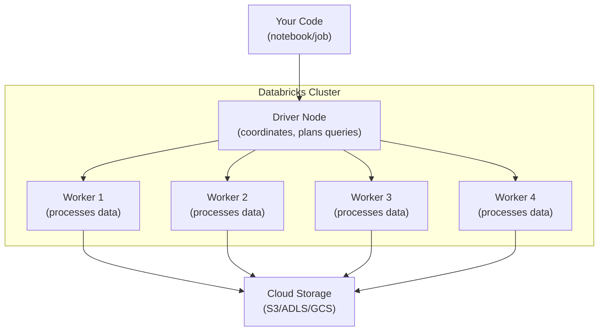

# Clusters and Compute — Fundamentals


## 🎯 Analogy

Think of Databricks clusters like rental cars: all-purpose clusters are always on (expensive but convenient), job clusters are rented for a single trip then returned (cost-efficient), and SQL warehouses are shared taxis for SQL workloads.

---
## What Is a Databricks Cluster?

A cluster is a set of compute resources (VMs) that execute your Spark code. It consists of a **driver** (coordinates work) and **workers** (process data in parallel).



The driver receives your code, creates an execution plan, distributes work to workers, and workers read/write data from cloud storage in parallel.

---

## Cluster Types

| Type | Purpose | Lifecycle | Pricing |
|------|---------|-----------|---------|
| **All-Purpose** | Interactive development, exploration | Runs until manually stopped or idle timeout | All-Purpose compute rate |
| **Job Cluster** | Production pipelines (Workflows) | Created for job, terminated after | Jobs compute rate (60% cheaper) |
| **SQL Warehouse** | BI queries, SQL analytics | Serverless or classic, auto-stops | SQL compute rate |

```python
# All-Purpose: for notebooks (interactive work)
# You start it → run notebooks → it stays running → you stop it (or idle timeout)

# Job Cluster: for production (Workflows)
# Job starts → cluster created → job runs → cluster terminated
# You pay ONLY for the time the job is running

# SQL Warehouse: for SQL/BI
# Query arrives → warehouse wakes up → processes → auto-stops after idle period
```

---

## Instance Types (Node Selection)

### Common Instance Families

| Family | Optimized For | Example | Use Case |
|--------|-------------|---------|----------|
| **m5/m6i** | General purpose (balanced) | m5.xlarge (4 vCPU, 16 GB) | Standard ETL |
| **r5/r6i** | Memory (high RAM/vCPU) | r5.2xlarge (8 vCPU, 64 GB) | Large joins, caching |
| **i3/i4i** | Storage (local NVMe SSD) | i3.xlarge (4 vCPU, 30 GB, 950 GB SSD) | Shuffle-heavy, Delta reads |
| **c5/c6i** | Compute (high vCPU/RAM) | c5.2xlarge (8 vCPU, 16 GB) | CPU-intensive transforms |
| **g5** | GPU | g5.xlarge (4 vCPU, 16 GB, A10G GPU) | ML training, inference |

### How to Choose

```python
# Decision framework:
# 1. What's the bottleneck?
#    - Shuffle-heavy (joins, groupBy): i3 (local SSD for spill)
#    - Memory-heavy (large caches, collect_list): r5 (more RAM)
#    - CPU-heavy (complex UDFs, string processing): c5 (more vCPU)
#    - Balanced workload: m5 (safe default)

# 2. Start with the default and observe:
#    - Check Spark UI: is time spent in I/O (disk), GC (memory), or CPU?
#    - Disk spill? → i3 (local SSD) or more workers
#    - GC pauses? → r5 (more memory) or fewer tasks per executor
#    - CPU at 100%? → c5 (more cores) or more workers
```

---

## Autoscaling

Automatically adjusts the number of workers based on workload:

```python
# Cluster config with autoscaling
{
    "autoscale": {
        "min_workers": 2,   # Always have at least 2 workers
        "max_workers": 8,   # Scale up to 8 when load is high
    }
}

# How it works:
# 1. Job starts with min_workers (2)
# 2. Spark scheduler detects pending tasks > available slots
# 3. Cluster adds workers (scales up) — takes ~2-4 minutes
# 4. As tasks complete and load decreases
# 5. Idle workers are removed (scales down) — after ~2 min idle

# When to use autoscaling:
# - Variable workload (some stages need more workers than others)
# - Unknown data volume (first run of a pipeline)
# - Cost optimization (don't pay for workers during light phases)

# When NOT to use:
# - Short jobs (< 10 min) — scaling overhead > benefit
# - Predictable workload — fixed size is simpler and faster
# - Streaming (continuous) — use fixed size for stable throughput
```

---

## Cluster Configuration Options

```python
CLUSTER_CONFIG = {
    "cluster_name": "etl-production",
    "spark_version": "14.3.x-scala2.12",  # Databricks Runtime version
    "node_type_id": "i3.xlarge",           # Instance type
    
    # Workers
    "autoscale": {"min_workers": 4, "max_workers": 12},
    # OR fixed: "num_workers": 8,
    
    # Driver (can be different from workers)
    "driver_node_type_id": "r5.xlarge",    # Larger driver for big plans
    
    # Spot instances (cost optimization)
    "aws_attributes": {
        "availability": "SPOT_WITH_FALLBACK",
        "spot_bid_price_percent": 100,
        "first_on_demand": 1,  # Driver on-demand, workers on spot
    },
    
    # Auto-termination (all-purpose clusters)
    "autotermination_minutes": 30,  # Stop after 30 min idle
    
    # Spark configuration
    "spark_conf": {
        "spark.sql.shuffle.partitions": "auto",
        "spark.databricks.delta.optimizeWrite.enabled": "true",
    },
    
    # Cluster tags (for cost tracking)
    "custom_tags": {
        "team": "data-engineering",
        "environment": "production",
        "cost_center": "DE-001",
    },
}
```

---

## Databricks Runtime Versions

| Runtime | Includes | Use Case |
|---------|----------|----------|
| Standard (14.x) | Spark + Delta + libraries | General ETL |
| ML (14.x ML) | + TensorFlow, PyTorch, MLflow | ML training |
| Photon (14.x) | + Photon engine (vectorized C++) | Fast SQL, Delta reads |
| GPU (14.x GPU) | + CUDA, cuDF | GPU acceleration |

```python
# Always use LTS (Long Term Support) versions for production
# Current LTS: 14.3 LTS
"spark_version": "14.3.x-scala2.12"       # Standard
"spark_version": "14.3.x-photon-scala2.12" # With Photon
"spark_version": "14.3.x-gpu-ml-scala2.12" # GPU + ML
```

---

## Spot Instances (Cost Optimization)

Spot instances cost 60-90% less than on-demand but can be reclaimed by AWS with 2-minute notice.

```python
"aws_attributes": {
    # SPOT: all workers on spot (cheapest, may lose workers)
    # ON_DEMAND: all on-demand (most expensive, guaranteed)
    # SPOT_WITH_FALLBACK: try spot, use on-demand if unavailable (recommended)
    "availability": "SPOT_WITH_FALLBACK",
    
    "first_on_demand": 1,  # First node (driver) always on-demand
    # Workers can be spot — if reclaimed, Spark redistributes their tasks
}

# Cost comparison (i3.xlarge):
# On-demand: $0.312/hr
# Spot: ~$0.094/hr (70% savings!)
# With fallback: guaranteed to get capacity at spot OR on-demand price

# When spot instances are safe:
# - ETL pipelines (Spark handles worker loss gracefully)
# - Auto Loader (checkpoint-based, fault-tolerant)
# - Workflows (job cluster, short-lived)

# When to avoid spot:
# - Interactive notebooks (losing a worker interrupts your work)
# - Streaming with tight latency SLA (scaling delay on reclamation)
```

---

## Cluster Pools (Faster Startup)

Pre-allocate idle instances for instant cluster creation:

```python
# Without pool: cluster start takes 4-7 minutes (VM provisioning)
# With pool: cluster start takes 30-60 seconds (VMs already running)

POOL_CONFIG = {
    "instance_pool_name": "etl-pool",
    "node_type_id": "i3.xlarge",
    "min_idle_instances": 4,    # Always keep 4 VMs warm
    "max_capacity": 20,         # Can grow to 20 VMs total
    "idle_instance_autotermination_minutes": 30,
}

# Cluster uses the pool:
{
    "instance_pool_id": "pool-abc123",
    "autoscale": {"min_workers": 2, "max_workers": 8},
    # Workers come from the pool (instant) instead of fresh VMs (slow)
}

# Best for:
# - Workflows that run every 15 min (avoid 5-min startup each time)
# - Interactive clusters that start/stop frequently
# - Teams with predictable cluster needs
```

---

## Key Metrics to Monitor

| Metric | Where to Check | What It Means |
|--------|---------------|---------------|
| CPU utilization | Cluster metrics UI | High = good (using resources), low = over-provisioned |
| Memory usage | Cluster metrics UI | Near max = risk of OOM, add memory or workers |
| Disk spill | Spark UI (Stages tab) | Data written to disk instead of memory = slow |
| Shuffle read/write | Spark UI (Stages tab) | Large shuffle = need more workers or broadcast |
| GC time | Spark UI (Executors tab) | >10% GC = memory pressure, need more RAM |

---


## ▶️ Try It Yourself

```bash
# Create a job cluster via Databricks CLI
databricks clusters create --json '{
  "cluster_name": "etl-job-cluster",
  "spark_version": "14.3.x-scala2.12",
  "node_type_id": "i3.xlarge",
  "autoscale": {"min_workers": 2, "max_workers": 8},
  "auto_termination_minutes": 30,
  "spark_conf": {
    "spark.databricks.delta.optimizeWrite.enabled": "true"
  }
}'

# List clusters
databricks clusters list

# Resize an existing cluster
databricks clusters resize --cluster-id abc-123 --num-workers 4

# Terminate idle cluster
databricks clusters delete --cluster-id abc-123
```

> **Run it:** Copy the snippet into a REPL or file — no external services needed for the basic example.

---
## Interview Tips

> **Tip 1:** "How do you choose an instance type?" — Start with i3.xlarge (balanced, has local SSD for shuffle). Monitor Spark UI: if you see disk spill → stay with i3 (or upgrade to i3.2xlarge). If GC is high → switch to r5 (more memory). If CPU is the bottleneck → switch to c5 (more compute per dollar).

> **Tip 2:** "Job cluster vs all-purpose?" — Job clusters: 60% cheaper, auto-terminate after job, use for ALL production workloads. All-purpose: for interactive development only (notebooks, exploration). Never run scheduled pipelines on all-purpose clusters — it's the #1 cost waste in Databricks.

> **Tip 3:** "How do spot instances work with Spark?" — Spark is fault-tolerant: if a spot worker is reclaimed, its tasks are re-scheduled on remaining workers (or new ones). Data isn't lost because Spark reads from cloud storage (not local disk for source data). The driver should be on-demand (losing it kills the job). Workers are safe on spot.
