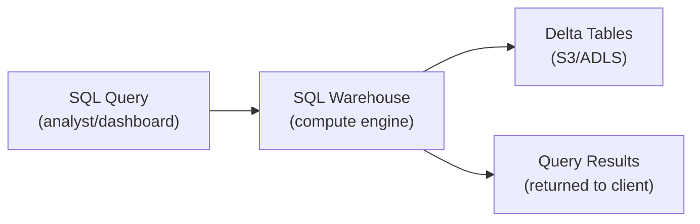

# Databricks SQL — Fundamentals

## What Is Databricks SQL?

Databricks SQL (DBSQL) is a **serverless SQL analytics service** built on top of the lakehouse. It lets analysts query Delta tables using standard SQL without managing Spark clusters — like having a data warehouse on top of your data lake.

```sql
-- Query Delta tables directly with standard SQL
SELECT 
    order_date,
    region,
    COUNT(*) AS total_orders,
    SUM(amount) AS revenue
FROM production.sales.orders
WHERE order_date >= '2024-01-01'
GROUP BY order_date, region
ORDER BY revenue DESC;

-- Same tables that ETL pipelines write to!
-- No data movement, no separate warehouse copy
```

> **Key Insight for DE:** DBSQL is the consumption layer of the lakehouse. Data engineers write data via Spark/DLT, analysts query it via DBSQL. Same Delta tables, different interfaces.

---

## SQL Warehouses

A SQL Warehouse is the compute engine that executes your queries:



The SQL Warehouse reads Delta tables from cloud storage and returns results. It auto-scales based on query load and auto-stops when idle.

### Warehouse Types

| Type | Management | Startup | Cost | Best For |
|------|-----------|---------|------|----------|
| **Serverless** | Fully managed by Databricks | Instant (~5s) | Per-query (higher rate) | Most use cases, zero ops |
| **Pro** | Customer-managed | 2-5 min | Hourly (lower rate) | High-volume, predictable |
| **Classic** | Customer-managed | 2-5 min | Hourly (lowest rate) | Legacy, budget |

```sql
-- Create a serverless warehouse (recommended):
-- Done in UI: SQL Warehouses → Create → Serverless → Size: Small

-- Warehouse sizes determine concurrency + speed:
-- 2X-Small: 1 cluster, light queries
-- Small: 1 cluster, standard ad-hoc
-- Medium: 1 cluster, dashboard refresh
-- Large: 1 cluster, heavy reports
-- 2X-Large+: multi-cluster, high concurrency
```

---

## Core SQL Features

### Standard SQL (ANSI Compliant)

```sql
-- JOINs, subqueries, CTEs, window functions — all standard SQL works
WITH monthly_revenue AS (
    SELECT 
        DATE_TRUNC('month', order_date) AS month,
        SUM(amount) AS revenue
    FROM production.sales.orders
    GROUP BY DATE_TRUNC('month', order_date)
)
SELECT 
    month,
    revenue,
    LAG(revenue) OVER (ORDER BY month) AS prev_month,
    (revenue - LAG(revenue) OVER (ORDER BY month)) / LAG(revenue) OVER (ORDER BY month) * 100 AS growth_pct
FROM monthly_revenue
ORDER BY month;
```

### Delta-Specific Features

```sql
-- Time Travel (query historical data)
SELECT * FROM production.sales.orders VERSION AS OF 42;
SELECT * FROM production.sales.orders TIMESTAMP AS OF '2024-03-01 00:00:00';

-- DESCRIBE and metadata
DESCRIBE TABLE EXTENDED production.sales.orders;
DESCRIBE HISTORY production.sales.orders;

-- MERGE (upsert)
MERGE INTO production.silver.customers t
USING staging.customer_updates s ON t.customer_id = s.customer_id
WHEN MATCHED THEN UPDATE SET t.name = s.name, t.email = s.email
WHEN NOT MATCHED THEN INSERT *;

-- OPTIMIZE (table maintenance)
OPTIMIZE production.sales.orders ZORDER BY (customer_id, order_date);
```

---

## Connecting BI Tools

DBSQL connects to all major BI tools via standard protocols:

```python
# Connection methods:
# 1. JDBC/ODBC driver (Tableau, Power BI, Looker)
# 2. Python connector (notebooks, scripts)
# 3. REST API (programmatic access)
# 4. Partner Connect (one-click setup for supported tools)

# Python connector example:
from databricks import sql

connection = sql.connect(
    server_hostname="adb-123456.azuredatabricks.net",
    http_path="/sql/1.0/warehouses/abc123",
    access_token="dapi..."
)

cursor = connection.cursor()
cursor.execute("SELECT * FROM production.gold.daily_revenue LIMIT 10")
rows = cursor.fetchall()
for row in rows:
    print(row)

cursor.close()
connection.close()
```

### BI Tool Integration

| Tool | Connection | Features |
|------|-----------|----------|
| **Tableau** | ODBC/JDBC driver | Live connection, extracts |
| **Power BI** | Databricks connector | DirectQuery, Import |
| **Looker** | JDBC | LookML modeling |
| **Metabase** | JDBC | Open-source, simple |
| **Grafana** | Databricks plugin | Real-time dashboards |

---

## Dashboards (Built-in)

DBSQL includes a native dashboard builder:

```sql
-- Create a query for a dashboard widget
-- Widget 1: Daily revenue trend (line chart)
SELECT order_date, SUM(amount) AS revenue
FROM production.gold.daily_revenue
WHERE order_date >= DATEADD(DAY, -30, CURRENT_DATE)
GROUP BY order_date
ORDER BY order_date;

-- Widget 2: Top customers (table)
SELECT customer_name, SUM(amount) AS total_spend, COUNT(*) AS orders
FROM production.gold.customer_metrics
GROUP BY customer_name
ORDER BY total_spend DESC
LIMIT 20;

-- Widget 3: Revenue KPI (counter)
SELECT SUM(amount) AS mtd_revenue
FROM production.sales.orders
WHERE order_date >= DATE_TRUNC('month', CURRENT_DATE);
```

### Dashboard Features
- **Auto-refresh:** schedule refresh every 1 min to 1 day
- **Parameters:** users can filter by date range, region, etc.
- **Alerts:** trigger notification when a metric crosses a threshold
- **Sharing:** share with users/groups via Unity Catalog permissions

---

## Query Optimization Basics

```sql
-- DBSQL automatically optimizes queries, but you can help:

-- 1. Filter early (partition pruning)
SELECT * FROM events WHERE event_date = '2024-03-15';
-- If table is partitioned by event_date: only reads one partition

-- 2. Select only needed columns (column pruning)
SELECT order_id, amount FROM orders;  -- Don't SELECT *

-- 3. Use Delta statistics (Z-ORDER columns in WHERE)
SELECT * FROM orders WHERE customer_id = 12345;
-- If table is Z-ORDERed by customer_id: skips 95% of files

-- 4. Avoid expensive operations on large tables
-- BAD: SELECT DISTINCT * FROM huge_table (scans everything)
-- GOOD: SELECT DISTINCT column FROM huge_table WHERE date = today

-- 5. Use EXPLAIN to understand query plan
EXPLAIN SELECT ... ;
-- Shows: scan method, join type, filter pushdown, data skipping
```

---

## Alerts

Set up automated monitoring on query results:

```sql
-- Alert: notify if daily revenue drops below threshold
-- Query:
SELECT SUM(amount) AS today_revenue
FROM production.sales.orders
WHERE order_date = CURRENT_DATE;

-- Alert configuration:
-- Trigger: when today_revenue < 50000
-- Notification: Slack channel #revenue-alerts
-- Schedule: check every 15 minutes
```

---

## SQL Warehouse Auto-Scaling

```python
# Warehouses can run multiple clusters for concurrent queries:
WAREHOUSE_CONFIG = {
    "name": "analytics-warehouse",
    "size": "Medium",
    "min_num_clusters": 1,    # Minimum clusters running
    "max_num_clusters": 5,    # Scale up to 5 for concurrent load
    "auto_stop_mins": 10,     # Stop after 10 min idle
    "spot_instance_policy": "COST_OPTIMIZED",  # Use spot for cost savings
    "enable_serverless_compute": True,
}

# Scaling behavior:
# 1 cluster handles ~10 concurrent queries
# If queue builds up → adds another cluster (horizontal scale)
# Up to max_num_clusters for peak load (e.g., dashboard refresh storm)
# Scales back down as load decreases
```

---

## Interview Tips

> **Tip 1:** "What is Databricks SQL?" — A serverless SQL analytics engine that queries Delta Lake tables directly. Analysts write SQL, DBSQL handles compute (auto-scaling, auto-stopping). It's the BI/analytics layer of the lakehouse — same tables that ETL writes to, no data movement needed.

> **Tip 2:** "Serverless vs Pro vs Classic warehouse?" — Serverless: instant startup, zero management, pay-per-query (recommended for most). Pro: lower per-DBU cost but you manage sizing/startup (good for predictable, high-volume). Classic: legacy, cheapest rate but least features. Default choice: Serverless.

> **Tip 3:** "How does DBSQL differ from running SQL on a Spark cluster?" — DBSQL is optimized for BI workloads: instant startup (serverless), result caching, auto-scaling for concurrent users, native dashboard builder, and BI tool connectivity (JDBC/ODBC). Spark clusters are for ETL/ML. Don't use all-purpose clusters for analyst SQL queries — use SQL Warehouses.
