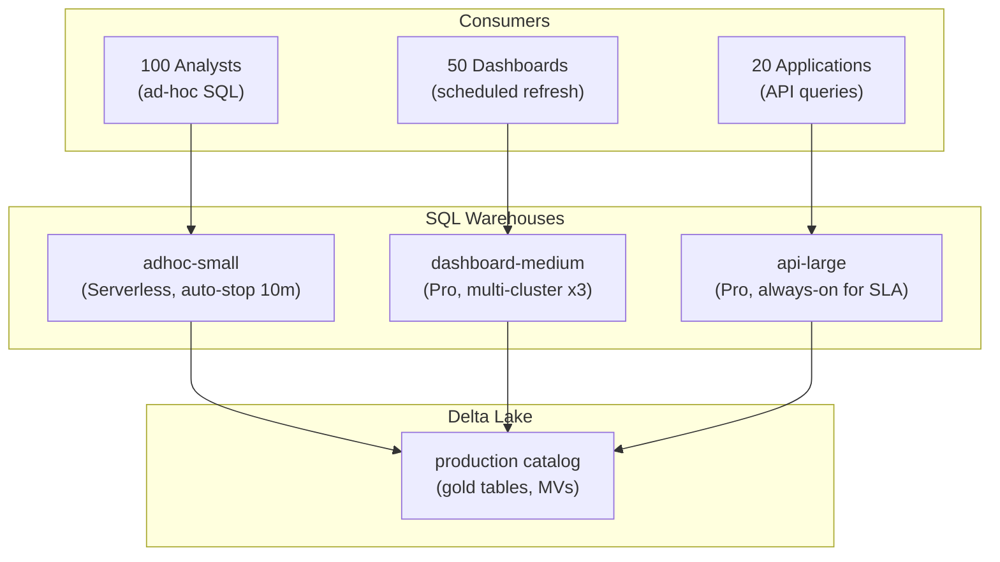

# Databricks SQL — Senior-Level Deep Dive

## Query Optimization Internals

### Photon Engine in SQL Warehouses

All SQL Warehouses run Photon by default — a C++ vectorized query engine:

```sql
-- Photon optimizations happening under the hood:
-- 1. Vectorized execution: processes batches of rows (not one at a time)
-- 2. Native Delta reader: reads Parquet column chunks directly (bypasses JVM)
-- 3. Runtime code generation: compiles query plan to native code
-- 4. SIMD instructions: parallel processing within CPU registers
-- 5. Memory-mapped I/O: efficient file access from SSD cache

-- Check Photon usage in query profile:
-- Look for "PhotonScan", "PhotonAggregate", "PhotonHashJoin"
-- If you see "SparkScan" instead → Photon fell back to Spark (usually for UDFs)

-- Performance comparison (typical):
-- | Operation | Spark (JVM) | Photon (C++) | Speedup |
-- | Scan 1TB Parquet | 45s | 12s | 3.8x |
-- | GroupBy 100M rows | 30s | 8s | 3.7x |
-- | Hash Join 1B × 10M | 60s | 18s | 3.3x |
-- | MERGE (1M updates) | 90s | 25s | 3.6x |
```

### Predictive I/O

```sql
-- DBSQL uses Predictive I/O to optimize file reads:
-- 1. Reads statistics from Delta log (min/max per file per column)
-- 2. Skips files that CAN'T contain matching rows (data skipping)
-- 3. Dynamically filters within files (late materialization)

-- Example: query with WHERE customer_id = 12345
-- Table has 1000 files, each with min/max stats for customer_id
-- Only 3 files MIGHT contain customer_id = 12345
-- DBSQL reads only 3 files (99.7% data skipped!)

-- To maximize Predictive I/O effectiveness:
OPTIMIZE production.silver.orders ZORDER BY (customer_id);
-- Z-ORDER clusters data so each file has a narrow range of customer_ids
-- This makes min/max statistics much more selective (better skipping)
```

---

## Production Warehouse Architecture



Separate warehouses per workload type prevents: dashboard refresh storms from blocking analyst queries, API latency spikes from interactive load.

```python
WAREHOUSE_ARCHITECTURE = {
    "adhoc_analysts": {
        "type": "Serverless",
        "size": "Small",
        "auto_stop": "10 min",
        "purpose": "Analyst exploration and ad-hoc queries",
        "sla": "Best effort (no latency guarantee)",
        "cost": "Pay-per-query (~$500/month)",
    },
    "dashboard_refresh": {
        "type": "Pro",
        "size": "Medium",
        "clusters": {"min": 1, "max": 3},
        "auto_stop": "15 min",
        "purpose": "Scheduled dashboard refresh (every 15 min)",
        "sla": "Refresh complete within 5 min",
        "cost": "~$2,000/month",
    },
    "application_api": {
        "type": "Pro",
        "size": "Large",
        "clusters": {"min": 1, "max": 1},  # Fixed (consistent latency)
        "auto_stop": "Never (always-on for API SLA)",
        "purpose": "Application queries via JDBC (p99 < 2s)",
        "sla": "p99 latency < 2 seconds",
        "cost": "~$3,000/month",
    },
}
```

---

## Materialized View Strategy

```sql
-- Strategy: identify expensive repeated queries and materialize them

-- Step 1: Find candidates (frequent, slow queries)
SELECT 
    query_hash,
    COUNT(*) AS executions,
    AVG(duration_ms) AS avg_duration_ms,
    SUM(bytes_read) / COUNT(*) AS avg_bytes_read
FROM system.query.history
WHERE start_time >= CURRENT_DATE - 30
  AND duration_ms > 5000  -- Slow (>5 seconds)
GROUP BY query_hash
HAVING executions > 50    -- Frequent (>50 times/month)
ORDER BY executions * avg_duration_ms DESC;  -- Impact = frequency × duration

-- Step 2: Create materialized views for top candidates
CREATE MATERIALIZED VIEW gold.mv_customer_revenue_monthly AS
SELECT 
    customer_id, customer_name, region,
    DATE_TRUNC('month', order_date) AS month,
    COUNT(*) AS orders,
    SUM(amount) AS revenue
FROM production.silver.orders o
JOIN production.silver.customers c USING (customer_id)
GROUP BY customer_id, customer_name, region, DATE_TRUNC('month', order_date);

-- Step 3: Schedule refresh
-- Workflow task: REFRESH MATERIALIZED VIEW gold.mv_customer_revenue_monthly;
-- Schedule: every hour (after silver table updates)

-- Step 4: Verify optimizer uses the MV
EXPLAIN SELECT customer_name, SUM(revenue) 
FROM gold.mv_customer_revenue_monthly
WHERE month >= '2024-01-01'
GROUP BY customer_name;
-- Should show: "Scan mv_customer_revenue_monthly" (not scanning the base tables)
```

---

## Cost Management

### Per-Query Cost Visibility

```sql
-- Track cost per query (system tables)
SELECT 
    user_name,
    query_text,
    start_time,
    duration_ms / 1000 AS seconds,
    -- Approximate cost: DBUs consumed × rate
    (duration_ms / 3600000.0) * warehouse_size_dbus * 0.22 AS estimated_cost_usd
FROM system.query.history
WHERE start_time >= CURRENT_DATE - 1
ORDER BY estimated_cost_usd DESC
LIMIT 20;

-- Find users running expensive queries repeatedly:
SELECT 
    user_name,
    COUNT(*) AS query_count,
    SUM(estimated_cost) AS total_cost_30d,
    AVG(duration_ms) AS avg_query_ms
FROM system.query.history
WHERE start_time >= CURRENT_DATE - 30
GROUP BY user_name
ORDER BY total_cost_30d DESC;
```

### Warehouse Auto-Stop Optimization

```python
# Problem: warehouse stays on between dashboard refreshes (10 min gap = $$$)
# Dashboard refreshes every 15 min, each refresh takes 2 min
# Without auto-stop: warehouse runs 24/7 = $5,000/month
# With 5-min auto-stop: runs ~4 min per 15-min cycle = $1,300/month (74% savings!)

# But: restart penalty is 2-5 min (queries queue during startup)
# Solution: Serverless warehouse (instant restart, zero penalty)

# Cost comparison for dashboard workload (runs 2 min every 15 min):
# Classic (always-on): $5,000/month (paying for 13 idle minutes per cycle)
# Pro (auto-stop 5 min): $1,800/month (restart adds 3 min per cycle)
# Serverless: $1,200/month (instant restart, pay only for 2 min execution)
```

---

## Query Governance and Security

### Row/Column Security in DBSQL

```sql
-- Unity Catalog row filters and column masks work transparently in DBSQL
-- Analysts query normally; security is enforced server-side

-- Example: sales team can only see their region
SELECT * FROM production.silver.orders;
-- US team sees: only US orders (row filter applied)
-- EU team sees: only EU orders (same query, different results!)

-- Column masking for PII:
SELECT customer_name, email, phone FROM production.silver.customers;
-- Authorized user sees: John Smith, john@co.com, 555-1234
-- Regular analyst sees: John Smith, jo***@co.com, ***-***-1234
-- Completely transparent — same query, masked output

-- Audit: who queried what?
SELECT user_name, query_text, start_time
FROM system.query.history
WHERE LOWER(query_text) LIKE '%customers%'
  AND start_time >= CURRENT_DATE - 7;
```

---

## Advanced Patterns

### Scheduled Queries (ETL in SQL)

```sql
-- Simple ETL using scheduled SQL queries (no notebooks needed)

-- Schedule: daily at 6 AM
-- Query: refresh gold table
INSERT OVERWRITE production.gold.daily_revenue
SELECT 
    order_date,
    region,
    COUNT(*) AS orders,
    SUM(amount) AS revenue
FROM production.silver.orders
WHERE order_date = CURRENT_DATE - 1
GROUP BY order_date, region;

-- Schedule: hourly
-- Query: incremental append to streaming table
INSERT INTO production.gold.hourly_events
SELECT event_type, COUNT(*) AS cnt, DATE_TRUNC('hour', event_time) AS hour
FROM production.silver.events
WHERE event_time >= DATE_TRUNC('hour', CURRENT_TIMESTAMP) - INTERVAL 1 HOUR
  AND event_time < DATE_TRUNC('hour', CURRENT_TIMESTAMP)
GROUP BY event_type, DATE_TRUNC('hour', event_time);
```

### Data Apps (SQL + Python)

```python
# Databricks SQL + Streamlit/Gradio for data apps
# Query DBSQL from a lightweight Python app

import streamlit as st
from databricks import sql

@st.cache_data(ttl=300)  # Cache for 5 minutes
def get_revenue_data(start_date, end_date, region):
    conn = sql.connect(server_hostname="...", http_path="...", access_token="...")
    cursor = conn.cursor()
    cursor.execute(f"""
        SELECT order_date, SUM(amount) as revenue
        FROM production.gold.daily_revenue
        WHERE order_date BETWEEN '{start_date}' AND '{end_date}'
          AND region = '{region}'
        GROUP BY order_date ORDER BY order_date
    """)
    return cursor.fetchall()

st.title("Revenue Dashboard")
region = st.selectbox("Region", ["US", "EU", "APAC"])
data = get_revenue_data("2024-01-01", "2024-03-31", region)
st.line_chart(data)
```

---

## Interview Tips

> **Tip 1:** "How do you optimize Databricks SQL for 100 concurrent dashboard queries?" — Multi-cluster warehouse (3-5 clusters, auto-scale based on queue depth), materialized views for expensive aggregations (pre-computed, instant reads), result caching (identical queries return cached results at zero cost), and table optimization (Z-ORDER + OPTIMIZE for data skipping).

> **Tip 2:** "Materialized views vs gold tables?" — Gold tables: manually refreshed by ETL pipelines, full control over refresh logic. Materialized views: Databricks manages refresh (incremental, automatic), optimizer rewrites queries to use them transparently. Use MVs for standard aggregations; gold tables for complex business logic that MVs can't express.

> **Tip 3:** "How do you govern SQL warehouse costs?" — Separate warehouses by workload (analysts vs dashboards vs APIs). Auto-stop on all warehouses (10-15 min). Serverless for bursty workloads (pay-per-query). Monitor via system.query.history (find expensive queries, heavy users). Set budget alerts. Create materialized views for repeated expensive queries (reduces compute needed).
