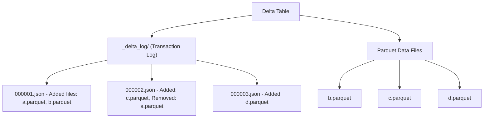

# Delta Lake — Fundamentals


## 🎯 Analogy

Think of Delta Lake like a Git repository for your data: every write creates a new commit (transaction log entry), you can roll back to any previous version, and ACID guarantees mean concurrent readers and writers never corrupt each other.

---
## What Is Delta Lake?

Delta Lake is an **open-source storage layer** that brings ACID transactions, schema enforcement, and time travel to data lakes built on Parquet files (S3, ADLS, GCS).

**The problem it solves:** Plain Parquet files on S3 have no transactions (partial writes corrupt data), no schema enforcement (bad data sneaks in), and no way to update/delete individual rows. Delta Lake adds all of these on top of the same Parquet format.

> **Key Insight:** Delta Lake = Parquet files + a transaction log (`_delta_log/`). The log tracks exactly which Parquet files are "current" at any point in time. This tiny addition enables ACID, time travel, and MERGE operations.

---

## Delta vs Plain Parquet

| Feature | Plain Parquet | Delta Lake |
|---------|--------------|-----------|
| ACID transactions | No (partial writes possible) | Yes (all-or-nothing) |
| Schema enforcement | No (any schema accepted) | Yes (rejects mismatched data) |
| UPDATE/DELETE/MERGE | Not supported | Fully supported |
| Time travel | Not possible | Query any historical version |
| Concurrent writes | Unsafe (data corruption risk) | Safe (optimistic concurrency) |
| Small file compaction | Manual (write a Spark job) | Built-in OPTIMIZE command |
| Data quality | None | Constraints and expectations |

---

## How Delta Lake Works



**What this shows:**
- Delta tables are just Parquet files + a `_delta_log/` directory
- The transaction log is a series of JSON files recording each change
- Each log entry says which Parquet files were added or removed
- To read the current state: replay the log to determine which Parquet files are "active"
- Old removed files are kept for time travel (cleaned up by VACUUM)

---

## Creating and Using Delta Tables

```python
from pyspark.sql import SparkSession

spark = SparkSession.builder \
    .config("spark.sql.extensions", "io.delta.sql.DeltaSparkSessionExtension") \
    .config("spark.sql.catalog.spark_catalog", "org.apache.spark.sql.delta.catalog.DeltaCatalog") \
    .getOrCreate()

# Create a Delta table from a DataFrame
df = spark.createDataFrame([
    ("Alice", "Engineering", 95000),
    ("Bob", "Marketing", 72000),
    ("Charlie", "Engineering", 110000),
], ["name", "department", "salary"])

# Write as Delta (creates the table with _delta_log/)
df.write.format("delta").mode("overwrite").save("s3://lake/tables/employees")

# Read a Delta table
employees = spark.read.format("delta").load("s3://lake/tables/employees")
employees.show()
```

**Result:**

| name | department | salary |
|------|-----------|--------|
| Alice | Engineering | 95000 |
| Bob | Marketing | 72000 |
| Charlie | Engineering | 110000 |

---

## ACID Transactions

Every write to a Delta table is atomic — it either fully succeeds or fully fails. No partial writes.

```python
# This write either adds ALL 1M records or NONE (if it fails midway)
large_df.write.format("delta").mode("append").save("s3://lake/tables/events")
# If Spark crashes mid-write, the uncommitted Parquet files are ignored
# (they're not listed in the transaction log)
```

**Concurrent writers are safe:**

```python
# Job A and Job B both append to the same table simultaneously
# Delta uses optimistic concurrency control:
# 1. Both jobs write their Parquet files
# 2. Both try to commit (add entry to _delta_log)
# 3. If no conflict: both succeed
# 4. If conflict (e.g., both modify same partition): one retries automatically
```

> **Compare to plain Parquet:** Two Spark jobs writing to the same Parquet directory simultaneously can corrupt data (partial files, duplicate data, missing data). Delta eliminates this risk.

---

## Schema Enforcement

Delta rejects writes that don't match the table's schema:

```python
# Table has schema: name (string), department (string), salary (int)

# This FAILS: extra column not in schema
bad_df = spark.createDataFrame([("Dave", "Sales", 80000, "2024-01-15")], 
                                ["name", "department", "salary", "hire_date"])
bad_df.write.format("delta").mode("append").save("s3://lake/tables/employees")
# Error: "A schema mismatch detected when writing to the Delta table"

# Schema evolution: explicitly allow it when needed
bad_df.write.format("delta") \
    .option("mergeSchema", "true") \  # Allow adding new columns
    .mode("append") \
    .save("s3://lake/tables/employees")
# Now hire_date column is added (existing rows get NULL for it)
```

---

## UPDATE, DELETE, and MERGE

Unlike plain Parquet, Delta supports row-level modifications:

### UPDATE

```python
from delta.tables import DeltaTable

dt = DeltaTable.forPath(spark, "s3://lake/tables/employees")

# Give Engineering a 10% raise
dt.update(
    condition="department = 'Engineering'",
    set={"salary": "salary * 1.10"}
)
```

### DELETE

```python
# Remove employees in Marketing
dt.delete(condition="department = 'Marketing'")
```

### MERGE (Upsert — Most Important for ETL)

```python
# Incoming data: new and updated records
updates = spark.createDataFrame([
    ("Alice", "Engineering", 104500),   # Updated salary
    ("Diana", "Marketing", 88000),      # New employee
], ["name", "department", "salary"])

dt.alias("target").merge(
    updates.alias("source"),
    "target.name = source.name"         # Match condition
).whenMatchedUpdate(
    set={"salary": "source.salary"}     # Update existing
).whenNotMatchedInsert(
    values={                            # Insert new
        "name": "source.name",
        "department": "source.department",
        "salary": "source.salary"
    }
).execute()
```

**Result after MERGE:**

| name | department | salary |
|------|-----------|--------|
| Alice | Engineering | 104500 |
| Charlie | Engineering | 110000 |
| Diana | Marketing | 88000 |

> **Why MERGE matters:** This is how production ETL works — you receive daily updates containing both new records and changes to existing ones. MERGE handles both in a single atomic operation.

---

## Time Travel

Query previous versions of a table — every write creates a new version:

```python
# Read the current version
current = spark.read.format("delta").load("s3://lake/tables/employees")

# Read version 0 (the original write)
v0 = spark.read.format("delta").option("versionAsOf", 0).load("s3://lake/tables/employees")

# Read as of a specific timestamp
yesterday = spark.read.format("delta") \
    .option("timestampAsOf", "2024-01-14 10:00:00") \
    .load("s3://lake/tables/employees")

# See the history of all changes
dt = DeltaTable.forPath(spark, "s3://lake/tables/employees")
dt.history().show()
```

**History output:**

| version | timestamp | operation | operationMetrics |
|---------|-----------|-----------|-----------------|
| 3 | 2024-01-15 14:30 | MERGE | {numTargetRowsUpdated: 1, numTargetRowsInserted: 1} |
| 2 | 2024-01-15 12:00 | DELETE | {numRemovedRows: 1} |
| 1 | 2024-01-15 10:00 | UPDATE | {numUpdatedRows: 2} |
| 0 | 2024-01-15 09:00 | WRITE | {numOutputRows: 3} |

> **Use case:** "What did this table look like before yesterday's bad ETL run?" → Query the version before that run, compare, and restore if needed.

---

## VACUUM — Cleaning Up Old Files

Time travel keeps old Parquet files. VACUUM deletes files no longer referenced by recent versions:

```python
# Remove old files no longer needed (default: keep 7 days of history)
dt.vacuum(retentionHours=168)  # 168 hours = 7 days

# WARNING: After VACUUM, you cannot time-travel to versions older than the retention period!
```

> **Default retention:** 7 days. You can query any version within the last 7 days. After VACUUM, old versions are permanently gone.

---

## Quick Comparison: When to Use Delta

| Scenario | Plain Parquet | Delta Lake |
|----------|--------------|-----------|
| Simple read-only data export | Fine | Overkill |
| ETL pipeline with daily updates | Risky (no MERGE) | Ideal |
| Multiple writers to same table | Dangerous | Safe |
| Need to fix/update historical data | Very complex | Simple (UPDATE) |
| Regulatory audit trail | Impossible | Time travel |
| Dashboard with strict correctness | Possible inconsistency | Guaranteed consistency |

---


## ▶️ Try It Yourself

```python
from delta import configure_spark_with_delta_pip
from pyspark.sql import SparkSession

builder = SparkSession.builder.master("local[*]")     .config("spark.sql.extensions", "io.delta.sql.DeltaSparkSessionExtension")     .config("spark.sql.catalog.spark_catalog",
            "org.apache.spark.sql.delta.catalog.DeltaCatalog")

spark = configure_spark_with_delta_pip(builder).getOrCreate()

data = [("Alice", 300.0), ("Bob", 150.0)]
df = spark.createDataFrame(data, ["name", "amount"])
df.write.format("delta").mode("overwrite").save("/tmp/delta_orders")

# Time travel: read previous version
v0 = spark.read.format("delta").option("versionAsOf", 0).load("/tmp/delta_orders")
v0.show()

# MERGE (upsert)
merge_sql = (
    "MERGE INTO delta.`/tmp/delta_orders` AS target "
    "USING (SELECT 'Alice' AS name, 400.0 AS amount) AS source "
    "ON target.name = source.name "
    "WHEN MATCHED THEN UPDATE SET amount = source.amount "
    "WHEN NOT MATCHED THEN INSERT *"
)
spark.sql(merge_sql)
```

> **Run it:** Copy the snippet into a REPL or file — no external services needed for the basic example.

---
## Interview Tips

> **Tip 1:** "What is Delta Lake?" — "It's an open-source storage layer that adds ACID transactions, schema enforcement, and time travel to Parquet data lakes. It's just Parquet files + a JSON transaction log that tracks which files are current. The log enables atomic writes, MERGE operations, and querying historical versions."

> **Tip 2:** "How does MERGE work in Delta?" — "It compares incoming data against existing data using a match condition. For matched rows, it updates. For unmatched rows, it inserts. This is atomic — either all changes apply or none do. It's the standard pattern for incremental ETL loads."

> **Tip 3:** "How does Delta handle concurrent writes?" — "Optimistic concurrency control. Multiple writers commit independently. If there's no conflict (writing to different partitions), both succeed. If there's a conflict, one writer retries automatically. The transaction log acts as a serialization point."
