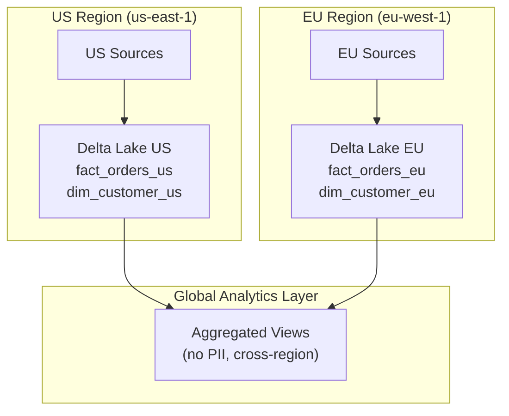

# Scenario Questions — Delta Lake

<article data-difficulty="junior">

## 🟢 Junior: Why Delta Over Plain Parquet?

**Scenario:** Your team stores data as Parquet files on S3. A data engineer accidentally ran the same ETL job twice, inserting duplicate records. Another time, a failed Spark job left partial/corrupt files in the output directory. Explain how Delta Lake would prevent both issues.

<details>
<summary>✅ Solution</summary>

**Problem 1: Duplicate records from double-run**

- **Plain Parquet:** Each run appends new files. No dedup mechanism. Running twice = double the data.
- **Delta Lake fix:** Use `MERGE` (upsert) instead of blind append. Match on business key — if row exists, update; if not, insert. Rerunning produces the same result (idempotent).

```python
# Idempotent with Delta MERGE
dt.alias("t").merge(
    new_data.alias("s"),
    "t.order_id = s.order_id"
).whenMatchedUpdateAll() \
 .whenNotMatchedInsertAll() \
 .execute()
# Running this twice with same data = no duplicates
```

**Problem 2: Corrupt files from failed job**

- **Plain Parquet:** Spark writes partial files. If job dies mid-write, the directory has incomplete Parquet files that corrupt downstream reads.
- **Delta Lake fix:** ACID transactions. A write either fully commits (all files registered in the log) or fully fails (uncommitted files are ignored). No partial state visible to readers.

```python
# Delta: atomic write — either ALL records commit or NONE
large_df.write.format("delta").mode("append").save(path)
# If Spark crashes at 50% → the uncommitted Parquet files exist on disk
# but are NOT in the transaction log → readers never see them
# VACUUM eventually cleans them up
```

</details>

</article>

<article data-difficulty="mid-level">

## 🟡 Mid-Level: Optimize a Slow MERGE

**Scenario:** Your nightly MERGE job processes 5M incoming records against a 2B-row Delta table. It takes 3 hours. The MERGE matches on `order_id`. The table is partitioned by `order_date`. How do you speed it up?

<details>
<summary>💡 Hint</summary>

If you include the partition column in the merge condition, Delta only scans relevant partitions instead of the entire 2B-row table.

</details>

<details>
<summary>✅ Solution</summary>

**Optimization 1: Include partition column in merge condition**

```python
# SLOW: scans ALL partitions to find matching order_ids
dt.merge(source, "t.order_id = s.order_id")

# FAST: only scans partitions that could contain matches
dt.merge(source, "t.order_id = s.order_id AND t.order_date = s.order_date")
# If source contains only last 3 days of data, Delta scans only 3 partitions!
```

**Optimization 2: Z-ORDER on the merge key**

```sql
OPTIMIZE delta.`s3://lake/tables/orders` ZORDER BY (order_id);
-- Colocates related order_ids → fewer files need rewriting per MERGE
```

**Optimization 3: Reduce source volume**

```python
# Only MERGE truly new/changed records
watermark = get_last_processed_timestamp()
new_records = source.filter(f"updated_at > '{watermark}'")
# 5M records → maybe only 500K actually changed since last run
dt.merge(new_records, ...)
```

**Optimization 4: Use replaceWhere for partition-level overwrites**

```python
# If you're replacing entire days of data (not surgical row updates):
source.write.format("delta") \
    .mode("overwrite") \
    .option("replaceWhere", "order_date IN ('2024-01-15', '2024-01-16')") \
    .save(path)
# Faster than MERGE when replacing entire partitions
```

**Expected improvement:** From 3 hours → 15-30 minutes with partition pruning in the merge condition alone.

</details>

</article>

<article data-difficulty="mid-level">

## 🟡 Mid-Level: Recover from a Bad ETL Run

**Scenario:** Last night's ETL job had a bug that corrupted the `amount` column in your `fact_orders` Delta table (set all amounts to 0). You discovered it this morning, 10 hours later. The table has Time Travel enabled with 7-day retention. How do you recover?

<details>
<summary>✅ Solution</summary>

**Step 1: Find the version before the bad write**

```python
# View history to identify the bad commit
dt = DeltaTable.forPath(spark, "s3://lake/tables/fact_orders")
dt.history(20).select("version", "timestamp", "operation", "userName").show()

# Find: version 42, timestamp 2024-01-15 02:00, operation=MERGE, user=etl_service
# This is the bad commit. We want version 41 (before the corruption).
```

**Step 2: Verify the good version**

```python
# Read the pre-corruption version
good_data = spark.read.format("delta") \
    .option("versionAsOf", 41) \
    .load("s3://lake/tables/fact_orders")

# Verify amounts are correct
good_data.select(avg("amount"), max("amount"), min("amount")).show()
# Looks correct!
```

**Step 3: Restore**

```sql
-- Option A: RESTORE command (Databricks / Delta 1.2+)
RESTORE TABLE delta.`s3://lake/tables/fact_orders` TO VERSION AS OF 41;
-- This creates a new commit (version 43) that points to version 41's files
-- Clean and simple!

-- Option B: If RESTORE not available (open-source Delta < 1.2)
-- Clone the good version to a new location, then swap
CREATE TABLE fact_orders_restored 
AS SELECT * FROM delta.`s3://lake/tables/fact_orders` VERSION AS OF 41;
-- Then rename/swap tables
```

**Step 4: Prevent recurrence**

```sql
-- Add constraint to catch zero amounts in future
ALTER TABLE fact_orders ADD CONSTRAINT amount_positive CHECK (amount > 0);

-- Add data quality check to ETL pipeline
-- After MERGE, verify: SELECT COUNT(*) WHERE amount = 0 should be 0
```

</details>

</article>

<article data-difficulty="senior">

## 🔴 Senior: Design a Multi-Region Delta Lake

**Scenario:** Your company operates in US and EU. Due to GDPR, EU customer data must stay in EU. But analytics teams in both regions need to query a unified view. Design a Delta Lake architecture that satisfies data residency requirements while enabling global analytics.

<details>
<summary>✅ Solution</summary>

**Architecture:**



**Implementation:**

```python
# Each region has its own Delta Lake with full data (including PII)
# US: s3://us-data-lake/silver/fact_orders/
# EU: s3://eu-data-lake/silver/fact_orders/

# Global analytics: aggregated, anonymized views replicated to both regions
# Step 1: Create PII-free aggregates in each region
us_agg = spark.read.format("delta").load("s3://us-data-lake/silver/fact_orders/") \
    .groupBy("order_date", "product_category", "region") \
    .agg(sum("amount").alias("revenue"), count("*").alias("orders"))

eu_agg = spark.read.format("delta").load("s3://eu-data-lake/silver/fact_orders/") \
    .groupBy("order_date", "product_category", "region") \
    .agg(sum("amount").alias("revenue"), count("*").alias("orders"))

# Step 2: Replicate aggregates (no PII) to global bucket
us_agg.write.format("delta").mode("overwrite") \
    .option("replaceWhere", f"region = 'US'") \
    .save("s3://global-analytics/gold/daily_sales/")

# EU aggregates replicated via cross-region Delta Sharing
# (or S3 cross-region replication for the gold layer only)
```

**Key design decisions:**

| Requirement | Solution |
|-------------|----------|
| EU data stays in EU | Separate Delta Lake per region (different S3 buckets in different regions) |
| Global analytics | Only aggregated/anonymized data crosses regions (gold layer) |
| No PII in global | Aggregation removes individual-level data before replication |
| Unified view | Global gold tables combine regional aggregates via UNION views |
| Cost efficiency | Raw/Silver data NOT replicated (expensive, unnecessary for global) |

**Delta Sharing (for cross-org or cross-region sharing):**

```python
# Provider (EU region): share a specific table or view
# Uses Delta Sharing protocol — recipient reads without full access to the lake
# No data copying — recipient queries provider's Delta table directly (or gets a replica)
```

**GDPR-specific controls:**

```python
# Right to erasure: DELETE specific customer's data
eu_dt = DeltaTable.forPath(spark, "s3://eu-data-lake/silver/fact_orders/")
eu_dt.delete("customer_id = 'GDPR-DELETE-REQUEST-123'")

# VACUUM to physically remove the data from storage
eu_dt.vacuum(0)  # Immediate physical deletion (override retention for GDPR)
```

</details>

</article>

---

## ⚡ Quick-fire Q&A

**Q: What is Delta Lake and what are its core capabilities?**
A: Delta Lake is an open-source storage layer that brings ACID transactions, scalable metadata handling, and unified streaming/batch processing to data lakes. It stores data as Parquet files with a `_delta_log` transaction log that provides atomicity, consistency, isolation, and durability.

**Q: How does Delta Lake's transaction log work?**
A: The `_delta_log` directory contains JSON commit files for each transaction. Each commit records which files were added or removed, schema changes, and metadata. Delta Lake reads these log files to reconstruct the current table state and provide time travel capabilities.

**Q: What is Delta Lake time travel and how do you use it?**
A: Time travel lets you query historical versions of a Delta table using version numbers or timestamps: `SELECT * FROM table VERSION AS OF 5` or `SELECT * FROM table TIMESTAMP AS OF '2024-01-15'`. It is used for auditing, debugging, and reproducing historical states.

**Q: What is the MERGE operation in Delta Lake and when is it used?**
A: `MERGE INTO` performs upserts — inserting new records, updating matching records, and optionally deleting removed records in one atomic operation. It is used for CDC (change data capture) integration, SCD Type 2 implementation, and any pattern requiring conditional insert/update.

**Q: What is Z-ordering in Delta Lake?**
A: Z-ordering is a multi-dimensional clustering technique (`OPTIMIZE table ZORDER BY col1, col2`) that co-locates related data across multiple columns in the same files. It enables efficient file skipping when queries filter on those columns, reducing data scanned and improving query latency.

**Q: What is Delta Lake schema enforcement vs. schema evolution?**
A: Schema enforcement (on by default) rejects writes that don't match the current table schema, preventing data corruption. Schema evolution (opt-in via `mergeSchema` or `autoMerge`) allows new columns to be added automatically during writes without failing the job.

**Q: What is the difference between Delta Lake, Apache Hudi, and Apache Iceberg?**
A: All three are open table formats providing ACID transactions on data lakes. Delta Lake has the tightest Databricks/Spark integration. Iceberg is the most interoperable (supported by Snowflake, AWS, BigQuery). Hudi specializes in upsert-heavy workloads with record-level indexing. All three are converging on similar feature sets.

**Q: What is Liquid Clustering in Delta Lake and how does it differ from Z-ordering?**
A: Liquid Clustering incrementally reorganizes data as new writes arrive, avoiding the expensive full-table rewrites required by Z-ordering's `OPTIMIZE` command. It automatically adapts clustering to query patterns over time and is the recommended replacement for Z-ordering in Delta Lake 3.x+.

---

## 💼 Interview Tips

- Understand the transaction log deeply — interviewers at Databricks-heavy shops will probe how Delta Lake achieves ACID guarantees at the file level.
- Know the difference between Delta Lake (open source), Delta Lake on Databricks (enhanced with proprietary features like Photon, Liquid Clustering), and the Delta Lake spec.
- Be ready to discuss MERGE semantics and performance — MERGE is powerful but can be expensive at scale; show you know optimization techniques (partition filtering, small file management).
- Senior interviewers expect you to compare Delta Lake with Iceberg and Hudi — know the key differentiators without being dogmatic about one being "the best."
- Show awareness of the full lifecycle: write optimization (Z-order, liquid clustering), read optimization (file skipping, data skipping), and maintenance (VACUUM, OPTIMIZE).
- Common mistake: not understanding VACUUM — it permanently removes files that are no longer referenced, which affects time travel retention. Show you know how to configure it safely.
