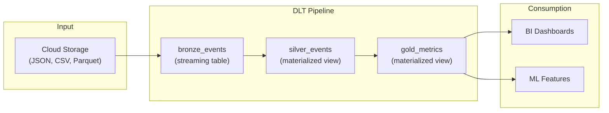

# Delta Live Tables (DLT) — Fundamentals

## What Is Delta Live Tables?

Delta Live Tables is Databricks' **declarative ETL framework**. Instead of writing imperative code (read → transform → write), you declare WHAT you want (the result), and DLT handles HOW (orchestration, dependencies, error handling, optimization).

```python
# IMPERATIVE (traditional Spark ETL):
raw_df = spark.read.json("s3://bucket/landing/")
cleaned_df = raw_df.filter(col("id").isNotNull()).withColumn("amount", col("amount").cast("decimal"))
cleaned_df.write.mode("append").saveAsTable("silver.orders")

# DECLARATIVE (DLT):
import dlt

@dlt.table
def silver_orders():
    """Clean orders with validated schema."""
    return (
        dlt.read("bronze_orders")
        .filter(col("id").isNotNull())
        .withColumn("amount", col("amount").cast("decimal(10,2)"))
    )
# DLT handles: execution order, checkpointing, error recovery, optimization
```

> **Key Insight for DE:** DLT lets you focus on transformation logic. It handles the plumbing: dependencies between tables, incremental processing, retry on failure, and data quality enforcement.

---

## Core Concepts

The following diagram shows how DLT manages a pipeline of dependent tables:



DLT automatically detects dependencies (silver reads from bronze, gold reads from silver) and executes them in the correct order.

---

## Table Types in DLT

### Streaming Tables (Append-Only)

```python
import dlt
from pyspark.sql.functions import col

@dlt.table
def bronze_events():
    """Ingest raw events from landing zone (append-only, streaming)."""
    return (
        spark.readStream
        .format("cloudFiles")
        .option("cloudFiles.format", "json")
        .option("cloudFiles.schemaLocation", "/checkpoints/schema/")
        .load("s3://lake/landing/events/")
    )
# Streaming table: appends new data incrementally (like Auto Loader)
# Perfect for: bronze ingestion, event logs, CDC streams
```

### Materialized Views (Computed Results)

```python
@dlt.table
def silver_events():
    """Cleaned events with proper types and deduplication."""
    return (
        dlt.read("bronze_events")
        .filter(col("event_id").isNotNull())
        .withColumn("event_timestamp", col("event_ts").cast("timestamp"))
        .withColumn("amount", col("amount").cast("decimal(10,2)"))
        .dropDuplicates(["event_id"])
    )
# Materialized view: DLT determines whether to recompute fully or incrementally
# DLT handles this optimization automatically!
```

### Views (Intermediate, Not Persisted)

```python
@dlt.view
def enriched_events():
    """Join events with user data (intermediate, not stored as table)."""
    return (
        dlt.read("silver_events")
        .join(dlt.read("dim_users"), "user_id")
    )
# View: computed at query time, not stored to disk
# Use for: intermediate transformations that don't need persistence
```

---

## Data Quality with Expectations

DLT's killer feature — built-in data quality enforcement:

```python
@dlt.table
@dlt.expect("valid_id", "event_id IS NOT NULL")              # Warn on violation
@dlt.expect_or_drop("positive_amount", "amount > 0")          # Drop bad rows
@dlt.expect_or_fail("valid_date", "event_date >= '2020-01-01'")  # Fail pipeline
def silver_orders():
    """Orders with enforced quality expectations."""
    return (
        dlt.read("bronze_orders")
        .withColumn("amount", col("amount").cast("decimal(10,2)"))
    )

# Three enforcement levels:
# expect(): Log violation but KEEP the row (monitoring only)
# expect_or_drop(): Drop rows that violate (bad data goes to _quarantine)
# expect_or_fail(): Stop the entire pipeline (critical violations)
```

### Expectation Behavior

| Level | On Violation | Use Case |
|-------|-------------|----------|
| `expect` | Keep row, log metric | Monitoring (track quality trends) |
| `expect_or_drop` | Drop row (quarantine) | Non-critical fields (fill rate acceptable) |
| `expect_or_fail` | Stop pipeline | Critical violations (data corruption) |

---

## Pipeline Configuration

DLT pipelines are configured in the Databricks UI or API:

```json
{
  "name": "ecommerce_etl",
  "target": "production.ecommerce",
  "storage": "s3://lake/dlt/ecommerce/",
  "continuous": false,
  "development": false,
  "channel": "CURRENT",
  "clusters": [
    {
      "label": "default",
      "autoscale": {
        "min_workers": 2,
        "max_workers": 8
      },
      "node_type_id": "r5.xlarge",
      "spark_conf": {
        "spark.sql.shuffle.partitions": "auto"
      }
    }
  ]
}
```

### Pipeline Modes

| Mode | Behavior | Use Case |
|------|----------|----------|
| Triggered | Runs once, processes available data, stops | Scheduled batch (hourly/daily) |
| Continuous | Runs forever, processes data as it arrives | Near-real-time (sub-minute latency) |
| Development | Runs on demand, relaxed validation | Testing and iteration |

---

## Complete DLT Pipeline Example

```python
import dlt
from pyspark.sql.functions import col, current_timestamp, from_json
from pyspark.sql.types import StructType, StructField, StringType, DoubleType

# ===== BRONZE: Raw Ingestion =====
@dlt.table(
    comment="Raw order events from landing zone"
)
def bronze_orders():
    return (
        spark.readStream
        .format("cloudFiles")
        .option("cloudFiles.format", "json")
        .option("cloudFiles.inferColumnTypes", "true")
        .load("s3://lake/landing/orders/")
        .withColumn("_ingested_at", current_timestamp())
    )

# ===== SILVER: Cleaned Entity =====
@dlt.table(
    comment="Validated, typed, deduplicated orders"
)
@dlt.expect_or_drop("valid_order_id", "order_id IS NOT NULL")
@dlt.expect_or_drop("positive_amount", "amount > 0")
@dlt.expect("valid_customer", "customer_id IS NOT NULL")
def silver_orders():
    return (
        dlt.read_stream("bronze_orders")  # Streaming read from bronze
        .withColumn("order_id", col("order_id").cast("bigint"))
        .withColumn("amount", col("amount").cast("decimal(10,2)"))
        .withColumn("order_date", col("order_date").cast("date"))
        .dropDuplicates(["order_id"])
    )

# ===== GOLD: Business Metrics =====
@dlt.table(
    comment="Daily revenue metrics for BI dashboards"
)
def gold_daily_revenue():
    return (
        dlt.read("silver_orders")
        .groupBy("order_date")
        .agg(
            count("*").alias("total_orders"),
            sum("amount").alias("total_revenue"),
            avg("amount").alias("avg_order_value"),
        )
    )
```

---

## DLT vs Manual Spark ETL

| Aspect | Manual Spark ETL | DLT |
|--------|-----------------|-----|
| Dependency management | You code it (manual ordering) | Automatic (reads determine deps) |
| Incremental processing | You implement (watermarks, state) | Automatic (DLT optimizes) |
| Error handling | You code try/except + retries | Built-in (retry, quarantine) |
| Data quality | You add checks manually | Built-in expectations |
| Monitoring | You build dashboards | Built-in pipeline UI + metrics |
| Schema evolution | You handle mergeSchema | Automatic in streaming tables |
| Code volume | 200-500 lines per pipeline | 50-100 lines per pipeline |

---

## Interview Tips

> **Tip 1:** "What is DLT?" — A declarative ETL framework where you define WHAT each table should look like (transformation logic), and DLT handles HOW (execution order, incremental processing, error handling, optimization). It's like dbt but for Spark — with added features like streaming tables and built-in data quality expectations.

> **Tip 2:** "Streaming table vs materialized view in DLT?" — Streaming table: append-only, processes new data incrementally (like Auto Loader). Use for bronze ingestion and event logs. Materialized view: DLT chooses the best refresh strategy (full or incremental). Use for silver/gold transformations. The choice affects how DLT optimizes the pipeline.

> **Tip 3:** "How does DLT handle data quality?" — Three levels of expectations: `expect` (warn but keep bad rows), `expect_or_drop` (remove bad rows, log them), `expect_or_fail` (stop the pipeline). Quality metrics are tracked automatically in the pipeline UI — you can see what % of records pass/fail each expectation over time.
