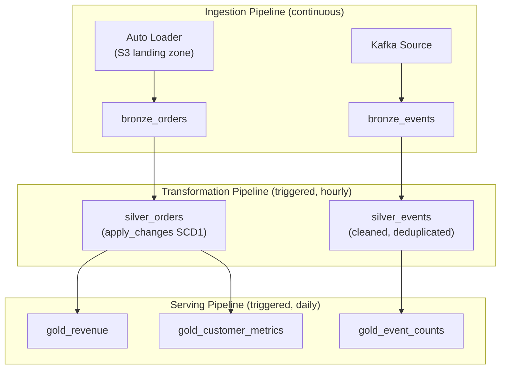

# Delta Live Tables — Senior-Level Deep Dive

## Pipeline Architecture at Scale

### Multi-Pipeline Design



Separate pipelines by cadence: continuous for ingestion (always processing), hourly for silver transformations, daily for gold aggregations. This prevents expensive gold rebuilds from blocking real-time ingestion.

---

## Performance Optimization

### Pipeline Cluster Configuration

```python
# DLT pipeline settings for optimal performance

PIPELINE_CONFIG = {
    "name": "production_etl",
    "target": "production",
    "continuous": False,  # Triggered mode (scheduled)
    "channel": "CURRENT",
    "photon": True,  # Enable Photon (C++ vectorized engine, 2-8x faster)
    "clusters": [
        {
            "label": "default",
            "autoscale": {"min_workers": 4, "max_workers": 16},
            "node_type_id": "i3.xlarge",  # Storage-optimized for Delta reads
            "spark_conf": {
                "spark.sql.shuffle.partitions": "auto",
                "spark.databricks.delta.optimizeWrite.enabled": "true",
                "spark.databricks.delta.autoCompact.enabled": "true",
            },
        },
        {
            "label": "maintenance",  # Separate cluster for OPTIMIZE/VACUUM
            "num_workers": 2,
            "node_type_id": "m5.xlarge",
        }
    ],
}

# Key optimizations:
# 1. Photon=True: 2-8x faster for aggregations, joins, file I/O
# 2. Auto shuffle partitions: DLT picks optimal count per query
# 3. Optimize write: auto-coalesces small files during write
# 4. Auto compact: runs OPTIMIZE automatically after writes
```

### Enhanced Auto Loader in DLT

```python
@dlt.table(
    table_properties={
        "quality": "bronze",
        "delta.autoOptimize.optimizeWrite": "true",
        "delta.autoOptimize.autoCompact": "true",
    }
)
def bronze_high_volume():
    """Optimized for high-throughput ingestion (100K+ files/day)."""
    return (
        spark.readStream
        .format("cloudFiles")
        .option("cloudFiles.format", "json")
        .option("cloudFiles.useNotifications", "true")
        .option("cloudFiles.maxFilesPerTrigger", "5000")
        .option("cloudFiles.maxBytesPerTrigger", "10g")
        .option("cloudFiles.schemaEvolutionMode", "addNewColumns")
        .load(spark.conf.get("source_path"))
    )
```

---

## Complex Transformation Patterns

### Multi-Source Join with Quality

```python
@dlt.table
@dlt.expect_or_drop("matched_customer", "customer_name IS NOT NULL")
def silver_enriched_orders():
    """Orders enriched with customer and product details."""
    orders = dlt.read_stream("bronze_orders")
    customers = dlt.read("dim_customers")  # Batch read for dimension
    products = dlt.read("dim_products")
    
    return (
        orders
        .join(customers, orders.customer_id == customers.customer_id, "left")
        .join(products, orders.product_id == products.product_id, "left")
        .select(
            orders.order_id,
            orders.amount,
            orders.order_date,
            customers.customer_name,
            customers.region,
            products.product_name,
            products.category,
        )
    )
```

### Window Functions in DLT

```python
@dlt.table
def gold_customer_rfm():
    """RFM (Recency, Frequency, Monetary) scores per customer."""
    return (
        dlt.read("silver_orders")
        .groupBy("customer_id")
        .agg(
            datediff(current_date(), max("order_date")).alias("recency_days"),
            count("order_id").alias("frequency"),
            sum("amount").alias("monetary"),
        )
        .withColumn("r_score", ntile(5).over(Window.orderBy("recency_days")))
        .withColumn("f_score", ntile(5).over(Window.orderBy(desc("frequency"))))
        .withColumn("m_score", ntile(5).over(Window.orderBy(desc("monetary"))))
    )
```

---

## Production Deployment Patterns

### Development → Staging → Production Promotion

```python
# Same DLT notebook code deployed across environments via pipeline config:

# Development pipeline config:
# { "target": "development.ecommerce", "development": true, "continuous": false }
# - Relaxed validation
# - Small cluster (min 1, max 2)
# - Reads from dev data

# Staging pipeline config:
# { "target": "staging.ecommerce", "development": false, "continuous": false }
# - Full validation
# - Production-sized cluster
# - Reads from staging data (copy of prod structure)

# Production pipeline config:
# { "target": "production.ecommerce", "development": false, "continuous": true }
# - Full validation
# - Auto-scaling cluster
# - Reads from production sources

# Promotion: change pipeline config only (not code)
# CI/CD: test in dev → validate in staging → promote config to production
```

### Pipeline-as-Code (Terraform)

```hcl
resource "databricks_pipeline" "ecommerce_etl" {
  name    = "ecommerce_etl_${var.environment}"
  target  = "${var.environment}.ecommerce"
  storage = "s3://${var.bucket}/dlt/${var.environment}/ecommerce/"
  
  continuous = var.environment == "production"
  photon     = true
  channel    = "CURRENT"

  library {
    notebook {
      path = "/Repos/main/pipelines/ecommerce_pipeline"
    }
  }

  cluster {
    label = "default"
    autoscale {
      min_workers = var.environment == "production" ? 4 : 1
      max_workers = var.environment == "production" ? 16 : 4
    }
    node_type_id = var.environment == "production" ? "i3.xlarge" : "m5.large"
  }

  configuration = {
    "source_path" = var.source_paths[var.environment]
  }
}
```

---

## Handling Pipeline Failures

### Retry and Recovery

```python
# DLT automatically retries transient failures (network, cloud API)
# For persistent failures, the pipeline stops and alerts

# Recovery strategies:
# 1. Fix source data → re-run pipeline (DLT picks up where it left off)
# 2. Skip bad files: configure schema evolution to rescue unknown data
# 3. Manual intervention: identify failed records in event log

# Full refresh (nuclear option):
# Pipeline Settings → "Full Refresh" mode
# Drops and recreates ALL tables from scratch
# Use when: schema changed incompatibly, data corruption, initial setup
```

### Maintenance Operations

```python
# DLT can run OPTIMIZE and VACUUM as part of the pipeline

@dlt.table(
    table_properties={
        "pipelines.autoOptimize.zOrderCols": "customer_id,order_date",
        "delta.autoOptimize.optimizeWrite": "true",
        "delta.autoOptimize.autoCompact": "true",
        "delta.deletedFileRetentionDuration": "7 days",
    }
)
def silver_orders():
    # Table is automatically optimized and compacted
    return dlt.read_stream("bronze_orders")

# Z-ORDER happens automatically on the specified columns
# VACUUM runs automatically based on retention setting
# No separate maintenance jobs needed!
```

---

## Event Log Analysis

```sql
-- Production monitoring queries on the DLT event log

-- Pipeline run history (duration, status)
SELECT 
    id,
    timestamp,
    details:update_progress.state AS status,
    details:update_progress.duration_ms / 1000 AS seconds
FROM event_log(TABLE(production.ecommerce.__event_log))
WHERE event_type = 'update_progress'
  AND details:update_progress.state IN ('COMPLETED', 'FAILED')
ORDER BY timestamp DESC
LIMIT 20;

-- Data quality trends (last 7 days)
SELECT 
    DATE(timestamp) AS run_date,
    details:flow_definition.output_dataset AS table_name,
    SUM(details:flow_progress.data_quality.expectations[*].passed_records) AS total_passed,
    SUM(details:flow_progress.data_quality.expectations[*].failed_records) AS total_failed
FROM event_log(TABLE(production.ecommerce.__event_log))
WHERE event_type = 'flow_progress'
  AND timestamp >= current_date() - 7
GROUP BY DATE(timestamp), details:flow_definition.output_dataset;

-- Rows processed per table per run
SELECT 
    details:flow_definition.output_dataset AS table_name,
    details:flow_progress.metrics.num_output_rows AS rows_written,
    timestamp
FROM event_log(TABLE(production.ecommerce.__event_log))
WHERE event_type = 'flow_progress'
ORDER BY timestamp DESC;
```

---

## Interview Tips

> **Tip 1:** "How do you deploy DLT pipelines across environments?" — Same notebook code, different pipeline configurations (Terraform-managed). Dev: small cluster, development mode, reads from dev data. Staging: production-size, full validation. Production: auto-scaling, continuous mode. Promotion is a config change, not a code change.

> **Tip 2:** "How does DLT handle failures in production?" — Automatic retry for transient failures (network, API). For persistent failures: pipeline stops, alert fires, you fix the issue, re-run (picks up from last checkpoint). For data quality failures: `expect_or_drop` quarantines bad rows without stopping. `expect_or_fail` stops only on critical violations.

> **Tip 3:** "DLT performance optimization?" — Enable Photon (2-8x faster), use streaming tables for incremental processing, configure auto-compact and optimize-write (prevent small files), Z-ORDER on frequently filtered columns, and right-size the cluster (auto-scale with appropriate min/max). Monitor via event log: duration trends show if optimization is needed.

## ⚡ Cheat Sheet

**Table types**
| Type | Decorator | Materialized | Recompute |
|---|---|---|---|
| Streaming table | `@dlt.table` + `read_stream` | Yes (Delta) | Incremental |
| Materialized view | `@dlt.table` + `read` | Yes (Delta) | On refresh |
| View | `@dlt.view` | No | Each query |

**Expectations (data quality)**
```python
@dlt.expect("valid_id", "id IS NOT NULL")           # warn only
@dlt.expect_or_drop("valid_id", "id IS NOT NULL")   # drop failing rows
@dlt.expect_or_fail("valid_id", "id IS NOT NULL")   # fail pipeline
@dlt.expect_all({"rule1": "col > 0", "rule2": "col < 1000"})
```

**Pipeline modes**
- Triggered: runs once on schedule; processes new data only (streaming tables)
- Continuous: low-latency streaming; keeps cluster running
- Development mode: skips retries; faster iteration; no production use

**Change data capture**
```python
dlt.apply_changes(
    target="target_table",
    source="cdc_feed",
    keys=["id"],
    sequence_by="timestamp",
    apply_as_deletes=expr("op = 'DELETE'"),
    stored_as_scd_type="2"   # or "1"
)
```

**Lineage and observability**
- Auto lineage: DLT tracks source → target in Unity Catalog
- Event log: `SELECT * FROM event_log(TABLE(pipeline_id))` — quality metrics per batch
- `expectations` in event log: pass/fail counts per rule per update

**Cost rules**
- DLT pipelines: priced at DBU × tier (core/pro/advanced); advanced required for SCD Type 2
- Use triggered mode for batch; continuous only when latency < 5 minutes matters
- Cluster policies: apply at pipeline settings to cap instance types
