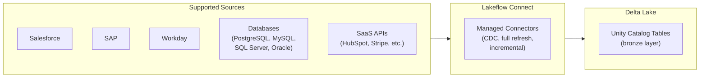

# Lakeflow — Fundamentals

## What Is Lakeflow?

Lakeflow is Databricks' **unified data engineering platform** that combines ingestion (Lakeflow Connect), transformation (DLT), and orchestration (Workflows) into a cohesive experience. It represents the evolution of Databricks' data pipeline tooling into a single, integrated product.

```python
# Lakeflow encompasses three capabilities:
# 1. Lakeflow Connect: managed connectors for data ingestion (no code)
# 2. Lakeflow Pipelines: DLT-based transformation pipelines
# 3. Lakeflow Orchestration: Workflows for scheduling and coordination
```

> **Key Insight for DE:** Lakeflow is not a new tool — it's the branding for Databricks' existing pipeline tools (Auto Loader, DLT, Workflows) unified under one name with tighter integration and new managed connector capabilities.

---

## Lakeflow Connect (Managed Ingestion)

Lakeflow Connect provides **no-code/low-code connectors** for ingesting data from common sources directly into Delta Lake:



Lakeflow Connect handles: connection management, schema discovery, incremental loading, CDC replication, and error handling — all without writing code.

---

## Key Components

| Component | What It Does | Replaces/Extends |
|-----------|-------------|------------------|
| **Lakeflow Connect** | Managed data connectors (SaaS, databases) | Custom ingestion scripts, Fivetran |
| **Lakeflow Pipelines** | Declarative ETL (DLT) | Spark ETL notebooks |
| **Lakeflow Orchestration** | Job scheduling and dependencies | External schedulers (Airflow) |

---

## Lakeflow Connect: Database Ingestion

```python
# Ingest from PostgreSQL with CDC (Change Data Capture)
# Configured via UI: Catalog → Create Connection → PostgreSQL

# Behind the scenes, Lakeflow Connect:
# 1. Connects to PostgreSQL using provided credentials
# 2. Performs initial full snapshot (all existing data)
# 3. Sets up CDC via logical replication (WAL-based)
# 4. Continuously captures INSERT/UPDATE/DELETE changes
# 5. Writes to Delta table in your Unity Catalog
# 6. Handles schema evolution automatically

# Configuration (UI or API):
CONNECT_CONFIG = {
    "source": {
        "type": "postgresql",
        "host": "prod-db.us-east-1.rds.amazonaws.com",
        "port": 5432,
        "database": "production",
        "tables": ["orders", "customers", "products"],
        "credential": "secret_scope/pg_credentials",
    },
    "target": {
        "catalog": "production",
        "schema": "bronze",
    },
    "ingestion_mode": "cdc",  # or "full_refresh" or "incremental"
    "schedule": "continuous",  # or cron expression
}

# Result: production.bronze.orders, production.bronze.customers, production.bronze.products
# All kept in sync with source via CDC (seconds to minutes latency)
```

---

## Lakeflow Pipelines (DLT Integration)

Lakeflow Pipelines is the transformation layer — it IS Delta Live Tables with tighter Unity Catalog integration:

```python
import dlt

# Define transformation pipeline (same DLT syntax!)
@dlt.table(comment="Cleaned orders from CDC source")
@dlt.expect_or_drop("valid_order", "order_id IS NOT NULL")
def silver_orders():
    """Read from Lakeflow Connect bronze table, transform to silver."""
    return (
        dlt.read_stream("bronze_orders")  # From Lakeflow Connect output
        .withColumn("order_id", col("order_id").cast("bigint"))
        .withColumn("amount", col("amount").cast("decimal(10,2)"))
        .dropDuplicates(["order_id"])
    )

@dlt.table(comment="Daily revenue metrics")
def gold_daily_revenue():
    return (
        dlt.read("silver_orders")
        .groupBy("order_date", "region")
        .agg(sum("amount").alias("revenue"), count("*").alias("orders"))
    )
```

---

## Lakeflow vs Traditional Approach

| Aspect | Traditional (DIY) | Lakeflow |
|--------|-------------------|----------|
| Database CDC | Custom Debezium + Kafka + consumer | Lakeflow Connect (managed, no code) |
| SaaS ingestion | Custom API scripts | Lakeflow Connect (managed connectors) |
| Transformation | Manual Spark notebooks | Lakeflow Pipelines (declarative DLT) |
| Scheduling | External Airflow or manual | Lakeflow Orchestration (native Workflows) |
| Schema evolution | Manual handling | Automatic |
| Error handling | Custom retry logic | Built-in retry + dead letter queue |
| Monitoring | Custom dashboards | Unified pipeline UI |

---

## Getting Started with Lakeflow

### Step 1: Create a Connection (UI)

```
Catalog → Connections → Create Connection
→ Select source type (PostgreSQL)
→ Enter credentials (host, port, user, password)
→ Test connection
→ Select tables to replicate
→ Choose target catalog and schema
→ Set ingestion mode (CDC/Full Refresh/Incremental)
→ Start replication
```

### Step 2: Create a Pipeline (Code or UI)

```python
# Lakeflow pipeline notebook
import dlt

@dlt.table
def silver_customers():
    """Transform raw CDC data into clean business entity."""
    return (
        dlt.read_stream("bronze_customers")
        .filter(col("_change_type") != "delete")  # CDC-aware
        .select("customer_id", "name", "email", "region", "updated_at")
    )
```

### Step 3: Orchestrate (Workflow)

```python
# Schedule everything in a Databricks Workflow:
# Task 1: Lakeflow Connect runs continuously (ingestion)
# Task 2: Lakeflow Pipeline triggered hourly (transformation)
# Task 3: Quality validation after pipeline completes
```

---

## When to Use Lakeflow Connect vs Auto Loader

| Scenario | Use Lakeflow Connect | Use Auto Loader |
|----------|---------------------|-----------------|
| Database CDC (PostgreSQL, MySQL) | ✅ (managed CDC) | ❌ (Auto Loader is for files) |
| SaaS APIs (Salesforce, HubSpot) | ✅ (managed connectors) | ❌ |
| Files in S3/ADLS (JSON, Parquet) | ❌ | ✅ (file-based ingestion) |
| Kafka streams | ❌ | Use Spark Structured Streaming |
| Custom APIs | ❌ (not supported) | Custom code + Auto Loader |

---

## Interview Tips

> **Tip 1:** "What is Lakeflow?" — Databricks' unified data engineering platform combining: Lakeflow Connect (managed ingestion from databases and SaaS), Lakeflow Pipelines (DLT transformations), and Lakeflow Orchestration (Workflows scheduling). It's the evolution of existing tools (Auto Loader, DLT, Workflows) into a cohesive product with tighter integration.

> **Tip 2:** "Lakeflow Connect vs Fivetran/Airbyte?" — Same concept (managed data connectors), but native to Databricks: writes directly to Delta Lake + Unity Catalog, uses Databricks compute, governance built-in, and no data duplication (goes straight to your lakehouse). Third-party tools require: separate infra, data landing zone, additional ETL to get into your lakehouse.

> **Tip 3:** "When would you still use custom ingestion code?" — For sources Lakeflow Connect doesn't support yet, complex API pagination logic, custom data validation during ingestion, or very high-volume streaming from Kafka (use Structured Streaming directly). Lakeflow Connect is great for common sources (databases, standard SaaS); custom code for everything else.
