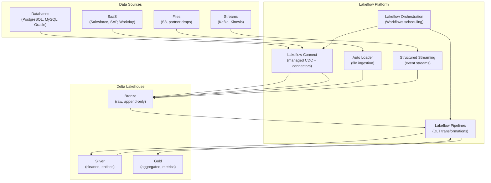

# Lakeflow — Senior-Level Deep Dive

## Enterprise Lakeflow Architecture



This diagram shows the complete Lakeflow architecture: multiple source types feed into the appropriate ingestion mechanism, which lands data in bronze. Lakeflow Pipelines (DLT) transforms through medallion layers, all orchestrated by Workflows.

---

## Lakeflow Connect Internals

### How CDC Works Under the Hood

```python
# PostgreSQL CDC via Lakeflow Connect:

# 1. INITIAL SNAPSHOT:
#    - Lakeflow Connect queries: SELECT * FROM source_table (with consistent snapshot)
#    - Writes to Delta in batches (parallel, optimized)
#    - Records the WAL position at snapshot time (consistency boundary)

# 2. ONGOING CDC:
#    - Creates a logical replication slot in PostgreSQL
#    - Subscribes to changes via pgoutput plugin
#    - Receives WAL stream: INSERT/UPDATE/DELETE events
#    - Batches events (configurable interval: 1s to 60s)
#    - Writes batch to Delta table atomically
#    - Acknowledges processed WAL position (advances checkpoint)

# 3. SCHEMA EVOLUTION:
#    - Monitors source catalog for DDL changes
#    - On new column: adds to Delta schema + handles backfill of NULLs
#    - On type change: validates compatibility, updates target schema

# Configuration for high-throughput CDC:
HIGH_THROUGHPUT_CONFIG = {
    "batch_interval_seconds": 5,        # Flush every 5 seconds
    "max_batch_size_mb": 100,           # Or when batch reaches 100 MB
    "parallelism": 4,                    # 4 parallel readers for multi-table
    "wal_retention_hours": 72,           # Keep 72h of WAL for replay
}
```

### Conflict Resolution

```python
# When multiple source tables have conflicting primary keys:

# Scenario: orders table has order_id PK, but order_id is not globally unique
# (two source databases might both have order_id = 1001)

# Solution: Lakeflow Connect adds source metadata:
# | order_id | amount | _source_database | _source_table | _ingestion_time |
# | 1001 | 99.50 | prod-us-db | orders | 2024-03-15 10:00 |
# | 1001 | 45.00 | prod-eu-db | orders | 2024-03-15 10:01 |

# Silver layer resolves conflicts:
@dlt.table
def silver_orders():
    return (
        dlt.read_stream("bronze_orders")
        .withColumn("global_order_id", 
            concat(col("_source_database"), lit("_"), col("order_id")))
        # Now order_id is globally unique across sources
    )
```

---

## Production Scaling

### High-Volume Ingestion (10M+ Rows/Day per Source)

```python
# For sources with high write volume:

# 1. Increase parallelism (more CDC readers)
{
    "parallelism": 8,  # 8 parallel threads reading WAL
    "batch_interval_seconds": 2,  # Flush more frequently (smaller batches)
    "target_partitions": 16,  # More Delta file parallelism
}

# 2. Separate compute for heavy sources
# Heavy sources (>1M rows/day) get dedicated Lakeflow Connect jobs
# Light sources (<100K rows/day) can share a connector job

# 3. Monitor throughput and lag
# Target: lag < 5 minutes for CDC
# Alert if lag exceeds threshold → scale up parallelism

# 4. Handle initial backfill for large tables
# 100M+ row table initial snapshot:
{
    "initial_snapshot_parallelism": 16,  # Parallel SELECT chunks
    "initial_snapshot_chunk_size": "1000000",  # 1M rows per chunk
    # Total: 100M / 1M = 100 chunks × 16 parallel = ~7 rounds
    # Time: ~30-60 minutes for initial load (then CDC takes over)
}
```

---

## Governance Integration

```python
# Lakeflow + Unity Catalog = governed ingestion

# 1. All ingested tables automatically registered in Unity Catalog
# No manual table creation needed — Lakeflow Connect creates them

# 2. Lineage tracked automatically
# Lineage: PostgreSQL.orders → production.bronze.orders → production.silver.orders
# Visible in Unity Catalog UI (data lineage graph)

# 3. Access control
# Lakeflow Connect credentials stored in Unity Catalog secrets
# Target tables inherit catalog/schema permissions
# Audit: system.access.audit logs show who set up which connector

# 4. Data classification
# Auto-tag PII columns during ingestion (if configured):
{
    "classification": {
        "auto_detect_pii": True,  # Scans for email, phone, SSN patterns
        "tag_pii_columns": True,  # Adds sensitivity tags automatically
        "mask_pii_by_default": True,  # Apply column masks for non-authorized users
    }
}
```

---

## Cost Optimization

```python
# Lakeflow Connect pricing: based on data volume ingested ($/GB)
# Optimize cost by:

COST_OPTIMIZATION = {
    "1_select_needed_columns": {
        "action": "Only replicate columns you actually need (not SELECT *)",
        "savings": "30-50% (less data transferred and stored)",
        "config": {"columns": ["order_id", "amount", "status", "updated_at"]},
    },
    "2_filter_at_source": {
        "action": "Apply WHERE clause to only replicate relevant rows",
        "savings": "Variable (depends on filter selectivity)",
        "config": {"filter": "status != 'deleted' AND created_at >= '2023-01-01'"},
    },
    "3_appropriate_mode": {
        "action": "Use incremental instead of full refresh where possible",
        "savings": "90%+ (only new/changed rows, not entire table each time)",
    },
    "4_batch_frequency": {
        "action": "For non-real-time needs: batch every 15-60 min instead of continuous",
        "savings": "Lower compute cost (cluster can stop between batches)",
    },
}
```

---

## Lakeflow vs Competitor Comparison

| Aspect | Lakeflow Connect | Fivetran | Airbyte |
|--------|-----------------|----------|---------|
| Native to lakehouse | ✅ (writes directly to Delta) | ❌ (writes to staging, needs ETL to lakehouse) | ❌ (same) |
| CDC quality | High (WAL-based, low latency) | High (varies by connector) | Medium (depends on connector) |
| Governance | Unity Catalog native | Separate | Separate |
| Pricing | Per-GB ingested | Per-MAR (monthly active rows) | Open source (self-hosted) or cloud |
| Connector count | Growing (fewer currently) | 300+ (mature) | 300+ (community) |
| Customization | Limited (managed) | Limited | High (open source) |
| Best for | Databricks-native pipelines | Multi-destination, breadth of connectors | Budget-conscious, customization needs |

---

## Interview Tips

> **Tip 1:** "How does Lakeflow fit into the Databricks architecture?" — It's the unified data engineering layer: Connect handles ingestion (managed CDC/connectors), Pipelines handles transformation (DLT), and Orchestration handles scheduling (Workflows). Together they cover the full ETL lifecycle: source → bronze → silver → gold. Everything is governed by Unity Catalog and observed through system tables.

> **Tip 2:** "Lakeflow Connect vs Fivetran?" — Lakeflow Connect: native to Databricks (writes directly to Delta + Unity Catalog, no intermediate staging), tighter governance integration, but fewer connectors currently. Fivetran: more mature, 300+ connectors, works with any destination. Choose Lakeflow Connect when fully on Databricks; choose Fivetran when you need rare connectors or multi-destination support.

> **Tip 3:** "How would you handle initial load of a 500M-row source table?" — Lakeflow Connect handles this automatically: parallel snapshot (chunks the table, reads in parallel), writes to Delta in optimized batches, then transitions to CDC mode. Configure: high parallelism (8-16 threads), appropriate chunk size (1M rows), and expect 30-90 minutes for the initial load depending on source DB performance and network bandwidth.
