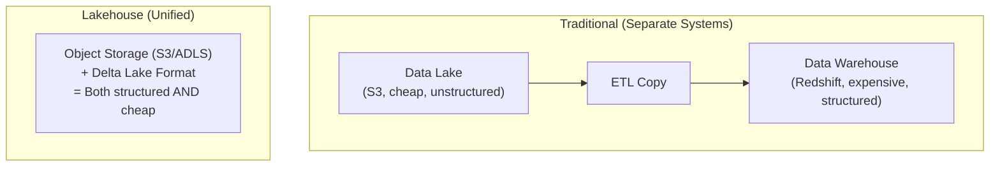
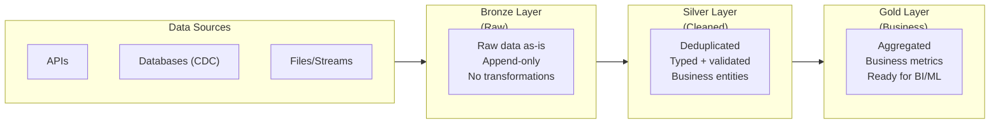

# Lakehouse Architecture — Fundamentals


## 🎯 Analogy

Think of the Databricks Lakehouse like a single platform replacing both your data lake (cheap storage, raw data) and your data warehouse (reliable, fast SQL): Delta Lake provides the ACID foundation, Unity Catalog the governance, and Photon the query speed.

---
## What Is a Lakehouse?

A Lakehouse combines the best of **data warehouses** (ACID transactions, schema enforcement, BI performance) with **data lakes** (low-cost storage, flexible formats, ML support). It's a unified architecture for all data workloads.



The lakehouse eliminates the costly ETL between lake and warehouse by making the lake warehouse-capable through Delta Lake's ACID transactions.

---

## Data Lake vs Data Warehouse vs Lakehouse

| Aspect | Data Lake | Data Warehouse | Lakehouse |
|--------|-----------|---------------|-----------|
| Storage | Object storage (cheap) | Proprietary (expensive) | Object storage (cheap) |
| Format | Any (Parquet, JSON, CSV) | Proprietary columnar | Open (Delta, Iceberg) |
| ACID | No | Yes | Yes (Delta Lake) |
| Schema | Schema-on-read (flexible) | Schema-on-write (strict) | Both (enforce + evolve) |
| Performance | Slow for analytics | Fast for BI queries | Fast (Photon, Z-ordering) |
| ML Support | Good (raw data access) | Poor (data must be exported) | Good (direct access) |
| Governance | Weak | Strong | Strong (Unity Catalog) |
| Cost | Low storage, high compute | High all around | Low storage, optimized compute |

---

## Medallion Architecture (Bronze → Silver → Gold)

The standard data organization pattern in a lakehouse:



Each layer refines the data further, from raw ingestion to business-ready analytics.

### Bronze Layer (Raw)

```sql
-- Bronze: ingest raw data, preserve everything, add metadata
CREATE TABLE production.bronze.orders (
    -- Raw columns from source (might have issues)
    raw_payload STRING,           -- Original JSON/data
    order_id STRING,              -- Might be null or malformed
    amount STRING,                -- Not yet cast to numeric
    
    -- Ingestion metadata (added by pipeline)
    _ingested_at TIMESTAMP,       -- When we loaded it
    _source_file STRING,          -- Which file it came from
    _source_system STRING         -- Where it originated
) USING DELTA
PARTITIONED BY (_ingested_at::DATE);

-- Bronze rules:
-- 1. Never transform the source data (keep exactly as received)
-- 2. Append-only (never update/delete — full history)
-- 3. Add ingestion metadata for traceability
-- 4. Schema-on-read: accept anything, validate later
```

### Silver Layer (Cleaned)

```sql
-- Silver: clean, deduplicate, type-cast, join with dimensions
CREATE TABLE production.silver.orders (
    order_id BIGINT NOT NULL,        -- Typed, validated
    customer_id BIGINT NOT NULL,
    amount DECIMAL(10,2) NOT NULL,    -- Proper numeric type
    order_date DATE NOT NULL,
    status STRING,
    _loaded_at TIMESTAMP,
    _source_order_id STRING           -- Trace back to bronze
) USING DELTA;

-- Silver transformation logic:
MERGE INTO production.silver.orders t
USING (
    SELECT DISTINCT
        CAST(order_id AS BIGINT) AS order_id,
        CAST(customer_id AS BIGINT) AS customer_id,
        CAST(amount AS DECIMAL(10,2)) AS amount,
        CAST(order_date AS DATE) AS order_date,
        status,
        current_timestamp() AS _loaded_at,
        order_id AS _source_order_id
    FROM production.bronze.orders
    WHERE _ingested_at >= current_timestamp() - INTERVAL 1 DAY
      AND order_id IS NOT NULL  -- Data quality filter
) s ON t.order_id = s.order_id
WHEN MATCHED THEN UPDATE SET *
WHEN NOT MATCHED THEN INSERT *;

-- Silver rules:
-- 1. Typed, validated, deduplicated
-- 2. Conforms to business entity schema
-- 3. Incremental updates (MERGE for SCD/upsert)
-- 4. One table per business entity
```

### Gold Layer (Business-Ready)

```sql
-- Gold: aggregated, denormalized, optimized for consumption
CREATE TABLE production.gold.daily_revenue (
    revenue_date DATE,
    region STRING,
    product_category STRING,
    total_orders INT,
    total_revenue DECIMAL(12,2),
    avg_order_value DECIMAL(10,2),
    _computed_at TIMESTAMP
) USING DELTA;

-- Gold transformation:
INSERT OVERWRITE production.gold.daily_revenue
SELECT 
    o.order_date AS revenue_date,
    c.region,
    p.category AS product_category,
    COUNT(*) AS total_orders,
    SUM(o.amount) AS total_revenue,
    AVG(o.amount) AS avg_order_value,
    current_timestamp() AS _computed_at
FROM production.silver.orders o
JOIN production.silver.customers c ON o.customer_id = c.customer_id
JOIN production.silver.products p ON o.product_id = p.product_id
WHERE o.order_date = current_date() - 1
GROUP BY o.order_date, c.region, p.category;

-- Gold rules:
-- 1. Business-specific aggregations and metrics
-- 2. Optimized for query performance (pre-joined, pre-aggregated)
-- 3. Named for business concepts (daily_revenue, not fact_sales_agg)
-- 4. Consumed by BI tools, dashboards, and ML features
```

---

## Why Delta Lake Makes the Lakehouse Possible

Without Delta Lake, a data lake has none of the warehouse properties:

| Capability | Plain Parquet on S3 | Delta Lake on S3 |
|-----------|--------------------|--------------------|
| ACID transactions | No (partial writes corrupt data) | Yes (atomic commits) |
| UPDATE/DELETE | No (immutable files) | Yes (log-based) |
| Schema enforcement | No (any file can land) | Yes (schema on write) |
| Time travel | No | Yes (version history) |
| MERGE (upsert) | No | Yes (native command) |
| Data skipping | Limited (partition pruning only) | Yes (file-level min/max stats) |
| Streaming + batch | Separate systems | Unified (same table) |

```sql
-- Delta Lake operations that wouldn't work on raw Parquet:
UPDATE orders SET status = 'cancelled' WHERE order_id = 12345;
DELETE FROM orders WHERE order_date < '2020-01-01';
MERGE INTO target USING source ON ... WHEN MATCHED THEN UPDATE ...;
SELECT * FROM orders VERSION AS OF 5;  -- Time travel
OPTIMIZE orders ZORDER BY (customer_id);  -- Data skipping
```

---

## Lakehouse Components on Databricks

| Component | Role | Databricks Feature |
|-----------|------|-------------------|
| Storage | Cheap, durable file storage | S3 / ADLS / GCS |
| Table Format | ACID, schema, time travel | Delta Lake |
| Ingestion | Incremental file loading | Auto Loader |
| Transformation | SQL/Python/Spark ETL | Notebooks, DLT |
| Governance | Access control, lineage | Unity Catalog |
| Compute | Processing engine | Clusters, Photon |
| Orchestration | Pipeline scheduling | Workflows |
| Serving | BI queries, SQL analytics | Databricks SQL |
| ML | Feature store, model training | MLflow |

---


## ▶️ Try It Yourself

```sql
-- Lakehouse medallion pattern in Databricks SQL
-- Bronze: raw, append-only
CREATE TABLE IF NOT EXISTS raw.orders_bronze
USING DELTA
LOCATION 's3://my-bucket/delta/bronze/orders';

-- Silver: cleaned
CREATE OR REPLACE TABLE clean.orders_silver
USING DELTA AS
SELECT order_id, CAST(amount AS DECIMAL(12,2)) amount,
       UPPER(region) region, CAST(order_date AS DATE) order_date
FROM raw.orders_bronze
WHERE amount > 0 AND region IS NOT NULL;

-- Gold: business aggregates
CREATE OR REPLACE TABLE gold.revenue_daily
USING DELTA AS
SELECT order_date, region,
       SUM(amount) AS revenue, COUNT(*) AS orders
FROM clean.orders_silver
GROUP BY order_date, region;
```

> **Run it:** Copy the snippet into a REPL or file — no external services needed for the basic example.

---
## Interview Tips

> **Tip 1:** "What is a lakehouse?" — It combines data lake economics (cheap object storage, open formats) with data warehouse capabilities (ACID transactions, schema enforcement, fast BI queries). Delta Lake is the technology that bridges the gap — it adds warehouse features on top of lake storage.

> **Tip 2:** "Explain the medallion architecture" — Three layers: Bronze (raw, as-is from source, append-only), Silver (cleaned, typed, deduplicated, business entities), Gold (aggregated, denormalized, business metrics). Each layer adds quality and value. Source → Bronze is ingestion; Bronze → Silver is cleansing; Silver → Gold is business logic.

> **Tip 3:** "Why not just use a data warehouse?" — Cost (lakehouse stores data at $0.023/GB vs $250+/TB for warehouse), flexibility (supports ML workloads natively, not just SQL), open format (no vendor lock-in with Delta/Iceberg/Parquet), and unified (one copy of data for BI + ML + streaming vs ETL-ing between separate systems).
